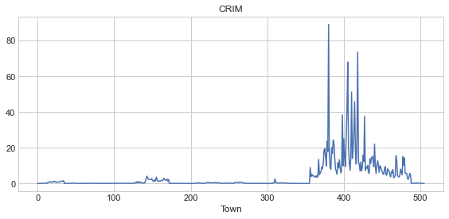
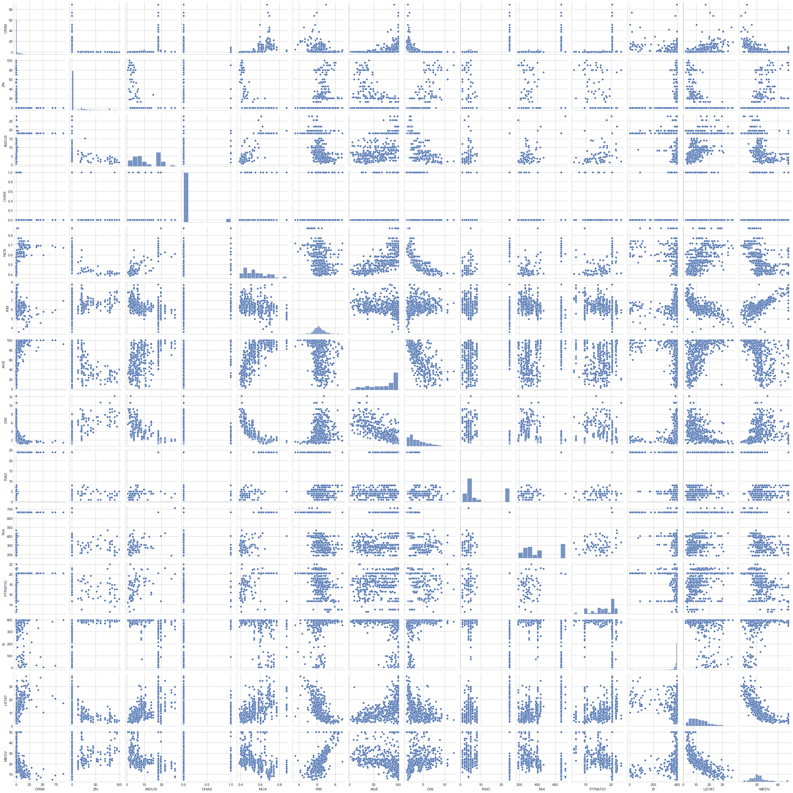
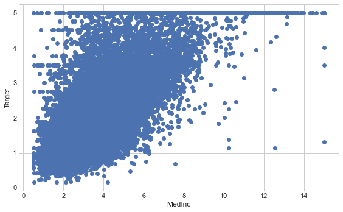
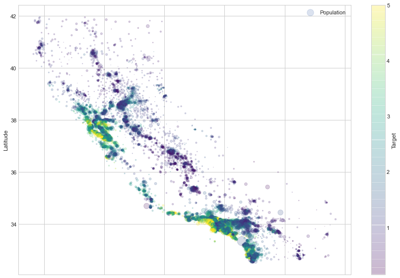
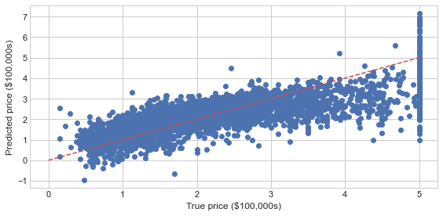
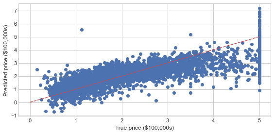
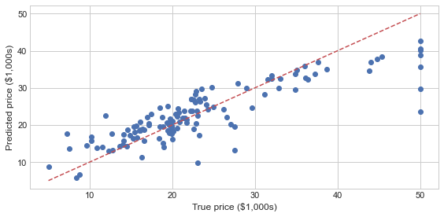

```python
import matplotlib as mpl
import matplotlib.pyplot as plt
mpl.__version__
```


    '3.3.4'


```python
plt.style.use(['seaborn-notebook'])
```

### 라인플롯(Line Plot)
- 플롯(plot)은 그림(figure)과 축(axes)으로 구성
- plt.Figure : 축과 그래픽, 텍스트, 레이블을 표시하는 모든 객체를 포함하는 컨테이너
- plt.Axes : 눈금과 레이블이 있는 테두리 박스를 시각화를 형성하는 플롯 요소 표함


```python
fig = plt.figure()
ax = plt.axes()
```


    

    


```python
fig = plt.figure()
plt.plot([0, 0.2, 0.4, 0.6, 0.8, 1] * 5)
```


    [<matplotlib.lines.Line2D at 0x28091605190>]


    

    


```python
x = np.arange(0,10,0.01)
fig = plt.figure()
plt.plot(x, np.sin(x));
```


    

    


```python
plt.plot(x, np.sin(x))
plt.plot(x, np.cos(x));
```


    

    


```python
plt.plot(np.random.randn(50).cumsum());
```


    

    


### 라인 스타일(Line Style)


```python
plt.plot(np.random.randn(50).cumsum(), linestyle='solid')
plt.plot(np.random.randn(50).cumsum(), linestyle='dashed')
plt.plot(np.random.randn(50).cumsum(), linestyle='dashdot')
plt.plot(np.random.randn(50).cumsum(), linestyle='dotted')
```


    [<matplotlib.lines.Line2D at 0x280917cf6a0>]


    

    


```python
plt.plot(np.random.randn(50).cumsum(), linestyle='-')
plt.plot(np.random.randn(50).cumsum(), linestyle='--')
plt.plot(np.random.randn(50).cumsum(), linestyle='-.')
plt.plot(np.random.randn(50).cumsum(), linestyle=':');
```


    

    


### 색상 스타일(Color Style)


```python
plt.plot(np.random.randn(50).cumsum(), color='g')
plt.plot(np.random.randn(50).cumsum(), color='#1243FF')
plt.plot(np.random.randn(50).cumsum(), color=(0.2, 0.4, 0.6))
plt.plot(np.random.randn(50).cumsum(), color='darkblue');
```


    

    


```python
plt.plot(np.random.randn(50).cumsum(), color='skyblue')
plt.plot(np.random.randn(50).cumsum(), color='dodgerblue')
plt.plot(np.random.randn(50).cumsum(), color='royalblue')
plt.plot(np.random.randn(50).cumsum(), color='navy');
```


    

    


```python
plt.plot(np.random.randn(50).cumsum(), 'b-')
plt.plot(np.random.randn(50).cumsum(), 'g--')
plt.plot(np.random.randn(50).cumsum(), 'c-.')
plt.plot(np.random.randn(50).cumsum(), 'm:');
```


    

    


### 플롯 축(Plto Axis)


```python
plt.plot(np.random.randn(50));
```


    

    


```python
plt.plot(np.random.randn(50))
plt.xlim(-1,50)
plt.ylim(-5,5);
```


    

    


```python
plt.plot(np.random.randn(50))
plt.axis([-1,50, -5, 5]);
```


    

    


```python
plt.plot(np.random.randn(50))
plt.axis('tight');
```


    

    


```python
plt.plot(np.random.randn(50))
plt.axis('equal');
```


    

    


### 플롯 레이블(Plot Label)


```python
plt.plot(np.random.randn(50))
plt.title("title")
plt.xlabel("x")
plt.ylabel("random.randn")
```


    Text(0, 0.5, 'random.randn')


    

    


```python
plt.plot(np.random.randn(50), label='A')
plt.plot(np.random.randn(50), label='B')
plt.plot(np.random.randn(50), label='C')
plt.title("title")
plt.xlabel("x")
plt.ylabel("random.randn")
plt.legend();
```


    

    


### 폰트 관리자(Font Manager)


```python
set([f.name for f in mpl.font_manager.fontManager.ttflist])
```


    {'Agency FB',
     'Algerian',
     'Ami R',
     'Arial',
     'Arial Rounded MT Bold',
     'Bahnschrift',
     'Baskerville Old Face',
     'Batang',
     'Bauhaus 93',
     'Bell MT',
     'Berlin Sans FB',
     'Berlin Sans FB Demi',
     'Bernard MT Condensed',
     'Blackadder ITC',
     'Bodoni MT',
     'Book Antiqua',
     'Bookman Old Style',
     'Bookshelf Symbol 7',
     'Bradley Hand ITC',
     'Britannic Bold',
     'Broadway',
     'Brush Script MT',
     'Calibri',
     'Californian FB',
     'Calisto MT',
     'Cambria',
     'Candara',
     'Castellar',
     'Centaur',
     'Century',
     'Century Gothic',
     'Century Schoolbook',
     'Chiller',
     'Colonna MT',
     'Comic Sans MS',
     'Consolas',
     'Constantia',
     'Cooper Black',
     'Copperplate Gothic Bold',
     'Copperplate Gothic Light',
     'Corbel',
     'Courier New',
     'Curlz MT',
     'DejaVu Sans',
     'DejaVu Sans Display',
     'DejaVu Sans Mono',
     'DejaVu Serif',
     'DejaVu Serif Display',
     'Dubai',
     'Ebrima',
     'Edwardian Script ITC',
     'Elephant',
     'Engravers MT',
     'Eras Bold ITC',
     'Eras Demi ITC',
     'Eras Light ITC',
     'Eras Medium ITC',
     'Felix Titling',
     'Footlight MT Light',
     'Forte',
     'Franklin Gothic Book',
     'Franklin Gothic Demi',
     'Franklin Gothic Demi Cond',
     'Franklin Gothic Heavy',
     'Franklin Gothic Medium',
     'Franklin Gothic Medium Cond',
     'Freestyle Script',
     'French Script MT',
     'Gabriola',
     'Gadugi',
     'Garamond',
     'Georgia',
     'Gigi',
     'Gill Sans MT',
     'Gill Sans MT Condensed',
     'Gill Sans MT Ext Condensed Bold',
     'Gill Sans Ultra Bold',
     'Gill Sans Ultra Bold Condensed',
     'Gloucester MT Extra Condensed',
     'Goudy Old Style',
     'Goudy Stout',
     'Gulim',
     'HYGothic-Extra',
     'HYGothic-Medium',
     'HYGraphic-Medium',
     'HYGungSo-Bold',
     'HYHeadLine-Medium',
     'HYMyeongJo-Extra',
     'HYPMokGak-Bold',
     'HYPost-Light',
     'HYPost-Medium',
     'HYShortSamul-Medium',
     'HYSinMyeongJo-Medium',
     'Haettenschweiler',
     'Harlow Solid Italic',
     'Harrington',
     'Headline R',
     'High Tower Text',
     'HoloLens MDL2 Assets',
     'Impact',
     'Imprint MT Shadow',
     'Informal Roman',
     'Ink Free',
     'Javanese Text',
     'Jokerman',
     'Juice ITC',
     'Kristen ITC',
     'Kunstler Script',
     'Leelawadee',
     'Leelawadee UI',
     'Lucida Bright',
     'Lucida Calligraphy',
     'Lucida Console',
     'Lucida Fax',
     'Lucida Handwriting',
     'Lucida Sans',
     'Lucida Sans Typewriter',
     'Lucida Sans Unicode',
     'MS Gothic',
     'MS Outlook',
     'MS Reference Sans Serif',
     'MS Reference Specialty',
     'MT Extra',
     'MV Boli',
     'Magic R',
     'Magneto',
     'Maiandra GD',
     'Malgun Gothic',
     'Marlett',
     'Matura MT Script Capitals',
     'MecSoft_Font-1',
     'Microsoft Himalaya',
     'Microsoft JhengHei',
     'Microsoft New Tai Lue',
     'Microsoft PhagsPa',
     'Microsoft Sans Serif',
     'Microsoft Tai Le',
     'Microsoft Uighur',
     'Microsoft YaHei',
     'Microsoft Yi Baiti',
     'MingLiU-ExtB',
     'Mistral',
     'Modern No. 20',
     'MoeumT R',
     'Mongolian Baiti',
     'Monotype Corsiva',
     'Myanmar Text',
     'New Gulim',
     'Niagara Engraved',
     'Niagara Solid',
     'Nirmala UI',
     'OCR A Extended',
     'Old English Text MT',
     'Onyx',
     'Palace Script MT',
     'Palatino Linotype',
     'Papyrus',
     'Parchment',
     'Perpetua',
     'Perpetua Titling MT',
     'Playbill',
     'Poor Richard',
     'Pristina',
     'Pyunji R',
     'Rage Italic',
     'Ravie',
     'Rockwell',
     'Rockwell Condensed',
     'Rockwell Extra Bold',
     'SLF-RHN Architect',
     'STIXGeneral',
     'STIXNonUnicode',
     'STIXSizeFiveSym',
     'STIXSizeFourSym',
     'STIXSizeOneSym',
     'STIXSizeThreeSym',
     'STIXSizeTwoSym',
     'Script MT Bold',
     'Segoe MDL2 Assets',
     'Segoe Print',
     'Segoe Script',
     'Segoe UI',
     'Segoe UI Emoji',
     'Segoe UI Historic',
     'Segoe UI Symbol',
     'Showcard Gothic',
     'SimSun',
     'SimSun-ExtB',
     'Sitka Small',
     'Snap ITC',
     'Stencil',
     'Sylfaen',
     'Symbol',
     'Tahoma',
     'Tempus Sans ITC',
     'Times New Roman',
     'Trebuchet MS',
     'Tw Cen MT',
     'Tw Cen MT Condensed',
     'Tw Cen MT Condensed Extra Bold',
     'Verdana',
     'Viner Hand ITC',
     'Vivaldi',
     'Vladimir Script',
     'Webdings',
     'Wide Latin',
     'Wingdings',
     'Wingdings 2',
     'Wingdings 3',
     'Yet R',
     'Yu Gothic',
     'cmb10',
     'cmex10',
     'cmmi10',
     'cmr10',
     'cmss10',
     'cmsy10',
     'cmtt10'}


```python
font1 = {'family' : 'Algerian', 'size' : 24, 'color' : 'black'}
font2 = {'family' : 'Bahnschrift', 'size' : 18, 'weight' : 'bold', 'color' : 'darkred'}
font3 = {'family' : 'Batang', 'size' : 16, 'weight' : 'light', 'color' : 'blue'}

plt.plot([1,2,3,4,5], [1,2,3,4,5])
plt.title('title', fontdict=font1)
plt.xlabel("xlabel", fontdict = font2)
plt.ylabel("random.randn",  fontdict = font3);
```


    

    


### 플롯 범례(Plot Legend)


```python
fig, ax = plt.subplots()
ax.plot(np.random.randn(10), '-r', label='A')
ax.plot(np.random.randn(10), ':g', label='B')
ax.plot(np.random.randn(10), '--b', label='C')
ax.axis('equal')
ax.legend();
```


    

    


```python
ax.legend(loc='lower right')
fig
```


    

    


```python
ax.legend(loc='upper center', frameon=False, ncol=2)
fig
```


    

    


```python
ax.legend(fancybox=True, framealpha=1, shadow=True, borderpad=1)
fig
```


    

    


```python
plt.figure(figsize=(8,4))
x = np.linspace(0,10,1000)
y = np.cos(x[:,np.newaxis]*np.arange(0, 2, 0.2))
lines=plt.plot(x,y)
plt.legend(lines[:3], ['c1', 'c2', 'c3'], loc='upper right');
```


    

    


```python
plt.plot(x,y[:,0], label='c1')
plt.plot(x,y[:,1], label='c2')
plt.plot(x,y[:,2], label='c3')
plt.plot(x,y[:,3:], )
plt.legend(framealpha=1, frameon=True, loc = 'upper right');
```


    

    


```python
x = np.linspace(0,20,100)
I = np.cos(x) - np.cos(x[:, np.newaxis])

plt.imshow(I)
plt.colorbar();
```


    

    


```python
plt.imshow(I, cmap='Blues')
plt.colorbar();
```


    

    


```python
plt.imshow(I, cmap='RdBu')
plt.colorbar();
```


    

    


```python
speckles = (np.random.random(I.shape) < 0.01)
I[speckles] = np.random.normal(0, 3, np.count_nonzero(speckles))

plt.imshow(I, cmap='RdBu')
plt.colorbar(extend = 'both')
plt.clim(-1,1);
```


    

    


```python
plt.imshow(I, cmap=plt.cm.get_cmap('Blues', 5))
plt.colorbar()
plt.clim(-1,1);
```


    

    


### 다중 플롯(Multiple Subplots)


```python
ax1 = plt.axes()
ax2 = plt.axes([0.65, 0.5, 0.2, 0.3])
```


    

    


```python
for i in range(1,10):
    plt.subplot(3,3, i)
    plt.text(0.5, 0.5, str((3,3,i)), ha='center')
```


    

    


```python
fig = plt.figure()
fig.subplots_adjust(hspace=0.4, wspace=0.4)
for i in range(1,10):
    plt.subplot(3,3, i)
    plt.text(0.5, 0.5, str((3,3,i)), ha='center')
```


    

    


```python
fig, ax = plt.subplots(3,3, sharex = 'col', sharey = 'row')
```


    

    


```python
for i in range(3):
    for j in range(3):
        ax[i,j].text(0.5, 0.5, str((i,j)), ha='center')
fig
```


    

    


```python
grid = plt.GridSpec(2,3, wspace=0.4, hspace=0.4)

plt.subplot(grid[0,0])
plt.subplot(grid[0,1:])
plt.subplot(grid[1,:2])
plt.subplot(grid[1,2]);
```


    

    


```python
plt.figure(figsize=(5,6))

x = range(1, 21)
columns = [np.random.randn(20) * i for i in range(1,7)]

i = 0
for c in columns:
    i += 1
    
    plt.subplot(3,2,i)
    plt.plot(x,c,marker='o', linewidth=1, label=c)
    plt.xlim(-1,21)
    plt.ylim(c.min()-1, c.max()+1)
```


    

    


### 텍스트와 주석(Text and Annotation)


```python
fig, ax = plt.subplots()
ax.axis([0, 10, 0, 10])
ax.text(3, 6, ". transData(3,6)", transform=ax.transData)
ax.text(0.2, 0.4, ". transAxes(0.2, 0.4)", transform = ax.transAxes)
ax.text(0.2, 0.2, ".transFigure(0.2, 0.2)", transform = fig.transFigure);
```


    

    


```python

```
