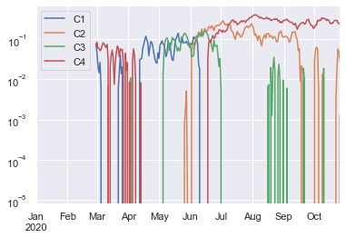

```python
pd.__version__
```


    '1.2.4'


```python
s = pd.Series([0, 0.25, 0.5, 0.75, 1.0])
s
```


    0    0.00
    1    0.25
    2    0.50
    3    0.75
    4    1.00
    dtype: float64


```python
s.values
```


    array([0.  , 0.25, 0.5 , 0.75, 1.  ])


```python
s.index
```


    RangeIndex(start=0, stop=5, step=1)


```python
s[1]
```


    0.25


```python
s[1:4]
```


    1    0.25
    2    0.50
    3    0.75
    dtype: float64


```python
s = pd.Series([0,0.25,0.5,0.75,1.0],
    index = ['a','b','c','d','e'])
s
```


    a    0.00
    b    0.25
    c    0.50
    d    0.75
    e    1.00
    dtype: float64


```python
s[['c','d','e']]
```


    c    0.50
    d    0.75
    e    1.00
    dtype: float64


```python
'b' in s
```


    True


```python
s.unique()
```


    array([0.  , 0.25, 0.5 , 0.75, 1.  ])


```python
s.value_counts()
```


    0.00    1
    1.00    1
    0.50    1
    0.75    1
    0.25    1
    dtype: int64


```python
s.isin([0.25,0.75])
```


    a    False
    b     True
    c    False
    d     True
    e    False
    dtype: bool


```python
pop_tuple = {'서울특별시' : 9720846,
             '부산광역시' : 3404423,
             '인천광역시' : 2947217,
             '대구광역시' : 2427954,
             '대전광역시' : 1471040,
             '광주광역시' : 1455058}
population = pd.Series(pop_tuple)
population
```


    서울특별시    9720846
    부산광역시    3404423
    인천광역시    2947217
    대구광역시    2427954
    대전광역시    1471040
    광주광역시    1455058
    dtype: int64


```python
population['서울특별시']
```


    9720846


```python
population['서울특별시' : '인천광역시']
```


    서울특별시    9720846
    부산광역시    3404423
    인천광역시    2947217
    dtype: int64


```python
pd.DataFrame([{'A':2, 'B':4, 'D':3}, {'A':4, 'B':5, 'C':7}])
```


<div>
<style scoped>
    .dataframe tbody tr th:only-of-type {
        vertical-align: middle;
    }

    .dataframe tbody tr th {
        vertical-align: top;
    }

    .dataframe thead th {
        text-align: right;
    }
</style>
<table border="1" class="dataframe">
  <thead>
    <tr style="text-align: right;">
      <th></th>
      <th>A</th>
      <th>B</th>
      <th>D</th>
      <th>C</th>
    </tr>
  </thead>
  <tbody>
    <tr>
      <th>0</th>
      <td>2</td>
      <td>4</td>
      <td>3.0</td>
      <td>NaN</td>
    </tr>
    <tr>
      <th>1</th>
      <td>4</td>
      <td>5</td>
      <td>NaN</td>
      <td>7.0</td>
    </tr>
  </tbody>
</table>
</div>


```python
pd.DataFrame(np.random.rand(5,5),
            columns = ['A','B','C','D','E'],
            index=[1,2,3,4,5])
```


<div>
<style scoped>
    .dataframe tbody tr th:only-of-type {
        vertical-align: middle;
    }

    .dataframe tbody tr th {
        vertical-align: top;
    }

    .dataframe thead th {
        text-align: right;
    }
</style>
<table border="1" class="dataframe">
  <thead>
    <tr style="text-align: right;">
      <th></th>
      <th>A</th>
      <th>B</th>
      <th>C</th>
      <th>D</th>
      <th>E</th>
    </tr>
  </thead>
  <tbody>
    <tr>
      <th>1</th>
      <td>0.231112</td>
      <td>0.164728</td>
      <td>0.048313</td>
      <td>0.984469</td>
      <td>0.259352</td>
    </tr>
    <tr>
      <th>2</th>
      <td>0.093701</td>
      <td>0.457589</td>
      <td>0.209987</td>
      <td>0.103723</td>
      <td>0.709007</td>
    </tr>
    <tr>
      <th>3</th>
      <td>0.352152</td>
      <td>0.673779</td>
      <td>0.677508</td>
      <td>0.735916</td>
      <td>0.362353</td>
    </tr>
    <tr>
      <th>4</th>
      <td>0.776853</td>
      <td>0.250416</td>
      <td>0.913275</td>
      <td>0.360487</td>
      <td>0.519379</td>
    </tr>
    <tr>
      <th>5</th>
      <td>0.074056</td>
      <td>0.097425</td>
      <td>0.852671</td>
      <td>0.244903</td>
      <td>0.311931</td>
    </tr>
  </tbody>
</table>
</div>


```python
male_tuple = {'서울특별시' : 4732275,
             '부산광역시' : 1668618,
             '인천광역시' : 1476813,
             '대구광역시' : 1198815,
             '대전광역시' : 734441,
             '광주광역시' : 720060}
male = pd.Series(male_tuple)
male
```


    서울특별시    4732275
    부산광역시    1668618
    인천광역시    1476813
    대구광역시    1198815
    대전광역시     734441
    광주광역시     720060
    dtype: int64


```python
female_tuple = {'서울특별시' : 4988571,
             '부산광역시' : 1735805,
             '인천광역시' : 1470404,
             '대구광역시' : 1229139,
             '대전광역시' : 736599,
             '광주광역시' : 734988}
female = pd.Series(female_tuple)
female
```


    서울특별시    4988571
    부산광역시    1735805
    인천광역시    1470404
    대구광역시    1229139
    대전광역시     736599
    광주광역시     734988
    dtype: int64


```python
korea_df = pd.DataFrame({ '인구수' : population,
                          '남자인구수' : male,
                          '여자인구수' : female})
korea_df
```


<div>
<style scoped>
    .dataframe tbody tr th:only-of-type {
        vertical-align: middle;
    }

    .dataframe tbody tr th {
        vertical-align: top;
    }

    .dataframe thead th {
        text-align: right;
    }
</style>
<table border="1" class="dataframe">
  <thead>
    <tr style="text-align: right;">
      <th></th>
      <th>인구수</th>
      <th>남자인구수</th>
      <th>여자인구수</th>
    </tr>
  </thead>
  <tbody>
    <tr>
      <th>서울특별시</th>
      <td>9720846</td>
      <td>4732275</td>
      <td>4988571</td>
    </tr>
    <tr>
      <th>부산광역시</th>
      <td>3404423</td>
      <td>1668618</td>
      <td>1735805</td>
    </tr>
    <tr>
      <th>인천광역시</th>
      <td>2947217</td>
      <td>1476813</td>
      <td>1470404</td>
    </tr>
    <tr>
      <th>대구광역시</th>
      <td>2427954</td>
      <td>1198815</td>
      <td>1229139</td>
    </tr>
    <tr>
      <th>대전광역시</th>
      <td>1471040</td>
      <td>734441</td>
      <td>736599</td>
    </tr>
    <tr>
      <th>광주광역시</th>
      <td>1455058</td>
      <td>720060</td>
      <td>734988</td>
    </tr>
  </tbody>
</table>
</div>


```python
korea_df.index
```


    Index(['서울특별시', '부산광역시', '인천광역시', '대구광역시', '대전광역시', '광주광역시'], dtype='object')


```python
korea_df.columns
```


    Index(['인구수', '남자인구수', '여자인구수'], dtype='object')


```python
korea_df['여자인구수']
```


    서울특별시    4988571
    부산광역시    1735805
    인천광역시    1470404
    대구광역시    1229139
    대전광역시     736599
    광주광역시     734988
    Name: 여자인구수, dtype: int64


```python
korea_df['서울특별시':'인천광역시']
```


<div>
<style scoped>
    .dataframe tbody tr th:only-of-type {
        vertical-align: middle;
    }

    .dataframe tbody tr th {
        vertical-align: top;
    }

    .dataframe thead th {
        text-align: right;
    }
</style>
<table border="1" class="dataframe">
  <thead>
    <tr style="text-align: right;">
      <th></th>
      <th>인구수</th>
      <th>남자인구수</th>
      <th>여자인구수</th>
    </tr>
  </thead>
  <tbody>
    <tr>
      <th>서울특별시</th>
      <td>9720846</td>
      <td>4732275</td>
      <td>4988571</td>
    </tr>
    <tr>
      <th>부산광역시</th>
      <td>3404423</td>
      <td>1668618</td>
      <td>1735805</td>
    </tr>
    <tr>
      <th>인천광역시</th>
      <td>2947217</td>
      <td>1476813</td>
      <td>1470404</td>
    </tr>
  </tbody>
</table>
</div>


### 인덱스 객체


```python
idx = pd.Index([2,4,6,8,10])
idx
```


    Int64Index([2, 4, 6, 8, 10], dtype='int64')


```python
idx[1]
```


    4


```python
idx[1:2:2]
```


    Int64Index([4], dtype='int64')


```python
idx[::2]
```


    Int64Index([2, 6, 10], dtype='int64')


```python
print(idx)
print(idx.size)
print(idx.shape)
print(idx.ndim)
print(idx.dtype)
```

    Int64Index([2, 4, 6, 8, 10], dtype='int64')
    5
    (5,)
    1
    int64
    

### index 연산


```python
idx1 = pd.Index([1,2,4,6,8])
idx2 = pd.Index([2,4,5,6,7])
print(idx1.append(idx2))
print(idx1.difference(idx2))
print(idx1 - idx2)
print(idx1.intersection(idx2))
print(idx1 & idx2)
print(idx1.union(idx2))
print(idx1 | idx2)
print(idx1.delete(0))
print(idx1.drop(1))
print(idx1 ^ idx2)
```

    Int64Index([1, 2, 4, 6, 8, 2, 4, 5, 6, 7], dtype='int64')
    Int64Index([1, 8], dtype='int64')
    Int64Index([-1, -2, -1, 0, 1], dtype='int64')
    Int64Index([2, 4, 6], dtype='int64')
    Int64Index([2, 4, 6], dtype='int64')
    Int64Index([1, 2, 4, 5, 6, 7, 8], dtype='int64')
    Int64Index([1, 2, 4, 5, 6, 7, 8], dtype='int64')
    Int64Index([2, 4, 6, 8], dtype='int64')
    Int64Index([2, 4, 6, 8], dtype='int64')
    Int64Index([1, 5, 7, 8], dtype='int64')
    

    <ipython-input-50-47eb462ab82c>:7: FutureWarning: Index.__and__ operating as a set operation is deprecated, in the future this will be a logical operation matching Series.__and__.  Use index.intersection(other) instead
      print(idx1 & idx2)
    <ipython-input-50-47eb462ab82c>:9: FutureWarning: Index.__or__ operating as a set operation is deprecated, in the future this will be a logical operation matching Series.__or__.  Use index.union(other) instead
      print(idx1 | idx2)
    <ipython-input-50-47eb462ab82c>:12: FutureWarning: Index.__xor__ operating as a set operation is deprecated, in the future this will be a logical operation matching Series.__xor__.  Use index.symmetric_difference(other) instead
      print(idx1 ^ idx2)
    

### 인덱싱


```python
s = pd.Series([0,0.25,0.5,0.75,1.0],
             index = ['a','b','c','d','e'])
s
```


    a    0.00
    b    0.25
    c    0.50
    d    0.75
    e    1.00
    dtype: float64


```python
s['b']
```


    0.25


```python
'b' in s
```


    True


```python
s.keys()
```


    Index(['a', 'b', 'c', 'd', 'e'], dtype='object')


```python
list(s.items())
```


    [('a', 0.0), ('b', 0.25), ('c', 0.5), ('d', 0.75), ('e', 1.0)]


```python
s['f'] = 1.25
s
```


    a    0.00
    b    0.25
    c    0.50
    d    0.75
    e    1.00
    f    1.25
    dtype: float64


```python
s['a':'d']
```


    a    0.00
    b    0.25
    c    0.50
    d    0.75
    dtype: float64


```python
s[0:4]
```


    a    0.00
    b    0.25
    c    0.50
    d    0.75
    dtype: float64


```python
s[(s > 0.4) & (s < 0.8)]
```


    c    0.50
    d    0.75
    dtype: float64


```python
s[['a','c','e']]
```


    a    0.0
    c    0.5
    e    1.0
    dtype: float64


### Series 인덱싱


```python
s = pd.Series(['a','b','c','d','e'],
             index = [1,3,5,7,9])
s
```


    1    a
    3    b
    5    c
    7    d
    9    e
    dtype: object


```python
s[1]
```


    'a'


```python
s[2:4]
```


    5    c
    7    d
    dtype: object


```python
s.iloc[1]
```


    'b'


```python
s.iloc[2:4]
```


    5    c
    7    d
    dtype: object


```python
s.reindex(range(10))
```


    0    NaN
    1      a
    2    NaN
    3      b
    4    NaN
    5      c
    6    NaN
    7      d
    8    NaN
    9      e
    dtype: object


```python
s.reindex(range(10), method='bfill')
```


    0    a
    1    a
    2    b
    3    b
    4    c
    5    c
    6    d
    7    d
    8    e
    9    e
    dtype: object


### DataFrame 인덱싱


```python
korea_df
```


<div>
<style scoped>
    .dataframe tbody tr th:only-of-type {
        vertical-align: middle;
    }

    .dataframe tbody tr th {
        vertical-align: top;
    }

    .dataframe thead th {
        text-align: right;
    }
</style>
<table border="1" class="dataframe">
  <thead>
    <tr style="text-align: right;">
      <th></th>
      <th>인구수</th>
      <th>남자인구수</th>
      <th>여자인구수</th>
    </tr>
  </thead>
  <tbody>
    <tr>
      <th>서울특별시</th>
      <td>9720846</td>
      <td>4732275</td>
      <td>4988571</td>
    </tr>
    <tr>
      <th>부산광역시</th>
      <td>3404423</td>
      <td>1668618</td>
      <td>1735805</td>
    </tr>
    <tr>
      <th>인천광역시</th>
      <td>2947217</td>
      <td>1476813</td>
      <td>1470404</td>
    </tr>
    <tr>
      <th>대구광역시</th>
      <td>2427954</td>
      <td>1198815</td>
      <td>1229139</td>
    </tr>
    <tr>
      <th>대전광역시</th>
      <td>1471040</td>
      <td>734441</td>
      <td>736599</td>
    </tr>
    <tr>
      <th>광주광역시</th>
      <td>1455058</td>
      <td>720060</td>
      <td>734988</td>
    </tr>
  </tbody>
</table>
</div>


```python
korea_df['남자인구수']
```


    서울특별시    4732275
    부산광역시    1668618
    인천광역시    1476813
    대구광역시    1198815
    대전광역시     734441
    광주광역시     720060
    Name: 남자인구수, dtype: int64


```python
korea_df.남자인구수
```


    서울특별시    4732275
    부산광역시    1668618
    인천광역시    1476813
    대구광역시    1198815
    대전광역시     734441
    광주광역시     720060
    Name: 남자인구수, dtype: int64


```python
korea_df.여자인구수
```


    서울특별시    4988571
    부산광역시    1735805
    인천광역시    1470404
    대구광역시    1229139
    대전광역시     736599
    광주광역시     734988
    Name: 여자인구수, dtype: int64


```python
korea_df['남여비율'] = (korea_df['남자인구수'] * 100 / korea_df['여자인구수'])
```


```python
korea_df.남여비율
```


    서울특별시     94.862336
    부산광역시     96.129346
    인천광역시    100.435867
    대구광역시     97.532907
    대전광역시     99.707032
    광주광역시     97.968946
    Name: 남여비율, dtype: float64


```python
korea_df.values
```


    array([[9.72084600e+06, 4.73227500e+06, 4.98857100e+06, 9.48623363e+01],
           [3.40442300e+06, 1.66861800e+06, 1.73580500e+06, 9.61293463e+01],
           [2.94721700e+06, 1.47681300e+06, 1.47040400e+06, 1.00435867e+02],
           [2.42795400e+06, 1.19881500e+06, 1.22913900e+06, 9.75329072e+01],
           [1.47104000e+06, 7.34441000e+05, 7.36599000e+05, 9.97070319e+01],
           [1.45505800e+06, 7.20060000e+05, 7.34988000e+05, 9.79689464e+01]])


```python
korea_df.T
```


<div>
<style scoped>
    .dataframe tbody tr th:only-of-type {
        vertical-align: middle;
    }

    .dataframe tbody tr th {
        vertical-align: top;
    }

    .dataframe thead th {
        text-align: right;
    }
</style>
<table border="1" class="dataframe">
  <thead>
    <tr style="text-align: right;">
      <th></th>
      <th>서울특별시</th>
      <th>부산광역시</th>
      <th>인천광역시</th>
      <th>대구광역시</th>
      <th>대전광역시</th>
      <th>광주광역시</th>
    </tr>
  </thead>
  <tbody>
    <tr>
      <th>인구수</th>
      <td>9.720846e+06</td>
      <td>3.404423e+06</td>
      <td>2.947217e+06</td>
      <td>2.427954e+06</td>
      <td>1.471040e+06</td>
      <td>1.455058e+06</td>
    </tr>
    <tr>
      <th>남자인구수</th>
      <td>4.732275e+06</td>
      <td>1.668618e+06</td>
      <td>1.476813e+06</td>
      <td>1.198815e+06</td>
      <td>7.344410e+05</td>
      <td>7.200600e+05</td>
    </tr>
    <tr>
      <th>여자인구수</th>
      <td>4.988571e+06</td>
      <td>1.735805e+06</td>
      <td>1.470404e+06</td>
      <td>1.229139e+06</td>
      <td>7.365990e+05</td>
      <td>7.349880e+05</td>
    </tr>
    <tr>
      <th>남여비율</th>
      <td>9.486234e+01</td>
      <td>9.612935e+01</td>
      <td>1.004359e+02</td>
      <td>9.753291e+01</td>
      <td>9.970703e+01</td>
      <td>9.796895e+01</td>
    </tr>
  </tbody>
</table>
</div>


```python
korea_df.인구수
```


    서울특별시    9720846
    부산광역시    3404423
    인천광역시    2947217
    대구광역시    2427954
    대전광역시    1471040
    광주광역시    1455058
    Name: 인구수, dtype: int64


```python
korea_df.loc[:'인천광역시', :'남자인구수']
```


<div>
<style scoped>
    .dataframe tbody tr th:only-of-type {
        vertical-align: middle;
    }

    .dataframe tbody tr th {
        vertical-align: top;
    }

    .dataframe thead th {
        text-align: right;
    }
</style>
<table border="1" class="dataframe">
  <thead>
    <tr style="text-align: right;">
      <th></th>
      <th>인구수</th>
      <th>남자인구수</th>
    </tr>
  </thead>
  <tbody>
    <tr>
      <th>서울특별시</th>
      <td>9720846</td>
      <td>4732275</td>
    </tr>
    <tr>
      <th>부산광역시</th>
      <td>3404423</td>
      <td>1668618</td>
    </tr>
    <tr>
      <th>인천광역시</th>
      <td>2947217</td>
      <td>1476813</td>
    </tr>
  </tbody>
</table>
</div>


```python
korea_df.loc[(korea_df.여자인구수 > 1000000)]
```


<div>
<style scoped>
    .dataframe tbody tr th:only-of-type {
        vertical-align: middle;
    }

    .dataframe tbody tr th {
        vertical-align: top;
    }

    .dataframe thead th {
        text-align: right;
    }
</style>
<table border="1" class="dataframe">
  <thead>
    <tr style="text-align: right;">
      <th></th>
      <th>인구수</th>
      <th>남자인구수</th>
      <th>여자인구수</th>
      <th>남여비율</th>
    </tr>
  </thead>
  <tbody>
    <tr>
      <th>서울특별시</th>
      <td>9720846</td>
      <td>4732275</td>
      <td>4988571</td>
      <td>94.862336</td>
    </tr>
    <tr>
      <th>부산광역시</th>
      <td>3404423</td>
      <td>1668618</td>
      <td>1735805</td>
      <td>96.129346</td>
    </tr>
    <tr>
      <th>인천광역시</th>
      <td>2947217</td>
      <td>1476813</td>
      <td>1470404</td>
      <td>100.435867</td>
    </tr>
    <tr>
      <th>대구광역시</th>
      <td>2427954</td>
      <td>1198815</td>
      <td>1229139</td>
      <td>97.532907</td>
    </tr>
  </tbody>
</table>
</div>


```python
korea_df.loc[(korea_df.여자인구수 < 2000000)]
```


<div>
<style scoped>
    .dataframe tbody tr th:only-of-type {
        vertical-align: middle;
    }

    .dataframe tbody tr th {
        vertical-align: top;
    }

    .dataframe thead th {
        text-align: right;
    }
</style>
<table border="1" class="dataframe">
  <thead>
    <tr style="text-align: right;">
      <th></th>
      <th>인구수</th>
      <th>남자인구수</th>
      <th>여자인구수</th>
      <th>남여비율</th>
    </tr>
  </thead>
  <tbody>
    <tr>
      <th>부산광역시</th>
      <td>3404423</td>
      <td>1668618</td>
      <td>1735805</td>
      <td>96.129346</td>
    </tr>
    <tr>
      <th>인천광역시</th>
      <td>2947217</td>
      <td>1476813</td>
      <td>1470404</td>
      <td>100.435867</td>
    </tr>
    <tr>
      <th>대구광역시</th>
      <td>2427954</td>
      <td>1198815</td>
      <td>1229139</td>
      <td>97.532907</td>
    </tr>
    <tr>
      <th>대전광역시</th>
      <td>1471040</td>
      <td>734441</td>
      <td>736599</td>
      <td>99.707032</td>
    </tr>
    <tr>
      <th>광주광역시</th>
      <td>1455058</td>
      <td>720060</td>
      <td>734988</td>
      <td>97.968946</td>
    </tr>
  </tbody>
</table>
</div>


```python
korea_df.loc[(korea_df.인구수 > 2500000)]
```


<div>
<style scoped>
    .dataframe tbody tr th:only-of-type {
        vertical-align: middle;
    }

    .dataframe tbody tr th {
        vertical-align: top;
    }

    .dataframe thead th {
        text-align: right;
    }
</style>
<table border="1" class="dataframe">
  <thead>
    <tr style="text-align: right;">
      <th></th>
      <th>인구수</th>
      <th>남자인구수</th>
      <th>여자인구수</th>
      <th>남여비율</th>
    </tr>
  </thead>
  <tbody>
    <tr>
      <th>서울특별시</th>
      <td>9720846</td>
      <td>4732275</td>
      <td>4988571</td>
      <td>94.862336</td>
    </tr>
    <tr>
      <th>부산광역시</th>
      <td>3404423</td>
      <td>1668618</td>
      <td>1735805</td>
      <td>96.129346</td>
    </tr>
    <tr>
      <th>인천광역시</th>
      <td>2947217</td>
      <td>1476813</td>
      <td>1470404</td>
      <td>100.435867</td>
    </tr>
  </tbody>
</table>
</div>


```python
korea_df.loc[(korea_df.남여비율 > 100)]
```


<div>
<style scoped>
    .dataframe tbody tr th:only-of-type {
        vertical-align: middle;
    }

    .dataframe tbody tr th {
        vertical-align: top;
    }

    .dataframe thead th {
        text-align: right;
    }
</style>
<table border="1" class="dataframe">
  <thead>
    <tr style="text-align: right;">
      <th></th>
      <th>인구수</th>
      <th>남자인구수</th>
      <th>여자인구수</th>
      <th>남여비율</th>
    </tr>
  </thead>
  <tbody>
    <tr>
      <th>인천광역시</th>
      <td>2947217</td>
      <td>1476813</td>
      <td>1470404</td>
      <td>100.435867</td>
    </tr>
  </tbody>
</table>
</div>


```python
korea_df.loc[(korea_df.인구수 > 2500000) & (korea_df.남여비율 > 100)]
```


<div>
<style scoped>
    .dataframe tbody tr th:only-of-type {
        vertical-align: middle;
    }

    .dataframe tbody tr th {
        vertical-align: top;
    }

    .dataframe thead th {
        text-align: right;
    }
</style>
<table border="1" class="dataframe">
  <thead>
    <tr style="text-align: right;">
      <th></th>
      <th>인구수</th>
      <th>남자인구수</th>
      <th>여자인구수</th>
      <th>남여비율</th>
    </tr>
  </thead>
  <tbody>
    <tr>
      <th>인천광역시</th>
      <td>2947217</td>
      <td>1476813</td>
      <td>1470404</td>
      <td>100.435867</td>
    </tr>
  </tbody>
</table>
</div>


```python
korea_df.iloc[:3, :2]
```


<div>
<style scoped>
    .dataframe tbody tr th:only-of-type {
        vertical-align: middle;
    }

    .dataframe tbody tr th {
        vertical-align: top;
    }

    .dataframe thead th {
        text-align: right;
    }
</style>
<table border="1" class="dataframe">
  <thead>
    <tr style="text-align: right;">
      <th></th>
      <th>인구수</th>
      <th>남자인구수</th>
    </tr>
  </thead>
  <tbody>
    <tr>
      <th>서울특별시</th>
      <td>9720846</td>
      <td>4732275</td>
    </tr>
    <tr>
      <th>부산광역시</th>
      <td>3404423</td>
      <td>1668618</td>
    </tr>
    <tr>
      <th>인천광역시</th>
      <td>2947217</td>
      <td>1476813</td>
    </tr>
  </tbody>
</table>
</div>


### 다중 인덱싱
    - 1차원의 Series와 2차원의 DataFrame 객체를 넘어 3차원, 4차원 이상의 고차원 데이터 처리
    - 단일 인덱스 내에 여러 인덱스를 포함하는 다중 인덱싱


```python
korea_df
```


<div>
<style scoped>
    .dataframe tbody tr th:only-of-type {
        vertical-align: middle;
    }

    .dataframe tbody tr th {
        vertical-align: top;
    }

    .dataframe thead th {
        text-align: right;
    }
</style>
<table border="1" class="dataframe">
  <thead>
    <tr style="text-align: right;">
      <th></th>
      <th>인구수</th>
      <th>남자인구수</th>
      <th>여자인구수</th>
      <th>남여비율</th>
    </tr>
  </thead>
  <tbody>
    <tr>
      <th>서울특별시</th>
      <td>9720846</td>
      <td>4732275</td>
      <td>4988571</td>
      <td>94.862336</td>
    </tr>
    <tr>
      <th>부산광역시</th>
      <td>3404423</td>
      <td>1668618</td>
      <td>1735805</td>
      <td>96.129346</td>
    </tr>
    <tr>
      <th>인천광역시</th>
      <td>2947217</td>
      <td>1476813</td>
      <td>1470404</td>
      <td>100.435867</td>
    </tr>
    <tr>
      <th>대구광역시</th>
      <td>2427954</td>
      <td>1198815</td>
      <td>1229139</td>
      <td>97.532907</td>
    </tr>
    <tr>
      <th>대전광역시</th>
      <td>1471040</td>
      <td>734441</td>
      <td>736599</td>
      <td>99.707032</td>
    </tr>
    <tr>
      <th>광주광역시</th>
      <td>1455058</td>
      <td>720060</td>
      <td>734988</td>
      <td>97.968946</td>
    </tr>
  </tbody>
</table>
</div>


```python
index_tuples = [('서울특별시',2010), ('서울특별시' , 2020),
               ('부산광역시',2010), ('부산광역시' , 2020),
               ('인천광역시',2010), ('인천광역시' , 2020),
               ('대구광역시',2010), ('대구광역시' , 2020),
               ('대전광역시',2010), ('대전광역시' , 2020),
               ('광주광역시',2010), ('광주광역시' , 2020),]
index_tuples
```


    [('서울특별시', 2010),
     ('서울특별시', 2020),
     ('부산광역시', 2010),
     ('부산광역시', 2020),
     ('인천광역시', 2010),
     ('인천광역시', 2020),
     ('대구광역시', 2010),
     ('대구광역시', 2020),
     ('대전광역시', 2010),
     ('대전광역시', 2020),
     ('광주광역시', 2010),
     ('광주광역시', 2020)]


```python
pop_tuples = [10312545, 9720846,
             2567910, 3404423,
             2758296, 2947217,
             2511676, 2427954,
             1503664, 1471040,
             1454636, 1455048]
population = pd.Series(pop_tuples, index=index_tuples)
population
```


    (서울특별시, 2010)    10312545
    (서울특별시, 2020)     9720846
    (부산광역시, 2010)     2567910
    (부산광역시, 2020)     3404423
    (인천광역시, 2010)     2758296
    (인천광역시, 2020)     2947217
    (대구광역시, 2010)     2511676
    (대구광역시, 2020)     2427954
    (대전광역시, 2010)     1503664
    (대전광역시, 2020)     1471040
    (광주광역시, 2010)     1454636
    (광주광역시, 2020)     1455048
    dtype: int64


```python
midx = pd.MultiIndex.from_tuples(index_tuples)
midx
```


    MultiIndex([('서울특별시', 2010),
                ('서울특별시', 2020),
                ('부산광역시', 2010),
                ('부산광역시', 2020),
                ('인천광역시', 2010),
                ('인천광역시', 2020),
                ('대구광역시', 2010),
                ('대구광역시', 2020),
                ('대전광역시', 2010),
                ('대전광역시', 2020),
                ('광주광역시', 2010),
                ('광주광역시', 2020)],
               )


```python
population = population.reindex(midx)
population
```


    서울특별시  2010    10312545
           2020     9720846
    부산광역시  2010     2567910
           2020     3404423
    인천광역시  2010     2758296
           2020     2947217
    대구광역시  2010     2511676
           2020     2427954
    대전광역시  2010     1503664
           2020     1471040
    광주광역시  2010     1454636
           2020     1455048
    dtype: int64


```python
population[:,2010]
```


    서울특별시    10312545
    부산광역시     2567910
    인천광역시     2758296
    대구광역시     2511676
    대전광역시     1503664
    광주광역시     1454636
    dtype: int64


```python
population['대전광역시',:]
```


    2010    1503664
    2020    1471040
    dtype: int64


```python
korea_mdf = population.unstack()
korea_mdf
```


<div>
<style scoped>
    .dataframe tbody tr th:only-of-type {
        vertical-align: middle;
    }

    .dataframe tbody tr th {
        vertical-align: top;
    }

    .dataframe thead th {
        text-align: right;
    }
</style>
<table border="1" class="dataframe">
  <thead>
    <tr style="text-align: right;">
      <th></th>
      <th>2010</th>
      <th>2020</th>
    </tr>
  </thead>
  <tbody>
    <tr>
      <th>광주광역시</th>
      <td>1454636</td>
      <td>1455048</td>
    </tr>
    <tr>
      <th>대구광역시</th>
      <td>2511676</td>
      <td>2427954</td>
    </tr>
    <tr>
      <th>대전광역시</th>
      <td>1503664</td>
      <td>1471040</td>
    </tr>
    <tr>
      <th>부산광역시</th>
      <td>2567910</td>
      <td>3404423</td>
    </tr>
    <tr>
      <th>서울특별시</th>
      <td>10312545</td>
      <td>9720846</td>
    </tr>
    <tr>
      <th>인천광역시</th>
      <td>2758296</td>
      <td>2947217</td>
    </tr>
  </tbody>
</table>
</div>


```python
korea_mdf.stack()
```


    광주광역시  2010     1454636
           2020     1455048
    대구광역시  2010     2511676
           2020     2427954
    대전광역시  2010     1503664
           2020     1471040
    부산광역시  2010     2567910
           2020     3404423
    서울특별시  2010    10312545
           2020     9720846
    인천광역시  2010     2758296
           2020     2947217
    dtype: int64


```python
male_tuples = [5111259, 4732275,
             1773170, 1668618,
             1390356, 1476813,
             1255245, 1198815,
             753648, 734441,
             721780, 720060]
male_tuples
```


    [5111259,
     4732275,
     1773170,
     1668618,
     1390356,
     1476813,
     1255245,
     1198815,
     753648,
     734441,
     721780,
     720060]


```python
korea_mdf = pd.DataFrame({"총인구수" : population,
                         "남자인구수" : male_tuples})
korea_mdf
```


<div>
<style scoped>
    .dataframe tbody tr th:only-of-type {
        vertical-align: middle;
    }

    .dataframe tbody tr th {
        vertical-align: top;
    }

    .dataframe thead th {
        text-align: right;
    }
</style>
<table border="1" class="dataframe">
  <thead>
    <tr style="text-align: right;">
      <th></th>
      <th></th>
      <th>총인구수</th>
      <th>남자인구수</th>
    </tr>
  </thead>
  <tbody>
    <tr>
      <th rowspan="2" valign="top">서울특별시</th>
      <th>2010</th>
      <td>10312545</td>
      <td>5111259</td>
    </tr>
    <tr>
      <th>2020</th>
      <td>9720846</td>
      <td>4732275</td>
    </tr>
    <tr>
      <th rowspan="2" valign="top">부산광역시</th>
      <th>2010</th>
      <td>2567910</td>
      <td>1773170</td>
    </tr>
    <tr>
      <th>2020</th>
      <td>3404423</td>
      <td>1668618</td>
    </tr>
    <tr>
      <th rowspan="2" valign="top">인천광역시</th>
      <th>2010</th>
      <td>2758296</td>
      <td>1390356</td>
    </tr>
    <tr>
      <th>2020</th>
      <td>2947217</td>
      <td>1476813</td>
    </tr>
    <tr>
      <th rowspan="2" valign="top">대구광역시</th>
      <th>2010</th>
      <td>2511676</td>
      <td>1255245</td>
    </tr>
    <tr>
      <th>2020</th>
      <td>2427954</td>
      <td>1198815</td>
    </tr>
    <tr>
      <th rowspan="2" valign="top">대전광역시</th>
      <th>2010</th>
      <td>1503664</td>
      <td>753648</td>
    </tr>
    <tr>
      <th>2020</th>
      <td>1471040</td>
      <td>734441</td>
    </tr>
    <tr>
      <th rowspan="2" valign="top">광주광역시</th>
      <th>2010</th>
      <td>1454636</td>
      <td>721780</td>
    </tr>
    <tr>
      <th>2020</th>
      <td>1455048</td>
      <td>720060</td>
    </tr>
  </tbody>
</table>
</div>


```python
female_tuples = [5201286, 4988571,
                1794740, 1735805,
                1367940, 1470404,
                1256431, 1229139,
                750016, 736599,
                732856, 734988]
```


```python
korea_mdf = pd.DataFrame({"총인구수" : population,
                         "남자인구수" : male_tuples,
                         "여자인구수" : female_tuples})
korea_mdf
```


<div>
<style scoped>
    .dataframe tbody tr th:only-of-type {
        vertical-align: middle;
    }

    .dataframe tbody tr th {
        vertical-align: top;
    }

    .dataframe thead th {
        text-align: right;
    }
</style>
<table border="1" class="dataframe">
  <thead>
    <tr style="text-align: right;">
      <th></th>
      <th></th>
      <th>총인구수</th>
      <th>남자인구수</th>
      <th>여자인구수</th>
    </tr>
  </thead>
  <tbody>
    <tr>
      <th rowspan="2" valign="top">서울특별시</th>
      <th>2010</th>
      <td>10312545</td>
      <td>5111259</td>
      <td>5201286</td>
    </tr>
    <tr>
      <th>2020</th>
      <td>9720846</td>
      <td>4732275</td>
      <td>4988571</td>
    </tr>
    <tr>
      <th rowspan="2" valign="top">부산광역시</th>
      <th>2010</th>
      <td>2567910</td>
      <td>1773170</td>
      <td>1794740</td>
    </tr>
    <tr>
      <th>2020</th>
      <td>3404423</td>
      <td>1668618</td>
      <td>1735805</td>
    </tr>
    <tr>
      <th rowspan="2" valign="top">인천광역시</th>
      <th>2010</th>
      <td>2758296</td>
      <td>1390356</td>
      <td>1367940</td>
    </tr>
    <tr>
      <th>2020</th>
      <td>2947217</td>
      <td>1476813</td>
      <td>1470404</td>
    </tr>
    <tr>
      <th rowspan="2" valign="top">대구광역시</th>
      <th>2010</th>
      <td>2511676</td>
      <td>1255245</td>
      <td>1256431</td>
    </tr>
    <tr>
      <th>2020</th>
      <td>2427954</td>
      <td>1198815</td>
      <td>1229139</td>
    </tr>
    <tr>
      <th rowspan="2" valign="top">대전광역시</th>
      <th>2010</th>
      <td>1503664</td>
      <td>753648</td>
      <td>750016</td>
    </tr>
    <tr>
      <th>2020</th>
      <td>1471040</td>
      <td>734441</td>
      <td>736599</td>
    </tr>
    <tr>
      <th rowspan="2" valign="top">광주광역시</th>
      <th>2010</th>
      <td>1454636</td>
      <td>721780</td>
      <td>732856</td>
    </tr>
    <tr>
      <th>2020</th>
      <td>1455048</td>
      <td>720060</td>
      <td>734988</td>
    </tr>
  </tbody>
</table>
</div>


```python
ratio = korea_mdf['남자인구수'] * 100 / korea_mdf['여자인구수']
ratio
```


    서울특별시  2010     98.269140
           2020     94.862336
    부산광역시  2010     98.798155
           2020     96.129346
    인천광역시  2010    101.638668
           2020    100.435867
    대구광역시  2010     99.905606
           2020     97.532907
    대전광역시  2010    100.484256
           2020     99.707032
    광주광역시  2010     98.488653
           2020     97.968946
    dtype: float64


```python
ratio.unstack()
```


<div>
<style scoped>
    .dataframe tbody tr th:only-of-type {
        vertical-align: middle;
    }

    .dataframe tbody tr th {
        vertical-align: top;
    }

    .dataframe thead th {
        text-align: right;
    }
</style>
<table border="1" class="dataframe">
  <thead>
    <tr style="text-align: right;">
      <th></th>
      <th>2010</th>
      <th>2020</th>
    </tr>
  </thead>
  <tbody>
    <tr>
      <th>광주광역시</th>
      <td>98.488653</td>
      <td>97.968946</td>
    </tr>
    <tr>
      <th>대구광역시</th>
      <td>99.905606</td>
      <td>97.532907</td>
    </tr>
    <tr>
      <th>대전광역시</th>
      <td>100.484256</td>
      <td>99.707032</td>
    </tr>
    <tr>
      <th>부산광역시</th>
      <td>98.798155</td>
      <td>96.129346</td>
    </tr>
    <tr>
      <th>서울특별시</th>
      <td>98.269140</td>
      <td>94.862336</td>
    </tr>
    <tr>
      <th>인천광역시</th>
      <td>101.638668</td>
      <td>100.435867</td>
    </tr>
  </tbody>
</table>
</div>


```python
korea_mdf = pd.DataFrame({"총인구수" : population,
                         "남자인구수" : male_tuples,
                         "여자인구수" : female_tuples,
                         "남녀비율" : ratio})
korea_mdf
```


<div>
<style scoped>
    .dataframe tbody tr th:only-of-type {
        vertical-align: middle;
    }

    .dataframe tbody tr th {
        vertical-align: top;
    }

    .dataframe thead th {
        text-align: right;
    }
</style>
<table border="1" class="dataframe">
  <thead>
    <tr style="text-align: right;">
      <th></th>
      <th></th>
      <th>총인구수</th>
      <th>남자인구수</th>
      <th>여자인구수</th>
      <th>남녀비율</th>
    </tr>
  </thead>
  <tbody>
    <tr>
      <th rowspan="2" valign="top">서울특별시</th>
      <th>2010</th>
      <td>10312545</td>
      <td>5111259</td>
      <td>5201286</td>
      <td>98.269140</td>
    </tr>
    <tr>
      <th>2020</th>
      <td>9720846</td>
      <td>4732275</td>
      <td>4988571</td>
      <td>94.862336</td>
    </tr>
    <tr>
      <th rowspan="2" valign="top">부산광역시</th>
      <th>2010</th>
      <td>2567910</td>
      <td>1773170</td>
      <td>1794740</td>
      <td>98.798155</td>
    </tr>
    <tr>
      <th>2020</th>
      <td>3404423</td>
      <td>1668618</td>
      <td>1735805</td>
      <td>96.129346</td>
    </tr>
    <tr>
      <th rowspan="2" valign="top">인천광역시</th>
      <th>2010</th>
      <td>2758296</td>
      <td>1390356</td>
      <td>1367940</td>
      <td>101.638668</td>
    </tr>
    <tr>
      <th>2020</th>
      <td>2947217</td>
      <td>1476813</td>
      <td>1470404</td>
      <td>100.435867</td>
    </tr>
    <tr>
      <th rowspan="2" valign="top">대구광역시</th>
      <th>2010</th>
      <td>2511676</td>
      <td>1255245</td>
      <td>1256431</td>
      <td>99.905606</td>
    </tr>
    <tr>
      <th>2020</th>
      <td>2427954</td>
      <td>1198815</td>
      <td>1229139</td>
      <td>97.532907</td>
    </tr>
    <tr>
      <th rowspan="2" valign="top">대전광역시</th>
      <th>2010</th>
      <td>1503664</td>
      <td>753648</td>
      <td>750016</td>
      <td>100.484256</td>
    </tr>
    <tr>
      <th>2020</th>
      <td>1471040</td>
      <td>734441</td>
      <td>736599</td>
      <td>99.707032</td>
    </tr>
    <tr>
      <th rowspan="2" valign="top">광주광역시</th>
      <th>2010</th>
      <td>1454636</td>
      <td>721780</td>
      <td>732856</td>
      <td>98.488653</td>
    </tr>
    <tr>
      <th>2020</th>
      <td>1455048</td>
      <td>720060</td>
      <td>734988</td>
      <td>97.968946</td>
    </tr>
  </tbody>
</table>
</div>


### 다중 인덱스 생성


```python
df = pd.DataFrame(np.random.rand(6,3),
                  index = [['a','a','b','b','c','c'],[1,2,1,2,1,2]],
                           columns=['c1','c2','c3'])
df
```


<div>
<style scoped>
    .dataframe tbody tr th:only-of-type {
        vertical-align: middle;
    }

    .dataframe tbody tr th {
        vertical-align: top;
    }

    .dataframe thead th {
        text-align: right;
    }
</style>
<table border="1" class="dataframe">
  <thead>
    <tr style="text-align: right;">
      <th></th>
      <th></th>
      <th>c1</th>
      <th>c2</th>
      <th>c3</th>
    </tr>
  </thead>
  <tbody>
    <tr>
      <th rowspan="2" valign="top">a</th>
      <th>1</th>
      <td>0.663769</td>
      <td>0.325597</td>
      <td>0.387873</td>
    </tr>
    <tr>
      <th>2</th>
      <td>0.377855</td>
      <td>0.750860</td>
      <td>0.725217</td>
    </tr>
    <tr>
      <th rowspan="2" valign="top">b</th>
      <th>1</th>
      <td>0.143703</td>
      <td>0.763345</td>
      <td>0.395607</td>
    </tr>
    <tr>
      <th>2</th>
      <td>0.723461</td>
      <td>0.769325</td>
      <td>0.054305</td>
    </tr>
    <tr>
      <th rowspan="2" valign="top">c</th>
      <th>1</th>
      <td>0.398800</td>
      <td>0.339523</td>
      <td>0.270084</td>
    </tr>
    <tr>
      <th>2</th>
      <td>0.010127</td>
      <td>0.754708</td>
      <td>0.290708</td>
    </tr>
  </tbody>
</table>
</div>


```python
pd.MultiIndex.from_arrays([['a','a','b','b','c','c'],[1,2,1,2,1,2]])
```


    MultiIndex([('a', 1),
                ('a', 2),
                ('b', 1),
                ('b', 2),
                ('c', 1),
                ('c', 2)],
               )


```python
pd.MultiIndex.from_arrays([('a',1),('a',2),('b',1),('b',2),('c',1),('c',2)])
```


    MultiIndex([('a', 'a', 'b', 'b', 'c', 'c'),
                (  1,   2,   1,   2,   1,   2)],
               )


```python
pd.MultiIndex.from_product([['a','b','c'],[1,2]])
```


    MultiIndex([('a', 1),
                ('a', 2),
                ('b', 1),
                ('b', 2),
                ('c', 1),
                ('c', 2)],
               )


```python
pd.MultiIndex(levels=[['a','b','c'],[1,2]],
             codes=[[0,0,1,1,2,2],[0,1,0,1,0,1]])
```


    MultiIndex([('a', 1),
                ('a', 2),
                ('b', 1),
                ('b', 2),
                ('c', 1),
                ('c', 2)],
               )


```python
population
```


    서울특별시  2010    10312545
           2020     9720846
    부산광역시  2010     2567910
           2020     3404423
    인천광역시  2010     2758296
           2020     2947217
    대구광역시  2010     2511676
           2020     2427954
    대전광역시  2010     1503664
           2020     1471040
    광주광역시  2010     1454636
           2020     1455048
    dtype: int64


```python
population.index.names = ['행정구역', '년도']
population
```


    행정구역   년도  
    서울특별시  2010    10312545
           2020     9720846
    부산광역시  2010     2567910
           2020     3404423
    인천광역시  2010     2758296
           2020     2947217
    대구광역시  2010     2511676
           2020     2427954
    대전광역시  2010     1503664
           2020     1471040
    광주광역시  2010     1454636
           2020     1455048
    dtype: int64


```python
idx = pd.MultiIndex.from_product([['a','b','c'],[1,2]],
                                names=['name1','name2'])
cols = pd.MultiIndex.from_product([['c1','c2','c3'],[1,2]],
                                 names=['col_name1','col_name2'])
data = np.round(np.random.rand(6,6),2)
mdf = pd.DataFrame(data, index=idx, columns = cols)
mdf
```


<div>
<style scoped>
    .dataframe tbody tr th:only-of-type {
        vertical-align: middle;
    }

    .dataframe tbody tr th {
        vertical-align: top;
    }

    .dataframe thead tr th {
        text-align: left;
    }

    .dataframe thead tr:last-of-type th {
        text-align: right;
    }
</style>
<table border="1" class="dataframe">
  <thead>
    <tr>
      <th></th>
      <th>col_name1</th>
      <th colspan="2" halign="left">c1</th>
      <th colspan="2" halign="left">c2</th>
      <th colspan="2" halign="left">c3</th>
    </tr>
    <tr>
      <th></th>
      <th>col_name2</th>
      <th>1</th>
      <th>2</th>
      <th>1</th>
      <th>2</th>
      <th>1</th>
      <th>2</th>
    </tr>
    <tr>
      <th>name1</th>
      <th>name2</th>
      <th></th>
      <th></th>
      <th></th>
      <th></th>
      <th></th>
      <th></th>
    </tr>
  </thead>
  <tbody>
    <tr>
      <th rowspan="2" valign="top">a</th>
      <th>1</th>
      <td>0.67</td>
      <td>0.76</td>
      <td>0.05</td>
      <td>0.34</td>
      <td>0.57</td>
      <td>0.43</td>
    </tr>
    <tr>
      <th>2</th>
      <td>0.45</td>
      <td>0.29</td>
      <td>0.66</td>
      <td>0.17</td>
      <td>0.23</td>
      <td>0.94</td>
    </tr>
    <tr>
      <th rowspan="2" valign="top">b</th>
      <th>1</th>
      <td>0.24</td>
      <td>0.04</td>
      <td>0.62</td>
      <td>0.76</td>
      <td>0.11</td>
      <td>0.23</td>
    </tr>
    <tr>
      <th>2</th>
      <td>0.68</td>
      <td>0.92</td>
      <td>0.14</td>
      <td>0.51</td>
      <td>0.87</td>
      <td>0.32</td>
    </tr>
    <tr>
      <th rowspan="2" valign="top">c</th>
      <th>1</th>
      <td>0.02</td>
      <td>0.50</td>
      <td>0.13</td>
      <td>0.97</td>
      <td>0.75</td>
      <td>0.66</td>
    </tr>
    <tr>
      <th>2</th>
      <td>0.07</td>
      <td>0.12</td>
      <td>0.97</td>
      <td>0.38</td>
      <td>0.31</td>
      <td>0.05</td>
    </tr>
  </tbody>
</table>
</div>


```python
mdf['c2']
```


<div>
<style scoped>
    .dataframe tbody tr th:only-of-type {
        vertical-align: middle;
    }

    .dataframe tbody tr th {
        vertical-align: top;
    }

    .dataframe thead th {
        text-align: right;
    }
</style>
<table border="1" class="dataframe">
  <thead>
    <tr style="text-align: right;">
      <th></th>
      <th>col_name2</th>
      <th>1</th>
      <th>2</th>
    </tr>
    <tr>
      <th>name1</th>
      <th>name2</th>
      <th></th>
      <th></th>
    </tr>
  </thead>
  <tbody>
    <tr>
      <th rowspan="2" valign="top">a</th>
      <th>1</th>
      <td>0.05</td>
      <td>0.34</td>
    </tr>
    <tr>
      <th>2</th>
      <td>0.66</td>
      <td>0.17</td>
    </tr>
    <tr>
      <th rowspan="2" valign="top">b</th>
      <th>1</th>
      <td>0.62</td>
      <td>0.76</td>
    </tr>
    <tr>
      <th>2</th>
      <td>0.14</td>
      <td>0.51</td>
    </tr>
    <tr>
      <th rowspan="2" valign="top">c</th>
      <th>1</th>
      <td>0.13</td>
      <td>0.97</td>
    </tr>
    <tr>
      <th>2</th>
      <td>0.97</td>
      <td>0.38</td>
    </tr>
  </tbody>
</table>
</div>


### 인덱싱 및 슬라이싱


```python
population
```


    행정구역   년도  
    서울특별시  2010    10312545
           2020     9720846
    부산광역시  2010     2567910
           2020     3404423
    인천광역시  2010     2758296
           2020     2947217
    대구광역시  2010     2511676
           2020     2427954
    대전광역시  2010     1503664
           2020     1471040
    광주광역시  2010     1454636
           2020     1455048
    dtype: int64


```python
population['인천광역시', 2010]
```


    2758296


```python
population[:, 2010]
```


    행정구역
    서울특별시    10312545
    부산광역시     2567910
    인천광역시     2758296
    대구광역시     2511676
    대전광역시     1503664
    광주광역시     1454636
    dtype: int64


```python
population[population > 3000000]
```


    행정구역   년도  
    서울특별시  2010    10312545
           2020     9720846
    부산광역시  2020     3404423
    dtype: int64


```python
population[['대구광역시','대전광역시']]
```


    행정구역   년도  
    대구광역시  2010    2511676
           2020    2427954
    대전광역시  2010    1503664
           2020    1471040
    dtype: int64


```python
mdf['c2',1]
```


    name1  name2
    a      1        0.05
           2        0.66
    b      1        0.62
           2        0.14
    c      1        0.13
           2        0.97
    Name: (c2, 1), dtype: float64


```python
mdf.iloc[:3, :4]
```


<div>
<style scoped>
    .dataframe tbody tr th:only-of-type {
        vertical-align: middle;
    }

    .dataframe tbody tr th {
        vertical-align: top;
    }

    .dataframe thead tr th {
        text-align: left;
    }

    .dataframe thead tr:last-of-type th {
        text-align: right;
    }
</style>
<table border="1" class="dataframe">
  <thead>
    <tr>
      <th></th>
      <th>col_name1</th>
      <th colspan="2" halign="left">c1</th>
      <th colspan="2" halign="left">c2</th>
    </tr>
    <tr>
      <th></th>
      <th>col_name2</th>
      <th>1</th>
      <th>2</th>
      <th>1</th>
      <th>2</th>
    </tr>
    <tr>
      <th>name1</th>
      <th>name2</th>
      <th></th>
      <th></th>
      <th></th>
      <th></th>
    </tr>
  </thead>
  <tbody>
    <tr>
      <th rowspan="2" valign="top">a</th>
      <th>1</th>
      <td>0.67</td>
      <td>0.76</td>
      <td>0.05</td>
      <td>0.34</td>
    </tr>
    <tr>
      <th>2</th>
      <td>0.45</td>
      <td>0.29</td>
      <td>0.66</td>
      <td>0.17</td>
    </tr>
    <tr>
      <th>b</th>
      <th>1</th>
      <td>0.24</td>
      <td>0.04</td>
      <td>0.62</td>
      <td>0.76</td>
    </tr>
  </tbody>
</table>
</div>


```python
mdf.loc[:, ('c2',1)]
```


    name1  name2
    a      1        0.05
           2        0.66
    b      1        0.62
           2        0.14
    c      1        0.13
           2        0.97
    Name: (c2, 1), dtype: float64


```python
idx_slice = pd.IndexSlice
mdf.loc[idx_slice[:,2], idx_slice[:,2]]
```


<div>
<style scoped>
    .dataframe tbody tr th:only-of-type {
        vertical-align: middle;
    }

    .dataframe tbody tr th {
        vertical-align: top;
    }

    .dataframe thead tr th {
        text-align: left;
    }

    .dataframe thead tr:last-of-type th {
        text-align: right;
    }
</style>
<table border="1" class="dataframe">
  <thead>
    <tr>
      <th></th>
      <th>col_name1</th>
      <th>c1</th>
      <th>c2</th>
      <th>c3</th>
    </tr>
    <tr>
      <th></th>
      <th>col_name2</th>
      <th>2</th>
      <th>2</th>
      <th>2</th>
    </tr>
    <tr>
      <th>name1</th>
      <th>name2</th>
      <th></th>
      <th></th>
      <th></th>
    </tr>
  </thead>
  <tbody>
    <tr>
      <th>a</th>
      <th>2</th>
      <td>0.29</td>
      <td>0.17</td>
      <td>0.94</td>
    </tr>
    <tr>
      <th>b</th>
      <th>2</th>
      <td>0.92</td>
      <td>0.51</td>
      <td>0.32</td>
    </tr>
    <tr>
      <th>c</th>
      <th>2</th>
      <td>0.12</td>
      <td>0.38</td>
      <td>0.05</td>
    </tr>
  </tbody>
</table>
</div>


```python
mdf['c2',1]
```


    name1  name2
    a      1        0.05
           2        0.66
    b      1        0.62
           2        0.14
    c      1        0.13
           2        0.97
    Name: (c2, 1), dtype: float64


```python
mdf.iloc[:3, :4]
```


<div>
<style scoped>
    .dataframe tbody tr th:only-of-type {
        vertical-align: middle;
    }

    .dataframe tbody tr th {
        vertical-align: top;
    }

    .dataframe thead tr th {
        text-align: left;
    }

    .dataframe thead tr:last-of-type th {
        text-align: right;
    }
</style>
<table border="1" class="dataframe">
  <thead>
    <tr>
      <th></th>
      <th>col_name1</th>
      <th colspan="2" halign="left">c1</th>
      <th colspan="2" halign="left">c2</th>
    </tr>
    <tr>
      <th></th>
      <th>col_name2</th>
      <th>1</th>
      <th>2</th>
      <th>1</th>
      <th>2</th>
    </tr>
    <tr>
      <th>name1</th>
      <th>name2</th>
      <th></th>
      <th></th>
      <th></th>
      <th></th>
    </tr>
  </thead>
  <tbody>
    <tr>
      <th rowspan="2" valign="top">a</th>
      <th>1</th>
      <td>0.67</td>
      <td>0.76</td>
      <td>0.05</td>
      <td>0.34</td>
    </tr>
    <tr>
      <th>2</th>
      <td>0.45</td>
      <td>0.29</td>
      <td>0.66</td>
      <td>0.17</td>
    </tr>
    <tr>
      <th>b</th>
      <th>1</th>
      <td>0.24</td>
      <td>0.04</td>
      <td>0.62</td>
      <td>0.76</td>
    </tr>
  </tbody>
</table>
</div>


```python
mdf.loc[:,('c2',1)]
```


    name1  name2
    a      1        0.05
           2        0.66
    b      1        0.62
           2        0.14
    c      1        0.13
           2        0.97
    Name: (c2, 1), dtype: float64


```python
idx_slice = pd.IndexSlice
mdf.loc[idx_slice[:,2], idx_slice[:,2]]
```


<div>
<style scoped>
    .dataframe tbody tr th:only-of-type {
        vertical-align: middle;
    }

    .dataframe tbody tr th {
        vertical-align: top;
    }

    .dataframe thead tr th {
        text-align: left;
    }

    .dataframe thead tr:last-of-type th {
        text-align: right;
    }
</style>
<table border="1" class="dataframe">
  <thead>
    <tr>
      <th></th>
      <th>col_name1</th>
      <th>c1</th>
      <th>c2</th>
      <th>c3</th>
    </tr>
    <tr>
      <th></th>
      <th>col_name2</th>
      <th>2</th>
      <th>2</th>
      <th>2</th>
    </tr>
    <tr>
      <th>name1</th>
      <th>name2</th>
      <th></th>
      <th></th>
      <th></th>
    </tr>
  </thead>
  <tbody>
    <tr>
      <th>a</th>
      <th>2</th>
      <td>0.29</td>
      <td>0.17</td>
      <td>0.94</td>
    </tr>
    <tr>
      <th>b</th>
      <th>2</th>
      <td>0.92</td>
      <td>0.51</td>
      <td>0.32</td>
    </tr>
    <tr>
      <th>c</th>
      <th>2</th>
      <td>0.12</td>
      <td>0.38</td>
      <td>0.05</td>
    </tr>
  </tbody>
</table>
</div>


### 다중 인덱스 재정렬


```python
korea_mdf
```


<div>
<style scoped>
    .dataframe tbody tr th:only-of-type {
        vertical-align: middle;
    }

    .dataframe tbody tr th {
        vertical-align: top;
    }

    .dataframe thead th {
        text-align: right;
    }
</style>
<table border="1" class="dataframe">
  <thead>
    <tr style="text-align: right;">
      <th></th>
      <th></th>
      <th>총인구수</th>
      <th>남자인구수</th>
      <th>여자인구수</th>
      <th>남녀비율</th>
    </tr>
  </thead>
  <tbody>
    <tr>
      <th rowspan="2" valign="top">서울특별시</th>
      <th>2010</th>
      <td>10312545</td>
      <td>5111259</td>
      <td>5201286</td>
      <td>98.269140</td>
    </tr>
    <tr>
      <th>2020</th>
      <td>9720846</td>
      <td>4732275</td>
      <td>4988571</td>
      <td>94.862336</td>
    </tr>
    <tr>
      <th rowspan="2" valign="top">부산광역시</th>
      <th>2010</th>
      <td>2567910</td>
      <td>1773170</td>
      <td>1794740</td>
      <td>98.798155</td>
    </tr>
    <tr>
      <th>2020</th>
      <td>3404423</td>
      <td>1668618</td>
      <td>1735805</td>
      <td>96.129346</td>
    </tr>
    <tr>
      <th rowspan="2" valign="top">인천광역시</th>
      <th>2010</th>
      <td>2758296</td>
      <td>1390356</td>
      <td>1367940</td>
      <td>101.638668</td>
    </tr>
    <tr>
      <th>2020</th>
      <td>2947217</td>
      <td>1476813</td>
      <td>1470404</td>
      <td>100.435867</td>
    </tr>
    <tr>
      <th rowspan="2" valign="top">대구광역시</th>
      <th>2010</th>
      <td>2511676</td>
      <td>1255245</td>
      <td>1256431</td>
      <td>99.905606</td>
    </tr>
    <tr>
      <th>2020</th>
      <td>2427954</td>
      <td>1198815</td>
      <td>1229139</td>
      <td>97.532907</td>
    </tr>
    <tr>
      <th rowspan="2" valign="top">대전광역시</th>
      <th>2010</th>
      <td>1503664</td>
      <td>753648</td>
      <td>750016</td>
      <td>100.484256</td>
    </tr>
    <tr>
      <th>2020</th>
      <td>1471040</td>
      <td>734441</td>
      <td>736599</td>
      <td>99.707032</td>
    </tr>
    <tr>
      <th rowspan="2" valign="top">광주광역시</th>
      <th>2010</th>
      <td>1454636</td>
      <td>721780</td>
      <td>732856</td>
      <td>98.488653</td>
    </tr>
    <tr>
      <th>2020</th>
      <td>1455048</td>
      <td>720060</td>
      <td>734988</td>
      <td>97.968946</td>
    </tr>
  </tbody>
</table>
</div>


```python
# korea_mdf['서울특별시':'인천광역시']

korea_mdf = korea_mdf.sort_index()
korea_mdf
```


<div>
<style scoped>
    .dataframe tbody tr th:only-of-type {
        vertical-align: middle;
    }

    .dataframe tbody tr th {
        vertical-align: top;
    }

    .dataframe thead th {
        text-align: right;
    }
</style>
<table border="1" class="dataframe">
  <thead>
    <tr style="text-align: right;">
      <th></th>
      <th></th>
      <th>총인구수</th>
      <th>남자인구수</th>
      <th>여자인구수</th>
      <th>남녀비율</th>
    </tr>
  </thead>
  <tbody>
    <tr>
      <th rowspan="2" valign="top">광주광역시</th>
      <th>2010</th>
      <td>1454636</td>
      <td>721780</td>
      <td>732856</td>
      <td>98.488653</td>
    </tr>
    <tr>
      <th>2020</th>
      <td>1455048</td>
      <td>720060</td>
      <td>734988</td>
      <td>97.968946</td>
    </tr>
    <tr>
      <th rowspan="2" valign="top">대구광역시</th>
      <th>2010</th>
      <td>2511676</td>
      <td>1255245</td>
      <td>1256431</td>
      <td>99.905606</td>
    </tr>
    <tr>
      <th>2020</th>
      <td>2427954</td>
      <td>1198815</td>
      <td>1229139</td>
      <td>97.532907</td>
    </tr>
    <tr>
      <th rowspan="2" valign="top">대전광역시</th>
      <th>2010</th>
      <td>1503664</td>
      <td>753648</td>
      <td>750016</td>
      <td>100.484256</td>
    </tr>
    <tr>
      <th>2020</th>
      <td>1471040</td>
      <td>734441</td>
      <td>736599</td>
      <td>99.707032</td>
    </tr>
    <tr>
      <th rowspan="2" valign="top">부산광역시</th>
      <th>2010</th>
      <td>2567910</td>
      <td>1773170</td>
      <td>1794740</td>
      <td>98.798155</td>
    </tr>
    <tr>
      <th>2020</th>
      <td>3404423</td>
      <td>1668618</td>
      <td>1735805</td>
      <td>96.129346</td>
    </tr>
    <tr>
      <th rowspan="2" valign="top">서울특별시</th>
      <th>2010</th>
      <td>10312545</td>
      <td>5111259</td>
      <td>5201286</td>
      <td>98.269140</td>
    </tr>
    <tr>
      <th>2020</th>
      <td>9720846</td>
      <td>4732275</td>
      <td>4988571</td>
      <td>94.862336</td>
    </tr>
    <tr>
      <th rowspan="2" valign="top">인천광역시</th>
      <th>2010</th>
      <td>2758296</td>
      <td>1390356</td>
      <td>1367940</td>
      <td>101.638668</td>
    </tr>
    <tr>
      <th>2020</th>
      <td>2947217</td>
      <td>1476813</td>
      <td>1470404</td>
      <td>100.435867</td>
    </tr>
  </tbody>
</table>
</div>


```python
korea_mdf['서울특별시':'인천광역시']
```


<div>
<style scoped>
    .dataframe tbody tr th:only-of-type {
        vertical-align: middle;
    }

    .dataframe tbody tr th {
        vertical-align: top;
    }

    .dataframe thead th {
        text-align: right;
    }
</style>
<table border="1" class="dataframe">
  <thead>
    <tr style="text-align: right;">
      <th></th>
      <th></th>
      <th>총인구수</th>
      <th>남자인구수</th>
      <th>여자인구수</th>
      <th>남녀비율</th>
    </tr>
  </thead>
  <tbody>
    <tr>
      <th rowspan="2" valign="top">서울특별시</th>
      <th>2010</th>
      <td>10312545</td>
      <td>5111259</td>
      <td>5201286</td>
      <td>98.269140</td>
    </tr>
    <tr>
      <th>2020</th>
      <td>9720846</td>
      <td>4732275</td>
      <td>4988571</td>
      <td>94.862336</td>
    </tr>
    <tr>
      <th rowspan="2" valign="top">인천광역시</th>
      <th>2010</th>
      <td>2758296</td>
      <td>1390356</td>
      <td>1367940</td>
      <td>101.638668</td>
    </tr>
    <tr>
      <th>2020</th>
      <td>2947217</td>
      <td>1476813</td>
      <td>1470404</td>
      <td>100.435867</td>
    </tr>
  </tbody>
</table>
</div>


```python
korea_mdf.unstack(level=0)
```


<div>
<style scoped>
    .dataframe tbody tr th:only-of-type {
        vertical-align: middle;
    }

    .dataframe tbody tr th {
        vertical-align: top;
    }

    .dataframe thead tr th {
        text-align: left;
    }
</style>
<table border="1" class="dataframe">
  <thead>
    <tr>
      <th></th>
      <th colspan="6" halign="left">총인구수</th>
      <th colspan="4" halign="left">남자인구수</th>
      <th>...</th>
      <th colspan="4" halign="left">여자인구수</th>
      <th colspan="6" halign="left">남녀비율</th>
    </tr>
    <tr>
      <th></th>
      <th>광주광역시</th>
      <th>대구광역시</th>
      <th>대전광역시</th>
      <th>부산광역시</th>
      <th>서울특별시</th>
      <th>인천광역시</th>
      <th>광주광역시</th>
      <th>대구광역시</th>
      <th>대전광역시</th>
      <th>부산광역시</th>
      <th>...</th>
      <th>대전광역시</th>
      <th>부산광역시</th>
      <th>서울특별시</th>
      <th>인천광역시</th>
      <th>광주광역시</th>
      <th>대구광역시</th>
      <th>대전광역시</th>
      <th>부산광역시</th>
      <th>서울특별시</th>
      <th>인천광역시</th>
    </tr>
  </thead>
  <tbody>
    <tr>
      <th>2010</th>
      <td>1454636</td>
      <td>2511676</td>
      <td>1503664</td>
      <td>2567910</td>
      <td>10312545</td>
      <td>2758296</td>
      <td>721780</td>
      <td>1255245</td>
      <td>753648</td>
      <td>1773170</td>
      <td>...</td>
      <td>750016</td>
      <td>1794740</td>
      <td>5201286</td>
      <td>1367940</td>
      <td>98.488653</td>
      <td>99.905606</td>
      <td>100.484256</td>
      <td>98.798155</td>
      <td>98.269140</td>
      <td>101.638668</td>
    </tr>
    <tr>
      <th>2020</th>
      <td>1455048</td>
      <td>2427954</td>
      <td>1471040</td>
      <td>3404423</td>
      <td>9720846</td>
      <td>2947217</td>
      <td>720060</td>
      <td>1198815</td>
      <td>734441</td>
      <td>1668618</td>
      <td>...</td>
      <td>736599</td>
      <td>1735805</td>
      <td>4988571</td>
      <td>1470404</td>
      <td>97.968946</td>
      <td>97.532907</td>
      <td>99.707032</td>
      <td>96.129346</td>
      <td>94.862336</td>
      <td>100.435867</td>
    </tr>
  </tbody>
</table>
<p>2 rows × 24 columns</p>
</div>


```python
korea_mdf.unstack(level=1)
```


<div>
<style scoped>
    .dataframe tbody tr th:only-of-type {
        vertical-align: middle;
    }

    .dataframe tbody tr th {
        vertical-align: top;
    }

    .dataframe thead tr th {
        text-align: left;
    }
</style>
<table border="1" class="dataframe">
  <thead>
    <tr>
      <th></th>
      <th colspan="2" halign="left">총인구수</th>
      <th colspan="2" halign="left">남자인구수</th>
      <th colspan="2" halign="left">여자인구수</th>
      <th colspan="2" halign="left">남녀비율</th>
    </tr>
    <tr>
      <th></th>
      <th>2010</th>
      <th>2020</th>
      <th>2010</th>
      <th>2020</th>
      <th>2010</th>
      <th>2020</th>
      <th>2010</th>
      <th>2020</th>
    </tr>
  </thead>
  <tbody>
    <tr>
      <th>광주광역시</th>
      <td>1454636</td>
      <td>1455048</td>
      <td>721780</td>
      <td>720060</td>
      <td>732856</td>
      <td>734988</td>
      <td>98.488653</td>
      <td>97.968946</td>
    </tr>
    <tr>
      <th>대구광역시</th>
      <td>2511676</td>
      <td>2427954</td>
      <td>1255245</td>
      <td>1198815</td>
      <td>1256431</td>
      <td>1229139</td>
      <td>99.905606</td>
      <td>97.532907</td>
    </tr>
    <tr>
      <th>대전광역시</th>
      <td>1503664</td>
      <td>1471040</td>
      <td>753648</td>
      <td>734441</td>
      <td>750016</td>
      <td>736599</td>
      <td>100.484256</td>
      <td>99.707032</td>
    </tr>
    <tr>
      <th>부산광역시</th>
      <td>2567910</td>
      <td>3404423</td>
      <td>1773170</td>
      <td>1668618</td>
      <td>1794740</td>
      <td>1735805</td>
      <td>98.798155</td>
      <td>96.129346</td>
    </tr>
    <tr>
      <th>서울특별시</th>
      <td>10312545</td>
      <td>9720846</td>
      <td>5111259</td>
      <td>4732275</td>
      <td>5201286</td>
      <td>4988571</td>
      <td>98.269140</td>
      <td>94.862336</td>
    </tr>
    <tr>
      <th>인천광역시</th>
      <td>2758296</td>
      <td>2947217</td>
      <td>1390356</td>
      <td>1476813</td>
      <td>1367940</td>
      <td>1470404</td>
      <td>101.638668</td>
      <td>100.435867</td>
    </tr>
  </tbody>
</table>
</div>


```python
korea_mdf.stack()
```


    광주광역시  2010  총인구수     1.454636e+06
                 남자인구수    7.217800e+05
                 여자인구수    7.328560e+05
                 남녀비율     9.848865e+01
           2020  총인구수     1.455048e+06
                 남자인구수    7.200600e+05
                 여자인구수    7.349880e+05
                 남녀비율     9.796895e+01
    대구광역시  2010  총인구수     2.511676e+06
                 남자인구수    1.255245e+06
                 여자인구수    1.256431e+06
                 남녀비율     9.990561e+01
           2020  총인구수     2.427954e+06
                 남자인구수    1.198815e+06
                 여자인구수    1.229139e+06
                 남녀비율     9.753291e+01
    대전광역시  2010  총인구수     1.503664e+06
                 남자인구수    7.536480e+05
                 여자인구수    7.500160e+05
                 남녀비율     1.004843e+02
           2020  총인구수     1.471040e+06
                 남자인구수    7.344410e+05
                 여자인구수    7.365990e+05
                 남녀비율     9.970703e+01
    부산광역시  2010  총인구수     2.567910e+06
                 남자인구수    1.773170e+06
                 여자인구수    1.794740e+06
                 남녀비율     9.879815e+01
           2020  총인구수     3.404423e+06
                 남자인구수    1.668618e+06
                 여자인구수    1.735805e+06
                 남녀비율     9.612935e+01
    서울특별시  2010  총인구수     1.031254e+07
                 남자인구수    5.111259e+06
                 여자인구수    5.201286e+06
                 남녀비율     9.826914e+01
           2020  총인구수     9.720846e+06
                 남자인구수    4.732275e+06
                 여자인구수    4.988571e+06
                 남녀비율     9.486234e+01
    인천광역시  2010  총인구수     2.758296e+06
                 남자인구수    1.390356e+06
                 여자인구수    1.367940e+06
                 남녀비율     1.016387e+02
           2020  총인구수     2.947217e+06
                 남자인구수    1.476813e+06
                 여자인구수    1.470404e+06
                 남녀비율     1.004359e+02
    dtype: float64


```python
korea_mdf
```


<div>
<style scoped>
    .dataframe tbody tr th:only-of-type {
        vertical-align: middle;
    }

    .dataframe tbody tr th {
        vertical-align: top;
    }

    .dataframe thead th {
        text-align: right;
    }
</style>
<table border="1" class="dataframe">
  <thead>
    <tr style="text-align: right;">
      <th></th>
      <th></th>
      <th>총인구수</th>
      <th>남자인구수</th>
      <th>여자인구수</th>
      <th>남녀비율</th>
    </tr>
  </thead>
  <tbody>
    <tr>
      <th rowspan="2" valign="top">광주광역시</th>
      <th>2010</th>
      <td>1454636</td>
      <td>721780</td>
      <td>732856</td>
      <td>98.488653</td>
    </tr>
    <tr>
      <th>2020</th>
      <td>1455048</td>
      <td>720060</td>
      <td>734988</td>
      <td>97.968946</td>
    </tr>
    <tr>
      <th rowspan="2" valign="top">대구광역시</th>
      <th>2010</th>
      <td>2511676</td>
      <td>1255245</td>
      <td>1256431</td>
      <td>99.905606</td>
    </tr>
    <tr>
      <th>2020</th>
      <td>2427954</td>
      <td>1198815</td>
      <td>1229139</td>
      <td>97.532907</td>
    </tr>
    <tr>
      <th rowspan="2" valign="top">대전광역시</th>
      <th>2010</th>
      <td>1503664</td>
      <td>753648</td>
      <td>750016</td>
      <td>100.484256</td>
    </tr>
    <tr>
      <th>2020</th>
      <td>1471040</td>
      <td>734441</td>
      <td>736599</td>
      <td>99.707032</td>
    </tr>
    <tr>
      <th rowspan="2" valign="top">부산광역시</th>
      <th>2010</th>
      <td>2567910</td>
      <td>1773170</td>
      <td>1794740</td>
      <td>98.798155</td>
    </tr>
    <tr>
      <th>2020</th>
      <td>3404423</td>
      <td>1668618</td>
      <td>1735805</td>
      <td>96.129346</td>
    </tr>
    <tr>
      <th rowspan="2" valign="top">서울특별시</th>
      <th>2010</th>
      <td>10312545</td>
      <td>5111259</td>
      <td>5201286</td>
      <td>98.269140</td>
    </tr>
    <tr>
      <th>2020</th>
      <td>9720846</td>
      <td>4732275</td>
      <td>4988571</td>
      <td>94.862336</td>
    </tr>
    <tr>
      <th rowspan="2" valign="top">인천광역시</th>
      <th>2010</th>
      <td>2758296</td>
      <td>1390356</td>
      <td>1367940</td>
      <td>101.638668</td>
    </tr>
    <tr>
      <th>2020</th>
      <td>2947217</td>
      <td>1476813</td>
      <td>1470404</td>
      <td>100.435867</td>
    </tr>
  </tbody>
</table>
</div>


```python
idx_flat = korea_mdf.reset_index(level=0)
idx_flat
```


<div>
<style scoped>
    .dataframe tbody tr th:only-of-type {
        vertical-align: middle;
    }

    .dataframe tbody tr th {
        vertical-align: top;
    }

    .dataframe thead th {
        text-align: right;
    }
</style>
<table border="1" class="dataframe">
  <thead>
    <tr style="text-align: right;">
      <th></th>
      <th>level_0</th>
      <th>총인구수</th>
      <th>남자인구수</th>
      <th>여자인구수</th>
      <th>남녀비율</th>
    </tr>
  </thead>
  <tbody>
    <tr>
      <th>2010</th>
      <td>광주광역시</td>
      <td>1454636</td>
      <td>721780</td>
      <td>732856</td>
      <td>98.488653</td>
    </tr>
    <tr>
      <th>2020</th>
      <td>광주광역시</td>
      <td>1455048</td>
      <td>720060</td>
      <td>734988</td>
      <td>97.968946</td>
    </tr>
    <tr>
      <th>2010</th>
      <td>대구광역시</td>
      <td>2511676</td>
      <td>1255245</td>
      <td>1256431</td>
      <td>99.905606</td>
    </tr>
    <tr>
      <th>2020</th>
      <td>대구광역시</td>
      <td>2427954</td>
      <td>1198815</td>
      <td>1229139</td>
      <td>97.532907</td>
    </tr>
    <tr>
      <th>2010</th>
      <td>대전광역시</td>
      <td>1503664</td>
      <td>753648</td>
      <td>750016</td>
      <td>100.484256</td>
    </tr>
    <tr>
      <th>2020</th>
      <td>대전광역시</td>
      <td>1471040</td>
      <td>734441</td>
      <td>736599</td>
      <td>99.707032</td>
    </tr>
    <tr>
      <th>2010</th>
      <td>부산광역시</td>
      <td>2567910</td>
      <td>1773170</td>
      <td>1794740</td>
      <td>98.798155</td>
    </tr>
    <tr>
      <th>2020</th>
      <td>부산광역시</td>
      <td>3404423</td>
      <td>1668618</td>
      <td>1735805</td>
      <td>96.129346</td>
    </tr>
    <tr>
      <th>2010</th>
      <td>서울특별시</td>
      <td>10312545</td>
      <td>5111259</td>
      <td>5201286</td>
      <td>98.269140</td>
    </tr>
    <tr>
      <th>2020</th>
      <td>서울특별시</td>
      <td>9720846</td>
      <td>4732275</td>
      <td>4988571</td>
      <td>94.862336</td>
    </tr>
    <tr>
      <th>2010</th>
      <td>인천광역시</td>
      <td>2758296</td>
      <td>1390356</td>
      <td>1367940</td>
      <td>101.638668</td>
    </tr>
    <tr>
      <th>2020</th>
      <td>인천광역시</td>
      <td>2947217</td>
      <td>1476813</td>
      <td>1470404</td>
      <td>100.435867</td>
    </tr>
  </tbody>
</table>
</div>


```python
idx_flat = korea_mdf.reset_index(level=(0,1))
idx_flat
```


<div>
<style scoped>
    .dataframe tbody tr th:only-of-type {
        vertical-align: middle;
    }

    .dataframe tbody tr th {
        vertical-align: top;
    }

    .dataframe thead th {
        text-align: right;
    }
</style>
<table border="1" class="dataframe">
  <thead>
    <tr style="text-align: right;">
      <th></th>
      <th>level_0</th>
      <th>level_1</th>
      <th>총인구수</th>
      <th>남자인구수</th>
      <th>여자인구수</th>
      <th>남녀비율</th>
    </tr>
  </thead>
  <tbody>
    <tr>
      <th>0</th>
      <td>광주광역시</td>
      <td>2010</td>
      <td>1454636</td>
      <td>721780</td>
      <td>732856</td>
      <td>98.488653</td>
    </tr>
    <tr>
      <th>1</th>
      <td>광주광역시</td>
      <td>2020</td>
      <td>1455048</td>
      <td>720060</td>
      <td>734988</td>
      <td>97.968946</td>
    </tr>
    <tr>
      <th>2</th>
      <td>대구광역시</td>
      <td>2010</td>
      <td>2511676</td>
      <td>1255245</td>
      <td>1256431</td>
      <td>99.905606</td>
    </tr>
    <tr>
      <th>3</th>
      <td>대구광역시</td>
      <td>2020</td>
      <td>2427954</td>
      <td>1198815</td>
      <td>1229139</td>
      <td>97.532907</td>
    </tr>
    <tr>
      <th>4</th>
      <td>대전광역시</td>
      <td>2010</td>
      <td>1503664</td>
      <td>753648</td>
      <td>750016</td>
      <td>100.484256</td>
    </tr>
    <tr>
      <th>5</th>
      <td>대전광역시</td>
      <td>2020</td>
      <td>1471040</td>
      <td>734441</td>
      <td>736599</td>
      <td>99.707032</td>
    </tr>
    <tr>
      <th>6</th>
      <td>부산광역시</td>
      <td>2010</td>
      <td>2567910</td>
      <td>1773170</td>
      <td>1794740</td>
      <td>98.798155</td>
    </tr>
    <tr>
      <th>7</th>
      <td>부산광역시</td>
      <td>2020</td>
      <td>3404423</td>
      <td>1668618</td>
      <td>1735805</td>
      <td>96.129346</td>
    </tr>
    <tr>
      <th>8</th>
      <td>서울특별시</td>
      <td>2010</td>
      <td>10312545</td>
      <td>5111259</td>
      <td>5201286</td>
      <td>98.269140</td>
    </tr>
    <tr>
      <th>9</th>
      <td>서울특별시</td>
      <td>2020</td>
      <td>9720846</td>
      <td>4732275</td>
      <td>4988571</td>
      <td>94.862336</td>
    </tr>
    <tr>
      <th>10</th>
      <td>인천광역시</td>
      <td>2010</td>
      <td>2758296</td>
      <td>1390356</td>
      <td>1367940</td>
      <td>101.638668</td>
    </tr>
    <tr>
      <th>11</th>
      <td>인천광역시</td>
      <td>2020</td>
      <td>2947217</td>
      <td>1476813</td>
      <td>1470404</td>
      <td>100.435867</td>
    </tr>
  </tbody>
</table>
</div>


```python
idx_flat.set_index(['행정구역','년도'])
```


    ---------------------------------------------------------------------------

    KeyError                                  Traceback (most recent call last)

    <ipython-input-148-6c0cd83558c6> in <module>
    ----> 1 idx_flat.set_index(['행정구역','년도'])
    

    ~\anaconda3\lib\site-packages\pandas\core\frame.py in set_index(self, keys, drop, append, inplace, verify_integrity)
       4725 
       4726         if missing:
    -> 4727             raise KeyError(f"None of {missing} are in the columns")
       4728 
       4729         if inplace:
    

    KeyError: "None of ['행정구역', '년도'] are in the columns"


### 데이터 연산


```python
s = pd.Series(np.random.randint(0,10,5))
s
```


    0    1
    1    8
    2    6
    3    9
    4    8
    dtype: int32


```python
df = pd.DataFrame(np.random.randint(0,10,(3,3)),
                 columns=["A","B","C"])
df
```


<div>
<style scoped>
    .dataframe tbody tr th:only-of-type {
        vertical-align: middle;
    }

    .dataframe tbody tr th {
        vertical-align: top;
    }

    .dataframe thead th {
        text-align: right;
    }
</style>
<table border="1" class="dataframe">
  <thead>
    <tr style="text-align: right;">
      <th></th>
      <th>A</th>
      <th>B</th>
      <th>C</th>
    </tr>
  </thead>
  <tbody>
    <tr>
      <th>0</th>
      <td>4</td>
      <td>6</td>
      <td>3</td>
    </tr>
    <tr>
      <th>1</th>
      <td>1</td>
      <td>4</td>
      <td>1</td>
    </tr>
    <tr>
      <th>2</th>
      <td>8</td>
      <td>1</td>
      <td>1</td>
    </tr>
  </tbody>
</table>
</div>


```python
np.exp(s)
```


    0       2.718282
    1    2980.957987
    2     403.428793
    3    8103.083928
    4    2980.957987
    dtype: float64


```python
np.cos(df * np.pi / 4)
```


<div>
<style scoped>
    .dataframe tbody tr th:only-of-type {
        vertical-align: middle;
    }

    .dataframe tbody tr th {
        vertical-align: top;
    }

    .dataframe thead th {
        text-align: right;
    }
</style>
<table border="1" class="dataframe">
  <thead>
    <tr style="text-align: right;">
      <th></th>
      <th>A</th>
      <th>B</th>
      <th>C</th>
    </tr>
  </thead>
  <tbody>
    <tr>
      <th>0</th>
      <td>-1.000000</td>
      <td>-1.836970e-16</td>
      <td>-0.707107</td>
    </tr>
    <tr>
      <th>1</th>
      <td>0.707107</td>
      <td>-1.000000e+00</td>
      <td>0.707107</td>
    </tr>
    <tr>
      <th>2</th>
      <td>1.000000</td>
      <td>7.071068e-01</td>
      <td>0.707107</td>
    </tr>
  </tbody>
</table>
</div>


```python
s1 = pd.Series([1,3,5,7,9], index=[0, 1, 2, 3, 4])
s2 = pd.Series([2,4,6,8,10], index=[1,2,3,4,5])
s1 + s2
```


    0     NaN
    1     5.0
    2     9.0
    3    13.0
    4    17.0
    5     NaN
    dtype: float64


```python
s1.add(s2, fill_value=0)
```


    0     1.0
    1     5.0
    2     9.0
    3    13.0
    4    17.0
    5    10.0
    dtype: float64


```python
df1 = pd.DataFrame(np.random.randint(0,20,(3,3)),
                  columns=list('ACD'))
df1
```


<div>
<style scoped>
    .dataframe tbody tr th:only-of-type {
        vertical-align: middle;
    }

    .dataframe tbody tr th {
        vertical-align: top;
    }

    .dataframe thead th {
        text-align: right;
    }
</style>
<table border="1" class="dataframe">
  <thead>
    <tr style="text-align: right;">
      <th></th>
      <th>A</th>
      <th>C</th>
      <th>D</th>
    </tr>
  </thead>
  <tbody>
    <tr>
      <th>0</th>
      <td>9</td>
      <td>19</td>
      <td>6</td>
    </tr>
    <tr>
      <th>1</th>
      <td>18</td>
      <td>14</td>
      <td>9</td>
    </tr>
    <tr>
      <th>2</th>
      <td>1</td>
      <td>5</td>
      <td>1</td>
    </tr>
  </tbody>
</table>
</div>


```python
df2 = pd.DataFrame(np.random.randint(0,20,(5,5)),
                  columns=list('BAECD'))
df2
```


<div>
<style scoped>
    .dataframe tbody tr th:only-of-type {
        vertical-align: middle;
    }

    .dataframe tbody tr th {
        vertical-align: top;
    }

    .dataframe thead th {
        text-align: right;
    }
</style>
<table border="1" class="dataframe">
  <thead>
    <tr style="text-align: right;">
      <th></th>
      <th>B</th>
      <th>A</th>
      <th>E</th>
      <th>C</th>
      <th>D</th>
    </tr>
  </thead>
  <tbody>
    <tr>
      <th>0</th>
      <td>11</td>
      <td>6</td>
      <td>0</td>
      <td>11</td>
      <td>6</td>
    </tr>
    <tr>
      <th>1</th>
      <td>1</td>
      <td>16</td>
      <td>6</td>
      <td>9</td>
      <td>6</td>
    </tr>
    <tr>
      <th>2</th>
      <td>8</td>
      <td>10</td>
      <td>4</td>
      <td>18</td>
      <td>16</td>
    </tr>
    <tr>
      <th>3</th>
      <td>12</td>
      <td>17</td>
      <td>16</td>
      <td>11</td>
      <td>8</td>
    </tr>
    <tr>
      <th>4</th>
      <td>2</td>
      <td>1</td>
      <td>5</td>
      <td>9</td>
      <td>10</td>
    </tr>
  </tbody>
</table>
</div>


```python
df1 + df2
```


<div>
<style scoped>
    .dataframe tbody tr th:only-of-type {
        vertical-align: middle;
    }

    .dataframe tbody tr th {
        vertical-align: top;
    }

    .dataframe thead th {
        text-align: right;
    }
</style>
<table border="1" class="dataframe">
  <thead>
    <tr style="text-align: right;">
      <th></th>
      <th>A</th>
      <th>B</th>
      <th>C</th>
      <th>D</th>
      <th>E</th>
    </tr>
  </thead>
  <tbody>
    <tr>
      <th>0</th>
      <td>15.0</td>
      <td>NaN</td>
      <td>30.0</td>
      <td>12.0</td>
      <td>NaN</td>
    </tr>
    <tr>
      <th>1</th>
      <td>34.0</td>
      <td>NaN</td>
      <td>23.0</td>
      <td>15.0</td>
      <td>NaN</td>
    </tr>
    <tr>
      <th>2</th>
      <td>11.0</td>
      <td>NaN</td>
      <td>23.0</td>
      <td>17.0</td>
      <td>NaN</td>
    </tr>
    <tr>
      <th>3</th>
      <td>NaN</td>
      <td>NaN</td>
      <td>NaN</td>
      <td>NaN</td>
      <td>NaN</td>
    </tr>
    <tr>
      <th>4</th>
      <td>NaN</td>
      <td>NaN</td>
      <td>NaN</td>
      <td>NaN</td>
      <td>NaN</td>
    </tr>
  </tbody>
</table>
</div>


```python
fvalue = df1.stack().mean()
df1.add(df2,fill_value=fvalue)
```


<div>
<style scoped>
    .dataframe tbody tr th:only-of-type {
        vertical-align: middle;
    }

    .dataframe tbody tr th {
        vertical-align: top;
    }

    .dataframe thead th {
        text-align: right;
    }
</style>
<table border="1" class="dataframe">
  <thead>
    <tr style="text-align: right;">
      <th></th>
      <th>A</th>
      <th>B</th>
      <th>C</th>
      <th>D</th>
      <th>E</th>
    </tr>
  </thead>
  <tbody>
    <tr>
      <th>0</th>
      <td>15.000000</td>
      <td>20.111111</td>
      <td>30.000000</td>
      <td>12.000000</td>
      <td>9.111111</td>
    </tr>
    <tr>
      <th>1</th>
      <td>34.000000</td>
      <td>10.111111</td>
      <td>23.000000</td>
      <td>15.000000</td>
      <td>15.111111</td>
    </tr>
    <tr>
      <th>2</th>
      <td>11.000000</td>
      <td>17.111111</td>
      <td>23.000000</td>
      <td>17.000000</td>
      <td>13.111111</td>
    </tr>
    <tr>
      <th>3</th>
      <td>26.111111</td>
      <td>21.111111</td>
      <td>20.111111</td>
      <td>17.111111</td>
      <td>25.111111</td>
    </tr>
    <tr>
      <th>4</th>
      <td>10.111111</td>
      <td>11.111111</td>
      <td>18.111111</td>
      <td>19.111111</td>
      <td>14.111111</td>
    </tr>
  </tbody>
</table>
</div>


### 연산자 범용 함수


```python
a = np.random.randint(1,10,size=(3,3))
a
```


    array([[4, 4, 5],
           [6, 9, 1],
           [1, 4, 8]])


```python
a + a[0]
```


    array([[ 8,  8, 10],
           [10, 13,  6],
           [ 5,  8, 13]])


```python
df = pd.DataFrame(a, columns=list('ABC'))
df
```


<div>
<style scoped>
    .dataframe tbody tr th:only-of-type {
        vertical-align: middle;
    }

    .dataframe tbody tr th {
        vertical-align: top;
    }

    .dataframe thead th {
        text-align: right;
    }
</style>
<table border="1" class="dataframe">
  <thead>
    <tr style="text-align: right;">
      <th></th>
      <th>A</th>
      <th>B</th>
      <th>C</th>
    </tr>
  </thead>
  <tbody>
    <tr>
      <th>0</th>
      <td>4</td>
      <td>4</td>
      <td>5</td>
    </tr>
    <tr>
      <th>1</th>
      <td>6</td>
      <td>9</td>
      <td>1</td>
    </tr>
    <tr>
      <th>2</th>
      <td>1</td>
      <td>4</td>
      <td>8</td>
    </tr>
  </tbody>
</table>
</div>


```python
df + df.iloc[0]
```


<div>
<style scoped>
    .dataframe tbody tr th:only-of-type {
        vertical-align: middle;
    }

    .dataframe tbody tr th {
        vertical-align: top;
    }

    .dataframe thead th {
        text-align: right;
    }
</style>
<table border="1" class="dataframe">
  <thead>
    <tr style="text-align: right;">
      <th></th>
      <th>A</th>
      <th>B</th>
      <th>C</th>
    </tr>
  </thead>
  <tbody>
    <tr>
      <th>0</th>
      <td>8</td>
      <td>8</td>
      <td>10</td>
    </tr>
    <tr>
      <th>1</th>
      <td>10</td>
      <td>13</td>
      <td>6</td>
    </tr>
    <tr>
      <th>2</th>
      <td>5</td>
      <td>8</td>
      <td>13</td>
    </tr>
  </tbody>
</table>
</div>


```python
df.add(df.iloc[0])
```


<div>
<style scoped>
    .dataframe tbody tr th:only-of-type {
        vertical-align: middle;
    }

    .dataframe tbody tr th {
        vertical-align: top;
    }

    .dataframe thead th {
        text-align: right;
    }
</style>
<table border="1" class="dataframe">
  <thead>
    <tr style="text-align: right;">
      <th></th>
      <th>A</th>
      <th>B</th>
      <th>C</th>
    </tr>
  </thead>
  <tbody>
    <tr>
      <th>0</th>
      <td>8</td>
      <td>8</td>
      <td>10</td>
    </tr>
    <tr>
      <th>1</th>
      <td>10</td>
      <td>13</td>
      <td>6</td>
    </tr>
    <tr>
      <th>2</th>
      <td>5</td>
      <td>8</td>
      <td>13</td>
    </tr>
  </tbody>
</table>
</div>


### sub()/ subtract()


```python
a
```


    array([[4, 4, 5],
           [6, 9, 1],
           [1, 4, 8]])


```python
a - a[0]
```


    array([[ 0,  0,  0],
           [ 2,  5, -4],
           [-3,  0,  3]])


```python
df
```


<div>
<style scoped>
    .dataframe tbody tr th:only-of-type {
        vertical-align: middle;
    }

    .dataframe tbody tr th {
        vertical-align: top;
    }

    .dataframe thead th {
        text-align: right;
    }
</style>
<table border="1" class="dataframe">
  <thead>
    <tr style="text-align: right;">
      <th></th>
      <th>A</th>
      <th>B</th>
      <th>C</th>
    </tr>
  </thead>
  <tbody>
    <tr>
      <th>0</th>
      <td>4</td>
      <td>4</td>
      <td>5</td>
    </tr>
    <tr>
      <th>1</th>
      <td>6</td>
      <td>9</td>
      <td>1</td>
    </tr>
    <tr>
      <th>2</th>
      <td>1</td>
      <td>4</td>
      <td>8</td>
    </tr>
  </tbody>
</table>
</div>


```python
df - df.iloc[0]
```


<div>
<style scoped>
    .dataframe tbody tr th:only-of-type {
        vertical-align: middle;
    }

    .dataframe tbody tr th {
        vertical-align: top;
    }

    .dataframe thead th {
        text-align: right;
    }
</style>
<table border="1" class="dataframe">
  <thead>
    <tr style="text-align: right;">
      <th></th>
      <th>A</th>
      <th>B</th>
      <th>C</th>
    </tr>
  </thead>
  <tbody>
    <tr>
      <th>0</th>
      <td>0</td>
      <td>0</td>
      <td>0</td>
    </tr>
    <tr>
      <th>1</th>
      <td>2</td>
      <td>5</td>
      <td>-4</td>
    </tr>
    <tr>
      <th>2</th>
      <td>-3</td>
      <td>0</td>
      <td>3</td>
    </tr>
  </tbody>
</table>
</div>


```python
df.sub(df.iloc[0])
```


<div>
<style scoped>
    .dataframe tbody tr th:only-of-type {
        vertical-align: middle;
    }

    .dataframe tbody tr th {
        vertical-align: top;
    }

    .dataframe thead th {
        text-align: right;
    }
</style>
<table border="1" class="dataframe">
  <thead>
    <tr style="text-align: right;">
      <th></th>
      <th>A</th>
      <th>B</th>
      <th>C</th>
    </tr>
  </thead>
  <tbody>
    <tr>
      <th>0</th>
      <td>0</td>
      <td>0</td>
      <td>0</td>
    </tr>
    <tr>
      <th>1</th>
      <td>2</td>
      <td>5</td>
      <td>-4</td>
    </tr>
    <tr>
      <th>2</th>
      <td>-3</td>
      <td>0</td>
      <td>3</td>
    </tr>
  </tbody>
</table>
</div>


```python
df.subtract(df['B'],axis=0)
```


<div>
<style scoped>
    .dataframe tbody tr th:only-of-type {
        vertical-align: middle;
    }

    .dataframe tbody tr th {
        vertical-align: top;
    }

    .dataframe thead th {
        text-align: right;
    }
</style>
<table border="1" class="dataframe">
  <thead>
    <tr style="text-align: right;">
      <th></th>
      <th>A</th>
      <th>B</th>
      <th>C</th>
    </tr>
  </thead>
  <tbody>
    <tr>
      <th>0</th>
      <td>0</td>
      <td>0</td>
      <td>1</td>
    </tr>
    <tr>
      <th>1</th>
      <td>-3</td>
      <td>0</td>
      <td>-8</td>
    </tr>
    <tr>
      <th>2</th>
      <td>-3</td>
      <td>0</td>
      <td>4</td>
    </tr>
  </tbody>
</table>
</div>


### mul()/multiply()


```python
a
```


    array([[4, 4, 5],
           [6, 9, 1],
           [1, 4, 8]])


```python
a * a[1]
```


    array([[24, 36,  5],
           [36, 81,  1],
           [ 6, 36,  8]])


```python
df
```


<div>
<style scoped>
    .dataframe tbody tr th:only-of-type {
        vertical-align: middle;
    }

    .dataframe tbody tr th {
        vertical-align: top;
    }

    .dataframe thead th {
        text-align: right;
    }
</style>
<table border="1" class="dataframe">
  <thead>
    <tr style="text-align: right;">
      <th></th>
      <th>A</th>
      <th>B</th>
      <th>C</th>
    </tr>
  </thead>
  <tbody>
    <tr>
      <th>0</th>
      <td>4</td>
      <td>4</td>
      <td>5</td>
    </tr>
    <tr>
      <th>1</th>
      <td>6</td>
      <td>9</td>
      <td>1</td>
    </tr>
    <tr>
      <th>2</th>
      <td>1</td>
      <td>4</td>
      <td>8</td>
    </tr>
  </tbody>
</table>
</div>


```python
df * df.iloc[1]
```


<div>
<style scoped>
    .dataframe tbody tr th:only-of-type {
        vertical-align: middle;
    }

    .dataframe tbody tr th {
        vertical-align: top;
    }

    .dataframe thead th {
        text-align: right;
    }
</style>
<table border="1" class="dataframe">
  <thead>
    <tr style="text-align: right;">
      <th></th>
      <th>A</th>
      <th>B</th>
      <th>C</th>
    </tr>
  </thead>
  <tbody>
    <tr>
      <th>0</th>
      <td>24</td>
      <td>36</td>
      <td>5</td>
    </tr>
    <tr>
      <th>1</th>
      <td>36</td>
      <td>81</td>
      <td>1</td>
    </tr>
    <tr>
      <th>2</th>
      <td>6</td>
      <td>36</td>
      <td>8</td>
    </tr>
  </tbody>
</table>
</div>


```python
df.mul(df.iloc[1])
```


<div>
<style scoped>
    .dataframe tbody tr th:only-of-type {
        vertical-align: middle;
    }

    .dataframe tbody tr th {
        vertical-align: top;
    }

    .dataframe thead th {
        text-align: right;
    }
</style>
<table border="1" class="dataframe">
  <thead>
    <tr style="text-align: right;">
      <th></th>
      <th>A</th>
      <th>B</th>
      <th>C</th>
    </tr>
  </thead>
  <tbody>
    <tr>
      <th>0</th>
      <td>24</td>
      <td>36</td>
      <td>5</td>
    </tr>
    <tr>
      <th>1</th>
      <td>36</td>
      <td>81</td>
      <td>1</td>
    </tr>
    <tr>
      <th>2</th>
      <td>6</td>
      <td>36</td>
      <td>8</td>
    </tr>
  </tbody>
</table>
</div>


```python
df.multiply(df.iloc[2])
```


<div>
<style scoped>
    .dataframe tbody tr th:only-of-type {
        vertical-align: middle;
    }

    .dataframe tbody tr th {
        vertical-align: top;
    }

    .dataframe thead th {
        text-align: right;
    }
</style>
<table border="1" class="dataframe">
  <thead>
    <tr style="text-align: right;">
      <th></th>
      <th>A</th>
      <th>B</th>
      <th>C</th>
    </tr>
  </thead>
  <tbody>
    <tr>
      <th>0</th>
      <td>4</td>
      <td>16</td>
      <td>40</td>
    </tr>
    <tr>
      <th>1</th>
      <td>6</td>
      <td>36</td>
      <td>8</td>
    </tr>
    <tr>
      <th>2</th>
      <td>1</td>
      <td>16</td>
      <td>64</td>
    </tr>
  </tbody>
</table>
</div>


### truediv()/div()/divide()/floordiv()


```python
a
```


    array([[4, 4, 5],
           [6, 9, 1],
           [1, 4, 8]])


```python
a / a[0]
```


    array([[1.  , 1.  , 1.  ],
           [1.5 , 2.25, 0.2 ],
           [0.25, 1.  , 1.6 ]])


```python
df
```


<div>
<style scoped>
    .dataframe tbody tr th:only-of-type {
        vertical-align: middle;
    }

    .dataframe tbody tr th {
        vertical-align: top;
    }

    .dataframe thead th {
        text-align: right;
    }
</style>
<table border="1" class="dataframe">
  <thead>
    <tr style="text-align: right;">
      <th></th>
      <th>A</th>
      <th>B</th>
      <th>C</th>
    </tr>
  </thead>
  <tbody>
    <tr>
      <th>0</th>
      <td>4</td>
      <td>4</td>
      <td>5</td>
    </tr>
    <tr>
      <th>1</th>
      <td>6</td>
      <td>9</td>
      <td>1</td>
    </tr>
    <tr>
      <th>2</th>
      <td>1</td>
      <td>4</td>
      <td>8</td>
    </tr>
  </tbody>
</table>
</div>


```python
df / df.iloc[0]
```


<div>
<style scoped>
    .dataframe tbody tr th:only-of-type {
        vertical-align: middle;
    }

    .dataframe tbody tr th {
        vertical-align: top;
    }

    .dataframe thead th {
        text-align: right;
    }
</style>
<table border="1" class="dataframe">
  <thead>
    <tr style="text-align: right;">
      <th></th>
      <th>A</th>
      <th>B</th>
      <th>C</th>
    </tr>
  </thead>
  <tbody>
    <tr>
      <th>0</th>
      <td>1.00</td>
      <td>1.00</td>
      <td>1.0</td>
    </tr>
    <tr>
      <th>1</th>
      <td>1.50</td>
      <td>2.25</td>
      <td>0.2</td>
    </tr>
    <tr>
      <th>2</th>
      <td>0.25</td>
      <td>1.00</td>
      <td>1.6</td>
    </tr>
  </tbody>
</table>
</div>


```python
df.truediv(df.iloc[0])
```


<div>
<style scoped>
    .dataframe tbody tr th:only-of-type {
        vertical-align: middle;
    }

    .dataframe tbody tr th {
        vertical-align: top;
    }

    .dataframe thead th {
        text-align: right;
    }
</style>
<table border="1" class="dataframe">
  <thead>
    <tr style="text-align: right;">
      <th></th>
      <th>A</th>
      <th>B</th>
      <th>C</th>
    </tr>
  </thead>
  <tbody>
    <tr>
      <th>0</th>
      <td>1.00</td>
      <td>1.00</td>
      <td>1.0</td>
    </tr>
    <tr>
      <th>1</th>
      <td>1.50</td>
      <td>2.25</td>
      <td>0.2</td>
    </tr>
    <tr>
      <th>2</th>
      <td>0.25</td>
      <td>1.00</td>
      <td>1.6</td>
    </tr>
  </tbody>
</table>
</div>


```python
df.div(df.iloc[1])
```


<div>
<style scoped>
    .dataframe tbody tr th:only-of-type {
        vertical-align: middle;
    }

    .dataframe tbody tr th {
        vertical-align: top;
    }

    .dataframe thead th {
        text-align: right;
    }
</style>
<table border="1" class="dataframe">
  <thead>
    <tr style="text-align: right;">
      <th></th>
      <th>A</th>
      <th>B</th>
      <th>C</th>
    </tr>
  </thead>
  <tbody>
    <tr>
      <th>0</th>
      <td>0.666667</td>
      <td>0.444444</td>
      <td>5.0</td>
    </tr>
    <tr>
      <th>1</th>
      <td>1.000000</td>
      <td>1.000000</td>
      <td>1.0</td>
    </tr>
    <tr>
      <th>2</th>
      <td>0.166667</td>
      <td>0.444444</td>
      <td>8.0</td>
    </tr>
  </tbody>
</table>
</div>


```python
df.divide(df.iloc[2])
```


<div>
<style scoped>
    .dataframe tbody tr th:only-of-type {
        vertical-align: middle;
    }

    .dataframe tbody tr th {
        vertical-align: top;
    }

    .dataframe thead th {
        text-align: right;
    }
</style>
<table border="1" class="dataframe">
  <thead>
    <tr style="text-align: right;">
      <th></th>
      <th>A</th>
      <th>B</th>
      <th>C</th>
    </tr>
  </thead>
  <tbody>
    <tr>
      <th>0</th>
      <td>4.0</td>
      <td>1.00</td>
      <td>0.625</td>
    </tr>
    <tr>
      <th>1</th>
      <td>6.0</td>
      <td>2.25</td>
      <td>0.125</td>
    </tr>
    <tr>
      <th>2</th>
      <td>1.0</td>
      <td>1.00</td>
      <td>1.000</td>
    </tr>
  </tbody>
</table>
</div>


```python
a // a[0]
```


    array([[1, 1, 1],
           [1, 2, 0],
           [0, 1, 1]], dtype=int32)


```python
df.floordiv(df.iloc[0])
```


<div>
<style scoped>
    .dataframe tbody tr th:only-of-type {
        vertical-align: middle;
    }

    .dataframe tbody tr th {
        vertical-align: top;
    }

    .dataframe thead th {
        text-align: right;
    }
</style>
<table border="1" class="dataframe">
  <thead>
    <tr style="text-align: right;">
      <th></th>
      <th>A</th>
      <th>B</th>
      <th>C</th>
    </tr>
  </thead>
  <tbody>
    <tr>
      <th>0</th>
      <td>1</td>
      <td>1</td>
      <td>1</td>
    </tr>
    <tr>
      <th>1</th>
      <td>1</td>
      <td>2</td>
      <td>0</td>
    </tr>
    <tr>
      <th>2</th>
      <td>0</td>
      <td>1</td>
      <td>1</td>
    </tr>
  </tbody>
</table>
</div>


### mod()


```python
a
```


    array([[4, 4, 5],
           [6, 9, 1],
           [1, 4, 8]])


```python
a % a[0]
```


    array([[0, 0, 0],
           [2, 1, 1],
           [1, 0, 3]], dtype=int32)


```python
df
```


<div>
<style scoped>
    .dataframe tbody tr th:only-of-type {
        vertical-align: middle;
    }

    .dataframe tbody tr th {
        vertical-align: top;
    }

    .dataframe thead th {
        text-align: right;
    }
</style>
<table border="1" class="dataframe">
  <thead>
    <tr style="text-align: right;">
      <th></th>
      <th>A</th>
      <th>B</th>
      <th>C</th>
    </tr>
  </thead>
  <tbody>
    <tr>
      <th>0</th>
      <td>4</td>
      <td>4</td>
      <td>5</td>
    </tr>
    <tr>
      <th>1</th>
      <td>6</td>
      <td>9</td>
      <td>1</td>
    </tr>
    <tr>
      <th>2</th>
      <td>1</td>
      <td>4</td>
      <td>8</td>
    </tr>
  </tbody>
</table>
</div>


```python
df.mod(df.iloc[0])
```


<div>
<style scoped>
    .dataframe tbody tr th:only-of-type {
        vertical-align: middle;
    }

    .dataframe tbody tr th {
        vertical-align: top;
    }

    .dataframe thead th {
        text-align: right;
    }
</style>
<table border="1" class="dataframe">
  <thead>
    <tr style="text-align: right;">
      <th></th>
      <th>A</th>
      <th>B</th>
      <th>C</th>
    </tr>
  </thead>
  <tbody>
    <tr>
      <th>0</th>
      <td>0</td>
      <td>0</td>
      <td>0</td>
    </tr>
    <tr>
      <th>1</th>
      <td>2</td>
      <td>1</td>
      <td>1</td>
    </tr>
    <tr>
      <th>2</th>
      <td>1</td>
      <td>0</td>
      <td>3</td>
    </tr>
  </tbody>
</table>
</div>


### pow()


```python
a
```


    array([[4, 4, 5],
           [6, 9, 1],
           [1, 4, 8]])


```python
a ** a[0]
```


    array([[  256,   256,  3125],
           [ 1296,  6561,     1],
           [    1,   256, 32768]], dtype=int32)


```python
df
```


<div>
<style scoped>
    .dataframe tbody tr th:only-of-type {
        vertical-align: middle;
    }

    .dataframe tbody tr th {
        vertical-align: top;
    }

    .dataframe thead th {
        text-align: right;
    }
</style>
<table border="1" class="dataframe">
  <thead>
    <tr style="text-align: right;">
      <th></th>
      <th>A</th>
      <th>B</th>
      <th>C</th>
    </tr>
  </thead>
  <tbody>
    <tr>
      <th>0</th>
      <td>4</td>
      <td>4</td>
      <td>5</td>
    </tr>
    <tr>
      <th>1</th>
      <td>6</td>
      <td>9</td>
      <td>1</td>
    </tr>
    <tr>
      <th>2</th>
      <td>1</td>
      <td>4</td>
      <td>8</td>
    </tr>
  </tbody>
</table>
</div>


```python
df.pow(df.iloc[0])
```


<div>
<style scoped>
    .dataframe tbody tr th:only-of-type {
        vertical-align: middle;
    }

    .dataframe tbody tr th {
        vertical-align: top;
    }

    .dataframe thead th {
        text-align: right;
    }
</style>
<table border="1" class="dataframe">
  <thead>
    <tr style="text-align: right;">
      <th></th>
      <th>A</th>
      <th>B</th>
      <th>C</th>
    </tr>
  </thead>
  <tbody>
    <tr>
      <th>0</th>
      <td>256</td>
      <td>256</td>
      <td>3125</td>
    </tr>
    <tr>
      <th>1</th>
      <td>1296</td>
      <td>6561</td>
      <td>1</td>
    </tr>
    <tr>
      <th>2</th>
      <td>1</td>
      <td>256</td>
      <td>32768</td>
    </tr>
  </tbody>
</table>
</div>


```python
row = df.iloc[0, ::2]
row
```


    A    4
    C    5
    Name: 0, dtype: int32


```python
df - row
```


<div>
<style scoped>
    .dataframe tbody tr th:only-of-type {
        vertical-align: middle;
    }

    .dataframe tbody tr th {
        vertical-align: top;
    }

    .dataframe thead th {
        text-align: right;
    }
</style>
<table border="1" class="dataframe">
  <thead>
    <tr style="text-align: right;">
      <th></th>
      <th>A</th>
      <th>B</th>
      <th>C</th>
    </tr>
  </thead>
  <tbody>
    <tr>
      <th>0</th>
      <td>0.0</td>
      <td>NaN</td>
      <td>0.0</td>
    </tr>
    <tr>
      <th>1</th>
      <td>2.0</td>
      <td>NaN</td>
      <td>-4.0</td>
    </tr>
    <tr>
      <th>2</th>
      <td>-3.0</td>
      <td>NaN</td>
      <td>3.0</td>
    </tr>
  </tbody>
</table>
</div>


### 정렬(sort)


```python
s = pd.Series(range(5), index=['A',"D",'B',"C",'E'])
s
```


    A    0
    D    1
    B    2
    C    3
    E    4
    dtype: int64


```python
s.sort_index()
```


    A    0
    B    2
    C    3
    D    1
    E    4
    dtype: int64


```python
s.sort_values()
```


    A    0
    D    1
    B    2
    C    3
    E    4
    dtype: int64


```python
df = pd.DataFrame(np.random.randint(0,10,(4,4)),
                 index=[2,4,1,3],
                 columns = list('BDAC'))
df
```


<div>
<style scoped>
    .dataframe tbody tr th:only-of-type {
        vertical-align: middle;
    }

    .dataframe tbody tr th {
        vertical-align: top;
    }

    .dataframe thead th {
        text-align: right;
    }
</style>
<table border="1" class="dataframe">
  <thead>
    <tr style="text-align: right;">
      <th></th>
      <th>B</th>
      <th>D</th>
      <th>A</th>
      <th>C</th>
    </tr>
  </thead>
  <tbody>
    <tr>
      <th>2</th>
      <td>1</td>
      <td>5</td>
      <td>1</td>
      <td>8</td>
    </tr>
    <tr>
      <th>4</th>
      <td>8</td>
      <td>7</td>
      <td>1</td>
      <td>4</td>
    </tr>
    <tr>
      <th>1</th>
      <td>0</td>
      <td>6</td>
      <td>7</td>
      <td>1</td>
    </tr>
    <tr>
      <th>3</th>
      <td>6</td>
      <td>2</td>
      <td>1</td>
      <td>6</td>
    </tr>
  </tbody>
</table>
</div>


```python
df.sort_index()
```


<div>
<style scoped>
    .dataframe tbody tr th:only-of-type {
        vertical-align: middle;
    }

    .dataframe tbody tr th {
        vertical-align: top;
    }

    .dataframe thead th {
        text-align: right;
    }
</style>
<table border="1" class="dataframe">
  <thead>
    <tr style="text-align: right;">
      <th></th>
      <th>B</th>
      <th>D</th>
      <th>A</th>
      <th>C</th>
    </tr>
  </thead>
  <tbody>
    <tr>
      <th>1</th>
      <td>0</td>
      <td>6</td>
      <td>7</td>
      <td>1</td>
    </tr>
    <tr>
      <th>2</th>
      <td>1</td>
      <td>5</td>
      <td>1</td>
      <td>8</td>
    </tr>
    <tr>
      <th>3</th>
      <td>6</td>
      <td>2</td>
      <td>1</td>
      <td>6</td>
    </tr>
    <tr>
      <th>4</th>
      <td>8</td>
      <td>7</td>
      <td>1</td>
      <td>4</td>
    </tr>
  </tbody>
</table>
</div>


```python
df.sort_index(axis=1)
```


<div>
<style scoped>
    .dataframe tbody tr th:only-of-type {
        vertical-align: middle;
    }

    .dataframe tbody tr th {
        vertical-align: top;
    }

    .dataframe thead th {
        text-align: right;
    }
</style>
<table border="1" class="dataframe">
  <thead>
    <tr style="text-align: right;">
      <th></th>
      <th>A</th>
      <th>B</th>
      <th>C</th>
      <th>D</th>
    </tr>
  </thead>
  <tbody>
    <tr>
      <th>2</th>
      <td>1</td>
      <td>1</td>
      <td>8</td>
      <td>5</td>
    </tr>
    <tr>
      <th>4</th>
      <td>1</td>
      <td>8</td>
      <td>4</td>
      <td>7</td>
    </tr>
    <tr>
      <th>1</th>
      <td>7</td>
      <td>0</td>
      <td>1</td>
      <td>6</td>
    </tr>
    <tr>
      <th>3</th>
      <td>1</td>
      <td>6</td>
      <td>6</td>
      <td>2</td>
    </tr>
  </tbody>
</table>
</div>


```python
df.sort_values(by='A')
```


<div>
<style scoped>
    .dataframe tbody tr th:only-of-type {
        vertical-align: middle;
    }

    .dataframe tbody tr th {
        vertical-align: top;
    }

    .dataframe thead th {
        text-align: right;
    }
</style>
<table border="1" class="dataframe">
  <thead>
    <tr style="text-align: right;">
      <th></th>
      <th>B</th>
      <th>D</th>
      <th>A</th>
      <th>C</th>
    </tr>
  </thead>
  <tbody>
    <tr>
      <th>2</th>
      <td>1</td>
      <td>5</td>
      <td>1</td>
      <td>8</td>
    </tr>
    <tr>
      <th>4</th>
      <td>8</td>
      <td>7</td>
      <td>1</td>
      <td>4</td>
    </tr>
    <tr>
      <th>3</th>
      <td>6</td>
      <td>2</td>
      <td>1</td>
      <td>6</td>
    </tr>
    <tr>
      <th>1</th>
      <td>0</td>
      <td>6</td>
      <td>7</td>
      <td>1</td>
    </tr>
  </tbody>
</table>
</div>


```python
df.sort_values(by=['A','C'])
```


<div>
<style scoped>
    .dataframe tbody tr th:only-of-type {
        vertical-align: middle;
    }

    .dataframe tbody tr th {
        vertical-align: top;
    }

    .dataframe thead th {
        text-align: right;
    }
</style>
<table border="1" class="dataframe">
  <thead>
    <tr style="text-align: right;">
      <th></th>
      <th>B</th>
      <th>D</th>
      <th>A</th>
      <th>C</th>
    </tr>
  </thead>
  <tbody>
    <tr>
      <th>4</th>
      <td>8</td>
      <td>7</td>
      <td>1</td>
      <td>4</td>
    </tr>
    <tr>
      <th>3</th>
      <td>6</td>
      <td>2</td>
      <td>1</td>
      <td>6</td>
    </tr>
    <tr>
      <th>2</th>
      <td>1</td>
      <td>5</td>
      <td>1</td>
      <td>8</td>
    </tr>
    <tr>
      <th>1</th>
      <td>0</td>
      <td>6</td>
      <td>7</td>
      <td>1</td>
    </tr>
  </tbody>
</table>
</div>


### 순위


```python
s = pd.Series([-2,4,7,3,0,7,5,-4,2,6])
s
```


    0   -2
    1    4
    2    7
    3    3
    4    0
    5    7
    6    5
    7   -4
    8    2
    9    6
    dtype: int64


```python
s.rank()
```


    0    2.0
    1    6.0
    2    9.5
    3    5.0
    4    3.0
    5    9.5
    6    7.0
    7    1.0
    8    4.0
    9    8.0
    dtype: float64


```python
s.rank(method='first')
```


    0     2.0
    1     6.0
    2     9.0
    3     5.0
    4     3.0
    5    10.0
    6     7.0
    7     1.0
    8     4.0
    9     8.0
    dtype: float64


```python
s.rank(method='max')
```


    0     2.0
    1     6.0
    2    10.0
    3     5.0
    4     3.0
    5    10.0
    6     7.0
    7     1.0
    8     4.0
    9     8.0
    dtype: float64


### 고성능 연산


```python
nrows, ncols = 100000, 100
df1, df2, df3, df4 = (pd.DataFrame(np.random.rand(nrows,ncols)) for i in range(4))
```


```python
%timeit df1 + df2 + df3 + df4
```

    43.1 ms ± 959 µs per loop (mean ± std. dev. of 7 runs, 10 loops each)
    


```python
%timeit pd.eval('df1 + df2 + df3 + df4')
```

    18.5 ms ± 222 µs per loop (mean ± std. dev. of 7 runs, 100 loops each)
    


```python
%timeit df1 * -df2 / (-df3 * df4)
```

    85.4 ms ± 432 µs per loop (mean ± std. dev. of 7 runs, 10 loops each)
    


```python
%timeit pd.eval('df1 * -df2 / (-df3 * df4)')
```

    21.3 ms ± 615 µs per loop (mean ± std. dev. of 7 runs, 10 loops each)
    


```python
%timeit (df1 < df2 ) & (df2 <= df3) & (df3 != df4)
```

    29.2 ms ± 369 µs per loop (mean ± std. dev. of 7 runs, 10 loops each)
    


```python
%timeit pd.eval('(df1 < df2 ) & (df2 <= df3) & (df3 != df4)')
```

    25.4 ms ± 717 µs per loop (mean ± std. dev. of 7 runs, 10 loops each)
    


```python
df = pd.DataFrame(np.random.rand(1000000,5), columns = ['A','B','C','D','E'])
df.head()
```


<div>
<style scoped>
    .dataframe tbody tr th:only-of-type {
        vertical-align: middle;
    }

    .dataframe tbody tr th {
        vertical-align: top;
    }

    .dataframe thead th {
        text-align: right;
    }
</style>
<table border="1" class="dataframe">
  <thead>
    <tr style="text-align: right;">
      <th></th>
      <th>A</th>
      <th>B</th>
      <th>C</th>
      <th>D</th>
      <th>E</th>
    </tr>
  </thead>
  <tbody>
    <tr>
      <th>0</th>
      <td>0.308938</td>
      <td>0.760172</td>
      <td>0.004385</td>
      <td>0.692173</td>
      <td>0.484017</td>
    </tr>
    <tr>
      <th>1</th>
      <td>0.337013</td>
      <td>0.111955</td>
      <td>0.800246</td>
      <td>0.834123</td>
      <td>0.868978</td>
    </tr>
    <tr>
      <th>2</th>
      <td>0.391214</td>
      <td>0.084581</td>
      <td>0.356146</td>
      <td>0.188013</td>
      <td>0.598789</td>
    </tr>
    <tr>
      <th>3</th>
      <td>0.749444</td>
      <td>0.736076</td>
      <td>0.468447</td>
      <td>0.346982</td>
      <td>0.450787</td>
    </tr>
    <tr>
      <th>4</th>
      <td>0.218657</td>
      <td>0.363779</td>
      <td>0.497587</td>
      <td>0.462850</td>
      <td>0.396246</td>
    </tr>
  </tbody>
</table>
</div>


```python
%timeit df['A'] + df['B'] / df['C'] - df['D'] * df['E']
```

    10.6 ms ± 149 µs per loop (mean ± std. dev. of 7 runs, 100 loops each)
    


```python
%timeit pd.eval('df.A + df.B / df.C - df.D * df.E')
```

    4.68 ms ± 213 µs per loop (mean ± std. dev. of 7 runs, 100 loops each)
    


```python
%timeit df.eval('A + B / C - D * E')
```

    8.29 ms ± 90.1 µs per loop (mean ± std. dev. of 7 runs, 100 loops each)
    


```python
df.eval('R = A + B / C - D * E', inplace = True)
df.head()
```


<div>
<style scoped>
    .dataframe tbody tr th:only-of-type {
        vertical-align: middle;
    }

    .dataframe tbody tr th {
        vertical-align: top;
    }

    .dataframe thead th {
        text-align: right;
    }
</style>
<table border="1" class="dataframe">
  <thead>
    <tr style="text-align: right;">
      <th></th>
      <th>A</th>
      <th>B</th>
      <th>C</th>
      <th>D</th>
      <th>E</th>
      <th>R</th>
    </tr>
  </thead>
  <tbody>
    <tr>
      <th>0</th>
      <td>0.308938</td>
      <td>0.760172</td>
      <td>0.004385</td>
      <td>0.692173</td>
      <td>0.484017</td>
      <td>173.334758</td>
    </tr>
    <tr>
      <th>1</th>
      <td>0.337013</td>
      <td>0.111955</td>
      <td>0.800246</td>
      <td>0.834123</td>
      <td>0.868978</td>
      <td>-0.247921</td>
    </tr>
    <tr>
      <th>2</th>
      <td>0.391214</td>
      <td>0.084581</td>
      <td>0.356146</td>
      <td>0.188013</td>
      <td>0.598789</td>
      <td>0.516124</td>
    </tr>
    <tr>
      <th>3</th>
      <td>0.749444</td>
      <td>0.736076</td>
      <td>0.468447</td>
      <td>0.346982</td>
      <td>0.450787</td>
      <td>2.164341</td>
    </tr>
    <tr>
      <th>4</th>
      <td>0.218657</td>
      <td>0.363779</td>
      <td>0.497587</td>
      <td>0.462850</td>
      <td>0.396246</td>
      <td>0.766341</td>
    </tr>
  </tbody>
</table>
</div>


```python
df.eval('R = A - B / C + D * E', inplace = True)
df.head()
```


<div>
<style scoped>
    .dataframe tbody tr th:only-of-type {
        vertical-align: middle;
    }

    .dataframe tbody tr th {
        vertical-align: top;
    }

    .dataframe thead th {
        text-align: right;
    }
</style>
<table border="1" class="dataframe">
  <thead>
    <tr style="text-align: right;">
      <th></th>
      <th>A</th>
      <th>B</th>
      <th>C</th>
      <th>D</th>
      <th>E</th>
      <th>R</th>
    </tr>
  </thead>
  <tbody>
    <tr>
      <th>0</th>
      <td>0.308938</td>
      <td>0.760172</td>
      <td>0.004385</td>
      <td>0.692173</td>
      <td>0.484017</td>
      <td>-172.716882</td>
    </tr>
    <tr>
      <th>1</th>
      <td>0.337013</td>
      <td>0.111955</td>
      <td>0.800246</td>
      <td>0.834123</td>
      <td>0.868978</td>
      <td>0.921947</td>
    </tr>
    <tr>
      <th>2</th>
      <td>0.391214</td>
      <td>0.084581</td>
      <td>0.356146</td>
      <td>0.188013</td>
      <td>0.598789</td>
      <td>0.266305</td>
    </tr>
    <tr>
      <th>3</th>
      <td>0.749444</td>
      <td>0.736076</td>
      <td>0.468447</td>
      <td>0.346982</td>
      <td>0.450787</td>
      <td>-0.665452</td>
    </tr>
    <tr>
      <th>4</th>
      <td>0.218657</td>
      <td>0.363779</td>
      <td>0.497587</td>
      <td>0.462850</td>
      <td>0.396246</td>
      <td>-0.329027</td>
    </tr>
  </tbody>
</table>
</div>


```python
col_mean = df.mean(1)
df['A'] + col_mean
```


    0        -28.102261
    1          0.982723
    2          0.705389
    3          1.097159
    4          0.487005
                ...    
    999995     0.377213
    999996     0.951678
    999997     0.324453
    999998     0.670394
    999999     0.577939
    Length: 1000000, dtype: float64


```python
df.eval('A + @col_mean')
```


    0        -28.102261
    1          0.982723
    2          0.705389
    3          1.097159
    4          0.487005
                ...    
    999995     0.377213
    999996     0.951678
    999997     0.324453
    999998     0.670394
    999999     0.577939
    Length: 1000000, dtype: float64


```python
df[((df.A < 0.5) & (df.B  < 0.5) & (df.C > 0.5))]
```


<div>
<style scoped>
    .dataframe tbody tr th:only-of-type {
        vertical-align: middle;
    }

    .dataframe tbody tr th {
        vertical-align: top;
    }

    .dataframe thead th {
        text-align: right;
    }
</style>
<table border="1" class="dataframe">
  <thead>
    <tr style="text-align: right;">
      <th></th>
      <th>A</th>
      <th>B</th>
      <th>C</th>
      <th>D</th>
      <th>E</th>
      <th>R</th>
    </tr>
  </thead>
  <tbody>
    <tr>
      <th>1</th>
      <td>0.337013</td>
      <td>0.111955</td>
      <td>0.800246</td>
      <td>0.834123</td>
      <td>0.868978</td>
      <td>0.921947</td>
    </tr>
    <tr>
      <th>5</th>
      <td>0.393496</td>
      <td>0.428890</td>
      <td>0.568641</td>
      <td>0.832768</td>
      <td>0.098808</td>
      <td>-0.278458</td>
    </tr>
    <tr>
      <th>11</th>
      <td>0.187391</td>
      <td>0.272626</td>
      <td>0.607700</td>
      <td>0.238132</td>
      <td>0.468022</td>
      <td>-0.149778</td>
    </tr>
    <tr>
      <th>25</th>
      <td>0.013381</td>
      <td>0.199618</td>
      <td>0.553482</td>
      <td>0.723326</td>
      <td>0.288805</td>
      <td>-0.138378</td>
    </tr>
    <tr>
      <th>33</th>
      <td>0.320100</td>
      <td>0.279848</td>
      <td>0.941695</td>
      <td>0.416427</td>
      <td>0.867114</td>
      <td>0.384014</td>
    </tr>
    <tr>
      <th>...</th>
      <td>...</td>
      <td>...</td>
      <td>...</td>
      <td>...</td>
      <td>...</td>
      <td>...</td>
    </tr>
    <tr>
      <th>999975</th>
      <td>0.290215</td>
      <td>0.147620</td>
      <td>0.522244</td>
      <td>0.475640</td>
      <td>0.109800</td>
      <td>0.059775</td>
    </tr>
    <tr>
      <th>999977</th>
      <td>0.180104</td>
      <td>0.187346</td>
      <td>0.808705</td>
      <td>0.199698</td>
      <td>0.708329</td>
      <td>0.089895</td>
    </tr>
    <tr>
      <th>999985</th>
      <td>0.021637</td>
      <td>0.200289</td>
      <td>0.817076</td>
      <td>0.377492</td>
      <td>0.486525</td>
      <td>-0.039832</td>
    </tr>
    <tr>
      <th>999992</th>
      <td>0.433221</td>
      <td>0.123979</td>
      <td>0.934485</td>
      <td>0.952054</td>
      <td>0.854816</td>
      <td>1.114382</td>
    </tr>
    <tr>
      <th>999997</th>
      <td>0.125301</td>
      <td>0.100793</td>
      <td>0.676276</td>
      <td>0.051815</td>
      <td>0.251436</td>
      <td>-0.010713</td>
    </tr>
  </tbody>
</table>
<p>124459 rows × 6 columns</p>
</div>


```python
pd.eval('df[((df.A < 0.5) & (df.B  < 0.5) & (df.C > 0.5))]')
```


<div>
<style scoped>
    .dataframe tbody tr th:only-of-type {
        vertical-align: middle;
    }

    .dataframe tbody tr th {
        vertical-align: top;
    }

    .dataframe thead th {
        text-align: right;
    }
</style>
<table border="1" class="dataframe">
  <thead>
    <tr style="text-align: right;">
      <th></th>
      <th>A</th>
      <th>B</th>
      <th>C</th>
      <th>D</th>
      <th>E</th>
      <th>R</th>
    </tr>
  </thead>
  <tbody>
    <tr>
      <th>1</th>
      <td>0.337013</td>
      <td>0.111955</td>
      <td>0.800246</td>
      <td>0.834123</td>
      <td>0.868978</td>
      <td>0.921947</td>
    </tr>
    <tr>
      <th>5</th>
      <td>0.393496</td>
      <td>0.428890</td>
      <td>0.568641</td>
      <td>0.832768</td>
      <td>0.098808</td>
      <td>-0.278458</td>
    </tr>
    <tr>
      <th>11</th>
      <td>0.187391</td>
      <td>0.272626</td>
      <td>0.607700</td>
      <td>0.238132</td>
      <td>0.468022</td>
      <td>-0.149778</td>
    </tr>
    <tr>
      <th>25</th>
      <td>0.013381</td>
      <td>0.199618</td>
      <td>0.553482</td>
      <td>0.723326</td>
      <td>0.288805</td>
      <td>-0.138378</td>
    </tr>
    <tr>
      <th>33</th>
      <td>0.320100</td>
      <td>0.279848</td>
      <td>0.941695</td>
      <td>0.416427</td>
      <td>0.867114</td>
      <td>0.384014</td>
    </tr>
    <tr>
      <th>...</th>
      <td>...</td>
      <td>...</td>
      <td>...</td>
      <td>...</td>
      <td>...</td>
      <td>...</td>
    </tr>
    <tr>
      <th>999975</th>
      <td>0.290215</td>
      <td>0.147620</td>
      <td>0.522244</td>
      <td>0.475640</td>
      <td>0.109800</td>
      <td>0.059775</td>
    </tr>
    <tr>
      <th>999977</th>
      <td>0.180104</td>
      <td>0.187346</td>
      <td>0.808705</td>
      <td>0.199698</td>
      <td>0.708329</td>
      <td>0.089895</td>
    </tr>
    <tr>
      <th>999985</th>
      <td>0.021637</td>
      <td>0.200289</td>
      <td>0.817076</td>
      <td>0.377492</td>
      <td>0.486525</td>
      <td>-0.039832</td>
    </tr>
    <tr>
      <th>999992</th>
      <td>0.433221</td>
      <td>0.123979</td>
      <td>0.934485</td>
      <td>0.952054</td>
      <td>0.854816</td>
      <td>1.114382</td>
    </tr>
    <tr>
      <th>999997</th>
      <td>0.125301</td>
      <td>0.100793</td>
      <td>0.676276</td>
      <td>0.051815</td>
      <td>0.251436</td>
      <td>-0.010713</td>
    </tr>
  </tbody>
</table>
<p>124459 rows × 6 columns</p>
</div>


```python
df.query('(A < 0.5) and (B < 0.5) and (C > 0.5)')
```


<div>
<style scoped>
    .dataframe tbody tr th:only-of-type {
        vertical-align: middle;
    }

    .dataframe tbody tr th {
        vertical-align: top;
    }

    .dataframe thead th {
        text-align: right;
    }
</style>
<table border="1" class="dataframe">
  <thead>
    <tr style="text-align: right;">
      <th></th>
      <th>A</th>
      <th>B</th>
      <th>C</th>
      <th>D</th>
      <th>E</th>
      <th>R</th>
    </tr>
  </thead>
  <tbody>
    <tr>
      <th>1</th>
      <td>0.337013</td>
      <td>0.111955</td>
      <td>0.800246</td>
      <td>0.834123</td>
      <td>0.868978</td>
      <td>0.921947</td>
    </tr>
    <tr>
      <th>5</th>
      <td>0.393496</td>
      <td>0.428890</td>
      <td>0.568641</td>
      <td>0.832768</td>
      <td>0.098808</td>
      <td>-0.278458</td>
    </tr>
    <tr>
      <th>11</th>
      <td>0.187391</td>
      <td>0.272626</td>
      <td>0.607700</td>
      <td>0.238132</td>
      <td>0.468022</td>
      <td>-0.149778</td>
    </tr>
    <tr>
      <th>25</th>
      <td>0.013381</td>
      <td>0.199618</td>
      <td>0.553482</td>
      <td>0.723326</td>
      <td>0.288805</td>
      <td>-0.138378</td>
    </tr>
    <tr>
      <th>33</th>
      <td>0.320100</td>
      <td>0.279848</td>
      <td>0.941695</td>
      <td>0.416427</td>
      <td>0.867114</td>
      <td>0.384014</td>
    </tr>
    <tr>
      <th>...</th>
      <td>...</td>
      <td>...</td>
      <td>...</td>
      <td>...</td>
      <td>...</td>
      <td>...</td>
    </tr>
    <tr>
      <th>999975</th>
      <td>0.290215</td>
      <td>0.147620</td>
      <td>0.522244</td>
      <td>0.475640</td>
      <td>0.109800</td>
      <td>0.059775</td>
    </tr>
    <tr>
      <th>999977</th>
      <td>0.180104</td>
      <td>0.187346</td>
      <td>0.808705</td>
      <td>0.199698</td>
      <td>0.708329</td>
      <td>0.089895</td>
    </tr>
    <tr>
      <th>999985</th>
      <td>0.021637</td>
      <td>0.200289</td>
      <td>0.817076</td>
      <td>0.377492</td>
      <td>0.486525</td>
      <td>-0.039832</td>
    </tr>
    <tr>
      <th>999992</th>
      <td>0.433221</td>
      <td>0.123979</td>
      <td>0.934485</td>
      <td>0.952054</td>
      <td>0.854816</td>
      <td>1.114382</td>
    </tr>
    <tr>
      <th>999997</th>
      <td>0.125301</td>
      <td>0.100793</td>
      <td>0.676276</td>
      <td>0.051815</td>
      <td>0.251436</td>
      <td>-0.010713</td>
    </tr>
  </tbody>
</table>
<p>124459 rows × 6 columns</p>
</div>


```python
col_mean = df['D'].mean()
df[(df.A < col_mean) & (df.B < col_mean)]
```


<div>
<style scoped>
    .dataframe tbody tr th:only-of-type {
        vertical-align: middle;
    }

    .dataframe tbody tr th {
        vertical-align: top;
    }

    .dataframe thead th {
        text-align: right;
    }
</style>
<table border="1" class="dataframe">
  <thead>
    <tr style="text-align: right;">
      <th></th>
      <th>A</th>
      <th>B</th>
      <th>C</th>
      <th>D</th>
      <th>E</th>
      <th>R</th>
    </tr>
  </thead>
  <tbody>
    <tr>
      <th>1</th>
      <td>0.337013</td>
      <td>0.111955</td>
      <td>0.800246</td>
      <td>0.834123</td>
      <td>0.868978</td>
      <td>0.921947</td>
    </tr>
    <tr>
      <th>2</th>
      <td>0.391214</td>
      <td>0.084581</td>
      <td>0.356146</td>
      <td>0.188013</td>
      <td>0.598789</td>
      <td>0.266305</td>
    </tr>
    <tr>
      <th>4</th>
      <td>0.218657</td>
      <td>0.363779</td>
      <td>0.497587</td>
      <td>0.462850</td>
      <td>0.396246</td>
      <td>-0.329027</td>
    </tr>
    <tr>
      <th>5</th>
      <td>0.393496</td>
      <td>0.428890</td>
      <td>0.568641</td>
      <td>0.832768</td>
      <td>0.098808</td>
      <td>-0.278458</td>
    </tr>
    <tr>
      <th>6</th>
      <td>0.257137</td>
      <td>0.004603</td>
      <td>0.409605</td>
      <td>0.224643</td>
      <td>0.286858</td>
      <td>0.310341</td>
    </tr>
    <tr>
      <th>...</th>
      <td>...</td>
      <td>...</td>
      <td>...</td>
      <td>...</td>
      <td>...</td>
      <td>...</td>
    </tr>
    <tr>
      <th>999992</th>
      <td>0.433221</td>
      <td>0.123979</td>
      <td>0.934485</td>
      <td>0.952054</td>
      <td>0.854816</td>
      <td>1.114382</td>
    </tr>
    <tr>
      <th>999994</th>
      <td>0.373606</td>
      <td>0.131317</td>
      <td>0.039340</td>
      <td>0.362022</td>
      <td>0.034592</td>
      <td>-2.951837</td>
    </tr>
    <tr>
      <th>999997</th>
      <td>0.125301</td>
      <td>0.100793</td>
      <td>0.676276</td>
      <td>0.051815</td>
      <td>0.251436</td>
      <td>-0.010713</td>
    </tr>
    <tr>
      <th>999998</th>
      <td>0.373241</td>
      <td>0.013203</td>
      <td>0.398271</td>
      <td>0.202588</td>
      <td>0.378784</td>
      <td>0.416827</td>
    </tr>
    <tr>
      <th>999999</th>
      <td>0.092165</td>
      <td>0.056693</td>
      <td>0.471699</td>
      <td>0.880529</td>
      <td>0.766582</td>
      <td>0.646974</td>
    </tr>
  </tbody>
</table>
<p>250368 rows × 6 columns</p>
</div>


```python
df.query('A < @col_mean and B < @col_mean')
```


<div>
<style scoped>
    .dataframe tbody tr th:only-of-type {
        vertical-align: middle;
    }

    .dataframe tbody tr th {
        vertical-align: top;
    }

    .dataframe thead th {
        text-align: right;
    }
</style>
<table border="1" class="dataframe">
  <thead>
    <tr style="text-align: right;">
      <th></th>
      <th>A</th>
      <th>B</th>
      <th>C</th>
      <th>D</th>
      <th>E</th>
      <th>R</th>
    </tr>
  </thead>
  <tbody>
    <tr>
      <th>1</th>
      <td>0.337013</td>
      <td>0.111955</td>
      <td>0.800246</td>
      <td>0.834123</td>
      <td>0.868978</td>
      <td>0.921947</td>
    </tr>
    <tr>
      <th>2</th>
      <td>0.391214</td>
      <td>0.084581</td>
      <td>0.356146</td>
      <td>0.188013</td>
      <td>0.598789</td>
      <td>0.266305</td>
    </tr>
    <tr>
      <th>4</th>
      <td>0.218657</td>
      <td>0.363779</td>
      <td>0.497587</td>
      <td>0.462850</td>
      <td>0.396246</td>
      <td>-0.329027</td>
    </tr>
    <tr>
      <th>5</th>
      <td>0.393496</td>
      <td>0.428890</td>
      <td>0.568641</td>
      <td>0.832768</td>
      <td>0.098808</td>
      <td>-0.278458</td>
    </tr>
    <tr>
      <th>6</th>
      <td>0.257137</td>
      <td>0.004603</td>
      <td>0.409605</td>
      <td>0.224643</td>
      <td>0.286858</td>
      <td>0.310341</td>
    </tr>
    <tr>
      <th>...</th>
      <td>...</td>
      <td>...</td>
      <td>...</td>
      <td>...</td>
      <td>...</td>
      <td>...</td>
    </tr>
    <tr>
      <th>999992</th>
      <td>0.433221</td>
      <td>0.123979</td>
      <td>0.934485</td>
      <td>0.952054</td>
      <td>0.854816</td>
      <td>1.114382</td>
    </tr>
    <tr>
      <th>999994</th>
      <td>0.373606</td>
      <td>0.131317</td>
      <td>0.039340</td>
      <td>0.362022</td>
      <td>0.034592</td>
      <td>-2.951837</td>
    </tr>
    <tr>
      <th>999997</th>
      <td>0.125301</td>
      <td>0.100793</td>
      <td>0.676276</td>
      <td>0.051815</td>
      <td>0.251436</td>
      <td>-0.010713</td>
    </tr>
    <tr>
      <th>999998</th>
      <td>0.373241</td>
      <td>0.013203</td>
      <td>0.398271</td>
      <td>0.202588</td>
      <td>0.378784</td>
      <td>0.416827</td>
    </tr>
    <tr>
      <th>999999</th>
      <td>0.092165</td>
      <td>0.056693</td>
      <td>0.471699</td>
      <td>0.880529</td>
      <td>0.766582</td>
      <td>0.646974</td>
    </tr>
  </tbody>
</table>
<p>250368 rows × 6 columns</p>
</div>


### 데이터 결합
    - Concat() / Append()


```python
s1 = pd.Series(['a', 'b'], index = [1,2])
s2 = pd.Series(['c', 'd'], index = [3,4])
pd.concat([s1, s2])
```


    1    a
    2    b
    3    c
    4    d
    dtype: object


```python
def create_df(cols, idx):
    data = {c: [str(c.lower()) + str(i) for i in idx] for c in cols}
    return pd.DataFrame(data, idx)
```


```python
df1 = create_df('AB', [1,2])
df1
```


<div>
<style scoped>
    .dataframe tbody tr th:only-of-type {
        vertical-align: middle;
    }

    .dataframe tbody tr th {
        vertical-align: top;
    }

    .dataframe thead th {
        text-align: right;
    }
</style>
<table border="1" class="dataframe">
  <thead>
    <tr style="text-align: right;">
      <th></th>
      <th>A</th>
      <th>B</th>
    </tr>
  </thead>
  <tbody>
    <tr>
      <th>1</th>
      <td>a1</td>
      <td>b1</td>
    </tr>
    <tr>
      <th>2</th>
      <td>a2</td>
      <td>b2</td>
    </tr>
  </tbody>
</table>
</div>


```python
df2 = create_df('AB', [3,4])
df2
```


<div>
<style scoped>
    .dataframe tbody tr th:only-of-type {
        vertical-align: middle;
    }

    .dataframe tbody tr th {
        vertical-align: top;
    }

    .dataframe thead th {
        text-align: right;
    }
</style>
<table border="1" class="dataframe">
  <thead>
    <tr style="text-align: right;">
      <th></th>
      <th>A</th>
      <th>B</th>
    </tr>
  </thead>
  <tbody>
    <tr>
      <th>3</th>
      <td>a3</td>
      <td>b3</td>
    </tr>
    <tr>
      <th>4</th>
      <td>a4</td>
      <td>b4</td>
    </tr>
  </tbody>
</table>
</div>


```python
pd.concat([df1,df2])
```


<div>
<style scoped>
    .dataframe tbody tr th:only-of-type {
        vertical-align: middle;
    }

    .dataframe tbody tr th {
        vertical-align: top;
    }

    .dataframe thead th {
        text-align: right;
    }
</style>
<table border="1" class="dataframe">
  <thead>
    <tr style="text-align: right;">
      <th></th>
      <th>A</th>
      <th>B</th>
    </tr>
  </thead>
  <tbody>
    <tr>
      <th>1</th>
      <td>a1</td>
      <td>b1</td>
    </tr>
    <tr>
      <th>2</th>
      <td>a2</td>
      <td>b2</td>
    </tr>
    <tr>
      <th>3</th>
      <td>a3</td>
      <td>b3</td>
    </tr>
    <tr>
      <th>4</th>
      <td>a4</td>
      <td>b4</td>
    </tr>
  </tbody>
</table>
</div>


```python
df3 = create_df('AB',[0,1])
df3
```


<div>
<style scoped>
    .dataframe tbody tr th:only-of-type {
        vertical-align: middle;
    }

    .dataframe tbody tr th {
        vertical-align: top;
    }

    .dataframe thead th {
        text-align: right;
    }
</style>
<table border="1" class="dataframe">
  <thead>
    <tr style="text-align: right;">
      <th></th>
      <th>A</th>
      <th>B</th>
    </tr>
  </thead>
  <tbody>
    <tr>
      <th>0</th>
      <td>a0</td>
      <td>b0</td>
    </tr>
    <tr>
      <th>1</th>
      <td>a1</td>
      <td>b1</td>
    </tr>
  </tbody>
</table>
</div>


```python
df4 = create_df('CD', [0,1])
df4
```


<div>
<style scoped>
    .dataframe tbody tr th:only-of-type {
        vertical-align: middle;
    }

    .dataframe tbody tr th {
        vertical-align: top;
    }

    .dataframe thead th {
        text-align: right;
    }
</style>
<table border="1" class="dataframe">
  <thead>
    <tr style="text-align: right;">
      <th></th>
      <th>C</th>
      <th>D</th>
    </tr>
  </thead>
  <tbody>
    <tr>
      <th>0</th>
      <td>c0</td>
      <td>d0</td>
    </tr>
    <tr>
      <th>1</th>
      <td>c1</td>
      <td>d1</td>
    </tr>
  </tbody>
</table>
</div>


```python
pd.concat([df3,df4])
```


<div>
<style scoped>
    .dataframe tbody tr th:only-of-type {
        vertical-align: middle;
    }

    .dataframe tbody tr th {
        vertical-align: top;
    }

    .dataframe thead th {
        text-align: right;
    }
</style>
<table border="1" class="dataframe">
  <thead>
    <tr style="text-align: right;">
      <th></th>
      <th>A</th>
      <th>B</th>
      <th>C</th>
      <th>D</th>
    </tr>
  </thead>
  <tbody>
    <tr>
      <th>0</th>
      <td>a0</td>
      <td>b0</td>
      <td>NaN</td>
      <td>NaN</td>
    </tr>
    <tr>
      <th>1</th>
      <td>a1</td>
      <td>b1</td>
      <td>NaN</td>
      <td>NaN</td>
    </tr>
    <tr>
      <th>0</th>
      <td>NaN</td>
      <td>NaN</td>
      <td>c0</td>
      <td>d0</td>
    </tr>
    <tr>
      <th>1</th>
      <td>NaN</td>
      <td>NaN</td>
      <td>c1</td>
      <td>d1</td>
    </tr>
  </tbody>
</table>
</div>


```python
# pd.concat([df1, df3], verify_intergrity = True)
```


```python
pd.concat([df1, df3], ignore_index = True)
```


<div>
<style scoped>
    .dataframe tbody tr th:only-of-type {
        vertical-align: middle;
    }

    .dataframe tbody tr th {
        vertical-align: top;
    }

    .dataframe thead th {
        text-align: right;
    }
</style>
<table border="1" class="dataframe">
  <thead>
    <tr style="text-align: right;">
      <th></th>
      <th>A</th>
      <th>B</th>
    </tr>
  </thead>
  <tbody>
    <tr>
      <th>0</th>
      <td>a1</td>
      <td>b1</td>
    </tr>
    <tr>
      <th>1</th>
      <td>a2</td>
      <td>b2</td>
    </tr>
    <tr>
      <th>2</th>
      <td>a0</td>
      <td>b0</td>
    </tr>
    <tr>
      <th>3</th>
      <td>a1</td>
      <td>b1</td>
    </tr>
  </tbody>
</table>
</div>


```python
pd.concat([df1, df3], keys = ['X','Y'])
```


<div>
<style scoped>
    .dataframe tbody tr th:only-of-type {
        vertical-align: middle;
    }

    .dataframe tbody tr th {
        vertical-align: top;
    }

    .dataframe thead th {
        text-align: right;
    }
</style>
<table border="1" class="dataframe">
  <thead>
    <tr style="text-align: right;">
      <th></th>
      <th></th>
      <th>A</th>
      <th>B</th>
    </tr>
  </thead>
  <tbody>
    <tr>
      <th rowspan="2" valign="top">X</th>
      <th>1</th>
      <td>a1</td>
      <td>b1</td>
    </tr>
    <tr>
      <th>2</th>
      <td>a2</td>
      <td>b2</td>
    </tr>
    <tr>
      <th rowspan="2" valign="top">Y</th>
      <th>0</th>
      <td>a0</td>
      <td>b0</td>
    </tr>
    <tr>
      <th>1</th>
      <td>a1</td>
      <td>b1</td>
    </tr>
  </tbody>
</table>
</div>


```python
df5 = create_df('ABC', [1,2])
df6 = create_df('BCD', [3,4])
pd.concat([df5,df6])
```


<div>
<style scoped>
    .dataframe tbody tr th:only-of-type {
        vertical-align: middle;
    }

    .dataframe tbody tr th {
        vertical-align: top;
    }

    .dataframe thead th {
        text-align: right;
    }
</style>
<table border="1" class="dataframe">
  <thead>
    <tr style="text-align: right;">
      <th></th>
      <th>A</th>
      <th>B</th>
      <th>C</th>
      <th>D</th>
    </tr>
  </thead>
  <tbody>
    <tr>
      <th>1</th>
      <td>a1</td>
      <td>b1</td>
      <td>c1</td>
      <td>NaN</td>
    </tr>
    <tr>
      <th>2</th>
      <td>a2</td>
      <td>b2</td>
      <td>c2</td>
      <td>NaN</td>
    </tr>
    <tr>
      <th>3</th>
      <td>NaN</td>
      <td>b3</td>
      <td>c3</td>
      <td>d3</td>
    </tr>
    <tr>
      <th>4</th>
      <td>NaN</td>
      <td>b4</td>
      <td>c4</td>
      <td>d4</td>
    </tr>
  </tbody>
</table>
</div>


```python
pd.concat([df5, df6], join = 'inner')
```


<div>
<style scoped>
    .dataframe tbody tr th:only-of-type {
        vertical-align: middle;
    }

    .dataframe tbody tr th {
        vertical-align: top;
    }

    .dataframe thead th {
        text-align: right;
    }
</style>
<table border="1" class="dataframe">
  <thead>
    <tr style="text-align: right;">
      <th></th>
      <th>B</th>
      <th>C</th>
    </tr>
  </thead>
  <tbody>
    <tr>
      <th>1</th>
      <td>b1</td>
      <td>c1</td>
    </tr>
    <tr>
      <th>2</th>
      <td>b2</td>
      <td>c2</td>
    </tr>
    <tr>
      <th>3</th>
      <td>b3</td>
      <td>c3</td>
    </tr>
    <tr>
      <th>4</th>
      <td>b4</td>
      <td>c4</td>
    </tr>
  </tbody>
</table>
</div>


```python
df5.append(df6)
```


<div>
<style scoped>
    .dataframe tbody tr th:only-of-type {
        vertical-align: middle;
    }

    .dataframe tbody tr th {
        vertical-align: top;
    }

    .dataframe thead th {
        text-align: right;
    }
</style>
<table border="1" class="dataframe">
  <thead>
    <tr style="text-align: right;">
      <th></th>
      <th>A</th>
      <th>B</th>
      <th>C</th>
      <th>D</th>
    </tr>
  </thead>
  <tbody>
    <tr>
      <th>1</th>
      <td>a1</td>
      <td>b1</td>
      <td>c1</td>
      <td>NaN</td>
    </tr>
    <tr>
      <th>2</th>
      <td>a2</td>
      <td>b2</td>
      <td>c2</td>
      <td>NaN</td>
    </tr>
    <tr>
      <th>3</th>
      <td>NaN</td>
      <td>b3</td>
      <td>c3</td>
      <td>d3</td>
    </tr>
    <tr>
      <th>4</th>
      <td>NaN</td>
      <td>b4</td>
      <td>c4</td>
      <td>d4</td>
    </tr>
  </tbody>
</table>
</div>


```python
pd.concat([df3, df4], axis=1)
```


<div>
<style scoped>
    .dataframe tbody tr th:only-of-type {
        vertical-align: middle;
    }

    .dataframe tbody tr th {
        vertical-align: top;
    }

    .dataframe thead th {
        text-align: right;
    }
</style>
<table border="1" class="dataframe">
  <thead>
    <tr style="text-align: right;">
      <th></th>
      <th>A</th>
      <th>B</th>
      <th>C</th>
      <th>D</th>
    </tr>
  </thead>
  <tbody>
    <tr>
      <th>0</th>
      <td>a0</td>
      <td>b0</td>
      <td>c0</td>
      <td>d0</td>
    </tr>
    <tr>
      <th>1</th>
      <td>a1</td>
      <td>b1</td>
      <td>c1</td>
      <td>d1</td>
    </tr>
  </tbody>
</table>
</div>


```python
df1 = pd.DataFrame({'학생': ['홍길동', '이순신', '임꺽정', '김유신'],
                   '학과' : ['경영학과', '교육학과', '컴퓨터학과', '통계학과']})
df1
```


<div>
<style scoped>
    .dataframe tbody tr th:only-of-type {
        vertical-align: middle;
    }

    .dataframe tbody tr th {
        vertical-align: top;
    }

    .dataframe thead th {
        text-align: right;
    }
</style>
<table border="1" class="dataframe">
  <thead>
    <tr style="text-align: right;">
      <th></th>
      <th>학생</th>
      <th>학과</th>
    </tr>
  </thead>
  <tbody>
    <tr>
      <th>0</th>
      <td>홍길동</td>
      <td>경영학과</td>
    </tr>
    <tr>
      <th>1</th>
      <td>이순신</td>
      <td>교육학과</td>
    </tr>
    <tr>
      <th>2</th>
      <td>임꺽정</td>
      <td>컴퓨터학과</td>
    </tr>
    <tr>
      <th>3</th>
      <td>김유신</td>
      <td>통계학과</td>
    </tr>
  </tbody>
</table>
</div>


```python
df2 = pd.DataFrame({'학생': ['홍길동', '이순신', '임꺽정', '김유신'],
                    '입학년도' : [2012, 2016, 2018, 2020]})
df2
```


<div>
<style scoped>
    .dataframe tbody tr th:only-of-type {
        vertical-align: middle;
    }

    .dataframe tbody tr th {
        vertical-align: top;
    }

    .dataframe thead th {
        text-align: right;
    }
</style>
<table border="1" class="dataframe">
  <thead>
    <tr style="text-align: right;">
      <th></th>
      <th>학생</th>
      <th>입학년도</th>
    </tr>
  </thead>
  <tbody>
    <tr>
      <th>0</th>
      <td>홍길동</td>
      <td>2012</td>
    </tr>
    <tr>
      <th>1</th>
      <td>이순신</td>
      <td>2016</td>
    </tr>
    <tr>
      <th>2</th>
      <td>임꺽정</td>
      <td>2018</td>
    </tr>
    <tr>
      <th>3</th>
      <td>김유신</td>
      <td>2020</td>
    </tr>
  </tbody>
</table>
</div>


```python
df3 = pd.merge(df1, df2)
df3
```


<div>
<style scoped>
    .dataframe tbody tr th:only-of-type {
        vertical-align: middle;
    }

    .dataframe tbody tr th {
        vertical-align: top;
    }

    .dataframe thead th {
        text-align: right;
    }
</style>
<table border="1" class="dataframe">
  <thead>
    <tr style="text-align: right;">
      <th></th>
      <th>학생</th>
      <th>학과</th>
      <th>입학년도</th>
    </tr>
  </thead>
  <tbody>
    <tr>
      <th>0</th>
      <td>홍길동</td>
      <td>경영학과</td>
      <td>2012</td>
    </tr>
    <tr>
      <th>1</th>
      <td>이순신</td>
      <td>교육학과</td>
      <td>2016</td>
    </tr>
    <tr>
      <th>2</th>
      <td>임꺽정</td>
      <td>컴퓨터학과</td>
      <td>2018</td>
    </tr>
    <tr>
      <th>3</th>
      <td>김유신</td>
      <td>통계학과</td>
      <td>2020</td>
    </tr>
  </tbody>
</table>
</div>


```python
df4 = pd.DataFrame({'학과' : ['경영학과', '교육학과', '컴퓨터학과', '통계학과'],
                   '학과장' : ['황희', '장영실', '안창호', '정약용']})
df4
```


<div>
<style scoped>
    .dataframe tbody tr th:only-of-type {
        vertical-align: middle;
    }

    .dataframe tbody tr th {
        vertical-align: top;
    }

    .dataframe thead th {
        text-align: right;
    }
</style>
<table border="1" class="dataframe">
  <thead>
    <tr style="text-align: right;">
      <th></th>
      <th>학과</th>
      <th>학과장</th>
    </tr>
  </thead>
  <tbody>
    <tr>
      <th>0</th>
      <td>경영학과</td>
      <td>황희</td>
    </tr>
    <tr>
      <th>1</th>
      <td>교육학과</td>
      <td>장영실</td>
    </tr>
    <tr>
      <th>2</th>
      <td>컴퓨터학과</td>
      <td>안창호</td>
    </tr>
    <tr>
      <th>3</th>
      <td>통계학과</td>
      <td>정약용</td>
    </tr>
  </tbody>
</table>
</div>


```python
pd.merge(df3, df4)
```


<div>
<style scoped>
    .dataframe tbody tr th:only-of-type {
        vertical-align: middle;
    }

    .dataframe tbody tr th {
        vertical-align: top;
    }

    .dataframe thead th {
        text-align: right;
    }
</style>
<table border="1" class="dataframe">
  <thead>
    <tr style="text-align: right;">
      <th></th>
      <th>학생</th>
      <th>학과</th>
      <th>입학년도</th>
      <th>학과장</th>
    </tr>
  </thead>
  <tbody>
    <tr>
      <th>0</th>
      <td>홍길동</td>
      <td>경영학과</td>
      <td>2012</td>
      <td>황희</td>
    </tr>
    <tr>
      <th>1</th>
      <td>이순신</td>
      <td>교육학과</td>
      <td>2016</td>
      <td>장영실</td>
    </tr>
    <tr>
      <th>2</th>
      <td>임꺽정</td>
      <td>컴퓨터학과</td>
      <td>2018</td>
      <td>안창호</td>
    </tr>
    <tr>
      <th>3</th>
      <td>김유신</td>
      <td>통계학과</td>
      <td>2020</td>
      <td>정약용</td>
    </tr>
  </tbody>
</table>
</div>


```python
df5 = pd.DataFrame({'학과' : ['경영학과','교육학과','교육학과','컴퓨터학과','컴퓨터학과','통계학과'],
                   '과목' : ['경영개론','기초수학','물리학', '프로그래밍', '운영체제', '확률론']})
df5
```


<div>
<style scoped>
    .dataframe tbody tr th:only-of-type {
        vertical-align: middle;
    }

    .dataframe tbody tr th {
        vertical-align: top;
    }

    .dataframe thead th {
        text-align: right;
    }
</style>
<table border="1" class="dataframe">
  <thead>
    <tr style="text-align: right;">
      <th></th>
      <th>학과</th>
      <th>과목</th>
    </tr>
  </thead>
  <tbody>
    <tr>
      <th>0</th>
      <td>경영학과</td>
      <td>경영개론</td>
    </tr>
    <tr>
      <th>1</th>
      <td>교육학과</td>
      <td>기초수학</td>
    </tr>
    <tr>
      <th>2</th>
      <td>교육학과</td>
      <td>물리학</td>
    </tr>
    <tr>
      <th>3</th>
      <td>컴퓨터학과</td>
      <td>프로그래밍</td>
    </tr>
    <tr>
      <th>4</th>
      <td>컴퓨터학과</td>
      <td>운영체제</td>
    </tr>
    <tr>
      <th>5</th>
      <td>통계학과</td>
      <td>확률론</td>
    </tr>
  </tbody>
</table>
</div>


```python
pd.merge(df1, df5)
```


<div>
<style scoped>
    .dataframe tbody tr th:only-of-type {
        vertical-align: middle;
    }

    .dataframe tbody tr th {
        vertical-align: top;
    }

    .dataframe thead th {
        text-align: right;
    }
</style>
<table border="1" class="dataframe">
  <thead>
    <tr style="text-align: right;">
      <th></th>
      <th>학생</th>
      <th>학과</th>
      <th>과목</th>
    </tr>
  </thead>
  <tbody>
    <tr>
      <th>0</th>
      <td>홍길동</td>
      <td>경영학과</td>
      <td>경영개론</td>
    </tr>
    <tr>
      <th>1</th>
      <td>이순신</td>
      <td>교육학과</td>
      <td>기초수학</td>
    </tr>
    <tr>
      <th>2</th>
      <td>이순신</td>
      <td>교육학과</td>
      <td>물리학</td>
    </tr>
    <tr>
      <th>3</th>
      <td>임꺽정</td>
      <td>컴퓨터학과</td>
      <td>프로그래밍</td>
    </tr>
    <tr>
      <th>4</th>
      <td>임꺽정</td>
      <td>컴퓨터학과</td>
      <td>운영체제</td>
    </tr>
    <tr>
      <th>5</th>
      <td>김유신</td>
      <td>통계학과</td>
      <td>확률론</td>
    </tr>
  </tbody>
</table>
</div>


```python
pd.merge(df1, df2, on='학생')
```


<div>
<style scoped>
    .dataframe tbody tr th:only-of-type {
        vertical-align: middle;
    }

    .dataframe tbody tr th {
        vertical-align: top;
    }

    .dataframe thead th {
        text-align: right;
    }
</style>
<table border="1" class="dataframe">
  <thead>
    <tr style="text-align: right;">
      <th></th>
      <th>학생</th>
      <th>학과</th>
      <th>입학년도</th>
    </tr>
  </thead>
  <tbody>
    <tr>
      <th>0</th>
      <td>홍길동</td>
      <td>경영학과</td>
      <td>2012</td>
    </tr>
    <tr>
      <th>1</th>
      <td>이순신</td>
      <td>교육학과</td>
      <td>2016</td>
    </tr>
    <tr>
      <th>2</th>
      <td>임꺽정</td>
      <td>컴퓨터학과</td>
      <td>2018</td>
    </tr>
    <tr>
      <th>3</th>
      <td>김유신</td>
      <td>통계학과</td>
      <td>2020</td>
    </tr>
  </tbody>
</table>
</div>


```python
df6 = pd.DataFrame({'이름' : ['홍길동', '이순신', '임꺽정', '김유신'],
                   '성적' : ['A', 'A+', 'B', 'A+']})
df6
```


<div>
<style scoped>
    .dataframe tbody tr th:only-of-type {
        vertical-align: middle;
    }

    .dataframe tbody tr th {
        vertical-align: top;
    }

    .dataframe thead th {
        text-align: right;
    }
</style>
<table border="1" class="dataframe">
  <thead>
    <tr style="text-align: right;">
      <th></th>
      <th>이름</th>
      <th>성적</th>
    </tr>
  </thead>
  <tbody>
    <tr>
      <th>0</th>
      <td>홍길동</td>
      <td>A</td>
    </tr>
    <tr>
      <th>1</th>
      <td>이순신</td>
      <td>A+</td>
    </tr>
    <tr>
      <th>2</th>
      <td>임꺽정</td>
      <td>B</td>
    </tr>
    <tr>
      <th>3</th>
      <td>김유신</td>
      <td>A+</td>
    </tr>
  </tbody>
</table>
</div>


```python
pd.merge(df1, df6, left_on = "학생", right_on = "이름")
```


<div>
<style scoped>
    .dataframe tbody tr th:only-of-type {
        vertical-align: middle;
    }

    .dataframe tbody tr th {
        vertical-align: top;
    }

    .dataframe thead th {
        text-align: right;
    }
</style>
<table border="1" class="dataframe">
  <thead>
    <tr style="text-align: right;">
      <th></th>
      <th>학생</th>
      <th>학과</th>
      <th>이름</th>
      <th>성적</th>
    </tr>
  </thead>
  <tbody>
    <tr>
      <th>0</th>
      <td>홍길동</td>
      <td>경영학과</td>
      <td>홍길동</td>
      <td>A</td>
    </tr>
    <tr>
      <th>1</th>
      <td>이순신</td>
      <td>교육학과</td>
      <td>이순신</td>
      <td>A+</td>
    </tr>
    <tr>
      <th>2</th>
      <td>임꺽정</td>
      <td>컴퓨터학과</td>
      <td>임꺽정</td>
      <td>B</td>
    </tr>
    <tr>
      <th>3</th>
      <td>김유신</td>
      <td>통계학과</td>
      <td>김유신</td>
      <td>A+</td>
    </tr>
  </tbody>
</table>
</div>


```python
pd.merge(df1, df6, left_on = "학생", right_on = "이름").drop("이름",axis=1)
```


<div>
<style scoped>
    .dataframe tbody tr th:only-of-type {
        vertical-align: middle;
    }

    .dataframe tbody tr th {
        vertical-align: top;
    }

    .dataframe thead th {
        text-align: right;
    }
</style>
<table border="1" class="dataframe">
  <thead>
    <tr style="text-align: right;">
      <th></th>
      <th>학생</th>
      <th>학과</th>
      <th>성적</th>
    </tr>
  </thead>
  <tbody>
    <tr>
      <th>0</th>
      <td>홍길동</td>
      <td>경영학과</td>
      <td>A</td>
    </tr>
    <tr>
      <th>1</th>
      <td>이순신</td>
      <td>교육학과</td>
      <td>A+</td>
    </tr>
    <tr>
      <th>2</th>
      <td>임꺽정</td>
      <td>컴퓨터학과</td>
      <td>B</td>
    </tr>
    <tr>
      <th>3</th>
      <td>김유신</td>
      <td>통계학과</td>
      <td>A+</td>
    </tr>
  </tbody>
</table>
</div>


```python
mdf1 = df1.set_index('학생')
mdf2 = df2.set_index('학생')
```


```python
mdf1
```


<div>
<style scoped>
    .dataframe tbody tr th:only-of-type {
        vertical-align: middle;
    }

    .dataframe tbody tr th {
        vertical-align: top;
    }

    .dataframe thead th {
        text-align: right;
    }
</style>
<table border="1" class="dataframe">
  <thead>
    <tr style="text-align: right;">
      <th></th>
      <th>학과</th>
    </tr>
    <tr>
      <th>학생</th>
      <th></th>
    </tr>
  </thead>
  <tbody>
    <tr>
      <th>홍길동</th>
      <td>경영학과</td>
    </tr>
    <tr>
      <th>이순신</th>
      <td>교육학과</td>
    </tr>
    <tr>
      <th>임꺽정</th>
      <td>컴퓨터학과</td>
    </tr>
    <tr>
      <th>김유신</th>
      <td>통계학과</td>
    </tr>
  </tbody>
</table>
</div>


```python
mdf2
```


<div>
<style scoped>
    .dataframe tbody tr th:only-of-type {
        vertical-align: middle;
    }

    .dataframe tbody tr th {
        vertical-align: top;
    }

    .dataframe thead th {
        text-align: right;
    }
</style>
<table border="1" class="dataframe">
  <thead>
    <tr style="text-align: right;">
      <th></th>
      <th>입학년도</th>
    </tr>
    <tr>
      <th>학생</th>
      <th></th>
    </tr>
  </thead>
  <tbody>
    <tr>
      <th>홍길동</th>
      <td>2012</td>
    </tr>
    <tr>
      <th>이순신</th>
      <td>2016</td>
    </tr>
    <tr>
      <th>임꺽정</th>
      <td>2018</td>
    </tr>
    <tr>
      <th>김유신</th>
      <td>2020</td>
    </tr>
  </tbody>
</table>
</div>


```python
pd.merge(mdf1, mdf2, left_index=True, right_index=True)
```


<div>
<style scoped>
    .dataframe tbody tr th:only-of-type {
        vertical-align: middle;
    }

    .dataframe tbody tr th {
        vertical-align: top;
    }

    .dataframe thead th {
        text-align: right;
    }
</style>
<table border="1" class="dataframe">
  <thead>
    <tr style="text-align: right;">
      <th></th>
      <th>학과</th>
      <th>입학년도</th>
    </tr>
    <tr>
      <th>학생</th>
      <th></th>
      <th></th>
    </tr>
  </thead>
  <tbody>
    <tr>
      <th>홍길동</th>
      <td>경영학과</td>
      <td>2012</td>
    </tr>
    <tr>
      <th>이순신</th>
      <td>교육학과</td>
      <td>2016</td>
    </tr>
    <tr>
      <th>임꺽정</th>
      <td>컴퓨터학과</td>
      <td>2018</td>
    </tr>
    <tr>
      <th>김유신</th>
      <td>통계학과</td>
      <td>2020</td>
    </tr>
  </tbody>
</table>
</div>


```python
mdf1.join(mdf2)
```


<div>
<style scoped>
    .dataframe tbody tr th:only-of-type {
        vertical-align: middle;
    }

    .dataframe tbody tr th {
        vertical-align: top;
    }

    .dataframe thead th {
        text-align: right;
    }
</style>
<table border="1" class="dataframe">
  <thead>
    <tr style="text-align: right;">
      <th></th>
      <th>학과</th>
      <th>입학년도</th>
    </tr>
    <tr>
      <th>학생</th>
      <th></th>
      <th></th>
    </tr>
  </thead>
  <tbody>
    <tr>
      <th>홍길동</th>
      <td>경영학과</td>
      <td>2012</td>
    </tr>
    <tr>
      <th>이순신</th>
      <td>교육학과</td>
      <td>2016</td>
    </tr>
    <tr>
      <th>임꺽정</th>
      <td>컴퓨터학과</td>
      <td>2018</td>
    </tr>
    <tr>
      <th>김유신</th>
      <td>통계학과</td>
      <td>2020</td>
    </tr>
  </tbody>
</table>
</div>


```python
pd.merge(mdf1, df6, left_index = True, right_on = '이름')
```


<div>
<style scoped>
    .dataframe tbody tr th:only-of-type {
        vertical-align: middle;
    }

    .dataframe tbody tr th {
        vertical-align: top;
    }

    .dataframe thead th {
        text-align: right;
    }
</style>
<table border="1" class="dataframe">
  <thead>
    <tr style="text-align: right;">
      <th></th>
      <th>학과</th>
      <th>이름</th>
      <th>성적</th>
    </tr>
  </thead>
  <tbody>
    <tr>
      <th>0</th>
      <td>경영학과</td>
      <td>홍길동</td>
      <td>A</td>
    </tr>
    <tr>
      <th>1</th>
      <td>교육학과</td>
      <td>이순신</td>
      <td>A+</td>
    </tr>
    <tr>
      <th>2</th>
      <td>컴퓨터학과</td>
      <td>임꺽정</td>
      <td>B</td>
    </tr>
    <tr>
      <th>3</th>
      <td>통계학과</td>
      <td>김유신</td>
      <td>A+</td>
    </tr>
  </tbody>
</table>
</div>


```python
df7 = pd.DataFrame({'이름' : ['홍길동', '이순신', '임꺽정'],
                   '주문음식' : ['햄버거', '피자', '짜장면']})
df7
```


<div>
<style scoped>
    .dataframe tbody tr th:only-of-type {
        vertical-align: middle;
    }

    .dataframe tbody tr th {
        vertical-align: top;
    }

    .dataframe thead th {
        text-align: right;
    }
</style>
<table border="1" class="dataframe">
  <thead>
    <tr style="text-align: right;">
      <th></th>
      <th>이름</th>
      <th>주문음식</th>
    </tr>
  </thead>
  <tbody>
    <tr>
      <th>0</th>
      <td>홍길동</td>
      <td>햄버거</td>
    </tr>
    <tr>
      <th>1</th>
      <td>이순신</td>
      <td>피자</td>
    </tr>
    <tr>
      <th>2</th>
      <td>임꺽정</td>
      <td>짜장면</td>
    </tr>
  </tbody>
</table>
</div>


```python
df8 = pd.DataFrame({'이름' : ['홍길동', '이순신', '김유신'],
                   '주문음료' : ['콜라', '사이다', '커피']})
df8
```


<div>
<style scoped>
    .dataframe tbody tr th:only-of-type {
        vertical-align: middle;
    }

    .dataframe tbody tr th {
        vertical-align: top;
    }

    .dataframe thead th {
        text-align: right;
    }
</style>
<table border="1" class="dataframe">
  <thead>
    <tr style="text-align: right;">
      <th></th>
      <th>이름</th>
      <th>주문음료</th>
    </tr>
  </thead>
  <tbody>
    <tr>
      <th>0</th>
      <td>홍길동</td>
      <td>콜라</td>
    </tr>
    <tr>
      <th>1</th>
      <td>이순신</td>
      <td>사이다</td>
    </tr>
    <tr>
      <th>2</th>
      <td>김유신</td>
      <td>커피</td>
    </tr>
  </tbody>
</table>
</div>


```python
pd.merge(df7, df8)
```


<div>
<style scoped>
    .dataframe tbody tr th:only-of-type {
        vertical-align: middle;
    }

    .dataframe tbody tr th {
        vertical-align: top;
    }

    .dataframe thead th {
        text-align: right;
    }
</style>
<table border="1" class="dataframe">
  <thead>
    <tr style="text-align: right;">
      <th></th>
      <th>이름</th>
      <th>주문음식</th>
      <th>주문음료</th>
    </tr>
  </thead>
  <tbody>
    <tr>
      <th>0</th>
      <td>홍길동</td>
      <td>햄버거</td>
      <td>콜라</td>
    </tr>
    <tr>
      <th>1</th>
      <td>이순신</td>
      <td>피자</td>
      <td>사이다</td>
    </tr>
  </tbody>
</table>
</div>


```python
pd.merge(df7, df8, how='inner')
```


<div>
<style scoped>
    .dataframe tbody tr th:only-of-type {
        vertical-align: middle;
    }

    .dataframe tbody tr th {
        vertical-align: top;
    }

    .dataframe thead th {
        text-align: right;
    }
</style>
<table border="1" class="dataframe">
  <thead>
    <tr style="text-align: right;">
      <th></th>
      <th>이름</th>
      <th>주문음식</th>
      <th>주문음료</th>
    </tr>
  </thead>
  <tbody>
    <tr>
      <th>0</th>
      <td>홍길동</td>
      <td>햄버거</td>
      <td>콜라</td>
    </tr>
    <tr>
      <th>1</th>
      <td>이순신</td>
      <td>피자</td>
      <td>사이다</td>
    </tr>
  </tbody>
</table>
</div>


```python
pd.merge(df7, df8, how='outer')
```


<div>
<style scoped>
    .dataframe tbody tr th:only-of-type {
        vertical-align: middle;
    }

    .dataframe tbody tr th {
        vertical-align: top;
    }

    .dataframe thead th {
        text-align: right;
    }
</style>
<table border="1" class="dataframe">
  <thead>
    <tr style="text-align: right;">
      <th></th>
      <th>이름</th>
      <th>주문음식</th>
      <th>주문음료</th>
    </tr>
  </thead>
  <tbody>
    <tr>
      <th>0</th>
      <td>홍길동</td>
      <td>햄버거</td>
      <td>콜라</td>
    </tr>
    <tr>
      <th>1</th>
      <td>이순신</td>
      <td>피자</td>
      <td>사이다</td>
    </tr>
    <tr>
      <th>2</th>
      <td>임꺽정</td>
      <td>짜장면</td>
      <td>NaN</td>
    </tr>
    <tr>
      <th>3</th>
      <td>김유신</td>
      <td>NaN</td>
      <td>커피</td>
    </tr>
  </tbody>
</table>
</div>


```python
pd.merge(df7, df8, how='left')
```


<div>
<style scoped>
    .dataframe tbody tr th:only-of-type {
        vertical-align: middle;
    }

    .dataframe tbody tr th {
        vertical-align: top;
    }

    .dataframe thead th {
        text-align: right;
    }
</style>
<table border="1" class="dataframe">
  <thead>
    <tr style="text-align: right;">
      <th></th>
      <th>이름</th>
      <th>주문음식</th>
      <th>주문음료</th>
    </tr>
  </thead>
  <tbody>
    <tr>
      <th>0</th>
      <td>홍길동</td>
      <td>햄버거</td>
      <td>콜라</td>
    </tr>
    <tr>
      <th>1</th>
      <td>이순신</td>
      <td>피자</td>
      <td>사이다</td>
    </tr>
    <tr>
      <th>2</th>
      <td>임꺽정</td>
      <td>짜장면</td>
      <td>NaN</td>
    </tr>
  </tbody>
</table>
</div>


```python
pd.merge(df7, df8, how='right')
```


<div>
<style scoped>
    .dataframe tbody tr th:only-of-type {
        vertical-align: middle;
    }

    .dataframe tbody tr th {
        vertical-align: top;
    }

    .dataframe thead th {
        text-align: right;
    }
</style>
<table border="1" class="dataframe">
  <thead>
    <tr style="text-align: right;">
      <th></th>
      <th>이름</th>
      <th>주문음식</th>
      <th>주문음료</th>
    </tr>
  </thead>
  <tbody>
    <tr>
      <th>0</th>
      <td>홍길동</td>
      <td>햄버거</td>
      <td>콜라</td>
    </tr>
    <tr>
      <th>1</th>
      <td>이순신</td>
      <td>피자</td>
      <td>사이다</td>
    </tr>
    <tr>
      <th>2</th>
      <td>김유신</td>
      <td>NaN</td>
      <td>커피</td>
    </tr>
  </tbody>
</table>
</div>


```python
df9 = pd.DataFrame({'이름' : ['홍길동','이순신','임꺽정','김유신'],
                   '순위' : [3, 2, 4, 1]})
df9
```


<div>
<style scoped>
    .dataframe tbody tr th:only-of-type {
        vertical-align: middle;
    }

    .dataframe tbody tr th {
        vertical-align: top;
    }

    .dataframe thead th {
        text-align: right;
    }
</style>
<table border="1" class="dataframe">
  <thead>
    <tr style="text-align: right;">
      <th></th>
      <th>이름</th>
      <th>순위</th>
    </tr>
  </thead>
  <tbody>
    <tr>
      <th>0</th>
      <td>홍길동</td>
      <td>3</td>
    </tr>
    <tr>
      <th>1</th>
      <td>이순신</td>
      <td>2</td>
    </tr>
    <tr>
      <th>2</th>
      <td>임꺽정</td>
      <td>4</td>
    </tr>
    <tr>
      <th>3</th>
      <td>김유신</td>
      <td>1</td>
    </tr>
  </tbody>
</table>
</div>


```python
df10 = pd.DataFrame({'이름' : ['홍길동','이순신','임꺽정','김유신'],
                   '순위' : [4, 1, 3, 2]})
df10
```


<div>
<style scoped>
    .dataframe tbody tr th:only-of-type {
        vertical-align: middle;
    }

    .dataframe tbody tr th {
        vertical-align: top;
    }

    .dataframe thead th {
        text-align: right;
    }
</style>
<table border="1" class="dataframe">
  <thead>
    <tr style="text-align: right;">
      <th></th>
      <th>이름</th>
      <th>순위</th>
    </tr>
  </thead>
  <tbody>
    <tr>
      <th>0</th>
      <td>홍길동</td>
      <td>4</td>
    </tr>
    <tr>
      <th>1</th>
      <td>이순신</td>
      <td>1</td>
    </tr>
    <tr>
      <th>2</th>
      <td>임꺽정</td>
      <td>3</td>
    </tr>
    <tr>
      <th>3</th>
      <td>김유신</td>
      <td>2</td>
    </tr>
  </tbody>
</table>
</div>


```python
pd.merge(df9, df10, on='이름')
```


<div>
<style scoped>
    .dataframe tbody tr th:only-of-type {
        vertical-align: middle;
    }

    .dataframe tbody tr th {
        vertical-align: top;
    }

    .dataframe thead th {
        text-align: right;
    }
</style>
<table border="1" class="dataframe">
  <thead>
    <tr style="text-align: right;">
      <th></th>
      <th>이름</th>
      <th>순위_x</th>
      <th>순위_y</th>
    </tr>
  </thead>
  <tbody>
    <tr>
      <th>0</th>
      <td>홍길동</td>
      <td>3</td>
      <td>4</td>
    </tr>
    <tr>
      <th>1</th>
      <td>이순신</td>
      <td>2</td>
      <td>1</td>
    </tr>
    <tr>
      <th>2</th>
      <td>임꺽정</td>
      <td>4</td>
      <td>3</td>
    </tr>
    <tr>
      <th>3</th>
      <td>김유신</td>
      <td>1</td>
      <td>2</td>
    </tr>
  </tbody>
</table>
</div>


```python
pd.merge(df9, df10, on='이름', suffixes=["_인기", "_성적"])
```


<div>
<style scoped>
    .dataframe tbody tr th:only-of-type {
        vertical-align: middle;
    }

    .dataframe tbody tr th {
        vertical-align: top;
    }

    .dataframe thead th {
        text-align: right;
    }
</style>
<table border="1" class="dataframe">
  <thead>
    <tr style="text-align: right;">
      <th></th>
      <th>이름</th>
      <th>순위_인기</th>
      <th>순위_성적</th>
    </tr>
  </thead>
  <tbody>
    <tr>
      <th>0</th>
      <td>홍길동</td>
      <td>3</td>
      <td>4</td>
    </tr>
    <tr>
      <th>1</th>
      <td>이순신</td>
      <td>2</td>
      <td>1</td>
    </tr>
    <tr>
      <th>2</th>
      <td>임꺽정</td>
      <td>4</td>
      <td>3</td>
    </tr>
    <tr>
      <th>3</th>
      <td>김유신</td>
      <td>1</td>
      <td>2</td>
    </tr>
  </tbody>
</table>
</div>


### 데이터 집계와 그룹 연산
- 집계 연산


```python
df = pd.DataFrame([[1,1.2, np.nan],
                  [2.4, 5.5, 4.2],
                  [np.nan,np.nan,np.nan],
                  [0.44, -3.1, -4.1]],
                 index = [1, 2, 3, 4],
                 columns = ['A', 'B','C'])
df
```


<div>
<style scoped>
    .dataframe tbody tr th:only-of-type {
        vertical-align: middle;
    }

    .dataframe tbody tr th {
        vertical-align: top;
    }

    .dataframe thead th {
        text-align: right;
    }
</style>
<table border="1" class="dataframe">
  <thead>
    <tr style="text-align: right;">
      <th></th>
      <th>A</th>
      <th>B</th>
      <th>C</th>
    </tr>
  </thead>
  <tbody>
    <tr>
      <th>1</th>
      <td>1.00</td>
      <td>1.2</td>
      <td>NaN</td>
    </tr>
    <tr>
      <th>2</th>
      <td>2.40</td>
      <td>5.5</td>
      <td>4.2</td>
    </tr>
    <tr>
      <th>3</th>
      <td>NaN</td>
      <td>NaN</td>
      <td>NaN</td>
    </tr>
    <tr>
      <th>4</th>
      <td>0.44</td>
      <td>-3.1</td>
      <td>-4.1</td>
    </tr>
  </tbody>
</table>
</div>


```python
df.head(2)
```


<div>
<style scoped>
    .dataframe tbody tr th:only-of-type {
        vertical-align: middle;
    }

    .dataframe tbody tr th {
        vertical-align: top;
    }

    .dataframe thead th {
        text-align: right;
    }
</style>
<table border="1" class="dataframe">
  <thead>
    <tr style="text-align: right;">
      <th></th>
      <th>A</th>
      <th>B</th>
      <th>C</th>
    </tr>
  </thead>
  <tbody>
    <tr>
      <th>1</th>
      <td>1.0</td>
      <td>1.2</td>
      <td>NaN</td>
    </tr>
    <tr>
      <th>2</th>
      <td>2.4</td>
      <td>5.5</td>
      <td>4.2</td>
    </tr>
  </tbody>
</table>
</div>


```python
df.tail(2)
```


<div>
<style scoped>
    .dataframe tbody tr th:only-of-type {
        vertical-align: middle;
    }

    .dataframe tbody tr th {
        vertical-align: top;
    }

    .dataframe thead th {
        text-align: right;
    }
</style>
<table border="1" class="dataframe">
  <thead>
    <tr style="text-align: right;">
      <th></th>
      <th>A</th>
      <th>B</th>
      <th>C</th>
    </tr>
  </thead>
  <tbody>
    <tr>
      <th>3</th>
      <td>NaN</td>
      <td>NaN</td>
      <td>NaN</td>
    </tr>
    <tr>
      <th>4</th>
      <td>0.44</td>
      <td>-3.1</td>
      <td>-4.1</td>
    </tr>
  </tbody>
</table>
</div>


```python
df.describe()
```


<div>
<style scoped>
    .dataframe tbody tr th:only-of-type {
        vertical-align: middle;
    }

    .dataframe tbody tr th {
        vertical-align: top;
    }

    .dataframe thead th {
        text-align: right;
    }
</style>
<table border="1" class="dataframe">
  <thead>
    <tr style="text-align: right;">
      <th></th>
      <th>A</th>
      <th>B</th>
      <th>C</th>
    </tr>
  </thead>
  <tbody>
    <tr>
      <th>count</th>
      <td>3.000000</td>
      <td>3.00</td>
      <td>2.000000</td>
    </tr>
    <tr>
      <th>mean</th>
      <td>1.280000</td>
      <td>1.20</td>
      <td>0.050000</td>
    </tr>
    <tr>
      <th>std</th>
      <td>1.009554</td>
      <td>4.30</td>
      <td>5.868986</td>
    </tr>
    <tr>
      <th>min</th>
      <td>0.440000</td>
      <td>-3.10</td>
      <td>-4.100000</td>
    </tr>
    <tr>
      <th>25%</th>
      <td>0.720000</td>
      <td>-0.95</td>
      <td>-2.025000</td>
    </tr>
    <tr>
      <th>50%</th>
      <td>1.000000</td>
      <td>1.20</td>
      <td>0.050000</td>
    </tr>
    <tr>
      <th>75%</th>
      <td>1.700000</td>
      <td>3.35</td>
      <td>2.125000</td>
    </tr>
    <tr>
      <th>max</th>
      <td>2.400000</td>
      <td>5.50</td>
      <td>4.200000</td>
    </tr>
  </tbody>
</table>
</div>


```python
print(df)
print(np.argmin(df), np.argmax(df))
```

          A    B    C
    1  1.00  1.2  NaN
    2  2.40  5.5  4.2
    3   NaN  NaN  NaN
    4  0.44 -3.1 -4.1
    2 2
    


```python
print(df)
print(df.idxmin())
print(df.idxmax())
```

          A    B    C
    1  1.00  1.2  NaN
    2  2.40  5.5  4.2
    3   NaN  NaN  NaN
    4  0.44 -3.1 -4.1
    A    4
    B    4
    C    4
    dtype: int64
    A    2
    B    2
    C    2
    dtype: int64
    


```python
print(df)
print(df.std())
print(df.var())
```

          A    B    C
    1  1.00  1.2  NaN
    2  2.40  5.5  4.2
    3   NaN  NaN  NaN
    4  0.44 -3.1 -4.1
    A    1.009554
    B    4.300000
    C    5.868986
    dtype: float64
    A     1.0192
    B    18.4900
    C    34.4450
    dtype: float64
    


```python
print(df)
print(df.skew())
print(df.kurt())
```

          A    B    C
    1  1.00  1.2  NaN
    2  2.40  5.5  4.2
    3   NaN  NaN  NaN
    4  0.44 -3.1 -4.1
    A    1.15207
    B    0.00000
    C        NaN
    dtype: float64
    A   NaN
    B   NaN
    C   NaN
    dtype: float64
    


```python
print(df)
print(df.sum())
print(df.cumsum())
```

          A    B    C
    1  1.00  1.2  NaN
    2  2.40  5.5  4.2
    3   NaN  NaN  NaN
    4  0.44 -3.1 -4.1
    A    3.84
    B    3.60
    C    0.10
    dtype: float64
          A    B    C
    1  1.00  1.2  NaN
    2  3.40  6.7  4.2
    3   NaN  NaN  NaN
    4  3.84  3.6  0.1
    


```python
print(df)
print(df.prod())
print(df.cumprod())
```

          A    B    C
    1  1.00  1.2  NaN
    2  2.40  5.5  4.2
    3   NaN  NaN  NaN
    4  0.44 -3.1 -4.1
    A     1.056
    B   -20.460
    C   -17.220
    dtype: float64
           A      B      C
    1  1.000   1.20    NaN
    2  2.400   6.60   4.20
    3    NaN    NaN    NaN
    4  1.056 -20.46 -17.22
    


```python
df.diff()
```


<div>
<style scoped>
    .dataframe tbody tr th:only-of-type {
        vertical-align: middle;
    }

    .dataframe tbody tr th {
        vertical-align: top;
    }

    .dataframe thead th {
        text-align: right;
    }
</style>
<table border="1" class="dataframe">
  <thead>
    <tr style="text-align: right;">
      <th></th>
      <th>A</th>
      <th>B</th>
      <th>C</th>
    </tr>
  </thead>
  <tbody>
    <tr>
      <th>1</th>
      <td>NaN</td>
      <td>NaN</td>
      <td>NaN</td>
    </tr>
    <tr>
      <th>2</th>
      <td>1.4</td>
      <td>4.3</td>
      <td>NaN</td>
    </tr>
    <tr>
      <th>3</th>
      <td>NaN</td>
      <td>NaN</td>
      <td>NaN</td>
    </tr>
    <tr>
      <th>4</th>
      <td>NaN</td>
      <td>NaN</td>
      <td>NaN</td>
    </tr>
  </tbody>
</table>
</div>


```python
df.quantile()
```


    A    1.00
    B    1.20
    C    0.05
    Name: 0.5, dtype: float64


```python
df.pct_change()
```


<div>
<style scoped>
    .dataframe tbody tr th:only-of-type {
        vertical-align: middle;
    }

    .dataframe tbody tr th {
        vertical-align: top;
    }

    .dataframe thead th {
        text-align: right;
    }
</style>
<table border="1" class="dataframe">
  <thead>
    <tr style="text-align: right;">
      <th></th>
      <th>A</th>
      <th>B</th>
      <th>C</th>
    </tr>
  </thead>
  <tbody>
    <tr>
      <th>1</th>
      <td>NaN</td>
      <td>NaN</td>
      <td>NaN</td>
    </tr>
    <tr>
      <th>2</th>
      <td>1.400000</td>
      <td>3.583333</td>
      <td>NaN</td>
    </tr>
    <tr>
      <th>3</th>
      <td>0.000000</td>
      <td>0.000000</td>
      <td>0.00000</td>
    </tr>
    <tr>
      <th>4</th>
      <td>-0.816667</td>
      <td>-1.563636</td>
      <td>-1.97619</td>
    </tr>
  </tbody>
</table>
</div>


```python
df.corr()
```


<div>
<style scoped>
    .dataframe tbody tr th:only-of-type {
        vertical-align: middle;
    }

    .dataframe tbody tr th {
        vertical-align: top;
    }

    .dataframe thead th {
        text-align: right;
    }
</style>
<table border="1" class="dataframe">
  <thead>
    <tr style="text-align: right;">
      <th></th>
      <th>A</th>
      <th>B</th>
      <th>C</th>
    </tr>
  </thead>
  <tbody>
    <tr>
      <th>A</th>
      <td>1.000000</td>
      <td>0.970725</td>
      <td>1.0</td>
    </tr>
    <tr>
      <th>B</th>
      <td>0.970725</td>
      <td>1.000000</td>
      <td>1.0</td>
    </tr>
    <tr>
      <th>C</th>
      <td>1.000000</td>
      <td>1.000000</td>
      <td>1.0</td>
    </tr>
  </tbody>
</table>
</div>


```python
df.corrwith(df.B)
```


    A    0.970725
    B    1.000000
    C    1.000000
    dtype: float64


```python
df.cov()
```


<div>
<style scoped>
    .dataframe tbody tr th:only-of-type {
        vertical-align: middle;
    }

    .dataframe tbody tr th {
        vertical-align: top;
    }

    .dataframe thead th {
        text-align: right;
    }
</style>
<table border="1" class="dataframe">
  <thead>
    <tr style="text-align: right;">
      <th></th>
      <th>A</th>
      <th>B</th>
      <th>C</th>
    </tr>
  </thead>
  <tbody>
    <tr>
      <th>A</th>
      <td>1.0192</td>
      <td>4.214</td>
      <td>8.134</td>
    </tr>
    <tr>
      <th>B</th>
      <td>4.2140</td>
      <td>18.490</td>
      <td>35.690</td>
    </tr>
    <tr>
      <th>C</th>
      <td>8.1340</td>
      <td>35.690</td>
      <td>34.445</td>
    </tr>
  </tbody>
</table>
</div>


```python
df['B'].unique()
```


    array([ 1.2,  5.5,  nan, -3.1])


```python
df['A'].value_counts()
```


    2.40    1
    0.44    1
    1.00    1
    Name: A, dtype: int64


### GroupBY 연산


```python
df = pd.DataFrame({'c1' : ['a', 'a', 'b', 'b', 'c', 'd', 'b'],
                  'c2' : ['A', 'B', 'B', 'A', 'D', 'C', 'C'],
                  'c3' : np.random.randint(7),
                  'c4' : np.random.random(7)})
df
```


<div>
<style scoped>
    .dataframe tbody tr th:only-of-type {
        vertical-align: middle;
    }

    .dataframe tbody tr th {
        vertical-align: top;
    }

    .dataframe thead th {
        text-align: right;
    }
</style>
<table border="1" class="dataframe">
  <thead>
    <tr style="text-align: right;">
      <th></th>
      <th>c1</th>
      <th>c2</th>
      <th>c3</th>
      <th>c4</th>
    </tr>
  </thead>
  <tbody>
    <tr>
      <th>0</th>
      <td>a</td>
      <td>A</td>
      <td>1</td>
      <td>0.094708</td>
    </tr>
    <tr>
      <th>1</th>
      <td>a</td>
      <td>B</td>
      <td>1</td>
      <td>0.823553</td>
    </tr>
    <tr>
      <th>2</th>
      <td>b</td>
      <td>B</td>
      <td>1</td>
      <td>0.705270</td>
    </tr>
    <tr>
      <th>3</th>
      <td>b</td>
      <td>A</td>
      <td>1</td>
      <td>0.005658</td>
    </tr>
    <tr>
      <th>4</th>
      <td>c</td>
      <td>D</td>
      <td>1</td>
      <td>0.372740</td>
    </tr>
    <tr>
      <th>5</th>
      <td>d</td>
      <td>C</td>
      <td>1</td>
      <td>0.522414</td>
    </tr>
    <tr>
      <th>6</th>
      <td>b</td>
      <td>C</td>
      <td>1</td>
      <td>0.406641</td>
    </tr>
  </tbody>
</table>
</div>


```python
df.dtypes
```


    c1     object
    c2     object
    c3      int64
    c4    float64
    dtype: object


```python
df['c3'].groupby(df['c1']).mean()
```


    c1
    a    1
    b    1
    c    1
    d    1
    Name: c3, dtype: int64


```python
df['c4'].groupby(df['c2']).std()
```


    c2
    A    0.062968
    B    0.083639
    C    0.081863
    D         NaN
    Name: c4, dtype: float64


```python
df['c4'].groupby([df['c1'], df['c2']]).mean()
```


    c1  c2
    a   A     0.094708
        B     0.823553
    b   A     0.005658
        B     0.705270
        C     0.406641
    c   D     0.372740
    d   C     0.522414
    Name: c4, dtype: float64


```python
df['c4'].groupby([df['c1'], df['c2']]).mean().unstack()
```


<div>
<style scoped>
    .dataframe tbody tr th:only-of-type {
        vertical-align: middle;
    }

    .dataframe tbody tr th {
        vertical-align: top;
    }

    .dataframe thead th {
        text-align: right;
    }
</style>
<table border="1" class="dataframe">
  <thead>
    <tr style="text-align: right;">
      <th>c2</th>
      <th>A</th>
      <th>B</th>
      <th>C</th>
      <th>D</th>
    </tr>
    <tr>
      <th>c1</th>
      <th></th>
      <th></th>
      <th></th>
      <th></th>
    </tr>
  </thead>
  <tbody>
    <tr>
      <th>a</th>
      <td>0.094708</td>
      <td>0.823553</td>
      <td>NaN</td>
      <td>NaN</td>
    </tr>
    <tr>
      <th>b</th>
      <td>0.005658</td>
      <td>0.705270</td>
      <td>0.406641</td>
      <td>NaN</td>
    </tr>
    <tr>
      <th>c</th>
      <td>NaN</td>
      <td>NaN</td>
      <td>NaN</td>
      <td>0.37274</td>
    </tr>
    <tr>
      <th>d</th>
      <td>NaN</td>
      <td>NaN</td>
      <td>0.522414</td>
      <td>NaN</td>
    </tr>
  </tbody>
</table>
</div>


```python
df.groupby('c1').mean()
```


<div>
<style scoped>
    .dataframe tbody tr th:only-of-type {
        vertical-align: middle;
    }

    .dataframe tbody tr th {
        vertical-align: top;
    }

    .dataframe thead th {
        text-align: right;
    }
</style>
<table border="1" class="dataframe">
  <thead>
    <tr style="text-align: right;">
      <th></th>
      <th>c3</th>
      <th>c4</th>
    </tr>
    <tr>
      <th>c1</th>
      <th></th>
      <th></th>
    </tr>
  </thead>
  <tbody>
    <tr>
      <th>a</th>
      <td>1</td>
      <td>0.459130</td>
    </tr>
    <tr>
      <th>b</th>
      <td>1</td>
      <td>0.372523</td>
    </tr>
    <tr>
      <th>c</th>
      <td>1</td>
      <td>0.372740</td>
    </tr>
    <tr>
      <th>d</th>
      <td>1</td>
      <td>0.522414</td>
    </tr>
  </tbody>
</table>
</div>


```python
df.groupby(['c1', 'c2']).mean()
```


<div>
<style scoped>
    .dataframe tbody tr th:only-of-type {
        vertical-align: middle;
    }

    .dataframe tbody tr th {
        vertical-align: top;
    }

    .dataframe thead th {
        text-align: right;
    }
</style>
<table border="1" class="dataframe">
  <thead>
    <tr style="text-align: right;">
      <th></th>
      <th></th>
      <th>c3</th>
      <th>c4</th>
    </tr>
    <tr>
      <th>c1</th>
      <th>c2</th>
      <th></th>
      <th></th>
    </tr>
  </thead>
  <tbody>
    <tr>
      <th rowspan="2" valign="top">a</th>
      <th>A</th>
      <td>1</td>
      <td>0.094708</td>
    </tr>
    <tr>
      <th>B</th>
      <td>1</td>
      <td>0.823553</td>
    </tr>
    <tr>
      <th rowspan="3" valign="top">b</th>
      <th>A</th>
      <td>1</td>
      <td>0.005658</td>
    </tr>
    <tr>
      <th>B</th>
      <td>1</td>
      <td>0.705270</td>
    </tr>
    <tr>
      <th>C</th>
      <td>1</td>
      <td>0.406641</td>
    </tr>
    <tr>
      <th>c</th>
      <th>D</th>
      <td>1</td>
      <td>0.372740</td>
    </tr>
    <tr>
      <th>d</th>
      <th>C</th>
      <td>1</td>
      <td>0.522414</td>
    </tr>
  </tbody>
</table>
</div>


```python
df.groupby(['c1', 'c2']).size()
```


    c1  c2
    a   A     1
        B     1
    b   A     1
        B     1
        C     1
    c   D     1
    d   C     1
    dtype: int64


```python
for c1, group in df.groupby('c1'):
    print(c1)
    print(group)
```

    a
      c1 c2  c3        c4
    0  a  A   1  0.094708
    1  a  B   1  0.823553
    b
      c1 c2  c3        c4
    2  b  B   1  0.705270
    3  b  A   1  0.005658
    6  b  C   1  0.406641
    c
      c1 c2  c3       c4
    4  c  D   1  0.37274
    d
      c1 c2  c3        c4
    5  d  C   1  0.522414
    


```python
for (c1, c2), group in df.groupby(['c1', 'c2']):
    print((c1, c2))
    print(group)
```

    ('a', 'A')
      c1 c2  c3        c4
    0  a  A   1  0.094708
    ('a', 'B')
      c1 c2  c3        c4
    1  a  B   1  0.823553
    ('b', 'A')
      c1 c2  c3        c4
    3  b  A   1  0.005658
    ('b', 'B')
      c1 c2  c3       c4
    2  b  B   1  0.70527
    ('b', 'C')
      c1 c2  c3        c4
    6  b  C   1  0.406641
    ('c', 'D')
      c1 c2  c3       c4
    4  c  D   1  0.37274
    ('d', 'C')
      c1 c2  c3        c4
    5  d  C   1  0.522414
    


```python
df.groupby(['c1','c2'])[['c4']].mean()
```


<div>
<style scoped>
    .dataframe tbody tr th:only-of-type {
        vertical-align: middle;
    }

    .dataframe tbody tr th {
        vertical-align: top;
    }

    .dataframe thead th {
        text-align: right;
    }
</style>
<table border="1" class="dataframe">
  <thead>
    <tr style="text-align: right;">
      <th></th>
      <th></th>
      <th>c4</th>
    </tr>
    <tr>
      <th>c1</th>
      <th>c2</th>
      <th></th>
    </tr>
  </thead>
  <tbody>
    <tr>
      <th rowspan="2" valign="top">a</th>
      <th>A</th>
      <td>0.094708</td>
    </tr>
    <tr>
      <th>B</th>
      <td>0.823553</td>
    </tr>
    <tr>
      <th rowspan="3" valign="top">b</th>
      <th>A</th>
      <td>0.005658</td>
    </tr>
    <tr>
      <th>B</th>
      <td>0.705270</td>
    </tr>
    <tr>
      <th>C</th>
      <td>0.406641</td>
    </tr>
    <tr>
      <th>c</th>
      <th>D</th>
      <td>0.372740</td>
    </tr>
    <tr>
      <th>d</th>
      <th>C</th>
      <td>0.522414</td>
    </tr>
  </tbody>
</table>
</div>


```python
df.groupby('c1')['c3'].quantile()
```


    c1
    a    1.0
    b    1.0
    c    1.0
    d    1.0
    Name: c3, dtype: float64


```python
df.groupby('c1')['c3'].count()
```


    c1
    a    2
    b    3
    c    1
    d    1
    Name: c3, dtype: int64


```python
df.groupby('c1')['c4'].median()
```


    c1
    a    0.459130
    b    0.406641
    c    0.372740
    d    0.522414
    Name: c4, dtype: float64


```python
df.groupby('c1')['c4'].std()
```


    c1
    a    0.515371
    b    0.351051
    c         NaN
    d         NaN
    Name: c4, dtype: float64


```python
df.groupby(['c1', 'c2'])['c4'].agg(['mean', 'max', 'min'])
```


<div>
<style scoped>
    .dataframe tbody tr th:only-of-type {
        vertical-align: middle;
    }

    .dataframe tbody tr th {
        vertical-align: top;
    }

    .dataframe thead th {
        text-align: right;
    }
</style>
<table border="1" class="dataframe">
  <thead>
    <tr style="text-align: right;">
      <th></th>
      <th></th>
      <th>mean</th>
      <th>max</th>
      <th>min</th>
    </tr>
    <tr>
      <th>c1</th>
      <th>c2</th>
      <th></th>
      <th></th>
      <th></th>
    </tr>
  </thead>
  <tbody>
    <tr>
      <th rowspan="2" valign="top">a</th>
      <th>A</th>
      <td>0.094708</td>
      <td>0.094708</td>
      <td>0.094708</td>
    </tr>
    <tr>
      <th>B</th>
      <td>0.823553</td>
      <td>0.823553</td>
      <td>0.823553</td>
    </tr>
    <tr>
      <th rowspan="3" valign="top">b</th>
      <th>A</th>
      <td>0.005658</td>
      <td>0.005658</td>
      <td>0.005658</td>
    </tr>
    <tr>
      <th>B</th>
      <td>0.705270</td>
      <td>0.705270</td>
      <td>0.705270</td>
    </tr>
    <tr>
      <th>C</th>
      <td>0.406641</td>
      <td>0.406641</td>
      <td>0.406641</td>
    </tr>
    <tr>
      <th>c</th>
      <th>D</th>
      <td>0.372740</td>
      <td>0.372740</td>
      <td>0.372740</td>
    </tr>
    <tr>
      <th>d</th>
      <th>C</th>
      <td>0.522414</td>
      <td>0.522414</td>
      <td>0.522414</td>
    </tr>
  </tbody>
</table>
</div>


```python
df.groupby(['c1', 'c2'], as_index=False)['c4'].mean()
```


<div>
<style scoped>
    .dataframe tbody tr th:only-of-type {
        vertical-align: middle;
    }

    .dataframe tbody tr th {
        vertical-align: top;
    }

    .dataframe thead th {
        text-align: right;
    }
</style>
<table border="1" class="dataframe">
  <thead>
    <tr style="text-align: right;">
      <th></th>
      <th>c1</th>
      <th>c2</th>
      <th>c4</th>
    </tr>
  </thead>
  <tbody>
    <tr>
      <th>0</th>
      <td>a</td>
      <td>A</td>
      <td>0.094708</td>
    </tr>
    <tr>
      <th>1</th>
      <td>a</td>
      <td>B</td>
      <td>0.823553</td>
    </tr>
    <tr>
      <th>2</th>
      <td>b</td>
      <td>A</td>
      <td>0.005658</td>
    </tr>
    <tr>
      <th>3</th>
      <td>b</td>
      <td>B</td>
      <td>0.705270</td>
    </tr>
    <tr>
      <th>4</th>
      <td>b</td>
      <td>C</td>
      <td>0.406641</td>
    </tr>
    <tr>
      <th>5</th>
      <td>c</td>
      <td>D</td>
      <td>0.372740</td>
    </tr>
    <tr>
      <th>6</th>
      <td>d</td>
      <td>C</td>
      <td>0.522414</td>
    </tr>
  </tbody>
</table>
</div>


```python
df.groupby(['c1', 'c2'], group_keys=False)['c4'].mean().unstack()
```


<div>
<style scoped>
    .dataframe tbody tr th:only-of-type {
        vertical-align: middle;
    }

    .dataframe tbody tr th {
        vertical-align: top;
    }

    .dataframe thead th {
        text-align: right;
    }
</style>
<table border="1" class="dataframe">
  <thead>
    <tr style="text-align: right;">
      <th>c2</th>
      <th>A</th>
      <th>B</th>
      <th>C</th>
      <th>D</th>
    </tr>
    <tr>
      <th>c1</th>
      <th></th>
      <th></th>
      <th></th>
      <th></th>
    </tr>
  </thead>
  <tbody>
    <tr>
      <th>a</th>
      <td>0.094708</td>
      <td>0.823553</td>
      <td>NaN</td>
      <td>NaN</td>
    </tr>
    <tr>
      <th>b</th>
      <td>0.005658</td>
      <td>0.705270</td>
      <td>0.406641</td>
      <td>NaN</td>
    </tr>
    <tr>
      <th>c</th>
      <td>NaN</td>
      <td>NaN</td>
      <td>NaN</td>
      <td>0.37274</td>
    </tr>
    <tr>
      <th>d</th>
      <td>NaN</td>
      <td>NaN</td>
      <td>0.522414</td>
      <td>NaN</td>
    </tr>
  </tbody>
</table>
</div>


```python
def top(df, n=3, column='c1'):
    return df.sort_values(by=column)[-n:]

top(df, n=5)
```


<div>
<style scoped>
    .dataframe tbody tr th:only-of-type {
        vertical-align: middle;
    }

    .dataframe tbody tr th {
        vertical-align: top;
    }

    .dataframe thead th {
        text-align: right;
    }
</style>
<table border="1" class="dataframe">
  <thead>
    <tr style="text-align: right;">
      <th></th>
      <th>c1</th>
      <th>c2</th>
      <th>c3</th>
      <th>c4</th>
    </tr>
  </thead>
  <tbody>
    <tr>
      <th>2</th>
      <td>b</td>
      <td>B</td>
      <td>1</td>
      <td>0.705270</td>
    </tr>
    <tr>
      <th>3</th>
      <td>b</td>
      <td>A</td>
      <td>1</td>
      <td>0.005658</td>
    </tr>
    <tr>
      <th>6</th>
      <td>b</td>
      <td>C</td>
      <td>1</td>
      <td>0.406641</td>
    </tr>
    <tr>
      <th>4</th>
      <td>c</td>
      <td>D</td>
      <td>1</td>
      <td>0.372740</td>
    </tr>
    <tr>
      <th>5</th>
      <td>d</td>
      <td>C</td>
      <td>1</td>
      <td>0.522414</td>
    </tr>
  </tbody>
</table>
</div>


```python
df.groupby('c1').apply(top)
```


<div>
<style scoped>
    .dataframe tbody tr th:only-of-type {
        vertical-align: middle;
    }

    .dataframe tbody tr th {
        vertical-align: top;
    }

    .dataframe thead th {
        text-align: right;
    }
</style>
<table border="1" class="dataframe">
  <thead>
    <tr style="text-align: right;">
      <th></th>
      <th></th>
      <th>c1</th>
      <th>c2</th>
      <th>c3</th>
      <th>c4</th>
    </tr>
    <tr>
      <th>c1</th>
      <th></th>
      <th></th>
      <th></th>
      <th></th>
      <th></th>
    </tr>
  </thead>
  <tbody>
    <tr>
      <th rowspan="2" valign="top">a</th>
      <th>0</th>
      <td>a</td>
      <td>A</td>
      <td>1</td>
      <td>0.094708</td>
    </tr>
    <tr>
      <th>1</th>
      <td>a</td>
      <td>B</td>
      <td>1</td>
      <td>0.823553</td>
    </tr>
    <tr>
      <th rowspan="3" valign="top">b</th>
      <th>2</th>
      <td>b</td>
      <td>B</td>
      <td>1</td>
      <td>0.705270</td>
    </tr>
    <tr>
      <th>3</th>
      <td>b</td>
      <td>A</td>
      <td>1</td>
      <td>0.005658</td>
    </tr>
    <tr>
      <th>6</th>
      <td>b</td>
      <td>C</td>
      <td>1</td>
      <td>0.406641</td>
    </tr>
    <tr>
      <th>c</th>
      <th>4</th>
      <td>c</td>
      <td>D</td>
      <td>1</td>
      <td>0.372740</td>
    </tr>
    <tr>
      <th>d</th>
      <th>5</th>
      <td>d</td>
      <td>C</td>
      <td>1</td>
      <td>0.522414</td>
    </tr>
  </tbody>
</table>
</div>


### 피벗 테이블(Pivot Table)


```python
df.pivot_table(['c3', 'c4'],
              index = ['c1'],
              columns = ['c2'])
```


<div>
<style scoped>
    .dataframe tbody tr th:only-of-type {
        vertical-align: middle;
    }

    .dataframe tbody tr th {
        vertical-align: top;
    }

    .dataframe thead tr th {
        text-align: left;
    }

    .dataframe thead tr:last-of-type th {
        text-align: right;
    }
</style>
<table border="1" class="dataframe">
  <thead>
    <tr>
      <th></th>
      <th colspan="4" halign="left">c3</th>
      <th colspan="4" halign="left">c4</th>
    </tr>
    <tr>
      <th>c2</th>
      <th>A</th>
      <th>B</th>
      <th>C</th>
      <th>D</th>
      <th>A</th>
      <th>B</th>
      <th>C</th>
      <th>D</th>
    </tr>
    <tr>
      <th>c1</th>
      <th></th>
      <th></th>
      <th></th>
      <th></th>
      <th></th>
      <th></th>
      <th></th>
      <th></th>
    </tr>
  </thead>
  <tbody>
    <tr>
      <th>a</th>
      <td>1.0</td>
      <td>1.0</td>
      <td>NaN</td>
      <td>NaN</td>
      <td>0.094708</td>
      <td>0.823553</td>
      <td>NaN</td>
      <td>NaN</td>
    </tr>
    <tr>
      <th>b</th>
      <td>1.0</td>
      <td>1.0</td>
      <td>1.0</td>
      <td>NaN</td>
      <td>0.005658</td>
      <td>0.705270</td>
      <td>0.406641</td>
      <td>NaN</td>
    </tr>
    <tr>
      <th>c</th>
      <td>NaN</td>
      <td>NaN</td>
      <td>NaN</td>
      <td>1.0</td>
      <td>NaN</td>
      <td>NaN</td>
      <td>NaN</td>
      <td>0.37274</td>
    </tr>
    <tr>
      <th>d</th>
      <td>NaN</td>
      <td>NaN</td>
      <td>1.0</td>
      <td>NaN</td>
      <td>NaN</td>
      <td>NaN</td>
      <td>0.522414</td>
      <td>NaN</td>
    </tr>
  </tbody>
</table>
</div>


```python
df.pivot_table(['c3', 'c4'],
              index = ['c1'],
              columns = ['c2'],
              margins=True)
```


<div>
<style scoped>
    .dataframe tbody tr th:only-of-type {
        vertical-align: middle;
    }

    .dataframe tbody tr th {
        vertical-align: top;
    }

    .dataframe thead tr th {
        text-align: left;
    }

    .dataframe thead tr:last-of-type th {
        text-align: right;
    }
</style>
<table border="1" class="dataframe">
  <thead>
    <tr>
      <th></th>
      <th colspan="5" halign="left">c3</th>
      <th colspan="5" halign="left">c4</th>
    </tr>
    <tr>
      <th>c2</th>
      <th>A</th>
      <th>B</th>
      <th>C</th>
      <th>D</th>
      <th>All</th>
      <th>A</th>
      <th>B</th>
      <th>C</th>
      <th>D</th>
      <th>All</th>
    </tr>
    <tr>
      <th>c1</th>
      <th></th>
      <th></th>
      <th></th>
      <th></th>
      <th></th>
      <th></th>
      <th></th>
      <th></th>
      <th></th>
      <th></th>
    </tr>
  </thead>
  <tbody>
    <tr>
      <th>a</th>
      <td>1.0</td>
      <td>1.0</td>
      <td>NaN</td>
      <td>NaN</td>
      <td>1</td>
      <td>0.094708</td>
      <td>0.823553</td>
      <td>NaN</td>
      <td>NaN</td>
      <td>0.459130</td>
    </tr>
    <tr>
      <th>b</th>
      <td>1.0</td>
      <td>1.0</td>
      <td>1.0</td>
      <td>NaN</td>
      <td>1</td>
      <td>0.005658</td>
      <td>0.705270</td>
      <td>0.406641</td>
      <td>NaN</td>
      <td>0.372523</td>
    </tr>
    <tr>
      <th>c</th>
      <td>NaN</td>
      <td>NaN</td>
      <td>NaN</td>
      <td>1.0</td>
      <td>1</td>
      <td>NaN</td>
      <td>NaN</td>
      <td>NaN</td>
      <td>0.37274</td>
      <td>0.372740</td>
    </tr>
    <tr>
      <th>d</th>
      <td>NaN</td>
      <td>NaN</td>
      <td>1.0</td>
      <td>NaN</td>
      <td>1</td>
      <td>NaN</td>
      <td>NaN</td>
      <td>0.522414</td>
      <td>NaN</td>
      <td>0.522414</td>
    </tr>
    <tr>
      <th>All</th>
      <td>1.0</td>
      <td>1.0</td>
      <td>1.0</td>
      <td>1.0</td>
      <td>1</td>
      <td>0.050183</td>
      <td>0.764411</td>
      <td>0.464528</td>
      <td>0.37274</td>
      <td>0.418712</td>
    </tr>
  </tbody>
</table>
</div>


```python
df.pivot_table(['c3', 'c4'],
              index = ['c1'],
              columns = ['c2'],
              margins=True,
              aggfunc = sum)
```


<div>
<style scoped>
    .dataframe tbody tr th:only-of-type {
        vertical-align: middle;
    }

    .dataframe tbody tr th {
        vertical-align: top;
    }

    .dataframe thead tr th {
        text-align: left;
    }

    .dataframe thead tr:last-of-type th {
        text-align: right;
    }
</style>
<table border="1" class="dataframe">
  <thead>
    <tr>
      <th></th>
      <th colspan="5" halign="left">c3</th>
      <th colspan="5" halign="left">c4</th>
    </tr>
    <tr>
      <th>c2</th>
      <th>A</th>
      <th>B</th>
      <th>C</th>
      <th>D</th>
      <th>All</th>
      <th>A</th>
      <th>B</th>
      <th>C</th>
      <th>D</th>
      <th>All</th>
    </tr>
    <tr>
      <th>c1</th>
      <th></th>
      <th></th>
      <th></th>
      <th></th>
      <th></th>
      <th></th>
      <th></th>
      <th></th>
      <th></th>
      <th></th>
    </tr>
  </thead>
  <tbody>
    <tr>
      <th>a</th>
      <td>1.0</td>
      <td>1.0</td>
      <td>NaN</td>
      <td>NaN</td>
      <td>2</td>
      <td>0.094708</td>
      <td>0.823553</td>
      <td>NaN</td>
      <td>NaN</td>
      <td>0.918261</td>
    </tr>
    <tr>
      <th>b</th>
      <td>1.0</td>
      <td>1.0</td>
      <td>1.0</td>
      <td>NaN</td>
      <td>3</td>
      <td>0.005658</td>
      <td>0.705270</td>
      <td>0.406641</td>
      <td>NaN</td>
      <td>1.117569</td>
    </tr>
    <tr>
      <th>c</th>
      <td>NaN</td>
      <td>NaN</td>
      <td>NaN</td>
      <td>1.0</td>
      <td>1</td>
      <td>NaN</td>
      <td>NaN</td>
      <td>NaN</td>
      <td>0.37274</td>
      <td>0.372740</td>
    </tr>
    <tr>
      <th>d</th>
      <td>NaN</td>
      <td>NaN</td>
      <td>1.0</td>
      <td>NaN</td>
      <td>1</td>
      <td>NaN</td>
      <td>NaN</td>
      <td>0.522414</td>
      <td>NaN</td>
      <td>0.522414</td>
    </tr>
    <tr>
      <th>All</th>
      <td>2.0</td>
      <td>2.0</td>
      <td>2.0</td>
      <td>1.0</td>
      <td>7</td>
      <td>0.100366</td>
      <td>1.528823</td>
      <td>0.929055</td>
      <td>0.37274</td>
      <td>2.930984</td>
    </tr>
  </tbody>
</table>
</div>


```python
df.pivot_table(['c3', 'c4'],
              index = ['c1'],
              columns = ['c2'],
              margins=True,
              aggfunc = sum,
              fill_value=0)
```


<div>
<style scoped>
    .dataframe tbody tr th:only-of-type {
        vertical-align: middle;
    }

    .dataframe tbody tr th {
        vertical-align: top;
    }

    .dataframe thead tr th {
        text-align: left;
    }

    .dataframe thead tr:last-of-type th {
        text-align: right;
    }
</style>
<table border="1" class="dataframe">
  <thead>
    <tr>
      <th></th>
      <th colspan="5" halign="left">c3</th>
      <th colspan="5" halign="left">c4</th>
    </tr>
    <tr>
      <th>c2</th>
      <th>A</th>
      <th>B</th>
      <th>C</th>
      <th>D</th>
      <th>All</th>
      <th>A</th>
      <th>B</th>
      <th>C</th>
      <th>D</th>
      <th>All</th>
    </tr>
    <tr>
      <th>c1</th>
      <th></th>
      <th></th>
      <th></th>
      <th></th>
      <th></th>
      <th></th>
      <th></th>
      <th></th>
      <th></th>
      <th></th>
    </tr>
  </thead>
  <tbody>
    <tr>
      <th>a</th>
      <td>1</td>
      <td>1</td>
      <td>0</td>
      <td>0</td>
      <td>2</td>
      <td>0.094708</td>
      <td>0.823553</td>
      <td>0.000000</td>
      <td>0.00000</td>
      <td>0.918261</td>
    </tr>
    <tr>
      <th>b</th>
      <td>1</td>
      <td>1</td>
      <td>1</td>
      <td>0</td>
      <td>3</td>
      <td>0.005658</td>
      <td>0.705270</td>
      <td>0.406641</td>
      <td>0.00000</td>
      <td>1.117569</td>
    </tr>
    <tr>
      <th>c</th>
      <td>0</td>
      <td>0</td>
      <td>0</td>
      <td>1</td>
      <td>1</td>
      <td>0.000000</td>
      <td>0.000000</td>
      <td>0.000000</td>
      <td>0.37274</td>
      <td>0.372740</td>
    </tr>
    <tr>
      <th>d</th>
      <td>0</td>
      <td>0</td>
      <td>1</td>
      <td>0</td>
      <td>1</td>
      <td>0.000000</td>
      <td>0.000000</td>
      <td>0.522414</td>
      <td>0.00000</td>
      <td>0.522414</td>
    </tr>
    <tr>
      <th>All</th>
      <td>2</td>
      <td>2</td>
      <td>2</td>
      <td>1</td>
      <td>7</td>
      <td>0.100366</td>
      <td>1.528823</td>
      <td>0.929055</td>
      <td>0.37274</td>
      <td>2.930984</td>
    </tr>
  </tbody>
</table>
</div>


```python
pd.crosstab(df.c1, df.c2)
```


<div>
<style scoped>
    .dataframe tbody tr th:only-of-type {
        vertical-align: middle;
    }

    .dataframe tbody tr th {
        vertical-align: top;
    }

    .dataframe thead th {
        text-align: right;
    }
</style>
<table border="1" class="dataframe">
  <thead>
    <tr style="text-align: right;">
      <th>c2</th>
      <th>A</th>
      <th>B</th>
      <th>C</th>
      <th>D</th>
    </tr>
    <tr>
      <th>c1</th>
      <th></th>
      <th></th>
      <th></th>
      <th></th>
    </tr>
  </thead>
  <tbody>
    <tr>
      <th>a</th>
      <td>1</td>
      <td>1</td>
      <td>0</td>
      <td>0</td>
    </tr>
    <tr>
      <th>b</th>
      <td>1</td>
      <td>1</td>
      <td>1</td>
      <td>0</td>
    </tr>
    <tr>
      <th>c</th>
      <td>0</td>
      <td>0</td>
      <td>0</td>
      <td>1</td>
    </tr>
    <tr>
      <th>d</th>
      <td>0</td>
      <td>0</td>
      <td>1</td>
      <td>0</td>
    </tr>
  </tbody>
</table>
</div>


```python
pd.crosstab(df.c1, df.c2, values=df.c3, aggfunc=sum, margins=True)
```


<div>
<style scoped>
    .dataframe tbody tr th:only-of-type {
        vertical-align: middle;
    }

    .dataframe tbody tr th {
        vertical-align: top;
    }

    .dataframe thead th {
        text-align: right;
    }
</style>
<table border="1" class="dataframe">
  <thead>
    <tr style="text-align: right;">
      <th>c2</th>
      <th>A</th>
      <th>B</th>
      <th>C</th>
      <th>D</th>
      <th>All</th>
    </tr>
    <tr>
      <th>c1</th>
      <th></th>
      <th></th>
      <th></th>
      <th></th>
      <th></th>
    </tr>
  </thead>
  <tbody>
    <tr>
      <th>a</th>
      <td>1.0</td>
      <td>1.0</td>
      <td>NaN</td>
      <td>NaN</td>
      <td>2</td>
    </tr>
    <tr>
      <th>b</th>
      <td>1.0</td>
      <td>1.0</td>
      <td>1.0</td>
      <td>NaN</td>
      <td>3</td>
    </tr>
    <tr>
      <th>c</th>
      <td>NaN</td>
      <td>NaN</td>
      <td>NaN</td>
      <td>1.0</td>
      <td>1</td>
    </tr>
    <tr>
      <th>d</th>
      <td>NaN</td>
      <td>NaN</td>
      <td>1.0</td>
      <td>NaN</td>
      <td>1</td>
    </tr>
    <tr>
      <th>All</th>
      <td>2.0</td>
      <td>2.0</td>
      <td>2.0</td>
      <td>1.0</td>
      <td>7</td>
    </tr>
  </tbody>
</table>
</div>


### 범주형(Categorical)데이터


```python
s = pd.Series(['c1', 'c2', 'c1', 'c2', 'c1'] * 2)
s
```


    0    c1
    1    c2
    2    c1
    3    c2
    4    c1
    5    c1
    6    c2
    7    c1
    8    c2
    9    c1
    dtype: object


```python
pd.unique(s)
```


    array(['c1', 'c2'], dtype=object)


```python
pd.value_counts(s)
```


    c1    6
    c2    4
    dtype: int64


```python
code = pd.Series([0,1,0,1,0] * 2)
code
```


    0    0
    1    1
    2    0
    3    1
    4    0
    5    0
    6    1
    7    0
    8    1
    9    0
    dtype: int64


```python
d = pd.Series(['c1', 'c2'])
d
```


    0    c1
    1    c2
    dtype: object


```python
d.take(code)
```


    0    c1
    1    c2
    0    c1
    1    c2
    0    c1
    0    c1
    1    c2
    0    c1
    1    c2
    0    c1
    dtype: object


```python
df = pd.DataFrame({'id' : np.arange(len(s)),
                  'c' : s,
                  'v' : np.random.randint(1000,5000, size = len(s))})
df
```


<div>
<style scoped>
    .dataframe tbody tr th:only-of-type {
        vertical-align: middle;
    }

    .dataframe tbody tr th {
        vertical-align: top;
    }

    .dataframe thead th {
        text-align: right;
    }
</style>
<table border="1" class="dataframe">
  <thead>
    <tr style="text-align: right;">
      <th></th>
      <th>id</th>
      <th>c</th>
      <th>v</th>
    </tr>
  </thead>
  <tbody>
    <tr>
      <th>0</th>
      <td>0</td>
      <td>c1</td>
      <td>1436</td>
    </tr>
    <tr>
      <th>1</th>
      <td>1</td>
      <td>c2</td>
      <td>1353</td>
    </tr>
    <tr>
      <th>2</th>
      <td>2</td>
      <td>c1</td>
      <td>2150</td>
    </tr>
    <tr>
      <th>3</th>
      <td>3</td>
      <td>c2</td>
      <td>4052</td>
    </tr>
    <tr>
      <th>4</th>
      <td>4</td>
      <td>c1</td>
      <td>3278</td>
    </tr>
    <tr>
      <th>5</th>
      <td>5</td>
      <td>c1</td>
      <td>3494</td>
    </tr>
    <tr>
      <th>6</th>
      <td>6</td>
      <td>c2</td>
      <td>2012</td>
    </tr>
    <tr>
      <th>7</th>
      <td>7</td>
      <td>c1</td>
      <td>4006</td>
    </tr>
    <tr>
      <th>8</th>
      <td>8</td>
      <td>c2</td>
      <td>2210</td>
    </tr>
    <tr>
      <th>9</th>
      <td>9</td>
      <td>c1</td>
      <td>4453</td>
    </tr>
  </tbody>
</table>
</div>


```python
c = df['c'].astype('category')
c
```


    0    c1
    1    c2
    2    c1
    3    c2
    4    c1
    5    c1
    6    c2
    7    c1
    8    c2
    9    c1
    Name: c, dtype: category
    Categories (2, object): ['c1', 'c2']


```python
c.values
```


    ['c1', 'c2', 'c1', 'c2', 'c1', 'c1', 'c2', 'c1', 'c2', 'c1']
    Categories (2, object): ['c1', 'c2']


```python
c.values.categories
```


    Index(['c1', 'c2'], dtype='object')


```python
c.values.codes
```


    array([0, 1, 0, 1, 0, 0, 1, 0, 1, 0], dtype=int8)


```python
df['c'] = c
df.c
```


    0    c1
    1    c2
    2    c1
    3    c2
    4    c1
    5    c1
    6    c2
    7    c1
    8    c2
    9    c1
    Name: c, dtype: category
    Categories (2, object): ['c1', 'c2']


```python
c = pd.Categorical(['c1', 'c2', 'c3', 'c1', 'c2'])
c
```


    ['c1', 'c2', 'c3', 'c1', 'c2']
    Categories (3, object): ['c1', 'c2', 'c3']


```python
categories = ['c1', 'c2', 'c3']
codes = [0, 1, 2, 0, 1]
c = pd.Categorical.from_codes(codes, categories)
c
```


    ['c1', 'c2', 'c3', 'c1', 'c2']
    Categories (3, object): ['c1', 'c2', 'c3']


```python
pd.Categorical.from_codes(codes, categories, ordered = True)
```


    ['c1', 'c2', 'c3', 'c1', 'c2']
    Categories (3, object): ['c1' < 'c2' < 'c3']


```python
c.as_ordered()
```


    ['c1', 'c2', 'c3', 'c1', 'c2']
    Categories (3, object): ['c1' < 'c2' < 'c3']


```python
c.codes
```


    array([0, 1, 2, 0, 1], dtype=int8)


```python
c.categories
```


    Index(['c1', 'c2', 'c3'], dtype='object')


```python
c = c.set_categories(['c1', 'c2', 'c3', 'c4', 'c5'])
c.categories
```


    Index(['c1', 'c2', 'c3', 'c4', 'c5'], dtype='object')


```python
c.value_counts()
```


    c1    2
    c2    2
    c3    1
    c4    0
    c5    0
    dtype: int64


```python
c[c.isin(['c1', 'c3'])]
```


    ['c1', 'c3', 'c1']
    Categories (5, object): ['c1', 'c2', 'c3', 'c4', 'c5']


```python
c = c.remove_unused_categories()
```


```python
c.categories
```


    Index(['c1', 'c2', 'c3'], dtype='object')


### 문자열 연산


```python
name_tuple = ["Younghoon Lee", 'Steven Jobs', 'Larry Page', 'Elon Musk', None, "Bill Gates", 'Mark zuckerberg', 'Jeff Bezos']
names = pd.Series(name_tuple)
names
```


    0      Younghoon Lee
    1        Steven Jobs
    2         Larry Page
    3          Elon Musk
    4               None
    5         Bill Gates
    6    Mark zuckerberg
    7         Jeff Bezos
    dtype: object


```python
names.str.lower()
```


    0      younghoon lee
    1        steven jobs
    2         larry page
    3          elon musk
    4               None
    5         bill gates
    6    mark zuckerberg
    7         jeff bezos
    dtype: object


```python
names.str.len()
```


    0    13.0
    1    11.0
    2    10.0
    3     9.0
    4     NaN
    5    10.0
    6    15.0
    7    10.0
    dtype: float64


```python
names.str.split()
```


    0      [Younghoon, Lee]
    1        [Steven, Jobs]
    2         [Larry, Page]
    3          [Elon, Musk]
    4                  None
    5         [Bill, Gates]
    6    [Mark, zuckerberg]
    7         [Jeff, Bezos]
    dtype: object


```python
names.str[0:4]
```


    0    Youn
    1    Stev
    2    Larr
    3    Elon
    4    None
    5    Bill
    6    Mark
    7    Jeff
    dtype: object


```python
names.str.split().str.get(-1)
```


    0           Lee
    1          Jobs
    2          Page
    3          Musk
    4          None
    5         Gates
    6    zuckerberg
    7         Bezos
    dtype: object


```python
names.str.repeat(2)
```


    0        Younghoon LeeYounghoon Lee
    1            Steven JobsSteven Jobs
    2              Larry PageLarry Page
    3                Elon MuskElon Musk
    4                              None
    5              Bill GatesBill Gates
    6    Mark zuckerbergMark zuckerberg
    7              Jeff BezosJeff Bezos
    dtype: object


```python
names.str.join('*')
```


    0        Y*o*u*n*g*h*o*o*n* *L*e*e
    1            S*t*e*v*e*n* *J*o*b*s
    2              L*a*r*r*y* *P*a*g*e
    3                E*l*o*n* *M*u*s*k
    4                             None
    5              B*i*l*l* *G*a*t*e*s
    6    M*a*r*k* *z*u*c*k*e*r*b*e*r*g
    7              J*e*f*f* *B*e*z*o*s
    dtype: object


### 정규표현식


```python
names.str.match('([A-Za-z]+)')
```


    0    True
    1    True
    2    True
    3    True
    4    None
    5    True
    6    True
    7    True
    dtype: object


```python
names.str.findall('([A-Za-z]+)')
```


    0      [Younghoon, Lee]
    1        [Steven, Jobs]
    2         [Larry, Page]
    3          [Elon, Musk]
    4                  None
    5         [Bill, Gates]
    6    [Mark, zuckerberg]
    7         [Jeff, Bezos]
    dtype: object


### 시계열 처리


```python
idx = pd.DatetimeIndex(['2019-01-01', '2020-01-01', '2020-02-01', '2020-02-02', '2020-03-01'])
s = pd.Series([0, 1, 2, 3, 4], index = idx)
s
```


    2019-01-01    0
    2020-01-01    1
    2020-02-01    2
    2020-02-02    3
    2020-03-01    4
    dtype: int64


```python
s['2020-01-01':]
```


    2020-01-01    1
    2020-02-01    2
    2020-02-02    3
    2020-03-01    4
    dtype: int64


```python
s[:'2020-01-01']
```


    2019-01-01    0
    2020-01-01    1
    dtype: int64


```python
s['2019']
```


    2019-01-01    0
    dtype: int64


### 시계열 데이터 구조
- 타임스탬프(timestamp)
- 기간(time peroid)
- 시간 델타 또는 지속시간


```python
from datetime import datetime
dates = pd.to_datetime(['12-12-2019', datetime(2020,1,1),'2nd of Feb, 2020', '2020-Mar-4', '20200701'])
dates
```


    DatetimeIndex(['2019-12-12', '2020-01-01', '2020-02-02', '2020-03-04',
                   '2020-07-01'],
                  dtype='datetime64[ns]', freq=None)


```python
dates.to_period('D')
```


    PeriodIndex(['2019-12-12', '2020-01-01', '2020-02-02', '2020-03-04',
                 '2020-07-01'],
                dtype='period[D]', freq='D')


```python
dates - dates[0]
```


    TimedeltaIndex(['0 days', '20 days', '52 days', '83 days', '202 days'], dtype='timedelta64[ns]', freq=None)


```python
pd.date_range('2020-01-01', '2020-07-01')
```


    DatetimeIndex(['2020-01-01', '2020-01-02', '2020-01-03', '2020-01-04',
                   '2020-01-05', '2020-01-06', '2020-01-07', '2020-01-08',
                   '2020-01-09', '2020-01-10',
                   ...
                   '2020-06-22', '2020-06-23', '2020-06-24', '2020-06-25',
                   '2020-06-26', '2020-06-27', '2020-06-28', '2020-06-29',
                   '2020-06-30', '2020-07-01'],
                  dtype='datetime64[ns]', length=183, freq='D')


```python
pd.date_range('2020-01-01', periods=7)
```


    DatetimeIndex(['2020-01-01', '2020-01-02', '2020-01-03', '2020-01-04',
                   '2020-01-05', '2020-01-06', '2020-01-07'],
                  dtype='datetime64[ns]', freq='D')


```python
pd.date_range('2020-01-01', periods=7, freq='M')
```


    DatetimeIndex(['2020-01-31', '2020-02-29', '2020-03-31', '2020-04-30',
                   '2020-05-31', '2020-06-30', '2020-07-31'],
                  dtype='datetime64[ns]', freq='M')


```python
pd.date_range('2020-01-01', periods=7, freq='H')
```


    DatetimeIndex(['2020-01-01 00:00:00', '2020-01-01 01:00:00',
                   '2020-01-01 02:00:00', '2020-01-01 03:00:00',
                   '2020-01-01 04:00:00', '2020-01-01 05:00:00',
                   '2020-01-01 06:00:00'],
                  dtype='datetime64[ns]', freq='H')


```python
idx = pd.to_datetime(['2020-01-01 12:00:00', '2020-01-02 00:00:00'] + [None])
idx
```


    DatetimeIndex(['2020-01-01 12:00:00', '2020-01-02 00:00:00', 'NaT'], dtype='datetime64[ns]', freq=None)


```python
idx[2]
```


    NaT


```python
pd.isnull(idx)
```


    array([False, False,  True])


```python
dates = [datetime(2020, 1, 1), datetime(2020, 1, 2), datetime(2020, 1,  4), datetime(2020,1,7),
        datetime(2020,1,10), datetime(2020,1,11), datetime(2020,1,15)]
dates
```


    [datetime.datetime(2020, 1, 1, 0, 0),
     datetime.datetime(2020, 1, 2, 0, 0),
     datetime.datetime(2020, 1, 4, 0, 0),
     datetime.datetime(2020, 1, 7, 0, 0),
     datetime.datetime(2020, 1, 10, 0, 0),
     datetime.datetime(2020, 1, 11, 0, 0),
     datetime.datetime(2020, 1, 15, 0, 0)]


```python
ts = pd.Series(np.random.randn(7), index = dates)
ts
```


    2020-01-01   -1.520484
    2020-01-02    0.438187
    2020-01-04    0.846228
    2020-01-07    1.136061
    2020-01-10    1.880157
    2020-01-11   -0.384334
    2020-01-15   -0.177910
    dtype: float64


```python
ts.index
```


    DatetimeIndex(['2020-01-01', '2020-01-02', '2020-01-04', '2020-01-07',
                   '2020-01-10', '2020-01-11', '2020-01-15'],
                  dtype='datetime64[ns]', freq=None)


```python
ts.index[0]
```


    Timestamp('2020-01-01 00:00:00')


```python
ts[ts.index[2]]
```


    0.846228400851197


```python
ts['20200104']
```


    0.846228400851197


```python
ts['1/4/2020']
```


    0.846228400851197


```python
ts = pd.Series(np.random.randn(1000),
              index = pd.date_range('2017-10-01', periods = 1000))
ts
```


    2017-10-01    0.341549
    2017-10-02   -0.091822
    2017-10-03    1.581413
    2017-10-04   -1.775376
    2017-10-05    1.600939
                    ...   
    2020-06-22    0.854329
    2020-06-23    1.682043
    2020-06-24    0.171436
    2020-06-25    1.272540
    2020-06-26   -0.680769
    Freq: D, Length: 1000, dtype: float64


```python
ts['2020']
```


    2020-01-01    0.861559
    2020-01-02    0.043109
    2020-01-03   -0.397281
    2020-01-04   -0.505220
    2020-01-05   -1.024982
                    ...   
    2020-06-22    0.854329
    2020-06-23    1.682043
    2020-06-24    0.171436
    2020-06-25    1.272540
    2020-06-26   -0.680769
    Freq: D, Length: 178, dtype: float64


```python
ts['2020-06'
]
```


    2020-06-01   -1.515381
    2020-06-02   -0.971630
    2020-06-03   -0.751303
    2020-06-04    2.078416
    2020-06-05   -0.594014
    2020-06-06    0.508062
    2020-06-07   -1.389524
    2020-06-08   -1.669613
    2020-06-09   -0.706331
    2020-06-10    2.162840
    2020-06-11   -0.372091
    2020-06-12    0.859836
    2020-06-13    0.256535
    2020-06-14   -0.462924
    2020-06-15   -0.011917
    2020-06-16   -0.470431
    2020-06-17    1.038029
    2020-06-18    0.238917
    2020-06-19    1.015130
    2020-06-20    1.030538
    2020-06-21    1.793035
    2020-06-22    0.854329
    2020-06-23    1.682043
    2020-06-24    0.171436
    2020-06-25    1.272540
    2020-06-26   -0.680769
    Freq: D, dtype: float64


```python
ts[datetime(2020,6,20):]
```


    2020-06-20    1.030538
    2020-06-21    1.793035
    2020-06-22    0.854329
    2020-06-23    1.682043
    2020-06-24    0.171436
    2020-06-25    1.272540
    2020-06-26   -0.680769
    Freq: D, dtype: float64


```python
ts['2020-06-10' : '2020-06-20']
```


    2020-06-10    2.162840
    2020-06-11   -0.372091
    2020-06-12    0.859836
    2020-06-13    0.256535
    2020-06-14   -0.462924
    2020-06-15   -0.011917
    2020-06-16   -0.470431
    2020-06-17    1.038029
    2020-06-18    0.238917
    2020-06-19    1.015130
    2020-06-20    1.030538
    Freq: D, dtype: float64


```python
tdf = pd.DataFrame(np.random.randn(1000,4),
                  index = pd.date_range('2017-10-01', periods=1000),
                  columns=['A','B','C','D'])
tdf
```


<div>
<style scoped>
    .dataframe tbody tr th:only-of-type {
        vertical-align: middle;
    }

    .dataframe tbody tr th {
        vertical-align: top;
    }

    .dataframe thead th {
        text-align: right;
    }
</style>
<table border="1" class="dataframe">
  <thead>
    <tr style="text-align: right;">
      <th></th>
      <th>A</th>
      <th>B</th>
      <th>C</th>
      <th>D</th>
    </tr>
  </thead>
  <tbody>
    <tr>
      <th>2017-10-01</th>
      <td>-0.620117</td>
      <td>-0.450272</td>
      <td>-0.260978</td>
      <td>-0.725236</td>
    </tr>
    <tr>
      <th>2017-10-02</th>
      <td>0.233166</td>
      <td>0.233994</td>
      <td>0.259360</td>
      <td>-1.809283</td>
    </tr>
    <tr>
      <th>2017-10-03</th>
      <td>0.478268</td>
      <td>-0.104192</td>
      <td>-1.121502</td>
      <td>1.174024</td>
    </tr>
    <tr>
      <th>2017-10-04</th>
      <td>0.165060</td>
      <td>0.437502</td>
      <td>1.090702</td>
      <td>0.164396</td>
    </tr>
    <tr>
      <th>2017-10-05</th>
      <td>0.079652</td>
      <td>0.643575</td>
      <td>0.076776</td>
      <td>-1.398574</td>
    </tr>
    <tr>
      <th>...</th>
      <td>...</td>
      <td>...</td>
      <td>...</td>
      <td>...</td>
    </tr>
    <tr>
      <th>2020-06-22</th>
      <td>0.485319</td>
      <td>1.034795</td>
      <td>2.187707</td>
      <td>-0.344585</td>
    </tr>
    <tr>
      <th>2020-06-23</th>
      <td>0.368964</td>
      <td>1.617465</td>
      <td>1.543468</td>
      <td>1.566792</td>
    </tr>
    <tr>
      <th>2020-06-24</th>
      <td>-0.199181</td>
      <td>-0.096146</td>
      <td>1.326316</td>
      <td>-1.030038</td>
    </tr>
    <tr>
      <th>2020-06-25</th>
      <td>-0.880132</td>
      <td>0.662494</td>
      <td>-1.007687</td>
      <td>0.224996</td>
    </tr>
    <tr>
      <th>2020-06-26</th>
      <td>0.314386</td>
      <td>-0.903000</td>
      <td>0.298758</td>
      <td>1.601348</td>
    </tr>
  </tbody>
</table>
<p>1000 rows × 4 columns</p>
</div>


```python
tdf['2020']
```

    <ipython-input-156-8f66df2f472c>:1: FutureWarning: Indexing a DataFrame with a datetimelike index using a single string to slice the rows, like `frame[string]`, is deprecated and will be removed in a future version. Use `frame.loc[string]` instead.
      tdf['2020']
    


<div>
<style scoped>
    .dataframe tbody tr th:only-of-type {
        vertical-align: middle;
    }

    .dataframe tbody tr th {
        vertical-align: top;
    }

    .dataframe thead th {
        text-align: right;
    }
</style>
<table border="1" class="dataframe">
  <thead>
    <tr style="text-align: right;">
      <th></th>
      <th>A</th>
      <th>B</th>
      <th>C</th>
      <th>D</th>
    </tr>
  </thead>
  <tbody>
    <tr>
      <th>2020-01-01</th>
      <td>1.241506</td>
      <td>-0.348248</td>
      <td>-1.291516</td>
      <td>-0.200825</td>
    </tr>
    <tr>
      <th>2020-01-02</th>
      <td>0.724339</td>
      <td>-0.600296</td>
      <td>-0.122213</td>
      <td>-1.588558</td>
    </tr>
    <tr>
      <th>2020-01-03</th>
      <td>-0.102135</td>
      <td>-0.756863</td>
      <td>0.646614</td>
      <td>-0.588829</td>
    </tr>
    <tr>
      <th>2020-01-04</th>
      <td>0.436467</td>
      <td>-1.564966</td>
      <td>1.182307</td>
      <td>-0.665772</td>
    </tr>
    <tr>
      <th>2020-01-05</th>
      <td>-1.217957</td>
      <td>-0.683988</td>
      <td>0.344117</td>
      <td>-0.572411</td>
    </tr>
    <tr>
      <th>...</th>
      <td>...</td>
      <td>...</td>
      <td>...</td>
      <td>...</td>
    </tr>
    <tr>
      <th>2020-06-22</th>
      <td>0.485319</td>
      <td>1.034795</td>
      <td>2.187707</td>
      <td>-0.344585</td>
    </tr>
    <tr>
      <th>2020-06-23</th>
      <td>0.368964</td>
      <td>1.617465</td>
      <td>1.543468</td>
      <td>1.566792</td>
    </tr>
    <tr>
      <th>2020-06-24</th>
      <td>-0.199181</td>
      <td>-0.096146</td>
      <td>1.326316</td>
      <td>-1.030038</td>
    </tr>
    <tr>
      <th>2020-06-25</th>
      <td>-0.880132</td>
      <td>0.662494</td>
      <td>-1.007687</td>
      <td>0.224996</td>
    </tr>
    <tr>
      <th>2020-06-26</th>
      <td>0.314386</td>
      <td>-0.903000</td>
      <td>0.298758</td>
      <td>1.601348</td>
    </tr>
  </tbody>
</table>
<p>178 rows × 4 columns</p>
</div>


```python
tdf.loc['2020-06']
```


<div>
<style scoped>
    .dataframe tbody tr th:only-of-type {
        vertical-align: middle;
    }

    .dataframe tbody tr th {
        vertical-align: top;
    }

    .dataframe thead th {
        text-align: right;
    }
</style>
<table border="1" class="dataframe">
  <thead>
    <tr style="text-align: right;">
      <th></th>
      <th>A</th>
      <th>B</th>
      <th>C</th>
      <th>D</th>
    </tr>
  </thead>
  <tbody>
    <tr>
      <th>2020-06-01</th>
      <td>-0.158901</td>
      <td>-0.258020</td>
      <td>-0.215958</td>
      <td>0.702627</td>
    </tr>
    <tr>
      <th>2020-06-02</th>
      <td>-0.787715</td>
      <td>-1.834689</td>
      <td>0.143757</td>
      <td>-0.632746</td>
    </tr>
    <tr>
      <th>2020-06-03</th>
      <td>1.054521</td>
      <td>-0.714161</td>
      <td>-0.174104</td>
      <td>-0.368196</td>
    </tr>
    <tr>
      <th>2020-06-04</th>
      <td>-0.253061</td>
      <td>-2.268749</td>
      <td>-1.357211</td>
      <td>-0.232881</td>
    </tr>
    <tr>
      <th>2020-06-05</th>
      <td>0.203037</td>
      <td>0.500221</td>
      <td>-1.243785</td>
      <td>-1.364416</td>
    </tr>
    <tr>
      <th>2020-06-06</th>
      <td>0.756983</td>
      <td>1.108938</td>
      <td>-0.773108</td>
      <td>1.381295</td>
    </tr>
    <tr>
      <th>2020-06-07</th>
      <td>1.512114</td>
      <td>0.711506</td>
      <td>-0.024245</td>
      <td>0.960122</td>
    </tr>
    <tr>
      <th>2020-06-08</th>
      <td>0.337691</td>
      <td>0.345828</td>
      <td>-2.184734</td>
      <td>0.314626</td>
    </tr>
    <tr>
      <th>2020-06-09</th>
      <td>-0.440419</td>
      <td>-0.172165</td>
      <td>-0.018955</td>
      <td>0.848107</td>
    </tr>
    <tr>
      <th>2020-06-10</th>
      <td>0.094627</td>
      <td>-0.393317</td>
      <td>-0.618222</td>
      <td>-1.170158</td>
    </tr>
    <tr>
      <th>2020-06-11</th>
      <td>0.111531</td>
      <td>0.981354</td>
      <td>2.914521</td>
      <td>1.595598</td>
    </tr>
    <tr>
      <th>2020-06-12</th>
      <td>0.357354</td>
      <td>1.655712</td>
      <td>0.479146</td>
      <td>1.386657</td>
    </tr>
    <tr>
      <th>2020-06-13</th>
      <td>-1.125471</td>
      <td>-0.528089</td>
      <td>0.217724</td>
      <td>1.901587</td>
    </tr>
    <tr>
      <th>2020-06-14</th>
      <td>0.204310</td>
      <td>0.011560</td>
      <td>-1.703913</td>
      <td>-1.372048</td>
    </tr>
    <tr>
      <th>2020-06-15</th>
      <td>0.985524</td>
      <td>-0.062490</td>
      <td>0.447034</td>
      <td>-0.146190</td>
    </tr>
    <tr>
      <th>2020-06-16</th>
      <td>-0.924895</td>
      <td>-1.013175</td>
      <td>0.486445</td>
      <td>1.313545</td>
    </tr>
    <tr>
      <th>2020-06-17</th>
      <td>-0.579071</td>
      <td>0.716775</td>
      <td>-1.250181</td>
      <td>-0.940660</td>
    </tr>
    <tr>
      <th>2020-06-18</th>
      <td>-1.213403</td>
      <td>0.990353</td>
      <td>0.587963</td>
      <td>-1.404222</td>
    </tr>
    <tr>
      <th>2020-06-19</th>
      <td>0.751466</td>
      <td>1.062299</td>
      <td>1.847569</td>
      <td>-0.505031</td>
    </tr>
    <tr>
      <th>2020-06-20</th>
      <td>1.473632</td>
      <td>0.248681</td>
      <td>1.329180</td>
      <td>1.196502</td>
    </tr>
    <tr>
      <th>2020-06-21</th>
      <td>-1.107934</td>
      <td>-0.374125</td>
      <td>0.017215</td>
      <td>-1.789009</td>
    </tr>
    <tr>
      <th>2020-06-22</th>
      <td>0.485319</td>
      <td>1.034795</td>
      <td>2.187707</td>
      <td>-0.344585</td>
    </tr>
    <tr>
      <th>2020-06-23</th>
      <td>0.368964</td>
      <td>1.617465</td>
      <td>1.543468</td>
      <td>1.566792</td>
    </tr>
    <tr>
      <th>2020-06-24</th>
      <td>-0.199181</td>
      <td>-0.096146</td>
      <td>1.326316</td>
      <td>-1.030038</td>
    </tr>
    <tr>
      <th>2020-06-25</th>
      <td>-0.880132</td>
      <td>0.662494</td>
      <td>-1.007687</td>
      <td>0.224996</td>
    </tr>
    <tr>
      <th>2020-06-26</th>
      <td>0.314386</td>
      <td>-0.903000</td>
      <td>0.298758</td>
      <td>1.601348</td>
    </tr>
  </tbody>
</table>
</div>


```python
tdf['2020-06-20':]
```


<div>
<style scoped>
    .dataframe tbody tr th:only-of-type {
        vertical-align: middle;
    }

    .dataframe tbody tr th {
        vertical-align: top;
    }

    .dataframe thead th {
        text-align: right;
    }
</style>
<table border="1" class="dataframe">
  <thead>
    <tr style="text-align: right;">
      <th></th>
      <th>A</th>
      <th>B</th>
      <th>C</th>
      <th>D</th>
    </tr>
  </thead>
  <tbody>
    <tr>
      <th>2020-06-20</th>
      <td>1.473632</td>
      <td>0.248681</td>
      <td>1.329180</td>
      <td>1.196502</td>
    </tr>
    <tr>
      <th>2020-06-21</th>
      <td>-1.107934</td>
      <td>-0.374125</td>
      <td>0.017215</td>
      <td>-1.789009</td>
    </tr>
    <tr>
      <th>2020-06-22</th>
      <td>0.485319</td>
      <td>1.034795</td>
      <td>2.187707</td>
      <td>-0.344585</td>
    </tr>
    <tr>
      <th>2020-06-23</th>
      <td>0.368964</td>
      <td>1.617465</td>
      <td>1.543468</td>
      <td>1.566792</td>
    </tr>
    <tr>
      <th>2020-06-24</th>
      <td>-0.199181</td>
      <td>-0.096146</td>
      <td>1.326316</td>
      <td>-1.030038</td>
    </tr>
    <tr>
      <th>2020-06-25</th>
      <td>-0.880132</td>
      <td>0.662494</td>
      <td>-1.007687</td>
      <td>0.224996</td>
    </tr>
    <tr>
      <th>2020-06-26</th>
      <td>0.314386</td>
      <td>-0.903000</td>
      <td>0.298758</td>
      <td>1.601348</td>
    </tr>
  </tbody>
</table>
</div>


```python
tdf['C']
```


    2017-10-01   -0.260978
    2017-10-02    0.259360
    2017-10-03   -1.121502
    2017-10-04    1.090702
    2017-10-05    0.076776
                    ...   
    2020-06-22    2.187707
    2020-06-23    1.543468
    2020-06-24    1.326316
    2020-06-25   -1.007687
    2020-06-26    0.298758
    Freq: D, Name: C, Length: 1000, dtype: float64


```python
ts = pd.Series(np.random.randn(10),
              index = pd.DatetimeIndex(['2020-01-01', '2020-01-01', '2020-01-02', '2020-01-02', '2020-01-03',
                                      '2020-01-04', '2020-01-05', '2020-01-05', '2020-01-06', '2020-01-07']))
ts
```


    2020-01-01   -0.933397
    2020-01-01    1.028024
    2020-01-02   -0.981088
    2020-01-02   -0.721044
    2020-01-03   -0.487443
    2020-01-04    0.304399
    2020-01-05    0.966065
    2020-01-05    0.337131
    2020-01-06   -1.280224
    2020-01-07   -1.671105
    dtype: float64


```python
ts.index.is_unique
```


    False


```python
ts['2020-01-01']
```


    2020-01-01   -0.933397
    2020-01-01    1.028024
    dtype: float64


```python
ts.groupby(level=0).mean()
```


    2020-01-01    0.047314
    2020-01-02   -0.851066
    2020-01-03   -0.487443
    2020-01-04    0.304399
    2020-01-05    0.651598
    2020-01-06   -1.280224
    2020-01-07   -1.671105
    dtype: float64


```python
pd.date_range('2020-01-01', '2020-07-01')
```


    DatetimeIndex(['2020-01-01', '2020-01-02', '2020-01-03', '2020-01-04',
                   '2020-01-05', '2020-01-06', '2020-01-07', '2020-01-08',
                   '2020-01-09', '2020-01-10',
                   ...
                   '2020-06-22', '2020-06-23', '2020-06-24', '2020-06-25',
                   '2020-06-26', '2020-06-27', '2020-06-28', '2020-06-29',
                   '2020-06-30', '2020-07-01'],
                  dtype='datetime64[ns]', length=183, freq='D')


```python
pd.date_range(start='2020-01-01', periods=10)
```


    DatetimeIndex(['2020-01-01', '2020-01-02', '2020-01-03', '2020-01-04',
                   '2020-01-05', '2020-01-06', '2020-01-07', '2020-01-08',
                   '2020-01-09', '2020-01-10'],
                  dtype='datetime64[ns]', freq='D')


```python
pd.date_range(end='2020-07-01', periods=10)
```


    DatetimeIndex(['2020-06-22', '2020-06-23', '2020-06-24', '2020-06-25',
                   '2020-06-26', '2020-06-27', '2020-06-28', '2020-06-29',
                   '2020-06-30', '2020-07-01'],
                  dtype='datetime64[ns]', freq='D')


```python
pd.date_range('2020-07-01', '2020-07-07', freq='B') # B=business (영업일만 출력)
```


    DatetimeIndex(['2020-07-01', '2020-07-02', '2020-07-03', '2020-07-06',
                   '2020-07-07'],
                  dtype='datetime64[ns]', freq='B')


```python
pd.timedelta_range(0,periods=12, freq='H')
```


    TimedeltaIndex(['0 days 00:00:00', '0 days 01:00:00', '0 days 02:00:00',
                    '0 days 03:00:00', '0 days 04:00:00', '0 days 05:00:00',
                    '0 days 06:00:00', '0 days 07:00:00', '0 days 08:00:00',
                    '0 days 09:00:00', '0 days 10:00:00', '0 days 11:00:00'],
                   dtype='timedelta64[ns]', freq='H')


```python
pd.timedelta_range(0,periods=60, freq='T')
```


    TimedeltaIndex(['0 days 00:00:00', '0 days 00:01:00', '0 days 00:02:00',
                    '0 days 00:03:00', '0 days 00:04:00', '0 days 00:05:00',
                    '0 days 00:06:00', '0 days 00:07:00', '0 days 00:08:00',
                    '0 days 00:09:00', '0 days 00:10:00', '0 days 00:11:00',
                    '0 days 00:12:00', '0 days 00:13:00', '0 days 00:14:00',
                    '0 days 00:15:00', '0 days 00:16:00', '0 days 00:17:00',
                    '0 days 00:18:00', '0 days 00:19:00', '0 days 00:20:00',
                    '0 days 00:21:00', '0 days 00:22:00', '0 days 00:23:00',
                    '0 days 00:24:00', '0 days 00:25:00', '0 days 00:26:00',
                    '0 days 00:27:00', '0 days 00:28:00', '0 days 00:29:00',
                    '0 days 00:30:00', '0 days 00:31:00', '0 days 00:32:00',
                    '0 days 00:33:00', '0 days 00:34:00', '0 days 00:35:00',
                    '0 days 00:36:00', '0 days 00:37:00', '0 days 00:38:00',
                    '0 days 00:39:00', '0 days 00:40:00', '0 days 00:41:00',
                    '0 days 00:42:00', '0 days 00:43:00', '0 days 00:44:00',
                    '0 days 00:45:00', '0 days 00:46:00', '0 days 00:47:00',
                    '0 days 00:48:00', '0 days 00:49:00', '0 days 00:50:00',
                    '0 days 00:51:00', '0 days 00:52:00', '0 days 00:53:00',
                    '0 days 00:54:00', '0 days 00:55:00', '0 days 00:56:00',
                    '0 days 00:57:00', '0 days 00:58:00', '0 days 00:59:00'],
                   dtype='timedelta64[ns]', freq='T')


```python
pd.timedelta_range(0,periods=10, freq='1H30T')
```


    TimedeltaIndex(['0 days 00:00:00', '0 days 01:30:00', '0 days 03:00:00',
                    '0 days 04:30:00', '0 days 06:00:00', '0 days 07:30:00',
                    '0 days 09:00:00', '0 days 10:30:00', '0 days 12:00:00',
                    '0 days 13:30:00'],
                   dtype='timedelta64[ns]', freq='90T')


```python
pd.date_range('2020-01-01', periods=20, freq='B')
```


    DatetimeIndex(['2020-01-01', '2020-01-02', '2020-01-03', '2020-01-06',
                   '2020-01-07', '2020-01-08', '2020-01-09', '2020-01-10',
                   '2020-01-13', '2020-01-14', '2020-01-15', '2020-01-16',
                   '2020-01-17', '2020-01-20', '2020-01-21', '2020-01-22',
                   '2020-01-23', '2020-01-24', '2020-01-27', '2020-01-28'],
                  dtype='datetime64[ns]', freq='B')


```python
pd.date_range('2020-01-01', periods=30, freq='2H')
```


    DatetimeIndex(['2020-01-01 00:00:00', '2020-01-01 02:00:00',
                   '2020-01-01 04:00:00', '2020-01-01 06:00:00',
                   '2020-01-01 08:00:00', '2020-01-01 10:00:00',
                   '2020-01-01 12:00:00', '2020-01-01 14:00:00',
                   '2020-01-01 16:00:00', '2020-01-01 18:00:00',
                   '2020-01-01 20:00:00', '2020-01-01 22:00:00',
                   '2020-01-02 00:00:00', '2020-01-02 02:00:00',
                   '2020-01-02 04:00:00', '2020-01-02 06:00:00',
                   '2020-01-02 08:00:00', '2020-01-02 10:00:00',
                   '2020-01-02 12:00:00', '2020-01-02 14:00:00',
                   '2020-01-02 16:00:00', '2020-01-02 18:00:00',
                   '2020-01-02 20:00:00', '2020-01-02 22:00:00',
                   '2020-01-03 00:00:00', '2020-01-03 02:00:00',
                   '2020-01-03 04:00:00', '2020-01-03 06:00:00',
                   '2020-01-03 08:00:00', '2020-01-03 10:00:00'],
                  dtype='datetime64[ns]', freq='2H')


```python
pd.date_range('2020-01-01', periods=30, freq='S')
```


    DatetimeIndex(['2020-01-01 00:00:00', '2020-01-01 00:00:01',
                   '2020-01-01 00:00:02', '2020-01-01 00:00:03',
                   '2020-01-01 00:00:04', '2020-01-01 00:00:05',
                   '2020-01-01 00:00:06', '2020-01-01 00:00:07',
                   '2020-01-01 00:00:08', '2020-01-01 00:00:09',
                   '2020-01-01 00:00:10', '2020-01-01 00:00:11',
                   '2020-01-01 00:00:12', '2020-01-01 00:00:13',
                   '2020-01-01 00:00:14', '2020-01-01 00:00:15',
                   '2020-01-01 00:00:16', '2020-01-01 00:00:17',
                   '2020-01-01 00:00:18', '2020-01-01 00:00:19',
                   '2020-01-01 00:00:20', '2020-01-01 00:00:21',
                   '2020-01-01 00:00:22', '2020-01-01 00:00:23',
                   '2020-01-01 00:00:24', '2020-01-01 00:00:25',
                   '2020-01-01 00:00:26', '2020-01-01 00:00:27',
                   '2020-01-01 00:00:28', '2020-01-01 00:00:29'],
                  dtype='datetime64[ns]', freq='S')


### 시프트(Shift)


```python
ts = pd.Series(np.random.randn(5),
              index=pd.date_range('2020-01-01', periods=5, freq='B'))
ts
```


    2020-01-01   -0.166856
    2020-01-02    0.984455
    2020-01-03    0.149819
    2020-01-06   -0.270342
    2020-01-07   -1.597413
    Freq: B, dtype: float64


```python
ts.shift(1)
```


    2020-01-01         NaN
    2020-01-02   -0.166856
    2020-01-03    0.984455
    2020-01-06    0.149819
    2020-01-07   -0.270342
    Freq: B, dtype: float64


```python
ts.shift(3)
```


    2020-01-01         NaN
    2020-01-02         NaN
    2020-01-03         NaN
    2020-01-06   -0.166856
    2020-01-07    0.984455
    Freq: B, dtype: float64


```python
ts.shift(-2)
```


    2020-01-01    0.149819
    2020-01-02   -0.270342
    2020-01-03   -1.597413
    2020-01-06         NaN
    2020-01-07         NaN
    Freq: B, dtype: float64


```python
ts.shift(3, freq='B')
```


    2020-01-06   -0.166856
    2020-01-07    0.984455
    2020-01-08    0.149819
    2020-01-09   -0.270342
    2020-01-10   -1.597413
    Freq: B, dtype: float64


```python
ts.shift(2, freq='W')
```


    2020-01-12   -0.166856
    2020-01-12    0.984455
    2020-01-12    0.149819
    2020-01-19   -0.270342
    2020-01-19   -1.597413
    dtype: float64


### 시간대 처리
- 국제표준시를 기준으로 떨어진 거리만큼 오프셋으로 시간대 처리
- 전 세계의 시간대 정보를 모아놓은 올슨 데이터베이스를 활용한 라이브러리인 pytz 사용


```python
import pytz
pytz.common_timezones
```


    ['Africa/Abidjan', 'Africa/Accra', 'Africa/Addis_Ababa', 'Africa/Algiers', 'Africa/Asmara', 'Africa/Bamako', 'Africa/Bangui', 'Africa/Banjul', 'Africa/Bissau', 'Africa/Blantyre', 'Africa/Brazzaville', 'Africa/Bujumbura', 'Africa/Cairo', 'Africa/Casablanca', 'Africa/Ceuta', 'Africa/Conakry', 'Africa/Dakar', 'Africa/Dar_es_Salaam', 'Africa/Djibouti', 'Africa/Douala', 'Africa/El_Aaiun', 'Africa/Freetown', 'Africa/Gaborone', 'Africa/Harare', 'Africa/Johannesburg', 'Africa/Juba', 'Africa/Kampala', 'Africa/Khartoum', 'Africa/Kigali', 'Africa/Kinshasa', 'Africa/Lagos', 'Africa/Libreville', 'Africa/Lome', 'Africa/Luanda', 'Africa/Lubumbashi', 'Africa/Lusaka', 'Africa/Malabo', 'Africa/Maputo', 'Africa/Maseru', 'Africa/Mbabane', 'Africa/Mogadishu', 'Africa/Monrovia', 'Africa/Nairobi', 'Africa/Ndjamena', 'Africa/Niamey', 'Africa/Nouakchott', 'Africa/Ouagadougou', 'Africa/Porto-Novo', 'Africa/Sao_Tome', 'Africa/Tripoli', 'Africa/Tunis', 'Africa/Windhoek', 'America/Adak', 'America/Anchorage', 'America/Anguilla', 'America/Antigua', 'America/Araguaina', 'America/Argentina/Buenos_Aires', 'America/Argentina/Catamarca', 'America/Argentina/Cordoba', 'America/Argentina/Jujuy', 'America/Argentina/La_Rioja', 'America/Argentina/Mendoza', 'America/Argentina/Rio_Gallegos', 'America/Argentina/Salta', 'America/Argentina/San_Juan', 'America/Argentina/San_Luis', 'America/Argentina/Tucuman', 'America/Argentina/Ushuaia', 'America/Aruba', 'America/Asuncion', 'America/Atikokan', 'America/Bahia', 'America/Bahia_Banderas', 'America/Barbados', 'America/Belem', 'America/Belize', 'America/Blanc-Sablon', 'America/Boa_Vista', 'America/Bogota', 'America/Boise', 'America/Cambridge_Bay', 'America/Campo_Grande', 'America/Cancun', 'America/Caracas', 'America/Cayenne', 'America/Cayman', 'America/Chicago', 'America/Chihuahua', 'America/Costa_Rica', 'America/Creston', 'America/Cuiaba', 'America/Curacao', 'America/Danmarkshavn', 'America/Dawson', 'America/Dawson_Creek', 'America/Denver', 'America/Detroit', 'America/Dominica', 'America/Edmonton', 'America/Eirunepe', 'America/El_Salvador', 'America/Fort_Nelson', 'America/Fortaleza', 'America/Glace_Bay', 'America/Goose_Bay', 'America/Grand_Turk', 'America/Grenada', 'America/Guadeloupe', 'America/Guatemala', 'America/Guayaquil', 'America/Guyana', 'America/Halifax', 'America/Havana', 'America/Hermosillo', 'America/Indiana/Indianapolis', 'America/Indiana/Knox', 'America/Indiana/Marengo', 'America/Indiana/Petersburg', 'America/Indiana/Tell_City', 'America/Indiana/Vevay', 'America/Indiana/Vincennes', 'America/Indiana/Winamac', 'America/Inuvik', 'America/Iqaluit', 'America/Jamaica', 'America/Juneau', 'America/Kentucky/Louisville', 'America/Kentucky/Monticello', 'America/Kralendijk', 'America/La_Paz', 'America/Lima', 'America/Los_Angeles', 'America/Lower_Princes', 'America/Maceio', 'America/Managua', 'America/Manaus', 'America/Marigot', 'America/Martinique', 'America/Matamoros', 'America/Mazatlan', 'America/Menominee', 'America/Merida', 'America/Metlakatla', 'America/Mexico_City', 'America/Miquelon', 'America/Moncton', 'America/Monterrey', 'America/Montevideo', 'America/Montserrat', 'America/Nassau', 'America/New_York', 'America/Nipigon', 'America/Nome', 'America/Noronha', 'America/North_Dakota/Beulah', 'America/North_Dakota/Center', 'America/North_Dakota/New_Salem', 'America/Nuuk', 'America/Ojinaga', 'America/Panama', 'America/Pangnirtung', 'America/Paramaribo', 'America/Phoenix', 'America/Port-au-Prince', 'America/Port_of_Spain', 'America/Porto_Velho', 'America/Puerto_Rico', 'America/Punta_Arenas', 'America/Rainy_River', 'America/Rankin_Inlet', 'America/Recife', 'America/Regina', 'America/Resolute', 'America/Rio_Branco', 'America/Santarem', 'America/Santiago', 'America/Santo_Domingo', 'America/Sao_Paulo', 'America/Scoresbysund', 'America/Sitka', 'America/St_Barthelemy', 'America/St_Johns', 'America/St_Kitts', 'America/St_Lucia', 'America/St_Thomas', 'America/St_Vincent', 'America/Swift_Current', 'America/Tegucigalpa', 'America/Thule', 'America/Thunder_Bay', 'America/Tijuana', 'America/Toronto', 'America/Tortola', 'America/Vancouver', 'America/Whitehorse', 'America/Winnipeg', 'America/Yakutat', 'America/Yellowknife', 'Antarctica/Casey', 'Antarctica/Davis', 'Antarctica/DumontDUrville', 'Antarctica/Macquarie', 'Antarctica/Mawson', 'Antarctica/McMurdo', 'Antarctica/Palmer', 'Antarctica/Rothera', 'Antarctica/Syowa', 'Antarctica/Troll', 'Antarctica/Vostok', 'Arctic/Longyearbyen', 'Asia/Aden', 'Asia/Almaty', 'Asia/Amman', 'Asia/Anadyr', 'Asia/Aqtau', 'Asia/Aqtobe', 'Asia/Ashgabat', 'Asia/Atyrau', 'Asia/Baghdad', 'Asia/Bahrain', 'Asia/Baku', 'Asia/Bangkok', 'Asia/Barnaul', 'Asia/Beirut', 'Asia/Bishkek', 'Asia/Brunei', 'Asia/Chita', 'Asia/Choibalsan', 'Asia/Colombo', 'Asia/Damascus', 'Asia/Dhaka', 'Asia/Dili', 'Asia/Dubai', 'Asia/Dushanbe', 'Asia/Famagusta', 'Asia/Gaza', 'Asia/Hebron', 'Asia/Ho_Chi_Minh', 'Asia/Hong_Kong', 'Asia/Hovd', 'Asia/Irkutsk', 'Asia/Jakarta', 'Asia/Jayapura', 'Asia/Jerusalem', 'Asia/Kabul', 'Asia/Kamchatka', 'Asia/Karachi', 'Asia/Kathmandu', 'Asia/Khandyga', 'Asia/Kolkata', 'Asia/Krasnoyarsk', 'Asia/Kuala_Lumpur', 'Asia/Kuching', 'Asia/Kuwait', 'Asia/Macau', 'Asia/Magadan', 'Asia/Makassar', 'Asia/Manila', 'Asia/Muscat', 'Asia/Nicosia', 'Asia/Novokuznetsk', 'Asia/Novosibirsk', 'Asia/Omsk', 'Asia/Oral', 'Asia/Phnom_Penh', 'Asia/Pontianak', 'Asia/Pyongyang', 'Asia/Qatar', 'Asia/Qostanay', 'Asia/Qyzylorda', 'Asia/Riyadh', 'Asia/Sakhalin', 'Asia/Samarkand', 'Asia/Seoul', 'Asia/Shanghai', 'Asia/Singapore', 'Asia/Srednekolymsk', 'Asia/Taipei', 'Asia/Tashkent', 'Asia/Tbilisi', 'Asia/Tehran', 'Asia/Thimphu', 'Asia/Tokyo', 'Asia/Tomsk', 'Asia/Ulaanbaatar', 'Asia/Urumqi', 'Asia/Ust-Nera', 'Asia/Vientiane', 'Asia/Vladivostok', 'Asia/Yakutsk', 'Asia/Yangon', 'Asia/Yekaterinburg', 'Asia/Yerevan', 'Atlantic/Azores', 'Atlantic/Bermuda', 'Atlantic/Canary', 'Atlantic/Cape_Verde', 'Atlantic/Faroe', 'Atlantic/Madeira', 'Atlantic/Reykjavik', 'Atlantic/South_Georgia', 'Atlantic/St_Helena', 'Atlantic/Stanley', 'Australia/Adelaide', 'Australia/Brisbane', 'Australia/Broken_Hill', 'Australia/Darwin', 'Australia/Eucla', 'Australia/Hobart', 'Australia/Lindeman', 'Australia/Lord_Howe', 'Australia/Melbourne', 'Australia/Perth', 'Australia/Sydney', 'Canada/Atlantic', 'Canada/Central', 'Canada/Eastern', 'Canada/Mountain', 'Canada/Newfoundland', 'Canada/Pacific', 'Europe/Amsterdam', 'Europe/Andorra', 'Europe/Astrakhan', 'Europe/Athens', 'Europe/Belgrade', 'Europe/Berlin', 'Europe/Bratislava', 'Europe/Brussels', 'Europe/Bucharest', 'Europe/Budapest', 'Europe/Busingen', 'Europe/Chisinau', 'Europe/Copenhagen', 'Europe/Dublin', 'Europe/Gibraltar', 'Europe/Guernsey', 'Europe/Helsinki', 'Europe/Isle_of_Man', 'Europe/Istanbul', 'Europe/Jersey', 'Europe/Kaliningrad', 'Europe/Kiev', 'Europe/Kirov', 'Europe/Lisbon', 'Europe/Ljubljana', 'Europe/London', 'Europe/Luxembourg', 'Europe/Madrid', 'Europe/Malta', 'Europe/Mariehamn', 'Europe/Minsk', 'Europe/Monaco', 'Europe/Moscow', 'Europe/Oslo', 'Europe/Paris', 'Europe/Podgorica', 'Europe/Prague', 'Europe/Riga', 'Europe/Rome', 'Europe/Samara', 'Europe/San_Marino', 'Europe/Sarajevo', 'Europe/Saratov', 'Europe/Simferopol', 'Europe/Skopje', 'Europe/Sofia', 'Europe/Stockholm', 'Europe/Tallinn', 'Europe/Tirane', 'Europe/Ulyanovsk', 'Europe/Uzhgorod', 'Europe/Vaduz', 'Europe/Vatican', 'Europe/Vienna', 'Europe/Vilnius', 'Europe/Volgograd', 'Europe/Warsaw', 'Europe/Zagreb', 'Europe/Zaporozhye', 'Europe/Zurich', 'GMT', 'Indian/Antananarivo', 'Indian/Chagos', 'Indian/Christmas', 'Indian/Cocos', 'Indian/Comoro', 'Indian/Kerguelen', 'Indian/Mahe', 'Indian/Maldives', 'Indian/Mauritius', 'Indian/Mayotte', 'Indian/Reunion', 'Pacific/Apia', 'Pacific/Auckland', 'Pacific/Bougainville', 'Pacific/Chatham', 'Pacific/Chuuk', 'Pacific/Easter', 'Pacific/Efate', 'Pacific/Enderbury', 'Pacific/Fakaofo', 'Pacific/Fiji', 'Pacific/Funafuti', 'Pacific/Galapagos', 'Pacific/Gambier', 'Pacific/Guadalcanal', 'Pacific/Guam', 'Pacific/Honolulu', 'Pacific/Kiritimati', 'Pacific/Kosrae', 'Pacific/Kwajalein', 'Pacific/Majuro', 'Pacific/Marquesas', 'Pacific/Midway', 'Pacific/Nauru', 'Pacific/Niue', 'Pacific/Norfolk', 'Pacific/Noumea', 'Pacific/Pago_Pago', 'Pacific/Palau', 'Pacific/Pitcairn', 'Pacific/Pohnpei', 'Pacific/Port_Moresby', 'Pacific/Rarotonga', 'Pacific/Saipan', 'Pacific/Tahiti', 'Pacific/Tarawa', 'Pacific/Tongatapu', 'Pacific/Wake', 'Pacific/Wallis', 'US/Alaska', 'US/Arizona', 'US/Central', 'US/Eastern', 'US/Hawaii', 'US/Mountain', 'US/Pacific', 'UTC']


```python
tz = pytz.timezone('Asia/Seoul')
```


```python
dinx = pd.date_range('2020-01-01 09:00', periods=7, freq='B')
ts = pd.Series(np.random.randn(len(dinx)), index=dinx)
ts
```


    2020-01-01 09:00:00   -0.025117
    2020-01-02 09:00:00    0.856537
    2020-01-03 09:00:00    0.112800
    2020-01-06 09:00:00   -0.282842
    2020-01-07 09:00:00   -0.184411
    2020-01-08 09:00:00   -1.005195
    2020-01-09 09:00:00   -2.025005
    Freq: B, dtype: float64


```python
pd.date_range('2020-01-01 09:00', periods=7, freq='B', tz='UTC')
```


    DatetimeIndex(['2020-01-01 09:00:00+00:00', '2020-01-02 09:00:00+00:00',
                   '2020-01-03 09:00:00+00:00', '2020-01-06 09:00:00+00:00',
                   '2020-01-07 09:00:00+00:00', '2020-01-08 09:00:00+00:00',
                   '2020-01-09 09:00:00+00:00'],
                  dtype='datetime64[ns, UTC]', freq='B')


```python
ts_utc = ts.tz_localize('UTC')
ts_utc
```


    2020-01-01 09:00:00+00:00   -0.025117
    2020-01-02 09:00:00+00:00    0.856537
    2020-01-03 09:00:00+00:00    0.112800
    2020-01-06 09:00:00+00:00   -0.282842
    2020-01-07 09:00:00+00:00   -0.184411
    2020-01-08 09:00:00+00:00   -1.005195
    2020-01-09 09:00:00+00:00   -2.025005
    Freq: B, dtype: float64


```python
ts_utc.index
```


    DatetimeIndex(['2020-01-01 09:00:00+00:00', '2020-01-02 09:00:00+00:00',
                   '2020-01-03 09:00:00+00:00', '2020-01-06 09:00:00+00:00',
                   '2020-01-07 09:00:00+00:00', '2020-01-08 09:00:00+00:00',
                   '2020-01-09 09:00:00+00:00'],
                  dtype='datetime64[ns, UTC]', freq='B')


```python
ts_utc.tz_convert('Asia/Seoul')
```


    2020-01-01 18:00:00+09:00   -0.025117
    2020-01-02 18:00:00+09:00    0.856537
    2020-01-03 18:00:00+09:00    0.112800
    2020-01-06 18:00:00+09:00   -0.282842
    2020-01-07 18:00:00+09:00   -0.184411
    2020-01-08 18:00:00+09:00   -1.005195
    2020-01-09 18:00:00+09:00   -2.025005
    Freq: B, dtype: float64


```python
ts_seoul = ts.tz_localize('Asia/Seoul')
ts_seoul
```


    2020-01-01 09:00:00+09:00   -0.025117
    2020-01-02 09:00:00+09:00    0.856537
    2020-01-03 09:00:00+09:00    0.112800
    2020-01-06 09:00:00+09:00   -0.282842
    2020-01-07 09:00:00+09:00   -0.184411
    2020-01-08 09:00:00+09:00   -1.005195
    2020-01-09 09:00:00+09:00   -2.025005
    dtype: float64


```python
ts_seoul.tz_convert('UTC')
```


    2020-01-01 00:00:00+00:00   -0.025117
    2020-01-02 00:00:00+00:00    0.856537
    2020-01-03 00:00:00+00:00    0.112800
    2020-01-06 00:00:00+00:00   -0.282842
    2020-01-07 00:00:00+00:00   -0.184411
    2020-01-08 00:00:00+00:00   -1.005195
    2020-01-09 00:00:00+00:00   -2.025005
    dtype: float64


```python
ts_seoul.tz_convert('Europe/Berlin')
```


    2020-01-01 01:00:00+01:00   -0.025117
    2020-01-02 01:00:00+01:00    0.856537
    2020-01-03 01:00:00+01:00    0.112800
    2020-01-06 01:00:00+01:00   -0.282842
    2020-01-07 01:00:00+01:00   -0.184411
    2020-01-08 01:00:00+01:00   -1.005195
    2020-01-09 01:00:00+01:00   -2.025005
    dtype: float64


```python
ts.index.tz_localize('America/New_York')
```


    DatetimeIndex(['2020-01-01 09:00:00-05:00', '2020-01-02 09:00:00-05:00',
                   '2020-01-03 09:00:00-05:00', '2020-01-06 09:00:00-05:00',
                   '2020-01-07 09:00:00-05:00', '2020-01-08 09:00:00-05:00',
                   '2020-01-09 09:00:00-05:00'],
                  dtype='datetime64[ns, America/New_York]', freq=None)


```python
stamp = pd.Timestamp('2020-01-01 12:00')
stamp_utc = stamp.tz_localize('UTC')
stamp_utc
```


    Timestamp('2020-01-01 12:00:00+0000', tz='UTC')


```python
stamp_utc.value
```


    1577880000000000000


```python
stamp_utc.tz_convert('Asia/Seoul')
```


    Timestamp('2020-01-01 21:00:00+0900', tz='Asia/Seoul')


```python
stamp_utc.tz_convert('Asia/Seoul').value
```


    1577880000000000000


```python
stamp_ny = pd.Timestamp('2020-01-01 12:00', tz='America/New_York')
stamp_ny
```


    Timestamp('2020-01-01 12:00:00-0500', tz='America/New_York')


```python
stamp_utc.value
```


    1577880000000000000


```python
stamp_ny.value
```


    1577898000000000000


```python
stamp_utc.tz_convert('Asia/Shanghai')
```


    Timestamp('2020-01-01 20:00:00+0800', tz='Asia/Shanghai')


```python
stamp = pd.Timestamp('2020-01-01 12:00', tz='Asia/Seoul')
stamp
```


    Timestamp('2020-01-01 12:00:00+0900', tz='Asia/Seoul')


```python
from pandas.tseries.offsets import Hour 
stamp + Hour()
```


    Timestamp('2020-01-01 13:00:00+0900', tz='Asia/Seoul')


```python
stamp + 3 * Hour()
```


    Timestamp('2020-01-01 15:00:00+0900', tz='Asia/Seoul')


```python
ts_utc
```


    2020-01-01 09:00:00+00:00   -0.025117
    2020-01-02 09:00:00+00:00    0.856537
    2020-01-03 09:00:00+00:00    0.112800
    2020-01-06 09:00:00+00:00   -0.282842
    2020-01-07 09:00:00+00:00   -0.184411
    2020-01-08 09:00:00+00:00   -1.005195
    2020-01-09 09:00:00+00:00   -2.025005
    Freq: B, dtype: float64


```python
ts1 = ts_utc[:5].tz_convert('Europe/Berlin')
ts2 = ts_utc[2:].tz_convert('America/New_York')
ts = ts1 + ts2
```


```python
ts.index
```


    DatetimeIndex(['2020-01-01 09:00:00+00:00', '2020-01-02 09:00:00+00:00',
                   '2020-01-03 09:00:00+00:00', '2020-01-06 09:00:00+00:00',
                   '2020-01-07 09:00:00+00:00', '2020-01-08 09:00:00+00:00',
                   '2020-01-09 09:00:00+00:00'],
                  dtype='datetime64[ns, UTC]', freq='B')


### 기간과 기간 연산


```python
p = pd.Period(2020, freq = 'A-JAN')
p
```


    Period('2020', 'A-JAN')


```python
p + 2
```


    Period('2022', 'A-JAN')


```python
p - 3
```


    Period('2017', 'A-JAN')


```python
p1 = pd.Period(2010, freq = 'A-JAN')
p2 = pd.Period(2020, freq = 'A-JAN')
p2 - p1
```


    <10 * YearEnds: month=1>


```python
pr = pd.period_range('2020-01-01', '2020-06-30', freq = 'M')
```


```python
pd.Series(np.random.randn(6), index = pr)
```


    2020-01   -0.484413
    2020-02    1.193120
    2020-03    0.301266
    2020-04    0.184255
    2020-05   -0.879323
    2020-06    1.578675
    Freq: M, dtype: float64


```python
pidx = pd.PeriodIndex(['2020-1', '2020-2', '2020-4'], freq='M')
pidx
```


    PeriodIndex(['2020-01', '2020-02', '2020-04'], dtype='period[M]', freq='M')


```python
p = pd.Period('2020', freq = 'A-FEB')
p
```


    Period('2020', 'A-FEB')


```python
p.asfreq('M', how='start')
```


    Period('2019-03', 'M')


```python
p.asfreq('M', how='end')
```


    Period('2020-02', 'M')


```python
p = pd.Period('2020', freq='A-OCT')
p
```


    Period('2020', 'A-OCT')


```python
p.asfreq('M', how='start')
```


    Period('2019-11', 'M')


```python
p.asfreq('M', how='end')
```


    Period('2020-10', 'M')


```python
pr = pd.period_range('2010', '2020', freq='A-JAN')
ts = pd.Series(np.random.randn(len(pr)), index = pr)
ts
```


    2010    1.253307
    2011   -0.466320
    2012    1.119733
    2013    0.328457
    2014    0.526474
    2015   -1.027444
    2016   -0.446026
    2017    1.629217
    2018   -0.016603
    2019   -0.007841
    2020   -0.796884
    Freq: A-JAN, dtype: float64


```python
ts.asfreq('M', how = 'start')
```


    2009-02    1.253307
    2010-02   -0.466320
    2011-02    1.119733
    2012-02    0.328457
    2013-02    0.526474
    2014-02   -1.027444
    2015-02   -0.446026
    2016-02    1.629217
    2017-02   -0.016603
    2018-02   -0.007841
    2019-02   -0.796884
    Freq: M, dtype: float64


```python
ts.asfreq('B', how='end')
```


    2010-01-29    1.253307
    2011-01-31   -0.466320
    2012-01-31    1.119733
    2013-01-31    0.328457
    2014-01-31    0.526474
    2015-01-30   -1.027444
    2016-01-29   -0.446026
    2017-01-31    1.629217
    2018-01-31   -0.016603
    2019-01-31   -0.007841
    2020-01-31   -0.796884
    Freq: B, dtype: float64


```python
p = pd.Period('2020Q2', freq='Q-JAN')
p
```


    Period('2020Q2', 'Q-JAN')


```python
p.asfreq('D', 'start')
```


    Period('2019-05-01', 'D')


```python
p.asfreq('D', 'end')
```


    Period('2019-07-31', 'D')


```python
pr = pd.period_range('2019Q3', '2020Q3', freq='Q-JAN')
ts = pd.Series(np.arange(len(pr)), index = pr)
ts
```


    2019Q3    0
    2019Q4    1
    2020Q1    2
    2020Q2    3
    2020Q3    4
    Freq: Q-JAN, dtype: int32


```python
pr = pd.date_range('2020-01-01', periods=5, freq='Q-JAN')
ts = pd.Series(np.random.randn(5), index = pr)
ts
```


    2020-01-31    0.634405
    2020-04-30   -1.516394
    2020-07-31   -0.137817
    2020-10-31    0.671813
    2021-01-31   -0.736443
    Freq: Q-JAN, dtype: float64


```python
ts.to_period()
```


    2020Q4    0.634405
    2021Q1   -1.516394
    2021Q2   -0.137817
    2021Q3    0.671813
    2021Q4   -0.736443
    Freq: Q-JAN, dtype: float64


```python
pr = pd.date_range('2020-01-01', periods=5, freq='D')
ts = pd.Series(np.random.randn(5), index=pr)
ts
```


    2020-01-01   -0.672695
    2020-01-02    0.860781
    2020-01-03   -1.225565
    2020-01-04   -0.672369
    2020-01-05   -0.494047
    Freq: D, dtype: float64


```python
p = ts.to_period('M')
p
```


    2020-01   -0.672695
    2020-01    0.860781
    2020-01   -1.225565
    2020-01   -0.672369
    2020-01   -0.494047
    Freq: M, dtype: float64


```python
p.to_timestamp(how='start')
```


    2020-01-01   -0.672695
    2020-01-01    0.860781
    2020-01-01   -1.225565
    2020-01-01   -0.672369
    2020-01-01   -0.494047
    dtype: float64


### 리샘플링(Resampling)
- 리샘플링 : 시계열의 빈도 변환
- 다운샘플링 : 상위 빈도 데이터를 하위 빈도 데이터로 집계
- 업샘플링 : 하위 빈도 데이터를 상위 빈도 데이터로 집계


```python
dr = pd.date_range('2020-01-01', periods = 200, freq = 'D')
ts = pd.Series(np.random.randn(len(dr)), index= dr)
ts
```


    2020-01-01    1.049907
    2020-01-02   -0.252138
    2020-01-03   -1.408534
    2020-01-04   -0.403009
    2020-01-05   -1.213133
                    ...   
    2020-07-14   -0.196544
    2020-07-15    1.840157
    2020-07-16    0.448863
    2020-07-17    1.525858
    2020-07-18    0.001522
    Freq: D, Length: 200, dtype: float64


```python
ts.resample('M').mean()
```


    2020-01-31   -0.147247
    2020-02-29    0.030399
    2020-03-31   -0.226564
    2020-04-30   -0.200889
    2020-05-31    0.229244
    2020-06-30    0.381108
    2020-07-31    0.182407
    Freq: M, dtype: float64


```python
ts.resample('M', kind='period').mean()
```


    2020-01   -0.147247
    2020-02    0.030399
    2020-03   -0.226564
    2020-04   -0.200889
    2020-05    0.229244
    2020-06    0.381108
    2020-07    0.182407
    Freq: M, dtype: float64


```python
dr = pd.date_range('2020-01-01', periods=10, freq='T')
ts = pd.Series(np.arange(10), index=dr)
ts
```


    2020-01-01 00:00:00    0
    2020-01-01 00:01:00    1
    2020-01-01 00:02:00    2
    2020-01-01 00:03:00    3
    2020-01-01 00:04:00    4
    2020-01-01 00:05:00    5
    2020-01-01 00:06:00    6
    2020-01-01 00:07:00    7
    2020-01-01 00:08:00    8
    2020-01-01 00:09:00    9
    Freq: T, dtype: int32


```python
ts.resample('2T', closed='left').sum()
```


    2020-01-01 00:00:00     1
    2020-01-01 00:02:00     5
    2020-01-01 00:04:00     9
    2020-01-01 00:06:00    13
    2020-01-01 00:08:00    17
    Freq: 2T, dtype: int32


```python
ts.resample('2T', closed='right').sum()
```


    2019-12-31 23:58:00     0
    2020-01-01 00:00:00     3
    2020-01-01 00:02:00     7
    2020-01-01 00:04:00    11
    2020-01-01 00:06:00    15
    2020-01-01 00:08:00     9
    Freq: 2T, dtype: int32


```python
ts.resample('2T', closed='right', label = 'right').sum()
```


    2020-01-01 00:00:00     0
    2020-01-01 00:02:00     3
    2020-01-01 00:04:00     7
    2020-01-01 00:06:00    11
    2020-01-01 00:08:00    15
    2020-01-01 00:10:00     9
    Freq: 2T, dtype: int32


```python
ts.resample('2T', closed='right', label = 'right', loffset='-1s').sum()
```

    <ipython-input-8-63abba13f70d>:1: FutureWarning: 'loffset' in .resample() and in Grouper() is deprecated.
    
    >>> df.resample(freq="3s", loffset="8H")
    
    becomes:
    
    >>> from pandas.tseries.frequencies import to_offset
    >>> df = df.resample(freq="3s").mean()
    >>> df.index = df.index.to_timestamp() + to_offset("8H")
    
      ts.resample('2T', closed='right', label = 'right', loffset='-1s').sum()
    


    2019-12-31 23:59:59     0
    2020-01-01 00:01:59     3
    2020-01-01 00:03:59     7
    2020-01-01 00:05:59    11
    2020-01-01 00:07:59    15
    2020-01-01 00:09:59     9
    Freq: 2T, dtype: int32


```python
ts.resample('2T').ohlc() #주식 (시가, 고가, 저가, 공가)
```


<div>
<style scoped>
    .dataframe tbody tr th:only-of-type {
        vertical-align: middle;
    }

    .dataframe tbody tr th {
        vertical-align: top;
    }

    .dataframe thead th {
        text-align: right;
    }
</style>
<table border="1" class="dataframe">
  <thead>
    <tr style="text-align: right;">
      <th></th>
      <th>open</th>
      <th>high</th>
      <th>low</th>
      <th>close</th>
    </tr>
  </thead>
  <tbody>
    <tr>
      <th>2020-01-01 00:00:00</th>
      <td>0</td>
      <td>1</td>
      <td>0</td>
      <td>1</td>
    </tr>
    <tr>
      <th>2020-01-01 00:02:00</th>
      <td>2</td>
      <td>3</td>
      <td>2</td>
      <td>3</td>
    </tr>
    <tr>
      <th>2020-01-01 00:04:00</th>
      <td>4</td>
      <td>5</td>
      <td>4</td>
      <td>5</td>
    </tr>
    <tr>
      <th>2020-01-01 00:06:00</th>
      <td>6</td>
      <td>7</td>
      <td>6</td>
      <td>7</td>
    </tr>
    <tr>
      <th>2020-01-01 00:08:00</th>
      <td>8</td>
      <td>9</td>
      <td>8</td>
      <td>9</td>
    </tr>
  </tbody>
</table>
</div>


```python
df = pd.DataFrame(np.random.randn(10,4),
                 index = pd.date_range('2019-10-01', periods=10, freq='M'),
                 columns = (['C1','C2','C3','C4']))
df
```


<div>
<style scoped>
    .dataframe tbody tr th:only-of-type {
        vertical-align: middle;
    }

    .dataframe tbody tr th {
        vertical-align: top;
    }

    .dataframe thead th {
        text-align: right;
    }
</style>
<table border="1" class="dataframe">
  <thead>
    <tr style="text-align: right;">
      <th></th>
      <th>C1</th>
      <th>C2</th>
      <th>C3</th>
      <th>C4</th>
    </tr>
  </thead>
  <tbody>
    <tr>
      <th>2019-10-31</th>
      <td>0.713630</td>
      <td>0.860016</td>
      <td>0.094171</td>
      <td>0.738334</td>
    </tr>
    <tr>
      <th>2019-11-30</th>
      <td>-0.539303</td>
      <td>-0.998355</td>
      <td>-0.132786</td>
      <td>-1.187754</td>
    </tr>
    <tr>
      <th>2019-12-31</th>
      <td>0.991532</td>
      <td>0.344537</td>
      <td>1.577246</td>
      <td>1.607290</td>
    </tr>
    <tr>
      <th>2020-01-31</th>
      <td>-0.349255</td>
      <td>-0.141760</td>
      <td>-0.373667</td>
      <td>-1.464196</td>
    </tr>
    <tr>
      <th>2020-02-29</th>
      <td>-1.334764</td>
      <td>-0.550168</td>
      <td>-0.304825</td>
      <td>0.143259</td>
    </tr>
    <tr>
      <th>2020-03-31</th>
      <td>-0.206510</td>
      <td>-2.116416</td>
      <td>0.904875</td>
      <td>-0.151923</td>
    </tr>
    <tr>
      <th>2020-04-30</th>
      <td>-1.519506</td>
      <td>1.318345</td>
      <td>1.242731</td>
      <td>0.176220</td>
    </tr>
    <tr>
      <th>2020-05-31</th>
      <td>1.191112</td>
      <td>0.738750</td>
      <td>0.443200</td>
      <td>-0.726617</td>
    </tr>
    <tr>
      <th>2020-06-30</th>
      <td>0.196386</td>
      <td>-0.290156</td>
      <td>-0.412958</td>
      <td>0.815223</td>
    </tr>
    <tr>
      <th>2020-07-31</th>
      <td>0.732874</td>
      <td>-1.130836</td>
      <td>-1.182570</td>
      <td>0.199036</td>
    </tr>
  </tbody>
</table>
</div>


```python
df.resample('Y').asfreq()
```


<div>
<style scoped>
    .dataframe tbody tr th:only-of-type {
        vertical-align: middle;
    }

    .dataframe tbody tr th {
        vertical-align: top;
    }

    .dataframe thead th {
        text-align: right;
    }
</style>
<table border="1" class="dataframe">
  <thead>
    <tr style="text-align: right;">
      <th></th>
      <th>C1</th>
      <th>C2</th>
      <th>C3</th>
      <th>C4</th>
    </tr>
  </thead>
  <tbody>
    <tr>
      <th>2019-12-31</th>
      <td>0.991532</td>
      <td>0.344537</td>
      <td>1.577246</td>
      <td>1.60729</td>
    </tr>
    <tr>
      <th>2020-12-31</th>
      <td>NaN</td>
      <td>NaN</td>
      <td>NaN</td>
      <td>NaN</td>
    </tr>
  </tbody>
</table>
</div>


```python
df.resample('W-FRI').asfreq()
```


<div>
<style scoped>
    .dataframe tbody tr th:only-of-type {
        vertical-align: middle;
    }

    .dataframe tbody tr th {
        vertical-align: top;
    }

    .dataframe thead th {
        text-align: right;
    }
</style>
<table border="1" class="dataframe">
  <thead>
    <tr style="text-align: right;">
      <th></th>
      <th>C1</th>
      <th>C2</th>
      <th>C3</th>
      <th>C4</th>
    </tr>
  </thead>
  <tbody>
    <tr>
      <th>2019-11-01</th>
      <td>NaN</td>
      <td>NaN</td>
      <td>NaN</td>
      <td>NaN</td>
    </tr>
    <tr>
      <th>2019-11-08</th>
      <td>NaN</td>
      <td>NaN</td>
      <td>NaN</td>
      <td>NaN</td>
    </tr>
    <tr>
      <th>2019-11-15</th>
      <td>NaN</td>
      <td>NaN</td>
      <td>NaN</td>
      <td>NaN</td>
    </tr>
    <tr>
      <th>2019-11-22</th>
      <td>NaN</td>
      <td>NaN</td>
      <td>NaN</td>
      <td>NaN</td>
    </tr>
    <tr>
      <th>2019-11-29</th>
      <td>NaN</td>
      <td>NaN</td>
      <td>NaN</td>
      <td>NaN</td>
    </tr>
    <tr>
      <th>2019-12-06</th>
      <td>NaN</td>
      <td>NaN</td>
      <td>NaN</td>
      <td>NaN</td>
    </tr>
    <tr>
      <th>2019-12-13</th>
      <td>NaN</td>
      <td>NaN</td>
      <td>NaN</td>
      <td>NaN</td>
    </tr>
    <tr>
      <th>2019-12-20</th>
      <td>NaN</td>
      <td>NaN</td>
      <td>NaN</td>
      <td>NaN</td>
    </tr>
    <tr>
      <th>2019-12-27</th>
      <td>NaN</td>
      <td>NaN</td>
      <td>NaN</td>
      <td>NaN</td>
    </tr>
    <tr>
      <th>2020-01-03</th>
      <td>NaN</td>
      <td>NaN</td>
      <td>NaN</td>
      <td>NaN</td>
    </tr>
    <tr>
      <th>2020-01-10</th>
      <td>NaN</td>
      <td>NaN</td>
      <td>NaN</td>
      <td>NaN</td>
    </tr>
    <tr>
      <th>2020-01-17</th>
      <td>NaN</td>
      <td>NaN</td>
      <td>NaN</td>
      <td>NaN</td>
    </tr>
    <tr>
      <th>2020-01-24</th>
      <td>NaN</td>
      <td>NaN</td>
      <td>NaN</td>
      <td>NaN</td>
    </tr>
    <tr>
      <th>2020-01-31</th>
      <td>-0.349255</td>
      <td>-0.141760</td>
      <td>-0.373667</td>
      <td>-1.464196</td>
    </tr>
    <tr>
      <th>2020-02-07</th>
      <td>NaN</td>
      <td>NaN</td>
      <td>NaN</td>
      <td>NaN</td>
    </tr>
    <tr>
      <th>2020-02-14</th>
      <td>NaN</td>
      <td>NaN</td>
      <td>NaN</td>
      <td>NaN</td>
    </tr>
    <tr>
      <th>2020-02-21</th>
      <td>NaN</td>
      <td>NaN</td>
      <td>NaN</td>
      <td>NaN</td>
    </tr>
    <tr>
      <th>2020-02-28</th>
      <td>NaN</td>
      <td>NaN</td>
      <td>NaN</td>
      <td>NaN</td>
    </tr>
    <tr>
      <th>2020-03-06</th>
      <td>NaN</td>
      <td>NaN</td>
      <td>NaN</td>
      <td>NaN</td>
    </tr>
    <tr>
      <th>2020-03-13</th>
      <td>NaN</td>
      <td>NaN</td>
      <td>NaN</td>
      <td>NaN</td>
    </tr>
    <tr>
      <th>2020-03-20</th>
      <td>NaN</td>
      <td>NaN</td>
      <td>NaN</td>
      <td>NaN</td>
    </tr>
    <tr>
      <th>2020-03-27</th>
      <td>NaN</td>
      <td>NaN</td>
      <td>NaN</td>
      <td>NaN</td>
    </tr>
    <tr>
      <th>2020-04-03</th>
      <td>NaN</td>
      <td>NaN</td>
      <td>NaN</td>
      <td>NaN</td>
    </tr>
    <tr>
      <th>2020-04-10</th>
      <td>NaN</td>
      <td>NaN</td>
      <td>NaN</td>
      <td>NaN</td>
    </tr>
    <tr>
      <th>2020-04-17</th>
      <td>NaN</td>
      <td>NaN</td>
      <td>NaN</td>
      <td>NaN</td>
    </tr>
    <tr>
      <th>2020-04-24</th>
      <td>NaN</td>
      <td>NaN</td>
      <td>NaN</td>
      <td>NaN</td>
    </tr>
    <tr>
      <th>2020-05-01</th>
      <td>NaN</td>
      <td>NaN</td>
      <td>NaN</td>
      <td>NaN</td>
    </tr>
    <tr>
      <th>2020-05-08</th>
      <td>NaN</td>
      <td>NaN</td>
      <td>NaN</td>
      <td>NaN</td>
    </tr>
    <tr>
      <th>2020-05-15</th>
      <td>NaN</td>
      <td>NaN</td>
      <td>NaN</td>
      <td>NaN</td>
    </tr>
    <tr>
      <th>2020-05-22</th>
      <td>NaN</td>
      <td>NaN</td>
      <td>NaN</td>
      <td>NaN</td>
    </tr>
    <tr>
      <th>2020-05-29</th>
      <td>NaN</td>
      <td>NaN</td>
      <td>NaN</td>
      <td>NaN</td>
    </tr>
    <tr>
      <th>2020-06-05</th>
      <td>NaN</td>
      <td>NaN</td>
      <td>NaN</td>
      <td>NaN</td>
    </tr>
    <tr>
      <th>2020-06-12</th>
      <td>NaN</td>
      <td>NaN</td>
      <td>NaN</td>
      <td>NaN</td>
    </tr>
    <tr>
      <th>2020-06-19</th>
      <td>NaN</td>
      <td>NaN</td>
      <td>NaN</td>
      <td>NaN</td>
    </tr>
    <tr>
      <th>2020-06-26</th>
      <td>NaN</td>
      <td>NaN</td>
      <td>NaN</td>
      <td>NaN</td>
    </tr>
    <tr>
      <th>2020-07-03</th>
      <td>NaN</td>
      <td>NaN</td>
      <td>NaN</td>
      <td>NaN</td>
    </tr>
    <tr>
      <th>2020-07-10</th>
      <td>NaN</td>
      <td>NaN</td>
      <td>NaN</td>
      <td>NaN</td>
    </tr>
    <tr>
      <th>2020-07-17</th>
      <td>NaN</td>
      <td>NaN</td>
      <td>NaN</td>
      <td>NaN</td>
    </tr>
    <tr>
      <th>2020-07-24</th>
      <td>NaN</td>
      <td>NaN</td>
      <td>NaN</td>
      <td>NaN</td>
    </tr>
    <tr>
      <th>2020-07-31</th>
      <td>0.732874</td>
      <td>-1.130836</td>
      <td>-1.182570</td>
      <td>0.199036</td>
    </tr>
  </tbody>
</table>
</div>


```python
df.resample('H').asfreq()
```


<div>
<style scoped>
    .dataframe tbody tr th:only-of-type {
        vertical-align: middle;
    }

    .dataframe tbody tr th {
        vertical-align: top;
    }

    .dataframe thead th {
        text-align: right;
    }
</style>
<table border="1" class="dataframe">
  <thead>
    <tr style="text-align: right;">
      <th></th>
      <th>C1</th>
      <th>C2</th>
      <th>C3</th>
      <th>C4</th>
    </tr>
  </thead>
  <tbody>
    <tr>
      <th>2019-10-31 00:00:00</th>
      <td>0.713630</td>
      <td>0.860016</td>
      <td>0.094171</td>
      <td>0.738334</td>
    </tr>
    <tr>
      <th>2019-10-31 01:00:00</th>
      <td>NaN</td>
      <td>NaN</td>
      <td>NaN</td>
      <td>NaN</td>
    </tr>
    <tr>
      <th>2019-10-31 02:00:00</th>
      <td>NaN</td>
      <td>NaN</td>
      <td>NaN</td>
      <td>NaN</td>
    </tr>
    <tr>
      <th>2019-10-31 03:00:00</th>
      <td>NaN</td>
      <td>NaN</td>
      <td>NaN</td>
      <td>NaN</td>
    </tr>
    <tr>
      <th>2019-10-31 04:00:00</th>
      <td>NaN</td>
      <td>NaN</td>
      <td>NaN</td>
      <td>NaN</td>
    </tr>
    <tr>
      <th>...</th>
      <td>...</td>
      <td>...</td>
      <td>...</td>
      <td>...</td>
    </tr>
    <tr>
      <th>2020-07-30 20:00:00</th>
      <td>NaN</td>
      <td>NaN</td>
      <td>NaN</td>
      <td>NaN</td>
    </tr>
    <tr>
      <th>2020-07-30 21:00:00</th>
      <td>NaN</td>
      <td>NaN</td>
      <td>NaN</td>
      <td>NaN</td>
    </tr>
    <tr>
      <th>2020-07-30 22:00:00</th>
      <td>NaN</td>
      <td>NaN</td>
      <td>NaN</td>
      <td>NaN</td>
    </tr>
    <tr>
      <th>2020-07-30 23:00:00</th>
      <td>NaN</td>
      <td>NaN</td>
      <td>NaN</td>
      <td>NaN</td>
    </tr>
    <tr>
      <th>2020-07-31 00:00:00</th>
      <td>0.732874</td>
      <td>-1.130836</td>
      <td>-1.182570</td>
      <td>0.199036</td>
    </tr>
  </tbody>
</table>
<p>6577 rows × 4 columns</p>
</div>


```python
df.resample('H').ffill()
```


<div>
<style scoped>
    .dataframe tbody tr th:only-of-type {
        vertical-align: middle;
    }

    .dataframe tbody tr th {
        vertical-align: top;
    }

    .dataframe thead th {
        text-align: right;
    }
</style>
<table border="1" class="dataframe">
  <thead>
    <tr style="text-align: right;">
      <th></th>
      <th>C1</th>
      <th>C2</th>
      <th>C3</th>
      <th>C4</th>
    </tr>
  </thead>
  <tbody>
    <tr>
      <th>2019-10-31 00:00:00</th>
      <td>0.713630</td>
      <td>0.860016</td>
      <td>0.094171</td>
      <td>0.738334</td>
    </tr>
    <tr>
      <th>2019-10-31 01:00:00</th>
      <td>0.713630</td>
      <td>0.860016</td>
      <td>0.094171</td>
      <td>0.738334</td>
    </tr>
    <tr>
      <th>2019-10-31 02:00:00</th>
      <td>0.713630</td>
      <td>0.860016</td>
      <td>0.094171</td>
      <td>0.738334</td>
    </tr>
    <tr>
      <th>2019-10-31 03:00:00</th>
      <td>0.713630</td>
      <td>0.860016</td>
      <td>0.094171</td>
      <td>0.738334</td>
    </tr>
    <tr>
      <th>2019-10-31 04:00:00</th>
      <td>0.713630</td>
      <td>0.860016</td>
      <td>0.094171</td>
      <td>0.738334</td>
    </tr>
    <tr>
      <th>...</th>
      <td>...</td>
      <td>...</td>
      <td>...</td>
      <td>...</td>
    </tr>
    <tr>
      <th>2020-07-30 20:00:00</th>
      <td>0.196386</td>
      <td>-0.290156</td>
      <td>-0.412958</td>
      <td>0.815223</td>
    </tr>
    <tr>
      <th>2020-07-30 21:00:00</th>
      <td>0.196386</td>
      <td>-0.290156</td>
      <td>-0.412958</td>
      <td>0.815223</td>
    </tr>
    <tr>
      <th>2020-07-30 22:00:00</th>
      <td>0.196386</td>
      <td>-0.290156</td>
      <td>-0.412958</td>
      <td>0.815223</td>
    </tr>
    <tr>
      <th>2020-07-30 23:00:00</th>
      <td>0.196386</td>
      <td>-0.290156</td>
      <td>-0.412958</td>
      <td>0.815223</td>
    </tr>
    <tr>
      <th>2020-07-31 00:00:00</th>
      <td>0.732874</td>
      <td>-1.130836</td>
      <td>-1.182570</td>
      <td>0.199036</td>
    </tr>
  </tbody>
</table>
<p>6577 rows × 4 columns</p>
</div>


```python
df.resample('H').ffill(limit=2)
```


<div>
<style scoped>
    .dataframe tbody tr th:only-of-type {
        vertical-align: middle;
    }

    .dataframe tbody tr th {
        vertical-align: top;
    }

    .dataframe thead th {
        text-align: right;
    }
</style>
<table border="1" class="dataframe">
  <thead>
    <tr style="text-align: right;">
      <th></th>
      <th>C1</th>
      <th>C2</th>
      <th>C3</th>
      <th>C4</th>
    </tr>
  </thead>
  <tbody>
    <tr>
      <th>2019-10-31 00:00:00</th>
      <td>0.713630</td>
      <td>0.860016</td>
      <td>0.094171</td>
      <td>0.738334</td>
    </tr>
    <tr>
      <th>2019-10-31 01:00:00</th>
      <td>0.713630</td>
      <td>0.860016</td>
      <td>0.094171</td>
      <td>0.738334</td>
    </tr>
    <tr>
      <th>2019-10-31 02:00:00</th>
      <td>0.713630</td>
      <td>0.860016</td>
      <td>0.094171</td>
      <td>0.738334</td>
    </tr>
    <tr>
      <th>2019-10-31 03:00:00</th>
      <td>NaN</td>
      <td>NaN</td>
      <td>NaN</td>
      <td>NaN</td>
    </tr>
    <tr>
      <th>2019-10-31 04:00:00</th>
      <td>NaN</td>
      <td>NaN</td>
      <td>NaN</td>
      <td>NaN</td>
    </tr>
    <tr>
      <th>...</th>
      <td>...</td>
      <td>...</td>
      <td>...</td>
      <td>...</td>
    </tr>
    <tr>
      <th>2020-07-30 20:00:00</th>
      <td>NaN</td>
      <td>NaN</td>
      <td>NaN</td>
      <td>NaN</td>
    </tr>
    <tr>
      <th>2020-07-30 21:00:00</th>
      <td>NaN</td>
      <td>NaN</td>
      <td>NaN</td>
      <td>NaN</td>
    </tr>
    <tr>
      <th>2020-07-30 22:00:00</th>
      <td>NaN</td>
      <td>NaN</td>
      <td>NaN</td>
      <td>NaN</td>
    </tr>
    <tr>
      <th>2020-07-30 23:00:00</th>
      <td>NaN</td>
      <td>NaN</td>
      <td>NaN</td>
      <td>NaN</td>
    </tr>
    <tr>
      <th>2020-07-31 00:00:00</th>
      <td>0.732874</td>
      <td>-1.130836</td>
      <td>-1.182570</td>
      <td>0.199036</td>
    </tr>
  </tbody>
</table>
<p>6577 rows × 4 columns</p>
</div>


```python
df.resample('Q-DEC').mean()
```


<div>
<style scoped>
    .dataframe tbody tr th:only-of-type {
        vertical-align: middle;
    }

    .dataframe tbody tr th {
        vertical-align: top;
    }

    .dataframe thead th {
        text-align: right;
    }
</style>
<table border="1" class="dataframe">
  <thead>
    <tr style="text-align: right;">
      <th></th>
      <th>C1</th>
      <th>C2</th>
      <th>C3</th>
      <th>C4</th>
    </tr>
  </thead>
  <tbody>
    <tr>
      <th>2019-12-31</th>
      <td>0.388620</td>
      <td>0.068733</td>
      <td>0.512877</td>
      <td>0.385957</td>
    </tr>
    <tr>
      <th>2020-03-31</th>
      <td>-0.630176</td>
      <td>-0.936115</td>
      <td>0.075461</td>
      <td>-0.490953</td>
    </tr>
    <tr>
      <th>2020-06-30</th>
      <td>-0.044002</td>
      <td>0.588979</td>
      <td>0.424324</td>
      <td>0.088275</td>
    </tr>
    <tr>
      <th>2020-09-30</th>
      <td>0.732874</td>
      <td>-1.130836</td>
      <td>-1.182570</td>
      <td>0.199036</td>
    </tr>
  </tbody>
</table>
</div>


```python
df.resample('Y').mean()
```


<div>
<style scoped>
    .dataframe tbody tr th:only-of-type {
        vertical-align: middle;
    }

    .dataframe tbody tr th {
        vertical-align: top;
    }

    .dataframe thead th {
        text-align: right;
    }
</style>
<table border="1" class="dataframe">
  <thead>
    <tr style="text-align: right;">
      <th></th>
      <th>C1</th>
      <th>C2</th>
      <th>C3</th>
      <th>C4</th>
    </tr>
  </thead>
  <tbody>
    <tr>
      <th>2019-12-31</th>
      <td>0.388620</td>
      <td>0.068733</td>
      <td>0.512877</td>
      <td>0.385957</td>
    </tr>
    <tr>
      <th>2020-12-31</th>
      <td>-0.184237</td>
      <td>-0.310320</td>
      <td>0.045255</td>
      <td>-0.144142</td>
    </tr>
  </tbody>
</table>
</div>


```python
df = pd.DataFrame(np.random.randn(300,4),
                 index = pd.date_range('2020-01-01', periods=300, freq='D'),
                 columns = ['C1', 'C2', 'C3', 'C4'])
df
```


<div>
<style scoped>
    .dataframe tbody tr th:only-of-type {
        vertical-align: middle;
    }

    .dataframe tbody tr th {
        vertical-align: top;
    }

    .dataframe thead th {
        text-align: right;
    }
</style>
<table border="1" class="dataframe">
  <thead>
    <tr style="text-align: right;">
      <th></th>
      <th>C1</th>
      <th>C2</th>
      <th>C3</th>
      <th>C4</th>
    </tr>
  </thead>
  <tbody>
    <tr>
      <th>2020-01-01</th>
      <td>0.480243</td>
      <td>-0.870916</td>
      <td>-0.732236</td>
      <td>0.082657</td>
    </tr>
    <tr>
      <th>2020-01-02</th>
      <td>1.741365</td>
      <td>-0.913010</td>
      <td>-0.507562</td>
      <td>0.555785</td>
    </tr>
    <tr>
      <th>2020-01-03</th>
      <td>-0.953049</td>
      <td>2.470530</td>
      <td>-0.798818</td>
      <td>0.535616</td>
    </tr>
    <tr>
      <th>2020-01-04</th>
      <td>-0.762908</td>
      <td>-1.660727</td>
      <td>0.258320</td>
      <td>-0.790196</td>
    </tr>
    <tr>
      <th>2020-01-05</th>
      <td>0.980437</td>
      <td>-1.257325</td>
      <td>2.006371</td>
      <td>0.590576</td>
    </tr>
    <tr>
      <th>...</th>
      <td>...</td>
      <td>...</td>
      <td>...</td>
      <td>...</td>
    </tr>
    <tr>
      <th>2020-10-22</th>
      <td>-0.487591</td>
      <td>0.918592</td>
      <td>1.211749</td>
      <td>0.704007</td>
    </tr>
    <tr>
      <th>2020-10-23</th>
      <td>-0.107668</td>
      <td>1.664979</td>
      <td>1.390802</td>
      <td>-0.685665</td>
    </tr>
    <tr>
      <th>2020-10-24</th>
      <td>2.147479</td>
      <td>1.807999</td>
      <td>-0.552045</td>
      <td>-0.817719</td>
    </tr>
    <tr>
      <th>2020-10-25</th>
      <td>0.257337</td>
      <td>0.268655</td>
      <td>2.163102</td>
      <td>-1.687081</td>
    </tr>
    <tr>
      <th>2020-10-26</th>
      <td>1.080135</td>
      <td>1.220994</td>
      <td>0.136555</td>
      <td>-0.645220</td>
    </tr>
  </tbody>
</table>
<p>300 rows × 4 columns</p>
</div>


```python
df.rolling(30).mean()
```


<div>
<style scoped>
    .dataframe tbody tr th:only-of-type {
        vertical-align: middle;
    }

    .dataframe tbody tr th {
        vertical-align: top;
    }

    .dataframe thead th {
        text-align: right;
    }
</style>
<table border="1" class="dataframe">
  <thead>
    <tr style="text-align: right;">
      <th></th>
      <th>C1</th>
      <th>C2</th>
      <th>C3</th>
      <th>C4</th>
    </tr>
  </thead>
  <tbody>
    <tr>
      <th>2020-01-01</th>
      <td>NaN</td>
      <td>NaN</td>
      <td>NaN</td>
      <td>NaN</td>
    </tr>
    <tr>
      <th>2020-01-02</th>
      <td>NaN</td>
      <td>NaN</td>
      <td>NaN</td>
      <td>NaN</td>
    </tr>
    <tr>
      <th>2020-01-03</th>
      <td>NaN</td>
      <td>NaN</td>
      <td>NaN</td>
      <td>NaN</td>
    </tr>
    <tr>
      <th>2020-01-04</th>
      <td>NaN</td>
      <td>NaN</td>
      <td>NaN</td>
      <td>NaN</td>
    </tr>
    <tr>
      <th>2020-01-05</th>
      <td>NaN</td>
      <td>NaN</td>
      <td>NaN</td>
      <td>NaN</td>
    </tr>
    <tr>
      <th>...</th>
      <td>...</td>
      <td>...</td>
      <td>...</td>
      <td>...</td>
    </tr>
    <tr>
      <th>2020-10-22</th>
      <td>0.008094</td>
      <td>0.028756</td>
      <td>0.028843</td>
      <td>0.321172</td>
    </tr>
    <tr>
      <th>2020-10-23</th>
      <td>0.022587</td>
      <td>0.016401</td>
      <td>0.147149</td>
      <td>0.270180</td>
    </tr>
    <tr>
      <th>2020-10-24</th>
      <td>0.123339</td>
      <td>0.097353</td>
      <td>0.087204</td>
      <td>0.181056</td>
    </tr>
    <tr>
      <th>2020-10-25</th>
      <td>0.131140</td>
      <td>0.115509</td>
      <td>0.168753</td>
      <td>0.114019</td>
    </tr>
    <tr>
      <th>2020-10-26</th>
      <td>0.187450</td>
      <td>0.196982</td>
      <td>0.238290</td>
      <td>0.137955</td>
    </tr>
  </tbody>
</table>
<p>300 rows × 4 columns</p>
</div>


```python
df.rolling(30).mean().plot()
```


    <AxesSubplot:>


    

    


```python
df.rolling(60).mean().plot()
```


    <AxesSubplot:>


    

    


```python
df.C1.rolling(60, min_periods=10).std().plot()
```


    <AxesSubplot:>


    

    


```python
df.rolling(60, min_periods=10).std()[10:50].plot()
```


    <AxesSubplot:>


    

    


```python
df.rolling(60, min_periods=10).std().expanding().mean().plot()
```


    <AxesSubplot:>


    

    


```python
df.rolling(60).mean().plot(logy=True)
```


    <AxesSubplot:>


    

    


```python
df.rolling('20D').mean().plot()
```


    <AxesSubplot:>


    

    


```python
df.C1.rolling(30, min_periods=20).mean().plot(style='--', label='Simple MA')
df.C1.ewm(span=30).mean().plot(style='-', label='EWMA')
```


    <AxesSubplot:>


    

    


```python
df.C1.rolling(100, min_periods=50).corr(df.C3).plot()
```


    <AxesSubplot:>


    

    


```python
df.C2.rolling(100,min_periods=50).corr(df.C4).plot()
```


    <AxesSubplot:>


    

    


### 데이터 읽기 및 저장


```python
# 텍스트 파일 읽기/쓰기
```


```python
%%writefile example1.csv
a, b, c, d, e, text
1, 2, 3, 4, 5, hi
6, 7, 8, 9, 10, pandas
11, 12, 13, 14, 15, csv
```

    Writing example1.csv
    


```python
!ls
```

    01_numpy.ipynb
    02_numpy_2.ipynb
    03_pandas_1.ipynb
    04_Pandas_2.ipynb
    05_pandas_3.ipynb
    Untitled.ipynb
    a.csv
    a.npy
    ab.npz
    b.csv
    datas
    exam_01_correlation_coefficient_pearson.ipynb
    exam_01_correlation_coefficient_pearson_full.ipynb
    exam_02_liner_regression.ipynb
    example1.csv
    ipython_config.ipynb
    makedata.py
    youtube_numpy.ipynb
    youtube_pandas.ipynb
    


```python
pd.read_csv('example1.csv')
```


<div>
<style scoped>
    .dataframe tbody tr th:only-of-type {
        vertical-align: middle;
    }

    .dataframe tbody tr th {
        vertical-align: top;
    }

    .dataframe thead th {
        text-align: right;
    }
</style>
<table border="1" class="dataframe">
  <thead>
    <tr style="text-align: right;">
      <th></th>
      <th>a</th>
      <th>b</th>
      <th>c</th>
      <th>d</th>
      <th>e</th>
      <th>text</th>
    </tr>
  </thead>
  <tbody>
    <tr>
      <th>0</th>
      <td>1</td>
      <td>2</td>
      <td>3</td>
      <td>4</td>
      <td>5</td>
      <td>hi</td>
    </tr>
    <tr>
      <th>1</th>
      <td>6</td>
      <td>7</td>
      <td>8</td>
      <td>9</td>
      <td>10</td>
      <td>pandas</td>
    </tr>
    <tr>
      <th>2</th>
      <td>11</td>
      <td>12</td>
      <td>13</td>
      <td>14</td>
      <td>15</td>
      <td>csv</td>
    </tr>
  </tbody>
</table>
</div>


```python
%%writefile example2.csv
1, 2, 3, 4, 5, hi
6, 7, 8, 9, 10, pandas
11, 12, 13, 14, 15, csv
```

    Writing example2.csv
    


```python
pd.read_csv('example2.csv', header = None)
```


<div>
<style scoped>
    .dataframe tbody tr th:only-of-type {
        vertical-align: middle;
    }

    .dataframe tbody tr th {
        vertical-align: top;
    }

    .dataframe thead th {
        text-align: right;
    }
</style>
<table border="1" class="dataframe">
  <thead>
    <tr style="text-align: right;">
      <th></th>
      <th>0</th>
      <th>1</th>
      <th>2</th>
      <th>3</th>
      <th>4</th>
      <th>5</th>
    </tr>
  </thead>
  <tbody>
    <tr>
      <th>0</th>
      <td>1</td>
      <td>2</td>
      <td>3</td>
      <td>4</td>
      <td>5</td>
      <td>hi</td>
    </tr>
    <tr>
      <th>1</th>
      <td>6</td>
      <td>7</td>
      <td>8</td>
      <td>9</td>
      <td>10</td>
      <td>pandas</td>
    </tr>
    <tr>
      <th>2</th>
      <td>11</td>
      <td>12</td>
      <td>13</td>
      <td>14</td>
      <td>15</td>
      <td>csv</td>
    </tr>
  </tbody>
</table>
</div>


```python
pd.read_csv('example2.csv', names=['a', 'b', 'c', 'd', 'e', 'text'])
```


<div>
<style scoped>
    .dataframe tbody tr th:only-of-type {
        vertical-align: middle;
    }

    .dataframe tbody tr th {
        vertical-align: top;
    }

    .dataframe thead th {
        text-align: right;
    }
</style>
<table border="1" class="dataframe">
  <thead>
    <tr style="text-align: right;">
      <th></th>
      <th>a</th>
      <th>b</th>
      <th>c</th>
      <th>d</th>
      <th>e</th>
      <th>text</th>
    </tr>
  </thead>
  <tbody>
    <tr>
      <th>0</th>
      <td>1</td>
      <td>2</td>
      <td>3</td>
      <td>4</td>
      <td>5</td>
      <td>hi</td>
    </tr>
    <tr>
      <th>1</th>
      <td>6</td>
      <td>7</td>
      <td>8</td>
      <td>9</td>
      <td>10</td>
      <td>pandas</td>
    </tr>
    <tr>
      <th>2</th>
      <td>11</td>
      <td>12</td>
      <td>13</td>
      <td>14</td>
      <td>15</td>
      <td>csv</td>
    </tr>
  </tbody>
</table>
</div>


```python
pd.read_csv('example2.csv', names=['a', 'b', 'c', 'd', 'e', 'text'], index_col = 'text')
```


<div>
<style scoped>
    .dataframe tbody tr th:only-of-type {
        vertical-align: middle;
    }

    .dataframe tbody tr th {
        vertical-align: top;
    }

    .dataframe thead th {
        text-align: right;
    }
</style>
<table border="1" class="dataframe">
  <thead>
    <tr style="text-align: right;">
      <th></th>
      <th>a</th>
      <th>b</th>
      <th>c</th>
      <th>d</th>
      <th>e</th>
    </tr>
    <tr>
      <th>text</th>
      <th></th>
      <th></th>
      <th></th>
      <th></th>
      <th></th>
    </tr>
  </thead>
  <tbody>
    <tr>
      <th>hi</th>
      <td>1</td>
      <td>2</td>
      <td>3</td>
      <td>4</td>
      <td>5</td>
    </tr>
    <tr>
      <th>pandas</th>
      <td>6</td>
      <td>7</td>
      <td>8</td>
      <td>9</td>
      <td>10</td>
    </tr>
    <tr>
      <th>csv</th>
      <td>11</td>
      <td>12</td>
      <td>13</td>
      <td>14</td>
      <td>15</td>
    </tr>
  </tbody>
</table>
</div>


```python
%%writefile example3.txt
  a           b           c
1 0.1         0.2        0.3
2 0.4         0.5        0.6
3 0.7         0.8        0.9
```

    Writing example3.txt
    


```python
pd.read_table('example3.txt', sep='\s+')
```


<div>
<style scoped>
    .dataframe tbody tr th:only-of-type {
        vertical-align: middle;
    }

    .dataframe tbody tr th {
        vertical-align: top;
    }

    .dataframe thead th {
        text-align: right;
    }
</style>
<table border="1" class="dataframe">
  <thead>
    <tr style="text-align: right;">
      <th></th>
      <th>a</th>
      <th>b</th>
      <th>c</th>
    </tr>
  </thead>
  <tbody>
    <tr>
      <th>1</th>
      <td>0.1</td>
      <td>0.2</td>
      <td>0.3</td>
    </tr>
    <tr>
      <th>2</th>
      <td>0.4</td>
      <td>0.5</td>
      <td>0.6</td>
    </tr>
    <tr>
      <th>3</th>
      <td>0.7</td>
      <td>0.8</td>
      <td>0.9</td>
    </tr>
  </tbody>
</table>
</div>


```python
%%writefile example4.csv
# 파일 설명
a, b, c, d, e, text
# 컬럼은 a, b, c, d, e와 text가 있음
1, 2, 3, 4, 5, hi
6, 7, 8, 9, 10, pandas
11, 12, 13, 14, 15, csv
```

    Writing example4.csv
    


```python
pd.read_csv('example4.csv', skiprows=[0,2])
```


<div>
<style scoped>
    .dataframe tbody tr th:only-of-type {
        vertical-align: middle;
    }

    .dataframe tbody tr th {
        vertical-align: top;
    }

    .dataframe thead th {
        text-align: right;
    }
</style>
<table border="1" class="dataframe">
  <thead>
    <tr style="text-align: right;">
      <th></th>
      <th>a</th>
      <th>b</th>
      <th>c</th>
      <th>d</th>
      <th>e</th>
      <th>text</th>
    </tr>
  </thead>
  <tbody>
    <tr>
      <th>0</th>
      <td>1</td>
      <td>2</td>
      <td>3</td>
      <td>4</td>
      <td>5</td>
      <td>hi</td>
    </tr>
    <tr>
      <th>1</th>
      <td>6</td>
      <td>7</td>
      <td>8</td>
      <td>9</td>
      <td>10</td>
      <td>pandas</td>
    </tr>
    <tr>
      <th>2</th>
      <td>11</td>
      <td>12</td>
      <td>13</td>
      <td>14</td>
      <td>15</td>
      <td>csv</td>
    </tr>
  </tbody>
</table>
</div>


```python
%%writefile example5.csv
a, b, c, d, e, text
1, 2, NA, 4, 5, hi
6, 7, 8, NULL, 10, pandas
11,NA,13, 14, 15, csv
```

    Writing example5.csv
    


```python
pd.read_csv('example5.csv')
```


<div>
<style scoped>
    .dataframe tbody tr th:only-of-type {
        vertical-align: middle;
    }

    .dataframe tbody tr th {
        vertical-align: top;
    }

    .dataframe thead th {
        text-align: right;
    }
</style>
<table border="1" class="dataframe">
  <thead>
    <tr style="text-align: right;">
      <th></th>
      <th>a</th>
      <th>b</th>
      <th>c</th>
      <th>d</th>
      <th>e</th>
      <th>text</th>
    </tr>
  </thead>
  <tbody>
    <tr>
      <th>0</th>
      <td>1</td>
      <td>2.0</td>
      <td>NA</td>
      <td>4</td>
      <td>5</td>
      <td>hi</td>
    </tr>
    <tr>
      <th>1</th>
      <td>6</td>
      <td>7.0</td>
      <td>8</td>
      <td>NULL</td>
      <td>10</td>
      <td>pandas</td>
    </tr>
    <tr>
      <th>2</th>
      <td>11</td>
      <td>NaN</td>
      <td>13</td>
      <td>14</td>
      <td>15</td>
      <td>csv</td>
    </tr>
  </tbody>
</table>
</div>


```python
%%writefile example6.csv
a, b, c, d, e, text
1, 2, NA, 4, 5, hi
6, 7, 8, NULL, 10, pandas
11,NA,13, 14, 15, csv
1, 2, NA, 4, 5, hi
6, 7, 8, NULL, 10, pandas
11,NA,13, 14, 15, csv
1, 2, NA, 4, 5, hi
6, 7, 8, NULL, 10, pandas
11,NA,13, 14, 15, csv
1, 2, NA, 4, 5, hi
6, 7, 8, NULL, 10, pandas
11,NA,13, 14, 15, csv
1, 2, NA, 4, 5, hi
6, 7, 8, NULL, 10, pandas
11,NA,13, 14, 15, csv
```

    Writing example6.csv
    


```python
pd.read_csv('example6.csv', nrows=5)
```


<div>
<style scoped>
    .dataframe tbody tr th:only-of-type {
        vertical-align: middle;
    }

    .dataframe tbody tr th {
        vertical-align: top;
    }

    .dataframe thead th {
        text-align: right;
    }
</style>
<table border="1" class="dataframe">
  <thead>
    <tr style="text-align: right;">
      <th></th>
      <th>a</th>
      <th>b</th>
      <th>c</th>
      <th>d</th>
      <th>e</th>
      <th>text</th>
    </tr>
  </thead>
  <tbody>
    <tr>
      <th>0</th>
      <td>1</td>
      <td>2.0</td>
      <td>NA</td>
      <td>4</td>
      <td>5</td>
      <td>hi</td>
    </tr>
    <tr>
      <th>1</th>
      <td>6</td>
      <td>7.0</td>
      <td>8</td>
      <td>NULL</td>
      <td>10</td>
      <td>pandas</td>
    </tr>
    <tr>
      <th>2</th>
      <td>11</td>
      <td>NaN</td>
      <td>13</td>
      <td>14</td>
      <td>15</td>
      <td>csv</td>
    </tr>
    <tr>
      <th>3</th>
      <td>1</td>
      <td>2.0</td>
      <td>NA</td>
      <td>4</td>
      <td>5</td>
      <td>hi</td>
    </tr>
    <tr>
      <th>4</th>
      <td>6</td>
      <td>7.0</td>
      <td>8</td>
      <td>NULL</td>
      <td>10</td>
      <td>pandas</td>
    </tr>
  </tbody>
</table>
</div>


```python
df = pd.read_csv('example6.csv')
df
```


<div>
<style scoped>
    .dataframe tbody tr th:only-of-type {
        vertical-align: middle;
    }

    .dataframe tbody tr th {
        vertical-align: top;
    }

    .dataframe thead th {
        text-align: right;
    }
</style>
<table border="1" class="dataframe">
  <thead>
    <tr style="text-align: right;">
      <th></th>
      <th>a</th>
      <th>b</th>
      <th>c</th>
      <th>d</th>
      <th>e</th>
      <th>text</th>
    </tr>
  </thead>
  <tbody>
    <tr>
      <th>0</th>
      <td>1</td>
      <td>2.0</td>
      <td>NA</td>
      <td>4</td>
      <td>5</td>
      <td>hi</td>
    </tr>
    <tr>
      <th>1</th>
      <td>6</td>
      <td>7.0</td>
      <td>8</td>
      <td>NULL</td>
      <td>10</td>
      <td>pandas</td>
    </tr>
    <tr>
      <th>2</th>
      <td>11</td>
      <td>NaN</td>
      <td>13</td>
      <td>14</td>
      <td>15</td>
      <td>csv</td>
    </tr>
    <tr>
      <th>3</th>
      <td>1</td>
      <td>2.0</td>
      <td>NA</td>
      <td>4</td>
      <td>5</td>
      <td>hi</td>
    </tr>
    <tr>
      <th>4</th>
      <td>6</td>
      <td>7.0</td>
      <td>8</td>
      <td>NULL</td>
      <td>10</td>
      <td>pandas</td>
    </tr>
    <tr>
      <th>5</th>
      <td>11</td>
      <td>NaN</td>
      <td>13</td>
      <td>14</td>
      <td>15</td>
      <td>csv</td>
    </tr>
    <tr>
      <th>6</th>
      <td>1</td>
      <td>2.0</td>
      <td>NA</td>
      <td>4</td>
      <td>5</td>
      <td>hi</td>
    </tr>
    <tr>
      <th>7</th>
      <td>6</td>
      <td>7.0</td>
      <td>8</td>
      <td>NULL</td>
      <td>10</td>
      <td>pandas</td>
    </tr>
    <tr>
      <th>8</th>
      <td>11</td>
      <td>NaN</td>
      <td>13</td>
      <td>14</td>
      <td>15</td>
      <td>csv</td>
    </tr>
    <tr>
      <th>9</th>
      <td>1</td>
      <td>2.0</td>
      <td>NA</td>
      <td>4</td>
      <td>5</td>
      <td>hi</td>
    </tr>
    <tr>
      <th>10</th>
      <td>6</td>
      <td>7.0</td>
      <td>8</td>
      <td>NULL</td>
      <td>10</td>
      <td>pandas</td>
    </tr>
    <tr>
      <th>11</th>
      <td>11</td>
      <td>NaN</td>
      <td>13</td>
      <td>14</td>
      <td>15</td>
      <td>csv</td>
    </tr>
    <tr>
      <th>12</th>
      <td>1</td>
      <td>2.0</td>
      <td>NA</td>
      <td>4</td>
      <td>5</td>
      <td>hi</td>
    </tr>
    <tr>
      <th>13</th>
      <td>6</td>
      <td>7.0</td>
      <td>8</td>
      <td>NULL</td>
      <td>10</td>
      <td>pandas</td>
    </tr>
    <tr>
      <th>14</th>
      <td>11</td>
      <td>NaN</td>
      <td>13</td>
      <td>14</td>
      <td>15</td>
      <td>csv</td>
    </tr>
  </tbody>
</table>
</div>


```python
df.to_csv('output.csv')
```


```python
!cat output.csv
```

    ,a, b, c, d, e, text
    0,1,2.0, NA, 4,5, hi
    1,6,7.0, 8, NULL,10, pandas
    2,11,,13, 14,15, csv
    3,1,2.0, NA, 4,5, hi
    4,6,7.0, 8, NULL,10, pandas
    5,11,,13, 14,15, csv
    6,1,2.0, NA, 4,5, hi
    7,6,7.0, 8, NULL,10, pandas
    8,11,,13, 14,15, csv
    9,1,2.0, NA, 4,5, hi
    10,6,7.0, 8, NULL,10, pandas
    11,11,,13, 14,15, csv
    12,1,2.0, NA, 4,5, hi
    13,6,7.0, 8, NULL,10, pandas
    14,11,,13, 14,15, csv
    


```python
dr = pd.date_range('2020-01-01', periods=10)
ts = pd.Series(np.arange(10), index = dr)
ts
```


    2020-01-01    0
    2020-01-02    1
    2020-01-03    2
    2020-01-04    3
    2020-01-05    4
    2020-01-06    5
    2020-01-07    6
    2020-01-08    7
    2020-01-09    8
    2020-01-10    9
    Freq: D, dtype: int32


```python
ts.to_csv('ts.csv', header = ['value'])
```


```python
!cat ts.csv
```

    ,value
    2020-01-01,0
    2020-01-02,1
    2020-01-03,2
    2020-01-04,3
    2020-01-05,4
    2020-01-06,5
    2020-01-07,6
    2020-01-08,7
    2020-01-09,8
    2020-01-10,9
    


```python
%%writefile example.json
[{"a":1, "b":2, "c":3, "d":4, "e":5},
{"a":6, "b":7, "c":8, "d":9, "e":10},
{"a":11, "b":12, "c":13, "d":14, "e":15}]
```

    Writing example.json
    


```python
!cat example.json
```

    [{"a":1, "b":2, "c":3, "d":4, "e":5},
    {"a":6, "b":7, "c":8, "d":9, "e":10},
    {"a":11, "b":12, "c":13, "d":14, "e":15}]
    


```python
pd.read_json('example.json')
```


<div>
<style scoped>
    .dataframe tbody tr th:only-of-type {
        vertical-align: middle;
    }

    .dataframe tbody tr th {
        vertical-align: top;
    }

    .dataframe thead th {
        text-align: right;
    }
</style>
<table border="1" class="dataframe">
  <thead>
    <tr style="text-align: right;">
      <th></th>
      <th>a</th>
      <th>b</th>
      <th>c</th>
      <th>d</th>
      <th>e</th>
    </tr>
  </thead>
  <tbody>
    <tr>
      <th>0</th>
      <td>1</td>
      <td>2</td>
      <td>3</td>
      <td>4</td>
      <td>5</td>
    </tr>
    <tr>
      <th>1</th>
      <td>6</td>
      <td>7</td>
      <td>8</td>
      <td>9</td>
      <td>10</td>
    </tr>
    <tr>
      <th>2</th>
      <td>11</td>
      <td>12</td>
      <td>13</td>
      <td>14</td>
      <td>15</td>
    </tr>
  </tbody>
</table>
</div>


```python
ts.to_json("output.json")
```


```python
!cat output.json
```

    {"1577836800000":0,"1577923200000":1,"1578009600000":2,"1578096000000":3,"1578182400000":4,"1578268800000":5,"1578355200000":6,"1578441600000":7,"1578528000000":8,"1578614400000":9}
    


```python
df.to_json("output.json")
```


```python
!cat output.json
```

    {"a":{"0":1,"1":6,"2":11,"3":1,"4":6,"5":11,"6":1,"7":6,"8":11,"9":1,"10":6,"11":11,"12":1,"13":6,"14":11}," b":{"0":2.0,"1":7.0,"2":null,"3":2.0,"4":7.0,"5":null,"6":2.0,"7":7.0,"8":null,"9":2.0,"10":7.0,"11":null,"12":2.0,"13":7.0,"14":null}," c":{"0":" NA","1":" 8","2":"13","3":" NA","4":" 8","5":"13","6":" NA","7":" 8","8":"13","9":" NA","10":" 8","11":"13","12":" NA","13":" 8","14":"13"}," d":{"0":" 4","1":" NULL","2":" 14","3":" 4","4":" NULL","5":" 14","6":" 4","7":" NULL","8":" 14","9":" 4","10":" NULL","11":" 14","12":" 4","13":" NULL","14":" 14"}," e":{"0":5,"1":10,"2":15,"3":5,"4":10,"5":15,"6":5,"7":10,"8":15,"9":5,"10":10,"11":15,"12":5,"13":10,"14":15}," text":{"0":" hi","1":" pandas","2":" csv","3":" hi","4":" pandas","5":" csv","6":" hi","7":" pandas","8":" csv","9":" hi","10":" pandas","11":" csv","12":" hi","13":" pandas","14":" csv"}}
    

### 이진 데이터 파일 읽기/쓰기


```python
df = pd.read_csv('example1.csv')
df
```


<div>
<style scoped>
    .dataframe tbody tr th:only-of-type {
        vertical-align: middle;
    }

    .dataframe tbody tr th {
        vertical-align: top;
    }

    .dataframe thead th {
        text-align: right;
    }
</style>
<table border="1" class="dataframe">
  <thead>
    <tr style="text-align: right;">
      <th></th>
      <th>a</th>
      <th>b</th>
      <th>c</th>
      <th>d</th>
      <th>e</th>
      <th>text</th>
    </tr>
  </thead>
  <tbody>
    <tr>
      <th>0</th>
      <td>1</td>
      <td>2</td>
      <td>3</td>
      <td>4</td>
      <td>5</td>
      <td>hi</td>
    </tr>
    <tr>
      <th>1</th>
      <td>6</td>
      <td>7</td>
      <td>8</td>
      <td>9</td>
      <td>10</td>
      <td>pandas</td>
    </tr>
    <tr>
      <th>2</th>
      <td>11</td>
      <td>12</td>
      <td>13</td>
      <td>14</td>
      <td>15</td>
      <td>csv</td>
    </tr>
  </tbody>
</table>
</div>


```python
df.to_pickle('df_pickle')
pd.read_pickle('df_pickle')
```


<div>
<style scoped>
    .dataframe tbody tr th:only-of-type {
        vertical-align: middle;
    }

    .dataframe tbody tr th {
        vertical-align: top;
    }

    .dataframe thead th {
        text-align: right;
    }
</style>
<table border="1" class="dataframe">
  <thead>
    <tr style="text-align: right;">
      <th></th>
      <th>a</th>
      <th>b</th>
      <th>c</th>
      <th>d</th>
      <th>e</th>
      <th>text</th>
    </tr>
  </thead>
  <tbody>
    <tr>
      <th>0</th>
      <td>1</td>
      <td>2</td>
      <td>3</td>
      <td>4</td>
      <td>5</td>
      <td>hi</td>
    </tr>
    <tr>
      <th>1</th>
      <td>6</td>
      <td>7</td>
      <td>8</td>
      <td>9</td>
      <td>10</td>
      <td>pandas</td>
    </tr>
    <tr>
      <th>2</th>
      <td>11</td>
      <td>12</td>
      <td>13</td>
      <td>14</td>
      <td>15</td>
      <td>csv</td>
    </tr>
  </tbody>
</table>
</div>


```python
df = pd.DataFrame({'a' : np.random.randn(100),
                  'a' : np.random.randn(100),
                  'a' : np.random.randn(100),})
df
```


<div>
<style scoped>
    .dataframe tbody tr th:only-of-type {
        vertical-align: middle;
    }

    .dataframe tbody tr th {
        vertical-align: top;
    }

    .dataframe thead th {
        text-align: right;
    }
</style>
<table border="1" class="dataframe">
  <thead>
    <tr style="text-align: right;">
      <th></th>
      <th>a</th>
    </tr>
  </thead>
  <tbody>
    <tr>
      <th>0</th>
      <td>0.076860</td>
    </tr>
    <tr>
      <th>1</th>
      <td>-0.877805</td>
    </tr>
    <tr>
      <th>2</th>
      <td>0.114678</td>
    </tr>
    <tr>
      <th>3</th>
      <td>0.319735</td>
    </tr>
    <tr>
      <th>4</th>
      <td>0.559664</td>
    </tr>
    <tr>
      <th>...</th>
      <td>...</td>
    </tr>
    <tr>
      <th>95</th>
      <td>0.588270</td>
    </tr>
    <tr>
      <th>96</th>
      <td>-0.113816</td>
    </tr>
    <tr>
      <th>97</th>
      <td>-1.075564</td>
    </tr>
    <tr>
      <th>98</th>
      <td>-0.364744</td>
    </tr>
    <tr>
      <th>99</th>
      <td>-0.446705</td>
    </tr>
  </tbody>
</table>
<p>100 rows × 1 columns</p>
</div>


```python
h = pd.HDFStore('date.h5')
h['obj1'] = df
h['obj1_col1'] = df['a']
h['obj1_col2'] = df['b']
h['obj1_col3'] = df['c']
h
```


    ---------------------------------------------------------------------------

    KeyError                                  Traceback (most recent call last)

    ~\anaconda3\lib\site-packages\pandas\core\indexes\base.py in get_loc(self, key, method, tolerance)
       3079             try:
    -> 3080                 return self._engine.get_loc(casted_key)
       3081             except KeyError as err:
    

    pandas\_libs\index.pyx in pandas._libs.index.IndexEngine.get_loc()
    

    pandas\_libs\index.pyx in pandas._libs.index.IndexEngine.get_loc()
    

    pandas\_libs\hashtable_class_helper.pxi in pandas._libs.hashtable.PyObjectHashTable.get_item()
    

    pandas\_libs\hashtable_class_helper.pxi in pandas._libs.hashtable.PyObjectHashTable.get_item()
    

    KeyError: 'b'

    
    The above exception was the direct cause of the following exception:
    

    KeyError                                  Traceback (most recent call last)

    <ipython-input-68-00bfb3b4c205> in <module>
          2 h['obj1'] = df
          3 h['obj1_col1'] = df['a']
    ----> 4 h['obj1_col2'] = df['b']
          5 h['obj1_col3'] = df['c']
          6 h
    

    ~\anaconda3\lib\site-packages\pandas\core\frame.py in __getitem__(self, key)
       3022             if self.columns.nlevels > 1:
       3023                 return self._getitem_multilevel(key)
    -> 3024             indexer = self.columns.get_loc(key)
       3025             if is_integer(indexer):
       3026                 indexer = [indexer]
    

    ~\anaconda3\lib\site-packages\pandas\core\indexes\base.py in get_loc(self, key, method, tolerance)
       3080                 return self._engine.get_loc(casted_key)
       3081             except KeyError as err:
    -> 3082                 raise KeyError(key) from err
       3083 
       3084         if tolerance is not None:
    

    KeyError: 'b'


```python
h['obj1']
```


<div>
<style scoped>
    .dataframe tbody tr th:only-of-type {
        vertical-align: middle;
    }

    .dataframe tbody tr th {
        vertical-align: top;
    }

    .dataframe thead th {
        text-align: right;
    }
</style>
<table border="1" class="dataframe">
  <thead>
    <tr style="text-align: right;">
      <th></th>
      <th>a</th>
    </tr>
  </thead>
  <tbody>
    <tr>
      <th>0</th>
      <td>0.076860</td>
    </tr>
    <tr>
      <th>1</th>
      <td>-0.877805</td>
    </tr>
    <tr>
      <th>2</th>
      <td>0.114678</td>
    </tr>
    <tr>
      <th>3</th>
      <td>0.319735</td>
    </tr>
    <tr>
      <th>4</th>
      <td>0.559664</td>
    </tr>
    <tr>
      <th>...</th>
      <td>...</td>
    </tr>
    <tr>
      <th>95</th>
      <td>0.588270</td>
    </tr>
    <tr>
      <th>96</th>
      <td>-0.113816</td>
    </tr>
    <tr>
      <th>97</th>
      <td>-1.075564</td>
    </tr>
    <tr>
      <th>98</th>
      <td>-0.364744</td>
    </tr>
    <tr>
      <th>99</th>
      <td>-0.446705</td>
    </tr>
  </tbody>
</table>
<p>100 rows × 1 columns</p>
</div>


```python
h.put('obj2', df, format='table')
```


```python
h.select('obj2', where=['index > 50 and index <= 60'])
```


<div>
<style scoped>
    .dataframe tbody tr th:only-of-type {
        vertical-align: middle;
    }

    .dataframe tbody tr th {
        vertical-align: top;
    }

    .dataframe thead th {
        text-align: right;
    }
</style>
<table border="1" class="dataframe">
  <thead>
    <tr style="text-align: right;">
      <th></th>
      <th>a</th>
    </tr>
  </thead>
  <tbody>
    <tr>
      <th>51</th>
      <td>-2.559412</td>
    </tr>
    <tr>
      <th>52</th>
      <td>0.565128</td>
    </tr>
    <tr>
      <th>53</th>
      <td>3.140153</td>
    </tr>
    <tr>
      <th>54</th>
      <td>-0.159587</td>
    </tr>
    <tr>
      <th>55</th>
      <td>-0.707061</td>
    </tr>
    <tr>
      <th>56</th>
      <td>2.131676</td>
    </tr>
    <tr>
      <th>57</th>
      <td>-1.193643</td>
    </tr>
    <tr>
      <th>58</th>
      <td>-0.138149</td>
    </tr>
    <tr>
      <th>59</th>
      <td>0.727953</td>
    </tr>
    <tr>
      <th>60</th>
      <td>0.935783</td>
    </tr>
  </tbody>
</table>
</div>


```python
h.close()
```


```python
df.to_hdf('data.h5', 'obj3', format='table')
```


```python
pd.read_hdf('data.h5', 'obj3', where=['index < 10'])
```


<div>
<style scoped>
    .dataframe tbody tr th:only-of-type {
        vertical-align: middle;
    }

    .dataframe tbody tr th {
        vertical-align: top;
    }

    .dataframe thead th {
        text-align: right;
    }
</style>
<table border="1" class="dataframe">
  <thead>
    <tr style="text-align: right;">
      <th></th>
      <th>a</th>
    </tr>
  </thead>
  <tbody>
    <tr>
      <th>0</th>
      <td>0.076860</td>
    </tr>
    <tr>
      <th>1</th>
      <td>-0.877805</td>
    </tr>
    <tr>
      <th>2</th>
      <td>0.114678</td>
    </tr>
    <tr>
      <th>3</th>
      <td>0.319735</td>
    </tr>
    <tr>
      <th>4</th>
      <td>0.559664</td>
    </tr>
    <tr>
      <th>5</th>
      <td>-1.002179</td>
    </tr>
    <tr>
      <th>6</th>
      <td>-2.287179</td>
    </tr>
    <tr>
      <th>7</th>
      <td>-0.322656</td>
    </tr>
    <tr>
      <th>8</th>
      <td>-0.948647</td>
    </tr>
    <tr>
      <th>9</th>
      <td>0.304633</td>
    </tr>
  </tbody>
</table>
</div>


```python
df.to_excel('example.xlsx', 'Sheet1')
```


```python
!ls
```

    01_numpy.ipynb
    02_numpy_2.ipynb
    03_pandas_1.ipynb
    04_Pandas_2.ipynb
    05_pandas_3.ipynb
    Untitled.ipynb
    a.csv
    a.npy
    ab.npz
    b.csv
    data.h5
    datas
    date.h5
    df_pickle
    exam_01_correlation_coefficient_pearson.ipynb
    exam_01_correlation_coefficient_pearson_full.ipynb
    exam_02_liner_regression.ipynb
    example.json
    example.xlsx
    example1.csv
    example2.csv
    example3.txt
    example4.csv
    example5.csv
    example6.csv
    ipython_config.ipynb
    makedata.py
    output.csv
    output.json
    ts.csv
    youtube_numpy.ipynb
    youtube_pandas.ipynb
    


```python
pd.read_excel('example.xlsx', 'Sheet1')
```


<div>
<style scoped>
    .dataframe tbody tr th:only-of-type {
        vertical-align: middle;
    }

    .dataframe tbody tr th {
        vertical-align: top;
    }

    .dataframe thead th {
        text-align: right;
    }
</style>
<table border="1" class="dataframe">
  <thead>
    <tr style="text-align: right;">
      <th></th>
      <th>Unnamed: 0</th>
      <th>a</th>
    </tr>
  </thead>
  <tbody>
    <tr>
      <th>0</th>
      <td>0</td>
      <td>0.076860</td>
    </tr>
    <tr>
      <th>1</th>
      <td>1</td>
      <td>-0.877805</td>
    </tr>
    <tr>
      <th>2</th>
      <td>2</td>
      <td>0.114678</td>
    </tr>
    <tr>
      <th>3</th>
      <td>3</td>
      <td>0.319735</td>
    </tr>
    <tr>
      <th>4</th>
      <td>4</td>
      <td>0.559664</td>
    </tr>
    <tr>
      <th>...</th>
      <td>...</td>
      <td>...</td>
    </tr>
    <tr>
      <th>95</th>
      <td>95</td>
      <td>0.588270</td>
    </tr>
    <tr>
      <th>96</th>
      <td>96</td>
      <td>-0.113816</td>
    </tr>
    <tr>
      <th>97</th>
      <td>97</td>
      <td>-1.075564</td>
    </tr>
    <tr>
      <th>98</th>
      <td>98</td>
      <td>-0.364744</td>
    </tr>
    <tr>
      <th>99</th>
      <td>99</td>
      <td>-0.446705</td>
    </tr>
  </tbody>
</table>
<p>100 rows × 2 columns</p>
</div>


### 데이터 정제
#### 누락값 처리
- 대부분의 실제 데이터들은 정제되지 않고 누락값들이 존재
- 서로 다른 데이터들은 다른 형태의 결측을 가짐
- 결측 데이터는 null, NaN, NA로 표기


```python
# None : 파이썬 누락 데이터
```


```python
a = np.array([1, 2, None, 4, 5])
a
```


    array([1, 2, None, 4, 5], dtype=object)


```python
# a.sum()
```


```python
# NaN : 누락된 수치 데이터
```


```python
a = np.array([1, 2, np.nan, 4, 5])
a.dtype
```


    dtype('float64')


```python
0 + np.nan
```


    nan


```python
np.nan + np.nan
```


    nan


```python
a.sum(), a.min(), a.max()
```


    (nan, nan, nan)


```python
np.nansum(a), np.nanmin(a), np.nanmax(a)
```


    (12.0, 1.0, 5.0)


```python
pd.Series([1, 2, np.nan, 4, None])
```


    0    1.0
    1    2.0
    2    NaN
    3    4.0
    4    NaN
    dtype: float64


```python
s = pd.Series(range(5), dtype = int)
s
```


    0    0
    1    1
    2    2
    3    3
    4    4
    dtype: int32


```python
s[0] = None
s
```


    0    NaN
    1    1.0
    2    2.0
    3    3.0
    4    4.0
    dtype: float64


```python
s[3] = np.nan
```


```python
s = pd.Series([True, False, None, np.nan])
s
```


    0     True
    1    False
    2     None
    3      NaN
    dtype: object


```python
# Null 값 처리
```


```python
s = pd.Series([1, 2, np.nan, 'String', None])
s
```


    0         1
    1         2
    2       NaN
    3    String
    4      None
    dtype: object


```python
s.isnull()
```


    0    False
    1    False
    2     True
    3    False
    4     True
    dtype: bool


```python
s[s.notnull()]
```


    0         1
    1         2
    3    String
    dtype: object


```python
s.dropna()
```


    0         1
    1         2
    3    String
    dtype: object


```python
df.dropna(axis='columns')
```


<div>
<style scoped>
    .dataframe tbody tr th:only-of-type {
        vertical-align: middle;
    }

    .dataframe tbody tr th {
        vertical-align: top;
    }

    .dataframe thead th {
        text-align: right;
    }
</style>
<table border="1" class="dataframe">
  <thead>
    <tr style="text-align: right;">
      <th></th>
      <th>a</th>
    </tr>
  </thead>
  <tbody>
    <tr>
      <th>0</th>
      <td>0.076860</td>
    </tr>
    <tr>
      <th>1</th>
      <td>-0.877805</td>
    </tr>
    <tr>
      <th>2</th>
      <td>0.114678</td>
    </tr>
    <tr>
      <th>3</th>
      <td>0.319735</td>
    </tr>
    <tr>
      <th>4</th>
      <td>0.559664</td>
    </tr>
    <tr>
      <th>...</th>
      <td>...</td>
    </tr>
    <tr>
      <th>95</th>
      <td>0.588270</td>
    </tr>
    <tr>
      <th>96</th>
      <td>-0.113816</td>
    </tr>
    <tr>
      <th>97</th>
      <td>-1.075564</td>
    </tr>
    <tr>
      <th>98</th>
      <td>-0.364744</td>
    </tr>
    <tr>
      <th>99</th>
      <td>-0.446705</td>
    </tr>
  </tbody>
</table>
<p>100 rows × 1 columns</p>
</div>


```python
df[3] = np.nan
df
```


<div>
<style scoped>
    .dataframe tbody tr th:only-of-type {
        vertical-align: middle;
    }

    .dataframe tbody tr th {
        vertical-align: top;
    }

    .dataframe thead th {
        text-align: right;
    }
</style>
<table border="1" class="dataframe">
  <thead>
    <tr style="text-align: right;">
      <th></th>
      <th>a</th>
      <th>3</th>
    </tr>
  </thead>
  <tbody>
    <tr>
      <th>0</th>
      <td>0.076860</td>
      <td>NaN</td>
    </tr>
    <tr>
      <th>1</th>
      <td>-0.877805</td>
      <td>NaN</td>
    </tr>
    <tr>
      <th>2</th>
      <td>0.114678</td>
      <td>NaN</td>
    </tr>
    <tr>
      <th>3</th>
      <td>0.319735</td>
      <td>NaN</td>
    </tr>
    <tr>
      <th>4</th>
      <td>0.559664</td>
      <td>NaN</td>
    </tr>
    <tr>
      <th>...</th>
      <td>...</td>
      <td>...</td>
    </tr>
    <tr>
      <th>95</th>
      <td>0.588270</td>
      <td>NaN</td>
    </tr>
    <tr>
      <th>96</th>
      <td>-0.113816</td>
      <td>NaN</td>
    </tr>
    <tr>
      <th>97</th>
      <td>-1.075564</td>
      <td>NaN</td>
    </tr>
    <tr>
      <th>98</th>
      <td>-0.364744</td>
      <td>NaN</td>
    </tr>
    <tr>
      <th>99</th>
      <td>-0.446705</td>
      <td>NaN</td>
    </tr>
  </tbody>
</table>
<p>100 rows × 2 columns</p>
</div>


```python
df.dropna(axis=
         'columns', how = 'all')
```


<div>
<style scoped>
    .dataframe tbody tr th:only-of-type {
        vertical-align: middle;
    }

    .dataframe tbody tr th {
        vertical-align: top;
    }

    .dataframe thead th {
        text-align: right;
    }
</style>
<table border="1" class="dataframe">
  <thead>
    <tr style="text-align: right;">
      <th></th>
      <th>a</th>
    </tr>
  </thead>
  <tbody>
    <tr>
      <th>0</th>
      <td>0.076860</td>
    </tr>
    <tr>
      <th>1</th>
      <td>-0.877805</td>
    </tr>
    <tr>
      <th>2</th>
      <td>0.114678</td>
    </tr>
    <tr>
      <th>3</th>
      <td>0.319735</td>
    </tr>
    <tr>
      <th>4</th>
      <td>0.559664</td>
    </tr>
    <tr>
      <th>...</th>
      <td>...</td>
    </tr>
    <tr>
      <th>95</th>
      <td>0.588270</td>
    </tr>
    <tr>
      <th>96</th>
      <td>-0.113816</td>
    </tr>
    <tr>
      <th>97</th>
      <td>-1.075564</td>
    </tr>
    <tr>
      <th>98</th>
      <td>-0.364744</td>
    </tr>
    <tr>
      <th>99</th>
      <td>-0.446705</td>
    </tr>
  </tbody>
</table>
<p>100 rows × 1 columns</p>
</div>


```python
df.dropna(axis='rows', thresh=3)
```


<div>
<style scoped>
    .dataframe tbody tr th:only-of-type {
        vertical-align: middle;
    }

    .dataframe tbody tr th {
        vertical-align: top;
    }

    .dataframe thead th {
        text-align: right;
    }
</style>
<table border="1" class="dataframe">
  <thead>
    <tr style="text-align: right;">
      <th></th>
      <th>a</th>
      <th>3</th>
    </tr>
  </thead>
  <tbody>
  </tbody>
</table>
</div>


```python
s
```


    0         1
    1         2
    2       NaN
    3    String
    4      None
    dtype: object


```python
s.fillna(0)
```


    0         1
    1         2
    2         0
    3    String
    4         0
    dtype: object


```python
s.fillna(method='ffill')
```


    0         1
    1         2
    2         2
    3    String
    4    String
    dtype: object


```python
s.fillna(method='bfill')
```


    0         1
    1         2
    2    String
    3    String
    4      None
    dtype: object


```python
df
```


<div>
<style scoped>
    .dataframe tbody tr th:only-of-type {
        vertical-align: middle;
    }

    .dataframe tbody tr th {
        vertical-align: top;
    }

    .dataframe thead th {
        text-align: right;
    }
</style>
<table border="1" class="dataframe">
  <thead>
    <tr style="text-align: right;">
      <th></th>
      <th>a</th>
      <th>3</th>
    </tr>
  </thead>
  <tbody>
    <tr>
      <th>0</th>
      <td>0.076860</td>
      <td>NaN</td>
    </tr>
    <tr>
      <th>1</th>
      <td>-0.877805</td>
      <td>NaN</td>
    </tr>
    <tr>
      <th>2</th>
      <td>0.114678</td>
      <td>NaN</td>
    </tr>
    <tr>
      <th>3</th>
      <td>0.319735</td>
      <td>NaN</td>
    </tr>
    <tr>
      <th>4</th>
      <td>0.559664</td>
      <td>NaN</td>
    </tr>
    <tr>
      <th>...</th>
      <td>...</td>
      <td>...</td>
    </tr>
    <tr>
      <th>95</th>
      <td>0.588270</td>
      <td>NaN</td>
    </tr>
    <tr>
      <th>96</th>
      <td>-0.113816</td>
      <td>NaN</td>
    </tr>
    <tr>
      <th>97</th>
      <td>-1.075564</td>
      <td>NaN</td>
    </tr>
    <tr>
      <th>98</th>
      <td>-0.364744</td>
      <td>NaN</td>
    </tr>
    <tr>
      <th>99</th>
      <td>-0.446705</td>
      <td>NaN</td>
    </tr>
  </tbody>
</table>
<p>100 rows × 2 columns</p>
</div>


```python
df.fillna(method='ffill', axis = 0)
```


<div>
<style scoped>
    .dataframe tbody tr th:only-of-type {
        vertical-align: middle;
    }

    .dataframe tbody tr th {
        vertical-align: top;
    }

    .dataframe thead th {
        text-align: right;
    }
</style>
<table border="1" class="dataframe">
  <thead>
    <tr style="text-align: right;">
      <th></th>
      <th>a</th>
      <th>3</th>
    </tr>
  </thead>
  <tbody>
    <tr>
      <th>0</th>
      <td>0.076860</td>
      <td>NaN</td>
    </tr>
    <tr>
      <th>1</th>
      <td>-0.877805</td>
      <td>NaN</td>
    </tr>
    <tr>
      <th>2</th>
      <td>0.114678</td>
      <td>NaN</td>
    </tr>
    <tr>
      <th>3</th>
      <td>0.319735</td>
      <td>NaN</td>
    </tr>
    <tr>
      <th>4</th>
      <td>0.559664</td>
      <td>NaN</td>
    </tr>
    <tr>
      <th>...</th>
      <td>...</td>
      <td>...</td>
    </tr>
    <tr>
      <th>95</th>
      <td>0.588270</td>
      <td>NaN</td>
    </tr>
    <tr>
      <th>96</th>
      <td>-0.113816</td>
      <td>NaN</td>
    </tr>
    <tr>
      <th>97</th>
      <td>-1.075564</td>
      <td>NaN</td>
    </tr>
    <tr>
      <th>98</th>
      <td>-0.364744</td>
      <td>NaN</td>
    </tr>
    <tr>
      <th>99</th>
      <td>-0.446705</td>
      <td>NaN</td>
    </tr>
  </tbody>
</table>
<p>100 rows × 2 columns</p>
</div>


```python
df.fillna(method='ffill', axis = 1)
```


<div>
<style scoped>
    .dataframe tbody tr th:only-of-type {
        vertical-align: middle;
    }

    .dataframe tbody tr th {
        vertical-align: top;
    }

    .dataframe thead th {
        text-align: right;
    }
</style>
<table border="1" class="dataframe">
  <thead>
    <tr style="text-align: right;">
      <th></th>
      <th>a</th>
      <th>3</th>
    </tr>
  </thead>
  <tbody>
    <tr>
      <th>0</th>
      <td>0.076860</td>
      <td>0.076860</td>
    </tr>
    <tr>
      <th>1</th>
      <td>-0.877805</td>
      <td>-0.877805</td>
    </tr>
    <tr>
      <th>2</th>
      <td>0.114678</td>
      <td>0.114678</td>
    </tr>
    <tr>
      <th>3</th>
      <td>0.319735</td>
      <td>0.319735</td>
    </tr>
    <tr>
      <th>4</th>
      <td>0.559664</td>
      <td>0.559664</td>
    </tr>
    <tr>
      <th>...</th>
      <td>...</td>
      <td>...</td>
    </tr>
    <tr>
      <th>95</th>
      <td>0.588270</td>
      <td>0.588270</td>
    </tr>
    <tr>
      <th>96</th>
      <td>-0.113816</td>
      <td>-0.113816</td>
    </tr>
    <tr>
      <th>97</th>
      <td>-1.075564</td>
      <td>-1.075564</td>
    </tr>
    <tr>
      <th>98</th>
      <td>-0.364744</td>
      <td>-0.364744</td>
    </tr>
    <tr>
      <th>99</th>
      <td>-0.446705</td>
      <td>-0.446705</td>
    </tr>
  </tbody>
</table>
<p>100 rows × 2 columns</p>
</div>


```python
df.fillna(method='bfill', axis=0)
```


<div>
<style scoped>
    .dataframe tbody tr th:only-of-type {
        vertical-align: middle;
    }

    .dataframe tbody tr th {
        vertical-align: top;
    }

    .dataframe thead th {
        text-align: right;
    }
</style>
<table border="1" class="dataframe">
  <thead>
    <tr style="text-align: right;">
      <th></th>
      <th>a</th>
      <th>3</th>
    </tr>
  </thead>
  <tbody>
    <tr>
      <th>0</th>
      <td>0.076860</td>
      <td>NaN</td>
    </tr>
    <tr>
      <th>1</th>
      <td>-0.877805</td>
      <td>NaN</td>
    </tr>
    <tr>
      <th>2</th>
      <td>0.114678</td>
      <td>NaN</td>
    </tr>
    <tr>
      <th>3</th>
      <td>0.319735</td>
      <td>NaN</td>
    </tr>
    <tr>
      <th>4</th>
      <td>0.559664</td>
      <td>NaN</td>
    </tr>
    <tr>
      <th>...</th>
      <td>...</td>
      <td>...</td>
    </tr>
    <tr>
      <th>95</th>
      <td>0.588270</td>
      <td>NaN</td>
    </tr>
    <tr>
      <th>96</th>
      <td>-0.113816</td>
      <td>NaN</td>
    </tr>
    <tr>
      <th>97</th>
      <td>-1.075564</td>
      <td>NaN</td>
    </tr>
    <tr>
      <th>98</th>
      <td>-0.364744</td>
      <td>NaN</td>
    </tr>
    <tr>
      <th>99</th>
      <td>-0.446705</td>
      <td>NaN</td>
    </tr>
  </tbody>
</table>
<p>100 rows × 2 columns</p>
</div>


```python
df.fillna(method='bfill', axis=1)
```


<div>
<style scoped>
    .dataframe tbody tr th:only-of-type {
        vertical-align: middle;
    }

    .dataframe tbody tr th {
        vertical-align: top;
    }

    .dataframe thead th {
        text-align: right;
    }
</style>
<table border="1" class="dataframe">
  <thead>
    <tr style="text-align: right;">
      <th></th>
      <th>a</th>
      <th>3</th>
    </tr>
  </thead>
  <tbody>
    <tr>
      <th>0</th>
      <td>0.076860</td>
      <td>NaN</td>
    </tr>
    <tr>
      <th>1</th>
      <td>-0.877805</td>
      <td>NaN</td>
    </tr>
    <tr>
      <th>2</th>
      <td>0.114678</td>
      <td>NaN</td>
    </tr>
    <tr>
      <th>3</th>
      <td>0.319735</td>
      <td>NaN</td>
    </tr>
    <tr>
      <th>4</th>
      <td>0.559664</td>
      <td>NaN</td>
    </tr>
    <tr>
      <th>...</th>
      <td>...</td>
      <td>...</td>
    </tr>
    <tr>
      <th>95</th>
      <td>0.588270</td>
      <td>NaN</td>
    </tr>
    <tr>
      <th>96</th>
      <td>-0.113816</td>
      <td>NaN</td>
    </tr>
    <tr>
      <th>97</th>
      <td>-1.075564</td>
      <td>NaN</td>
    </tr>
    <tr>
      <th>98</th>
      <td>-0.364744</td>
      <td>NaN</td>
    </tr>
    <tr>
      <th>99</th>
      <td>-0.446705</td>
      <td>NaN</td>
    </tr>
  </tbody>
</table>
<p>100 rows × 2 columns</p>
</div>


### 중복 제거


```python
df = pd.DataFrame({'c1' : ['a' , 'b', 'c'] * 2 + ['b'] + ['c'],
                  'c2' : [1, 2, 1, 1, 2, 3, 3, 4]})
df

```


<div>
<style scoped>
    .dataframe tbody tr th:only-of-type {
        vertical-align: middle;
    }

    .dataframe tbody tr th {
        vertical-align: top;
    }

    .dataframe thead th {
        text-align: right;
    }
</style>
<table border="1" class="dataframe">
  <thead>
    <tr style="text-align: right;">
      <th></th>
      <th>c1</th>
      <th>c2</th>
    </tr>
  </thead>
  <tbody>
    <tr>
      <th>0</th>
      <td>a</td>
      <td>1</td>
    </tr>
    <tr>
      <th>1</th>
      <td>b</td>
      <td>2</td>
    </tr>
    <tr>
      <th>2</th>
      <td>c</td>
      <td>1</td>
    </tr>
    <tr>
      <th>3</th>
      <td>a</td>
      <td>1</td>
    </tr>
    <tr>
      <th>4</th>
      <td>b</td>
      <td>2</td>
    </tr>
    <tr>
      <th>5</th>
      <td>c</td>
      <td>3</td>
    </tr>
    <tr>
      <th>6</th>
      <td>b</td>
      <td>3</td>
    </tr>
    <tr>
      <th>7</th>
      <td>c</td>
      <td>4</td>
    </tr>
  </tbody>
</table>
</div>


```python
df.duplicated()
```


    0    False
    1    False
    2    False
    3     True
    4     True
    5    False
    6    False
    7    False
    dtype: bool


```python
df.drop_duplicates()
```


<div>
<style scoped>
    .dataframe tbody tr th:only-of-type {
        vertical-align: middle;
    }

    .dataframe tbody tr th {
        vertical-align: top;
    }

    .dataframe thead th {
        text-align: right;
    }
</style>
<table border="1" class="dataframe">
  <thead>
    <tr style="text-align: right;">
      <th></th>
      <th>c1</th>
      <th>c2</th>
    </tr>
  </thead>
  <tbody>
    <tr>
      <th>0</th>
      <td>a</td>
      <td>1</td>
    </tr>
    <tr>
      <th>1</th>
      <td>b</td>
      <td>2</td>
    </tr>
    <tr>
      <th>2</th>
      <td>c</td>
      <td>1</td>
    </tr>
    <tr>
      <th>5</th>
      <td>c</td>
      <td>3</td>
    </tr>
    <tr>
      <th>6</th>
      <td>b</td>
      <td>3</td>
    </tr>
    <tr>
      <th>7</th>
      <td>c</td>
      <td>4</td>
    </tr>
  </tbody>
</table>
</div>


### 값 치환


```python
s = pd.Series([1., 2., -999., 3., -1000., 4.])
s
```


    0       1.0
    1       2.0
    2    -999.0
    3       3.0
    4   -1000.0
    5       4.0
    dtype: float64


```python
s.replace(-999, np.nan)
```


    0       1.0
    1       2.0
    2       NaN
    3       3.0
    4   -1000.0
    5       4.0
    dtype: float64


```python
s.replace([-999, -1000], np.nan)
```


    0    1.0
    1    2.0
    2    NaN
    3    3.0
    4    NaN
    5    4.0
    dtype: float64


```python
s.replace([-999, -1000], [np.nan, 0])
```


    0    1.0
    1    2.0
    2    NaN
    3    3.0
    4    0.0
    5    4.0
    dtype: float64


```python

```
