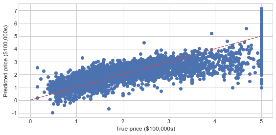
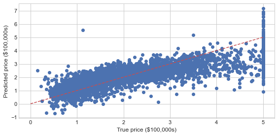

### 눈금 맞춤(Cusomizing Ticks)


```python
plt.axes(xscale='log', yscale='log');
```


    

    


```python
ax = plt.axes()
ax.plot(np.random.randn(100).cumsum())

ax.yaxis.set_major_locator(plt.NullLocator())
ax.xaxis.set_major_formatter(plt.NullFormatter())
```


    

    


```python
fig, ax = plt.subplots(3,3,sharex=True, sharey = True)
```


    

    


```python
for axi in ax.flat:
    axi.xaxis.set_major_locator(plt.MaxNLocator(4))
    axi.yaxis.set_major_locator(plt.MaxNLocator(4))
fig
```


    

    


```python
x = np.linspace(-np.pi, np.pi, 1000, endpoint=True)
y = np.sin(x)
plt.plot(x,y)

ax = plt.gca()
ax.spines['bottom'].set_position(('data',0))
ax.spines['left'].set_position(('data',0))
ax.xaxis.set_ticks_position('bottom')
ax.yaxis.set_ticks_position('left')
```


    

    


```python
x = np.linspace(1,10)
y = [10 ** el for el in x]
z = [2 * el for el in x]

fig = plt.figure(figsize=(10, 8))

ax1 = fig.add_subplot(2,2,1)
ax1.plot(x,y,'-y')
ax1.set_yscale('log')
ax1.set_title(r'Logarithmic plot of $ {10}^{x} $')
ax1.set_ylabel(r'${y} = {10}^{x} $')
plt.grid(b=True, which='both', axis='both')

ax1 = fig.add_subplot(2,2,2)
ax1.plot(x,y,'--r')
ax1.set_yscale('linear')
ax1.set_title(r'Linear plot of $ {10}^{x} $')
ax1.set_ylabel(r'${y} = {10}^{x} $')
plt.grid(b=True, which='both', axis='both')

ax1 = fig.add_subplot(2,2,3)
ax1.plot(x,y,'-.g')
ax1.set_yscale('log')
ax1.set_title(r'Logarithmic plot of $ {2}^{x} $')
ax1.set_ylabel(r'${y} = {2}^{x} $')
plt.grid(b=True, which='both', axis='both')

ax1 = fig.add_subplot(2,2,4)
ax1.plot(x,y,':b')
ax1.set_yscale('linear')
ax1.set_title(r'Linear plot of $ {2}^{x} $')
ax1.set_ylabel(r'${y} = {2}^{x} $')
plt.grid(b=True, which='both', axis='both')
```


    

    


### 스타일(Style)


```python
fig = plt.figure(figsize=(10,10))
x = range(1,11)
columns = [np.random.randn(10) * i for i in range(1, 26)]

for n, v in enumerate(plt.style.available[1:]):
    plt.style.use(v)
    plt.subplot(5,5, n + 1)
    plt.title(v)
    
    for c in columns:
        plt.plot(x, c, marker='', color='royalblue', linewidth=1, alpha=0.4)
        plt.subplots_adjust(hspace=0.5, wspace=0.4)
```


    

    


```python
plt.style.use(['seaborn-notebook'])
```

### 플롯 종류
- 막대 플롯(Barplot)
- 스템 플롯(Stem Plot)
- 박스플롯(Boxplot)


```python
# 막대 플롯
height = [np.random.randn() * i for i in range(1,6)]
names = ['A','B','C','D','E']
y_pos = np.arange(len(names))
plt.bar(y_pos, height)
plt.xticks(y_pos, names, fontweight='bold')
plt.xlabel('group');
```


    

    


```python
height = [np.random.randn() * i for i in range(1,6)]
names = ['A','B','C','D','E']
y_pos = np.arange(len(names))
plt.barh(y_pos, height)
plt.xticks(y_pos, names, fontweight='bold')
plt.ylabel('group');
```


    

    


```python
bars1 = [12, 28, 1, 8, 22]
bars2 = [28, 7, 16, 4, 10]
bars3 = [25, 3, 23, 25, 17]
bars = np.add(bars1, bars2).tolist()

r = [0, 1, 2, 3, 4]
names = ['A','B','C','D','E']

plt.bar(r, bars1, color='royalblue', edgecolor='white')
plt.bar(r, bars1, bottom=bars1, color='skyblue', edgecolor='white')
plt.bar(r, bars1, bottom=bars2, color='lightblue', edgecolor='white')

plt.xlabel('group', fontweight='bold')
plt.xticks(r, names, fontweight='bold');
```


    

    


```python
bar_width = 0.25

bars1 = [14, 17, 9, 8, 7]
bars2 = [14, 7, 12, 4, 10]
bars3 = [21, 4, 24, 13, 17]

r1= np.arange(len(bars1))
r2 = [x + bar_width for x in r1]
r3 = [x + bar_width for x in r2]

plt.bar(r1, bars1, color='royalblue', width=bar_width, edgecolor='white', label='r1')
plt.bar(r2, bars2, color='skyblue', width=bar_width, edgecolor='white', label='r2')
plt.bar(r3, bars3, color='lightblue', width=bar_width, edgecolor='white', label='r3')

plt.xlabel('group', fontweight='bold')
plt.xticks([r + bar_width for r in range(len(bars1))], ['A','B','C','D','E'])
plt.legend();
```


    

    


```python
x = [0, 5, 10, 15, 30, 40, 50, 60, 100]
v = [0, -5, -10, -15, -30, -40, -50, -60, -100]
n = len(v)
y = np.ones(n)
u = np.zeros(n)

plt.barbs(x,y,u,v,length=9)
plt.xticks(x)
plt.ylim(0.98, 1.05);
```


    

    


```python
# 스템 플롯
x = np.linspace(0.1, 2 * np.pi, 41)
y = np.exp(np.sin(x))

plt.stem(x,y,linefmt='gray', bottom=1, use_line_collection=True);
```


    

    


```python
# 박스 플롯(Boxplot)
r1 = np.random.normal(loc=0, scale=0.5, size=100)
r2 = np.random.normal(loc=0.5, scale=1, size=100)
r3 = np.random.normal(loc=1, scale=1.5, size=100)
r4 = np.random.normal(loc=1.5, scale=2, size=100)
r5 = np.random.normal(loc=2, scale=2.5, size=100)

f,ax = plt.subplots(1,1)
ax.boxplot((r1, r2, r3, r4, r5))
ax.set_xticklabels(['r1', 'r2', 'r3', 'r4', 'r5']);
```


    

    


```python
# 산점도(Scatter Plot)
plt.plot(np.random.randn(50), 'o');
```


    

    


```python
plt.figure(figsize=(8,4))
markers = ['.', ',', 'o', 'v', '^', '<', '>', '1', '2' ,'3', '4', 's', 'p', '*' ,'h', 'H', '+', 'D', 'd', '|']
for m in markers:
    plt.plot(np.random.rand(5), np.random.rand(5), m, label="'{0}'".format(m))
             
plt.legend(loc='center right', ncol=2)
plt.xlim(0,1.5);
```


    

    


```python
x = np.linspace(0, 10, 100)
y = np.sin(x)

plt.plot(x,y,'o');
```


    

    


```python
plt.scatter(x,y, marker='o');
```


    

    


```python
for i in range(9):
    x = np.arange(1000)
    y = np.random.randn(1000).cumsum()
    plt.scatter(x,y,alpha=0.2, cmap='viridis')
```


    

    


```python
x = np.random.randn(100)
y = np.random.randn(100)
colors = np.random.rand(100)
sizes = 1000 * np.random.rand(100)

plt.scatter(x,y, c=colors, s=sizes, alpha=0.3, cmap='viridis')
plt.colorbar();
```


    

    


```python
plt.scatter(x,y, c=colors, s=sizes, alpha=0.3, cmap='inferno')
plt.colorbar();
```


    

    


```python
x = np.random.randn(200)
y1 = np.random.randn(len(x))
y2 = 1.1 * np.exp(x)

ax1 = plt.plot()
plt.scatter(x, y1, color='indigo', alpha=0.3, label='no correlation')
plt.scatter(x, y2, color='blue', alpha=0.3, label='no correlation')
plt.grid(True)
plt.legend();
```


    

    


### x와 y의 일관성 차트(coherence)


```python
plt.subplots_adjust(wspace=1)

dt = 0.01
t = np.arange(0, 30, dt)
n1 = np.random.randn(len(t))
n2 = np.random.randn(len(t))
r = np.exp(-t/0.05)

c1 = np.convolve(n1, r, mode='same') * dt
c2 = np.convolve(n2, r, mode='same') * dt

s1 = 0.01 * np.sin(2 * np.pi * 10 * t) + c1
s2 = 0.01 * np.sin(2 * np.pi * 10 * t) + c2

plt.subplot(211)
plt.plot(t, s1, t, s2)
plt.xlim(0,5)
plt.xlabel('time')
plt.ylabel('s1 & s2')
plt.grid(True)

plt.subplot(212)
plt.cohere(s1, s2, 256, 1./dt)
plt.ylabel('coherence');
```


    

    


```python
s1 = 1.5 * np.sin(2 * np.pi * 10 * t) + c1
s2 = np.cos(np.pi * t) + c2 + np.sin(2 * np.pi * 10 * t)

fig, [ax1, ax2] = plt.subplots(2,1)
ax1.plot(t, s1, t, s2)
ax1.set_xlim(0,5)
ax1.set_xlabel('time')
ax1.set_ylabel('s1 & s2')
ax1.grid(True)

ax2.cohere(s1, s2, 256, 1./dt)
ax2.set_ylabel('coherence');

```


    

    


```python
d1 = np.random.randn(365).cumsum()
t1 = sum(d1)
av1 = t1 / len(d1)
z1 = [i - av1 for i in d1]

d2 = np.random.randn(365).cumsum()
t2 = sum(d2)
av2 = t2 / len(d2)
z2 = [i - av2 for i in d2]

fig = plt.figure()

ax1 = fig.add_subplot(311)
ax1.plot(d1)

ax2 = fig.add_subplot(312)
ax2.plot(d2)

ax3 = fig.add_subplot(313)
ax3.xcorr(z1, z2, usevlines=True, maxlags=None, normed=True, lw=2)

plt.ylim(-1, 1);

```


    

    


### 오차 막대(Error Bar)
- 예상 측정 오차를 나타내는 데 사용
- 오차 막대는 값의 불확실성을 나타냄


```python
x = np.linspace(0, 20, 40)
dy = 1
y = np.sin(x) + dy * np.random.randn(40)

plt.errorbar(x, y, yerr=dy, fmt='H');
```


    

    


```python
plt.errorbar(x, y, yerr=dy, fmt='s', color='darkblue', ecolor='gray', elinewidth=2, capsize=0);
```


    

    


### 2차원 유사 플롯(pcolor/pcolormesh)


```python
plt.pcolor(np.random.rand(20, 20), cmap='Reds');
```


    

    


```python
plt.pcolor(np.random.rand(20, 20), cmap='Blues');
```


    

    


### 히스토그램, 구간화, 밀도(Histogram, Binnings, and Density)


```python
data = np.random.randn(10000)
plt.hist(data);
```


    

    


```python
plt.hist(data, bins=50, alpha=0.5, histtype='stepfilled', color='steelblue', edgecolor='none');
```


    

    


```python
x1 = np.random.normal(0, 1, 10000)
x2 = np.random.normal(-5, 3, 10000)
x3 = np.random.normal(5, 2, 10000)
d = dict(histtype='stepfilled', alpha=0.3, bins=50)

plt.hist(x1, **d)
plt.hist(x2, **d)
plt.hist(x3, **d);
```


    

    


```python
x = np.random.normal(size=50000)
y = x - np.random.normal(size=50000)

plt.hist2d(x, y, bins=50, cmap='OrRd')
plt.colorbar();
```


    

    


```python
plt.hexbin(x, y, gridsize=20, cmap='OrRd')
plt.colorbar();
```


    

    


### 밀도와 등고선 플롯(Density and Contour Plots)


```python
a = np.arange(-1, 1, 0.1)
X, Y = np.meshgrid(a,a)
Z = np.sin(X * Y)
CS = plt.contour(X, Y, Z, levels=a)
plt.clabel(CS, inline=2)
plt.colorbar();
```


    

    


```python
def f(x,y):
    return(1 - (x ** 2 + y ** 2)) * np.exp(-y ** 2 / 2)

x = np.arange(-1.5, 1.5, 0.1)
y = np.arange(-1.5, 1.5, 0.1)

X, Y = np.meshgrid(x,y)
Z = f(X,Y)
N = np.arange(-1, 2, 0.2)

CS = plt.contour(Z, N, linewidth=2, cmap = 'rainbow')
plt.clabel(CS, inline=True, fmt='%1.1f')
plt.colorbar(CS);
```

    <ipython-input-75-38b918388c25>:11: UserWarning: The following kwargs were not used by contour: 'linewidth'
      CS = plt.contour(Z, N, linewidth=2, cmap = 'rainbow')
    


    

    


```python
l = np.linspace(-1.0, 1.0, 1000)
X, Y = np.meshgrid(l,l)
Z = np.sqrt(X ** 2 + Y ** 2)
lv = np.linspace(Z.reshape(-1,1).min(), Z.reshape(-1,1).max(), 40)
plt.contour(X, Y, Z, levels=lv)
plt.colorbar();
```


    

    


```python
plt.contourf(X, Y, Z, levels=lv)
plt.colorbar();
```


    

    


```python
plt.imshow(Z, extent=[-1, 1, -1, 1], origin='lower', cmap='rainbow', alpha=0.4);
```


    

    


### 스트림 플롯(Stream Plot)


```python
Y, X = np.mgrid[0:5:100j, 0:5:100j]
U = X
V = np.sin(Y)
plt.streamplot(X,Y,U,V);
```


    

    


```python
Y, X = np.mgrid[-3:3:100j, -3:3:100j]
U = -1 -X ** 2 + Y
V = 1 + X - Y ** 2
speed = np.sqrt(U ** 2 + V ** 2)
plt.figure(figsize=(12,7))
plt.streamplot(X,Y,U,V, density=2);
```


    

    


### 화살표 2차원 필드(quiver)


```python
import sympy

x,y = sympy.symbols('x y')
f = x**2 + y**2 + x*y - sympy.sin(x) * 4
fdx = sympy.diff(f, x)
fdy = sympy.diff(f,y)

sample_size=100
xs, ys = np.meshgrid(np.linspace(-10, 10, sample_size), np.linspace(-10, 10, sample_size))

zs = [float(f.subs(x, xv).subs(y,yv)) for xv, yv in zip(xs.ravel(), ys.ravel())]
zs = np.array(zs).reshape(sample_size, sample_size)
plt.contour(xs, ys, zs, 40, levels=np.logspace(-0.5, 2.0, 40), cmap='rainbow')

xs_q, ys_q = np.meshgrid(np.linspace(-10, 10, 10), np.linspace(-10, 10, 10))

xsg = [-float(fdx.subs(x, xv).subs(y, yv)) for xv, yv in zip(xs_q.ravel(), ys_q.ravel())]
ysg = [-float(fdx.subs(x, xv).subs(y, yv)) for xv, yv in zip(xs_q.ravel(), ys_q.ravel())]

plt.quiver(xs_q, ys_q, xsg, ysg, width=0.005, scale=500, color='black')
```


    <matplotlib.quiver.Quiver at 0x2127bb4c4c0>


    

    


### 파이 차트(Pie Chart)
- 원그래프, 파이차트는 전체에 대한 각 부분의 비율을 부채꼴 모양으로 나타낸 그래프
- 각 부채꼴의 중심각이 전체에서 차지하는 비율을 나타내며, 비율을 한눈에 볼 수 있다는 장점
- 전체적인 비율을 쉽게 파악할 수 있어서 언론사에서 통계 수치를 공개할 때 자주 활용


```python
data = [10, 50, 30, 40, 60]
categories = ['C1', 'C2', 'C3', 'C4', 'C5']
plt.pie(data, labels=categories, autopct='%0.1f%%')
plt.legend(categories);
```


    

    


```python
explode = [0.1, 0.1, 0.1, 0.1, 0.1]
plt.pie(data, explode = explode, labels=categories, autopct='%0.1f%%')
plt.legend(categories);
```


    

    


### 레이다 차트(Radar Chart)
- 어떤 측정 목표에 대한 평가항목이 여러 개일 때 항목 수에 따라 원을 같은 간격으로 나누고, 중심으로부터 일정 간격으로
동심으로 척도를 재는 칸을 나누어 각 평가항목의 정량화된 점수에 따라 그 위치에 점을 찍고 평가항목간 점을 이어 선으로
만들어 항목 간 균형을 한눈에 볼 수 있도록 해주는 도표
- 여러 측정 목표를 함께 겹쳐 놓아 비교하기에도 편리 각 항목 간 비율뿐만 아니라 균형과 경향을 직관적으로 알 수 있어 편리


```python
df = pd.DataFrame({
    'group' : ['A', 'B', 'C', 'D'],
    'var1' : [38, 1.5, 30, 4],
    'var2' : [29, 10, 9, 34],
    'var3' : [8, 39, 23, 24],
    'var4' : [7, 31, 33, 14],
    'var5' : [28, 15, 32, 14]
})

categories = list(df)[1:]
N = len(categories)

angles = [n / float(N) * 2 * np.pi for n in range(N)]
angles += angles[:1]

ax = plt.subplot(111, polar=True)
ax.set_theta_offset(np.pi / 2)
ax.set_theta_direction(-1)
ax.set_rlabel_position(0)
plt.xticks(angles[:-1], categories)
plt.yticks([10, 20, 30], ["10", "20", "30"], color='gray', size = 7)
plt.ylim(0, 40)

values = df.loc[0].drop('group').values.flatten().tolist()
values += values[:1]
ax.plot(angles, values, linewidth=1, linestyle='solid', label='A')
ax.fill(angles, values, 'b', alpha=0.1)

values = df.loc[1].drop('group').values.flatten().tolist()
values += values[:1]
ax.plot(angles, values, linewidth=1, linestyle='solid', label='B')
ax.fill(angles, values, 'r', alpha=0.1)

plt.legend(bbox_to_anchor=(0.1, 0.1));
```


    

    


### 생키 다이어그램(Sankey Diagram)
- 흐름(Flow)다이어그램의 한 종류로서 그 화살표의 너비로 흐름의 양을 비율적으로 보여줌


```python
from matplotlib.sankey import Sankey

Sankey(flows=[0.20, 0.15, 0.25, -0.25, -0.25, -0.15, -0.60, -0.20],
      labels=['Zero', 'One', 'Two', 'Three', 'Four', 'Five', 'Six', 'Seven'],
      orientations=[-1, -1, 0, 1, 1, 1, 0, -1]).finish();
```


    

    


### 3차원 플로팅(Three-Dimensional Plotting)


```python
from mpl_toolkits import mplot3d
```


```python
fig = plt.figure()
ax = plt.axes(projection='3d')
```


    

    


```python
x = range(1,101)
y = np.random.randn(100) * x
z = np.random.randn(100) * x

fig = plt.figure()
ax = fig.add_subplot(111, projection='3d')
ax.scatter(x, y, z, c='green', s=60);
```


    

    


```python
ax = plt.axes(projection = '3d')

zline = np.linspace(0, 20, 1000)
xline = np.sin(zline)
yline = np.cos(zline)
ax.plot3D(xline, yline, zline, 'gray')

zdata = 20 * np.random.random(100)
xdata = np.sin(zdata) + 0.2 * np.random.randn(100)
ydata = np.cos(zdata) + 0.2 * np.random.randn(100)
ax.scatter3D(xdata, ydata, zdata, c=zdata, cmap='Blues');
```


    

    


```python
def f(x,y):
    return np.cos(np.sqrt(x**2 + y**2))

l = np.linspace(-4, 4, 20)
X, Y = np.meshgrid(l,l)
Z = f(X,Y)
```


```python
fig = plt.figure()
ax = plt.axes(projection='3d')
ax.contour3D(X, Y, Z, 50, cmap='BuPu')
ax.set_xlabel('x')
ax.set_ylabel('y')
ax.set_zlabel('z')
```


    Text(0.5, 0, 'z')


    

    


```python
ax.view_init(60,30)
fig
```


    

    


```python
fig = plt.figure()
ax = plt.axes(projection='3d')
ax.plot_wireframe(X,Y,Z, color='gray');
```


    

    


```python
ax = plt.axes(projection='3d')
ax.plot_surface(X,Y,Z, rstride=1, cstride=1, cmap='viridis', edgecolor='none');
```


    

    


```python
r = np.linspace(0, 6, 20)
theta = np.linspace(-0.8 * np.pi, 0.8 * np.pi, 40)
r, theta = np.meshgrid(r, theta)

X = r * np.sin(theta)
Y = r * np.cos(theta)
Z = f(X,Y)

ax = plt.axes(projection='3d')
ax.plot_surface(X, Y, Z, rstride=1, cstride=1, cmap='viridis', edgecolor='none');
```


    

    


```python
theta = 2 * np.pi * np.random.random(1000)
r = 6 * np.random.random(1000)
X = np.ravel(r * np.sin(theta))
Y = np.ravel(r * np.cos(theta))
Z = f(X,Y)
```


```python
ax = plt.axes(projection = '3d')
ax.scatter(X, Y, Z, c=Z, cmap='viridis', linewidth=0.5);
```


    

    


```python
ax = plt.axes(projection='3d')
ax.plot_trisurf(X, Y, Z, cmap='viridis', edgecolor='none')
```


    <mpl_toolkits.mplot3d.art3d.Poly3DCollection at 0x21200277a90>


    

    


```python
x = np.random.normal(5, 1, 100)
y = np.random.normal(3, 0.5, 100)

fig = plt.figure(figsize = (8, 10))
hist, xedges, yedges = np.histogram2d(x,y, bins=10)

elements = (len(xedges) -1) * (len(yedges)-1)
xpos, ypos = np.meshgrid(xedges[:-1] + 0.25, yedges[:-1] + 0.25)
xpos = xpos.flatten()
ypos = ypos.flatten()
zpos = np.zeros(elements)

dx = 0.1 * np.ones_like(zpos)
dy = dx.copy()
dz = hist.flatten()

ax = fig.add_subplot(211)
ax.scatter(x,y, alpha=0.5)
ax.set_xlabel('X Axis')
ax.set_ylabel('Y Axis')

ax2 = fig.add_subplot(212, projection = '3d')
ax2.bar3d(xpos, ypos, zpos, dx, dy, dz, alpha=0.4)
ax2.set_xlabel('X Axis')
ax2.set_ylabel('Y Axis')
ax2.set_zlabel('Z Axis');


```


    

    


```python

```
