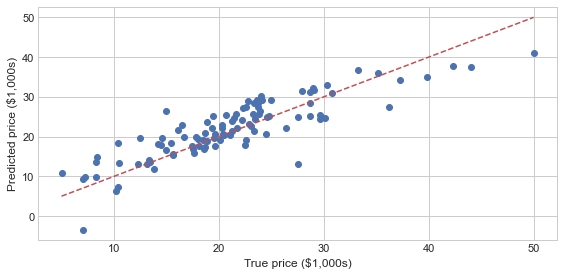

### API 사용 방법
- 1. Scikit-Learn으로부터 적절한 estimator 클래스를 임포트해서 모델의 클래스 선택
- 2. 클래스를 원하는 값으로 인스턴스화해서 모델의 하이퍼파라미터 선택
- 3. 데이터를 특징 배열과 대상 벡터로 배치
- 4. 모델 인스턴스의 fit()메서드를 호출해 모델을 데이터에 적합
- 5. 모델을 새 데이터에 대해서 적용
    - 지도 학습 : 대체로 predict() 메서드를 사용해 알려지지 않은 데이터에 대한 레이블을 예측
    - 비지도 학습 : 대체로 transform()이나 predict() 메서드를 사용해 데이터의 속성을 변환하거나 추론

#### API 사용 예제


```python
import matplotlib.pyplot as plt
plt.style.use(['seaborn-whitegrid'])
```


```python
x = 10 * np.random.rand(50)
y = 2 * x + np.random.rand(50)
plt.scatter(x, y);
```


    

    


```python
# 1. 적절한 estimator 클래스를 임포트해서 모델의 클래스 선택
from sklearn.linear_model import LinearRegression
```


```python
# 2. 클래스를 원하는 값으로 인스턴스화해서 모델의 하이퍼파라미터 선택
model = LinearRegression(fit_intercept = True)
model
```


    LinearRegression()


```python
# 3. 데이터를 특징 배열과 대상 벡터로 배치
X = x[:, np.newaxis]
X
```


    array([[8.72201734],
           [7.35438397],
           [9.82581478],
           [4.05363224],
           [5.2982629 ],
           [9.48847978],
           [0.50063005],
           [0.0754356 ],
           [7.15731545],
           [2.18673563],
           [2.93515902],
           [8.22999673],
           [4.62643519],
           [6.97536074],
           [0.36221068],
           [3.24437506],
           [3.18821064],
           [6.97220781],
           [4.09154958],
           [5.24005174],
           [1.61371305],
           [1.22235002],
           [8.80343037],
           [7.63272576],
           [9.4906031 ],
           [9.93766237],
           [1.57170467],
           [3.54086404],
           [0.30124261],
           [2.02864209],
           [1.49558907],
           [5.35132434],
           [9.95291536],
           [8.53592236],
           [6.6218749 ],
           [6.30800046],
           [5.36095894],
           [3.29866703],
           [3.95644228],
           [2.49037319],
           [1.95140071],
           [9.69926389],
           [3.71842938],
           [7.90137464],
           [9.60244536],
           [8.64967743],
           [1.78760922],
           [2.34659359],
           [5.94052132],
           [0.62502477]])


```python
# 4. 모델 인스턴스의 fit() 메서드를 호출해 모델을 데이터에 적합
model.fit(X, y)
```


    LinearRegression()


```python
# 5. 모델을 새 데이터에 대해서 적용
xfit = np.linspace(-1,11)
Xfit = xfit[:,np.newaxis]
yfit = model.predict(Xfit)
```


```python
plt.scatter(x,y)
plt.plot(xfit,yfit, '--r');
```


    

    


### 분류와 클러스터링을 위한 표본 데이터 생성
- datasets.make_classifications() : 분류를 위한 데이터 세트 생성, 높은 상관도, 불필요한 속성 등의 노이즈를 고려한 데이터를 무작위 생성
- datasets.make_blobs() : 클러스터링을 위한 데이터 세트 생성. 군집 지정 개수에 따라 여러 가지 클러스터링을 위한 데이터 셋트를 무작위로 생성


#### 예제 데이터 세트 구조
- 일반적으로 딕셔너리 형태로 구성
- data : 특징 데이터 세트
- target : 분류용은 레이블 값, 회귀용은 숫자 결과값 데이터
- target_names : 개별 레이블의 이름 (분류용)
- feature_names : 특징 이름
- DESCR : 데이터 세트에 대한 설명과 각 특징 설명


```python
from sklearn.datasets import load_diabetes

diabetes = load_diabetes()
print(diabetes.keys())
```

    dict_keys(['data', 'target', 'frame', 'DESCR', 'feature_names', 'data_filename', 'target_filename'])
    


```python
print(diabetes.data)
```

    [[ 0.03807591  0.05068012  0.06169621 ... -0.00259226  0.01990842
      -0.01764613]
     [-0.00188202 -0.04464164 -0.05147406 ... -0.03949338 -0.06832974
      -0.09220405]
     [ 0.08529891  0.05068012  0.04445121 ... -0.00259226  0.00286377
      -0.02593034]
     ...
     [ 0.04170844  0.05068012 -0.01590626 ... -0.01107952 -0.04687948
       0.01549073]
     [-0.04547248 -0.04464164  0.03906215 ...  0.02655962  0.04452837
      -0.02593034]
     [-0.04547248 -0.04464164 -0.0730303  ... -0.03949338 -0.00421986
       0.00306441]]
    


```python
print(diabetes.target)
```

    [151.  75. 141. 206. 135.  97. 138.  63. 110. 310. 101.  69. 179. 185.
     118. 171. 166. 144.  97. 168.  68.  49.  68. 245. 184. 202. 137.  85.
     131. 283. 129.  59. 341.  87.  65. 102. 265. 276. 252.  90. 100.  55.
      61.  92. 259.  53. 190. 142.  75. 142. 155. 225.  59. 104. 182. 128.
      52.  37. 170. 170.  61. 144.  52. 128.  71. 163. 150.  97. 160. 178.
      48. 270. 202. 111.  85.  42. 170. 200. 252. 113. 143.  51.  52. 210.
      65. 141.  55. 134.  42. 111.  98. 164.  48.  96.  90. 162. 150. 279.
      92.  83. 128. 102. 302. 198.  95.  53. 134. 144. 232.  81. 104.  59.
     246. 297. 258. 229. 275. 281. 179. 200. 200. 173. 180.  84. 121. 161.
      99. 109. 115. 268. 274. 158. 107.  83. 103. 272.  85. 280. 336. 281.
     118. 317. 235.  60. 174. 259. 178. 128.  96. 126. 288.  88. 292.  71.
     197. 186.  25.  84.  96. 195.  53. 217. 172. 131. 214.  59.  70. 220.
     268. 152.  47.  74. 295. 101. 151. 127. 237. 225.  81. 151. 107.  64.
     138. 185. 265. 101. 137. 143. 141.  79. 292. 178.  91. 116.  86. 122.
      72. 129. 142.  90. 158.  39. 196. 222. 277.  99. 196. 202. 155.  77.
     191.  70.  73.  49.  65. 263. 248. 296. 214. 185.  78.  93. 252. 150.
      77. 208.  77. 108. 160.  53. 220. 154. 259.  90. 246. 124.  67.  72.
     257. 262. 275. 177.  71.  47. 187. 125.  78.  51. 258. 215. 303. 243.
      91. 150. 310. 153. 346.  63.  89.  50.  39. 103. 308. 116. 145.  74.
      45. 115. 264.  87. 202. 127. 182. 241.  66.  94. 283.  64. 102. 200.
     265.  94. 230. 181. 156. 233.  60. 219.  80.  68. 332. 248.  84. 200.
      55.  85.  89.  31. 129.  83. 275.  65. 198. 236. 253. 124.  44. 172.
     114. 142. 109. 180. 144. 163. 147.  97. 220. 190. 109. 191. 122. 230.
     242. 248. 249. 192. 131. 237.  78. 135. 244. 199. 270. 164.  72.  96.
     306.  91. 214.  95. 216. 263. 178. 113. 200. 139. 139.  88. 148.  88.
     243.  71.  77. 109. 272.  60.  54. 221.  90. 311. 281. 182. 321.  58.
     262. 206. 233. 242. 123. 167.  63. 197.  71. 168. 140. 217. 121. 235.
     245.  40.  52. 104. 132.  88.  69. 219.  72. 201. 110.  51. 277.  63.
     118.  69. 273. 258.  43. 198. 242. 232. 175.  93. 168. 275. 293. 281.
      72. 140. 189. 181. 209. 136. 261. 113. 131. 174. 257.  55.  84.  42.
     146. 212. 233.  91. 111. 152. 120.  67. 310.  94. 183.  66. 173.  72.
      49.  64.  48. 178. 104. 132. 220.  57.]
    


```python
print(diabetes.DESCR)
```

    .. _diabetes_dataset:
    
    Diabetes dataset
    ----------------
    
    Ten baseline variables, age, sex, body mass index, average blood
    pressure, and six blood serum measurements were obtained for each of n =
    442 diabetes patients, as well as the response of interest, a
    quantitative measure of disease progression one year after baseline.
    
    **Data Set Characteristics:**
    
      :Number of Instances: 442
    
      :Number of Attributes: First 10 columns are numeric predictive values
    
      :Target: Column 11 is a quantitative measure of disease progression one year after baseline
    
      :Attribute Information:
          - age     age in years
          - sex
          - bmi     body mass index
          - bp      average blood pressure
          - s1      tc, T-Cells (a type of white blood cells)
          - s2      ldl, low-density lipoproteins
          - s3      hdl, high-density lipoproteins
          - s4      tch, thyroid stimulating hormone
          - s5      ltg, lamotrigine
          - s6      glu, blood sugar level
    
    Note: Each of these 10 feature variables have been mean centered and scaled by the standard deviation times `n_samples` (i.e. the sum of squares of each column totals 1).
    
    Source URL:
    https://www4.stat.ncsu.edu/~boos/var.select/diabetes.html
    
    For more information see:
    Bradley Efron, Trevor Hastie, Iain Johnstone and Robert Tibshirani (2004) "Least Angle Regression," Annals of Statistics (with discussion), 407-499.
    (https://web.stanford.edu/~hastie/Papers/LARS/LeastAngle_2002.pdf)
    


```python
print(diabetes.feature_names)
```

    ['age', 'sex', 'bmi', 'bp', 's1', 's2', 's3', 's4', 's5', 's6']
    


```python
print(diabetes.data_filename)
print(diabetes.target_filename)
```

    C:\Users\ds990\anaconda3\lib\site-packages\sklearn\datasets\data\diabetes_data.csv.gz
    C:\Users\ds990\anaconda3\lib\site-packages\sklearn\datasets\data\diabetes_target.csv.gz
    

#### model_selection 모듈
- 학습용 데이터와 테스트 데이터로 분리
- 교차 검증 분할 및 평가
- Estimator의 하이퍼 파라미터 튜닝을 위한 다양한 함수와 클래스 제공

#### train_test_split() : 학습/테스트 데이터 세트 분리


```python
from sklearn.linear_model import LinearRegression
from sklearn.model_selection import train_test_split
from sklearn.datasets import load_diabetes

diabetes = load_diabetes()
X_train, X_test, y_train, y_test = train_test_split(diabetes.data, diabetes.target, test_size = 0.3)

model = LinearRegression()
model.fit(X_train, y_train)

print("학습 데이터 점수 : {}".format(model.score(X_train, y_train)))
print("평가 데이터 점수 : {}".format(model.score(X_test, y_test)))

```

    학습 데이터 점수 : 0.5500882454381986
    평가 데이터 점수 : 0.4309586828307431
    


```python
predicted = model.predict(X_test)
expected = y_test
plt.figure(figsize = (8,4))
plt.scatter(expected, predicted)
plt.plot([30, 350], [30, 350], '--r')
plt.tight_layout()
```


    

    


#### cross_val_score() : 교차 검증


```python
from sklearn.model_selection import cross_val_score, cross_validate

scores = cross_val_score(model, diabetes.data, diabetes.target, cv=5)

print("교차 검증 정확도 : {}".format(scores))
print("교차 검증 정확도 : {} +/- {}".format(np.mean(scores), np.std(scores)))
```

    교차 검증 정확도 : [0.42955643 0.52259828 0.4826784  0.42650827 0.55024923]
    교차 검증 정확도 : 0.4823181221114939 +/- 0.04926619776563213
    

#### GridSearchCV : 교차 검증과 최적 하이퍼 파라미터 찾기
- 훈련 단계에서 학습한 파라미터에 영향을 받아서 최상의 파라미터를 찾는 일은 항상 어려운 문제
- 다양한 모델의 훈련 과정을 자동화하고, 교차 검사를 사용해 최적 값을 제공하는 도구 필요


```python
from sklearn.model_selection import GridSearchCV
from sklearn.linear_model import Ridge

alpha = [0.001, 0.01, 0.1, 1, 10, 100, 1000]
param_grid = dict(alpha=alpha)

gs = GridSearchCV(estimator=Ridge(), param_grid=param_grid, cv=10)
result = gs.fit(diabetes.data, diabetes.target)

print("최적 점수 : {}".format(result.best_score_))
print("최적 파라미터 : {}".format(result.best_params_))
print(gs.best_estimator_)
pd.DataFrame(result.cv_results_)
```

    최적 점수 : 0.4633240541517594
    최적 파라미터 : {'alpha': 0.1}
    Ridge(alpha=0.1)
    


<div>
<style scoped>
    .dataframe tbody tr th:only-of-type {
        vertical-align: middle;
    }

    .dataframe tbody tr th {
        vertical-align: top;
    }

    .dataframe thead th {
        text-align: right;
    }
</style>
<table border="1" class="dataframe">
  <thead>
    <tr style="text-align: right;">
      <th></th>
      <th>mean_fit_time</th>
      <th>std_fit_time</th>
      <th>mean_score_time</th>
      <th>std_score_time</th>
      <th>param_alpha</th>
      <th>params</th>
      <th>split0_test_score</th>
      <th>split1_test_score</th>
      <th>split2_test_score</th>
      <th>split3_test_score</th>
      <th>split4_test_score</th>
      <th>split5_test_score</th>
      <th>split6_test_score</th>
      <th>split7_test_score</th>
      <th>split8_test_score</th>
      <th>split9_test_score</th>
      <th>mean_test_score</th>
      <th>std_test_score</th>
      <th>rank_test_score</th>
    </tr>
  </thead>
  <tbody>
    <tr>
      <th>0</th>
      <td>0.001787</td>
      <td>0.004043</td>
      <td>0.000268</td>
      <td>0.000550</td>
      <td>0.001</td>
      <td>{'alpha': 0.001}</td>
      <td>0.554415</td>
      <td>0.233686</td>
      <td>0.356799</td>
      <td>0.620259</td>
      <td>0.267033</td>
      <td>0.619397</td>
      <td>0.419907</td>
      <td>0.433019</td>
      <td>0.433431</td>
      <td>0.684984</td>
      <td>0.462293</td>
      <td>0.145848</td>
      <td>3</td>
    </tr>
    <tr>
      <th>1</th>
      <td>0.000397</td>
      <td>0.000487</td>
      <td>0.000350</td>
      <td>0.000450</td>
      <td>0.01</td>
      <td>{'alpha': 0.01}</td>
      <td>0.546297</td>
      <td>0.244132</td>
      <td>0.368901</td>
      <td>0.613732</td>
      <td>0.271717</td>
      <td>0.623089</td>
      <td>0.426074</td>
      <td>0.424759</td>
      <td>0.429484</td>
      <td>0.680912</td>
      <td>0.462910</td>
      <td>0.141446</td>
      <td>2</td>
    </tr>
    <tr>
      <th>2</th>
      <td>0.000400</td>
      <td>0.000490</td>
      <td>0.000268</td>
      <td>0.000556</td>
      <td>0.1</td>
      <td>{'alpha': 0.1}</td>
      <td>0.526550</td>
      <td>0.244987</td>
      <td>0.383530</td>
      <td>0.606594</td>
      <td>0.286094</td>
      <td>0.618033</td>
      <td>0.431230</td>
      <td>0.441788</td>
      <td>0.431968</td>
      <td>0.662466</td>
      <td>0.463324</td>
      <td>0.132681</td>
      <td>1</td>
    </tr>
    <tr>
      <th>3</th>
      <td>0.000300</td>
      <td>0.000458</td>
      <td>0.000212</td>
      <td>0.000424</td>
      <td>1</td>
      <td>{'alpha': 1}</td>
      <td>0.421593</td>
      <td>0.168442</td>
      <td>0.358004</td>
      <td>0.512608</td>
      <td>0.284928</td>
      <td>0.514264</td>
      <td>0.388246</td>
      <td>0.484448</td>
      <td>0.396502</td>
      <td>0.525132</td>
      <td>0.405417</td>
      <td>0.108385</td>
      <td>4</td>
    </tr>
    <tr>
      <th>4</th>
      <td>0.000403</td>
      <td>0.000494</td>
      <td>0.000150</td>
      <td>0.000319</td>
      <td>10</td>
      <td>{'alpha': 10}</td>
      <td>0.159386</td>
      <td>-0.081177</td>
      <td>0.152190</td>
      <td>0.165690</td>
      <td>0.119349</td>
      <td>0.186933</td>
      <td>0.158147</td>
      <td>0.203748</td>
      <td>0.153627</td>
      <td>0.189440</td>
      <td>0.140733</td>
      <td>0.077298</td>
      <td>5</td>
    </tr>
    <tr>
      <th>5</th>
      <td>0.000401</td>
      <td>0.000491</td>
      <td>0.000308</td>
      <td>0.000471</td>
      <td>100</td>
      <td>{'alpha': 100}</td>
      <td>0.012468</td>
      <td>-0.234480</td>
      <td>0.013522</td>
      <td>-0.012820</td>
      <td>0.004838</td>
      <td>0.022647</td>
      <td>0.022028</td>
      <td>-0.009908</td>
      <td>0.015589</td>
      <td>0.026427</td>
      <td>-0.013969</td>
      <td>0.074561</td>
      <td>6</td>
    </tr>
    <tr>
      <th>6</th>
      <td>0.000147</td>
      <td>0.000305</td>
      <td>0.000417</td>
      <td>0.000511</td>
      <td>1000</td>
      <td>{'alpha': 1000}</td>
      <td>-0.009602</td>
      <td>-0.258118</td>
      <td>-0.007849</td>
      <td>-0.038479</td>
      <td>-0.012933</td>
      <td>-0.000932</td>
      <td>0.001768</td>
      <td>-0.042679</td>
      <td>-0.004652</td>
      <td>0.002744</td>
      <td>-0.037073</td>
      <td>0.075191</td>
      <td>7</td>
    </tr>
  </tbody>
</table>
</div>


```python
import multiprocessing
from sklearn.datasets import load_iris
from sklearn.linear_model import LogisticRegression

iris = load_iris()

param_grid = [
                {
                    'penalty' : ['l1', 'l2'],
                    'C' : [1.5,2.0, 2.5, 3.0, 3.5]
                }
]

gs = GridSearchCV(estimator=LogisticRegression(), param_grid=param_grid,
                 scoring='accuracy', cv=10, n_jobs=multiprocessing.cpu_count())
result = gs.fit(iris.data, iris.target)

print("최적 점수 : {}".format(result.best_score_))
print("최적 파라미터 : {}".format(result.best_params_))
print(gs.best_estimator_)
pd.DataFrame(result.cv_results_)
```

    최적 점수 : 0.9800000000000001
    최적 파라미터 : {'C': 2.5, 'penalty': 'l2'}
    LogisticRegression(C=2.5)
    

    C:\Users\ds990\anaconda3\lib\site-packages\sklearn\model_selection\_search.py:918: UserWarning: One or more of the test scores are non-finite: [       nan 0.97333333        nan 0.97333333        nan 0.98
            nan 0.98              nan 0.98      ]
      warnings.warn(
    C:\Users\ds990\anaconda3\lib\site-packages\sklearn\linear_model\_logistic.py:763: ConvergenceWarning: lbfgs failed to converge (status=1):
    STOP: TOTAL NO. of ITERATIONS REACHED LIMIT.
    
    Increase the number of iterations (max_iter) or scale the data as shown in:
        https://scikit-learn.org/stable/modules/preprocessing.html
    Please also refer to the documentation for alternative solver options:
        https://scikit-learn.org/stable/modules/linear_model.html#logistic-regression
      n_iter_i = _check_optimize_result(
    


<div>
<style scoped>
    .dataframe tbody tr th:only-of-type {
        vertical-align: middle;
    }

    .dataframe tbody tr th {
        vertical-align: top;
    }

    .dataframe thead th {
        text-align: right;
    }
</style>
<table border="1" class="dataframe">
  <thead>
    <tr style="text-align: right;">
      <th></th>
      <th>mean_fit_time</th>
      <th>std_fit_time</th>
      <th>mean_score_time</th>
      <th>std_score_time</th>
      <th>param_C</th>
      <th>param_penalty</th>
      <th>params</th>
      <th>split0_test_score</th>
      <th>split1_test_score</th>
      <th>split2_test_score</th>
      <th>split3_test_score</th>
      <th>split4_test_score</th>
      <th>split5_test_score</th>
      <th>split6_test_score</th>
      <th>split7_test_score</th>
      <th>split8_test_score</th>
      <th>split9_test_score</th>
      <th>mean_test_score</th>
      <th>std_test_score</th>
      <th>rank_test_score</th>
    </tr>
  </thead>
  <tbody>
    <tr>
      <th>0</th>
      <td>0.000309</td>
      <td>0.000473</td>
      <td>0.000000</td>
      <td>0.000000</td>
      <td>1.5</td>
      <td>l1</td>
      <td>{'C': 1.5, 'penalty': 'l1'}</td>
      <td>NaN</td>
      <td>NaN</td>
      <td>NaN</td>
      <td>NaN</td>
      <td>NaN</td>
      <td>NaN</td>
      <td>NaN</td>
      <td>NaN</td>
      <td>NaN</td>
      <td>NaN</td>
      <td>NaN</td>
      <td>NaN</td>
      <td>6</td>
    </tr>
    <tr>
      <th>1</th>
      <td>0.034285</td>
      <td>0.001876</td>
      <td>0.000548</td>
      <td>0.000472</td>
      <td>1.5</td>
      <td>l2</td>
      <td>{'C': 1.5, 'penalty': 'l2'}</td>
      <td>1.0</td>
      <td>0.933333</td>
      <td>1.0</td>
      <td>1.0</td>
      <td>0.933333</td>
      <td>0.933333</td>
      <td>0.933333</td>
      <td>1.0</td>
      <td>1.0</td>
      <td>1.0</td>
      <td>0.973333</td>
      <td>0.032660</td>
      <td>4</td>
    </tr>
    <tr>
      <th>2</th>
      <td>0.000304</td>
      <td>0.000245</td>
      <td>0.000000</td>
      <td>0.000000</td>
      <td>2.0</td>
      <td>l1</td>
      <td>{'C': 2.0, 'penalty': 'l1'}</td>
      <td>NaN</td>
      <td>NaN</td>
      <td>NaN</td>
      <td>NaN</td>
      <td>NaN</td>
      <td>NaN</td>
      <td>NaN</td>
      <td>NaN</td>
      <td>NaN</td>
      <td>NaN</td>
      <td>NaN</td>
      <td>NaN</td>
      <td>7</td>
    </tr>
    <tr>
      <th>3</th>
      <td>0.032478</td>
      <td>0.003597</td>
      <td>0.000376</td>
      <td>0.000408</td>
      <td>2.0</td>
      <td>l2</td>
      <td>{'C': 2.0, 'penalty': 'l2'}</td>
      <td>1.0</td>
      <td>0.933333</td>
      <td>1.0</td>
      <td>1.0</td>
      <td>0.933333</td>
      <td>0.933333</td>
      <td>0.933333</td>
      <td>1.0</td>
      <td>1.0</td>
      <td>1.0</td>
      <td>0.973333</td>
      <td>0.032660</td>
      <td>4</td>
    </tr>
    <tr>
      <th>4</th>
      <td>0.000100</td>
      <td>0.000300</td>
      <td>0.000000</td>
      <td>0.000000</td>
      <td>2.5</td>
      <td>l1</td>
      <td>{'C': 2.5, 'penalty': 'l1'}</td>
      <td>NaN</td>
      <td>NaN</td>
      <td>NaN</td>
      <td>NaN</td>
      <td>NaN</td>
      <td>NaN</td>
      <td>NaN</td>
      <td>NaN</td>
      <td>NaN</td>
      <td>NaN</td>
      <td>NaN</td>
      <td>NaN</td>
      <td>8</td>
    </tr>
    <tr>
      <th>5</th>
      <td>0.032238</td>
      <td>0.004355</td>
      <td>0.000455</td>
      <td>0.000422</td>
      <td>2.5</td>
      <td>l2</td>
      <td>{'C': 2.5, 'penalty': 'l2'}</td>
      <td>1.0</td>
      <td>0.933333</td>
      <td>1.0</td>
      <td>1.0</td>
      <td>0.933333</td>
      <td>1.000000</td>
      <td>0.933333</td>
      <td>1.0</td>
      <td>1.0</td>
      <td>1.0</td>
      <td>0.980000</td>
      <td>0.030551</td>
      <td>1</td>
    </tr>
    <tr>
      <th>6</th>
      <td>0.000188</td>
      <td>0.000305</td>
      <td>0.000000</td>
      <td>0.000000</td>
      <td>3.0</td>
      <td>l1</td>
      <td>{'C': 3.0, 'penalty': 'l1'}</td>
      <td>NaN</td>
      <td>NaN</td>
      <td>NaN</td>
      <td>NaN</td>
      <td>NaN</td>
      <td>NaN</td>
      <td>NaN</td>
      <td>NaN</td>
      <td>NaN</td>
      <td>NaN</td>
      <td>NaN</td>
      <td>NaN</td>
      <td>9</td>
    </tr>
    <tr>
      <th>7</th>
      <td>0.029810</td>
      <td>0.003759</td>
      <td>0.000501</td>
      <td>0.000501</td>
      <td>3.0</td>
      <td>l2</td>
      <td>{'C': 3.0, 'penalty': 'l2'}</td>
      <td>1.0</td>
      <td>0.933333</td>
      <td>1.0</td>
      <td>1.0</td>
      <td>0.933333</td>
      <td>1.000000</td>
      <td>0.933333</td>
      <td>1.0</td>
      <td>1.0</td>
      <td>1.0</td>
      <td>0.980000</td>
      <td>0.030551</td>
      <td>1</td>
    </tr>
    <tr>
      <th>8</th>
      <td>0.000201</td>
      <td>0.000402</td>
      <td>0.000000</td>
      <td>0.000000</td>
      <td>3.5</td>
      <td>l1</td>
      <td>{'C': 3.5, 'penalty': 'l1'}</td>
      <td>NaN</td>
      <td>NaN</td>
      <td>NaN</td>
      <td>NaN</td>
      <td>NaN</td>
      <td>NaN</td>
      <td>NaN</td>
      <td>NaN</td>
      <td>NaN</td>
      <td>NaN</td>
      <td>NaN</td>
      <td>NaN</td>
      <td>10</td>
    </tr>
    <tr>
      <th>9</th>
      <td>0.031328</td>
      <td>0.002774</td>
      <td>0.000466</td>
      <td>0.000476</td>
      <td>3.5</td>
      <td>l2</td>
      <td>{'C': 3.5, 'penalty': 'l2'}</td>
      <td>1.0</td>
      <td>0.933333</td>
      <td>1.0</td>
      <td>1.0</td>
      <td>0.933333</td>
      <td>1.000000</td>
      <td>0.933333</td>
      <td>1.0</td>
      <td>1.0</td>
      <td>1.0</td>
      <td>0.980000</td>
      <td>0.030551</td>
      <td>1</td>
    </tr>
  </tbody>
</table>
</div>


### preprocessing : 데이터 전처리 모듈
- 데이터의 특징 스케일링(feature scaling)을 위한 방법으로 표준화(Standardization)와 정규화(Normalization) 사용
- scikit-learn 에서는 개별 벡터 크기를 맞추는 형태로 정규화

#### StandardScaler : 표준화 클래스


```python
iris = load_iris()
iris_df = pd.DataFrame(data=iris.data, columns = iris.feature_names)
iris_df.describe()
```


<div>
<style scoped>
    .dataframe tbody tr th:only-of-type {
        vertical-align: middle;
    }

    .dataframe tbody tr th {
        vertical-align: top;
    }

    .dataframe thead th {
        text-align: right;
    }
</style>
<table border="1" class="dataframe">
  <thead>
    <tr style="text-align: right;">
      <th></th>
      <th>sepal length (cm)</th>
      <th>sepal width (cm)</th>
      <th>petal length (cm)</th>
      <th>petal width (cm)</th>
    </tr>
  </thead>
  <tbody>
    <tr>
      <th>count</th>
      <td>150.000000</td>
      <td>150.000000</td>
      <td>150.000000</td>
      <td>150.000000</td>
    </tr>
    <tr>
      <th>mean</th>
      <td>5.843333</td>
      <td>3.057333</td>
      <td>3.758000</td>
      <td>1.199333</td>
    </tr>
    <tr>
      <th>std</th>
      <td>0.828066</td>
      <td>0.435866</td>
      <td>1.765298</td>
      <td>0.762238</td>
    </tr>
    <tr>
      <th>min</th>
      <td>4.300000</td>
      <td>2.000000</td>
      <td>1.000000</td>
      <td>0.100000</td>
    </tr>
    <tr>
      <th>25%</th>
      <td>5.100000</td>
      <td>2.800000</td>
      <td>1.600000</td>
      <td>0.300000</td>
    </tr>
    <tr>
      <th>50%</th>
      <td>5.800000</td>
      <td>3.000000</td>
      <td>4.350000</td>
      <td>1.300000</td>
    </tr>
    <tr>
      <th>75%</th>
      <td>6.400000</td>
      <td>3.300000</td>
      <td>5.100000</td>
      <td>1.800000</td>
    </tr>
    <tr>
      <th>max</th>
      <td>7.900000</td>
      <td>4.400000</td>
      <td>6.900000</td>
      <td>2.500000</td>
    </tr>
  </tbody>
</table>
</div>


```python
from sklearn.preprocessing import StandardScaler

scaler = StandardScaler()
iris_scaled = scaler.fit_transform(iris_df)
iris_df_scaled = pd.DataFrame(data=iris_scaled, columns=iris.feature_names)
iris_df_scaled.describe()
```


<div>
<style scoped>
    .dataframe tbody tr th:only-of-type {
        vertical-align: middle;
    }

    .dataframe tbody tr th {
        vertical-align: top;
    }

    .dataframe thead th {
        text-align: right;
    }
</style>
<table border="1" class="dataframe">
  <thead>
    <tr style="text-align: right;">
      <th></th>
      <th>sepal length (cm)</th>
      <th>sepal width (cm)</th>
      <th>petal length (cm)</th>
      <th>petal width (cm)</th>
    </tr>
  </thead>
  <tbody>
    <tr>
      <th>count</th>
      <td>1.500000e+02</td>
      <td>1.500000e+02</td>
      <td>1.500000e+02</td>
      <td>1.500000e+02</td>
    </tr>
    <tr>
      <th>mean</th>
      <td>-1.690315e-15</td>
      <td>-1.842970e-15</td>
      <td>-1.698641e-15</td>
      <td>-1.409243e-15</td>
    </tr>
    <tr>
      <th>std</th>
      <td>1.003350e+00</td>
      <td>1.003350e+00</td>
      <td>1.003350e+00</td>
      <td>1.003350e+00</td>
    </tr>
    <tr>
      <th>min</th>
      <td>-1.870024e+00</td>
      <td>-2.433947e+00</td>
      <td>-1.567576e+00</td>
      <td>-1.447076e+00</td>
    </tr>
    <tr>
      <th>25%</th>
      <td>-9.006812e-01</td>
      <td>-5.923730e-01</td>
      <td>-1.226552e+00</td>
      <td>-1.183812e+00</td>
    </tr>
    <tr>
      <th>50%</th>
      <td>-5.250608e-02</td>
      <td>-1.319795e-01</td>
      <td>3.364776e-01</td>
      <td>1.325097e-01</td>
    </tr>
    <tr>
      <th>75%</th>
      <td>6.745011e-01</td>
      <td>5.586108e-01</td>
      <td>7.627583e-01</td>
      <td>7.906707e-01</td>
    </tr>
    <tr>
      <th>max</th>
      <td>2.492019e+00</td>
      <td>3.090775e+00</td>
      <td>1.785832e+00</td>
      <td>1.712096e+00</td>
    </tr>
  </tbody>
</table>
</div>


```python
X_train, X_test, y_train, y_test = train_test_split(iris_df_scaled, iris.target, test_size = 0.3)

model = LogisticRegression()
model.fit(X_train, y_train)

print("훈련 데이터 점수: {}".format(model.score(X_train, y_train)))
print("평가 데이터 점수: {}".format(model.score(X_test, y_test)))
```

    훈련 데이터 점수: 0.9523809523809523
    평가 데이터 점수: 0.9777777777777777
    

#### MinMaxScaler : 정규화 클래스


```python
from sklearn.preprocessing import MinMaxScaler

scaler = MinMaxScaler()
iris_scaled = scaler.fit_transform(iris_df)
iris_df_scaled = pd.DataFrame(data=iris_scaled, columns = iris.feature_names)
iris_df_scaled.describe()
```


<div>
<style scoped>
    .dataframe tbody tr th:only-of-type {
        vertical-align: middle;
    }

    .dataframe tbody tr th {
        vertical-align: top;
    }

    .dataframe thead th {
        text-align: right;
    }
</style>
<table border="1" class="dataframe">
  <thead>
    <tr style="text-align: right;">
      <th></th>
      <th>sepal length (cm)</th>
      <th>sepal width (cm)</th>
      <th>petal length (cm)</th>
      <th>petal width (cm)</th>
    </tr>
  </thead>
  <tbody>
    <tr>
      <th>count</th>
      <td>150.000000</td>
      <td>150.000000</td>
      <td>150.000000</td>
      <td>150.000000</td>
    </tr>
    <tr>
      <th>mean</th>
      <td>0.428704</td>
      <td>0.440556</td>
      <td>0.467458</td>
      <td>0.458056</td>
    </tr>
    <tr>
      <th>std</th>
      <td>0.230018</td>
      <td>0.181611</td>
      <td>0.299203</td>
      <td>0.317599</td>
    </tr>
    <tr>
      <th>min</th>
      <td>0.000000</td>
      <td>0.000000</td>
      <td>0.000000</td>
      <td>0.000000</td>
    </tr>
    <tr>
      <th>25%</th>
      <td>0.222222</td>
      <td>0.333333</td>
      <td>0.101695</td>
      <td>0.083333</td>
    </tr>
    <tr>
      <th>50%</th>
      <td>0.416667</td>
      <td>0.416667</td>
      <td>0.567797</td>
      <td>0.500000</td>
    </tr>
    <tr>
      <th>75%</th>
      <td>0.583333</td>
      <td>0.541667</td>
      <td>0.694915</td>
      <td>0.708333</td>
    </tr>
    <tr>
      <th>max</th>
      <td>1.000000</td>
      <td>1.000000</td>
      <td>1.000000</td>
      <td>1.000000</td>
    </tr>
  </tbody>
</table>
</div>


```python
X_train, X_test, y_train, y_test = train_test_split(iris_df_scaled, iris.target, test_size=0.3)

model = LogisticRegression()
model.fit(X_train, y_train)

print("훈련 데이터 점수 : {}".format(model.score(X_train, y_train)))
print("평가 데이터 점수 : {}".format(model.score(X_test, y_test)))
```

    훈련 데이터 점수 : 0.9238095238095239
    평가 데이터 점수 : 0.9111111111111111
    

### 성능 평가 지표

#### 정확도(Accuracy)
- 정확도는 전체 예측 데이터 건수 중 예측 결과가 동일한 데이터 건수로 계산
- scikit-learn에서는 accuracy_score 함수를 제공


```python
from sklearn.datasets import make_classification
from sklearn.linear_model import LogisticRegression
from sklearn.metrics import accuracy_score

X,y = make_classification(n_samples=1000, n_features=2, n_informative=2,
                         n_redundant=0, n_clusters_per_class=1)

X_train, X_test, y_train, y_test = train_test_split(X, y, test_size = 0.3)

model = LogisticRegression()
model.fit(X_train, y_train)

print("훈련 데이터 점수 : {}".format(model.score(X_train, y_train)))
print("평가 데이터 점수 : {}".format(model.score(X_test, y_test)))

predict = model.predict(X_test)
print("정확도 : {}".format(accuracy_score(y_test, predict)))
```

    훈련 데이터 점수 : 0.9871428571428571
    평가 데이터 점수 : 0.9866666666666667
    정확도 : 0.9866666666666667
    

### 오차 행렬(Confusion Matrix)
- True Negative : 예측값을 Negative 값 0으로 예측했고, 실제 값도 Negative 값 0
- False Positive : 예측값을 Positive 값 1로 예측했는데, 실제 값은 Negative 값 0
- False Negative : 예측값을 Negative 값 0으로 예측했는데, 실제 값은 Positive 값 1
- True Positive : 예측값을 Positive 값 1로 예측했고, 실제 값도 Positive값 1


```python
from sklearn.metrics import confusion_matrix

confmat = confusion_matrix(y_true=y_test, y_pred = predict)
print(confmat)
```

    [[148   3]
     [  1 148]]
    


```python
fig, ax = plt.subplots(figsize=(2.5, 2.5))
ax.matshow(confmat, cmap=plt.cm.Blues, alpha=0.3)
for i in range(confmat.shape[0]):
    for j in range(confmat.shape[1]):
        ax.text(x=j, y=i, s=confmat[i,j], va='center', ha='center')
        
plt.xlabel('Predicted label')
plt.ylabel('True label')
plt.tight_layout()
plt.show()
```


    

    


### 정밀도(Precision)와 재현율(Recall)
- 정밀도 = TP / (FP + TP)
- 재현율 = TP / (FN + TP)
- 정확도 = (TN + TP) / (TN + FP + FN+ TP)
- 오류율 = (FN + FP) / (TN + FP + FN + TP)


```python
from sklearn.metrics import precision_score, recall_score

precision = precision_score(y_test, predict)
recall = recall_score(y_test, predict)

print("정밀도 : {}".format(precision))
print("재현율 : {}".format(recall))
```

    정밀도 : 0.9801324503311258
    재현율 : 0.9932885906040269
    

### F1 Score(F-measure)
- 정밀도와 재현율을 결합한 지표
- 정밀도와 재현율이 어느 한쪽으로 치우치지 않을 때 높은 값을 가짐


```python
from sklearn.metrics import f1_score

f1 = f1_score(y_test, predict)

print("F1 score: {}".format(f1))
```

    F1 score: 0.9866666666666667
    

### ROC 곡선과 AUC
- ROC 곡선은 FPR(False Positive Rate)이 변할 때 TPR(True Positive Rate)이 어떻게 변하는지 나타내는 곡선
    - TPR(True Positive Rate): TP/ (FN+TP), 재현율
    - TNR(True Negative Rate): TN / (FP + TN)
    - FPR(False Positive Rate): FP / (FP + TN), 1 - TNR
        
- AUC(Area Under Curve) 값은 ROC 곡선 밑에 면적을 구한 값 (1이 가까울수록 좋은 값)


```python
from sklearn.metrics import roc_curve

pred_proba_class1 = model.predict_proba(X_test)[:,1]
fprs, tprs, thersholds = roc_curve(y_test, pred_proba_class1)

plt.plot(fprs, tprs, label='ROC')
plt.plot([0, 1], [0, 1], '--k' , label='Random')
start, end = plt.xlim()
plt.xticks(np.round(np.arange(start, end, 0.1), 2))
plt.xlim(0,1)
plt.ylim(0,1)
plt.xlabel('FPR(1-Sensitivity)')
plt.ylabel('TPR(Recall)')
plt.legend();
```


    

    


```python
from sklearn.metrics import roc_auc_score

roc_auc = roc_auc_score(y_test, predict)

print("ROC AUC Score : {}".format(roc_auc))
```

    ROC AUC Score : 0.9867105204675763
    


```python

```
