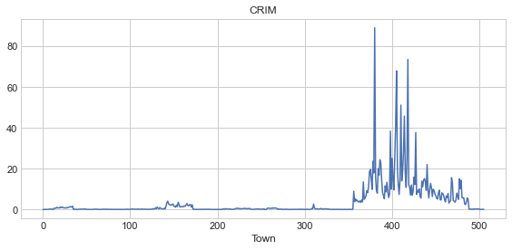
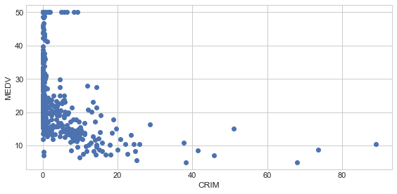
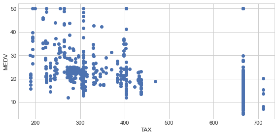
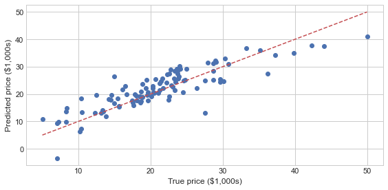
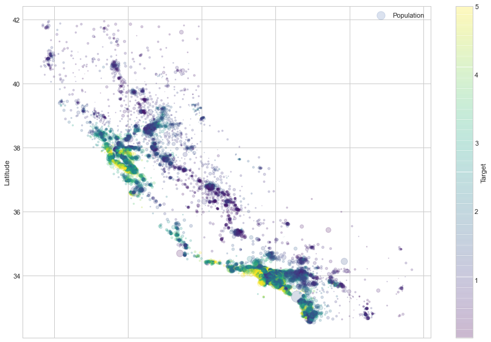
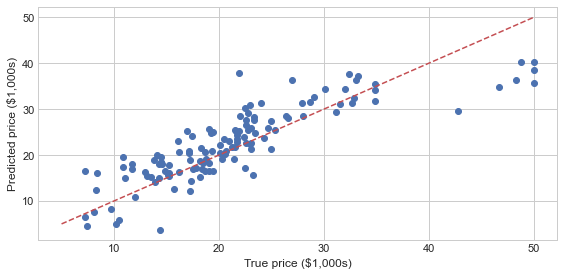
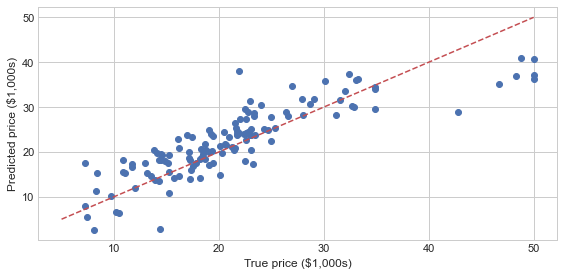

```python
plt.style.use(['seaborn-whitegrid'])
```


```python
from sklearn.linear_model import LinearRegression
from sklearn.model_selection import train_test_split
```


```python
noise = np.random.rand(100,1)
X = sorted(10 * np.random.rand(100,1)) + noise
y = sorted(10 * np.random.rand(100))

plt.scatter(X, y);
```


    

    


```python
X_train, X_test, y_train, y_test = train_test_split(X, y, test_size = 0.2)
model = LinearRegression()
model.fit(X_train, y_train)
```


    LinearRegression()


```python
print("선형 회귀 가중치 : {}".format(model.coef_))
print("선형 회귀 편향 : {}".format(model.intercept_))
```

    선형 회귀 가중치 : [1.07965617]
    선형 회귀 편향 : -0.6685461735594602
    


```python
print("학습 데이터 점수 : {}".format(model.score(X_train, y_train)))
print("평가 데이터 점수 : {}".format(model.score(X_test, y_test)))
```

    학습 데이터 점수 : 0.9773409767693667
    평가 데이터 점수 : 0.9725832827741256
    


```python
predict = model.predict(X_test)

plt.scatter(X_test, y_test)
plt.plot(X_test, predict, '--r')
```


    [<matplotlib.lines.Line2D at 0x24268ff3fd0>]


    

    


```python
from sklearn.datasets import load_boston

boston = load_boston()
print(boston.keys())
print(boston.DESCR)
```

    dict_keys(['data', 'target', 'feature_names', 'DESCR', 'filename'])
    .. _boston_dataset:
    
    Boston house prices dataset
    ---------------------------
    
    **Data Set Characteristics:**  
    
        :Number of Instances: 506 
    
        :Number of Attributes: 13 numeric/categorical predictive. Median Value (attribute 14) is usually the target.
    
        :Attribute Information (in order):
            - CRIM     per capita crime rate by town
            - ZN       proportion of residential land zoned for lots over 25,000 sq.ft.
            - INDUS    proportion of non-retail business acres per town
            - CHAS     Charles River dummy variable (= 1 if tract bounds river; 0 otherwise)
            - NOX      nitric oxides concentration (parts per 10 million)
            - RM       average number of rooms per dwelling
            - AGE      proportion of owner-occupied units built prior to 1940
            - DIS      weighted distances to five Boston employment centres
            - RAD      index of accessibility to radial highways
            - TAX      full-value property-tax rate per $10,000
            - PTRATIO  pupil-teacher ratio by town
            - B        1000(Bk - 0.63)^2 where Bk is the proportion of blacks by town
            - LSTAT    % lower status of the population
            - MEDV     Median value of owner-occupied homes in $1000's
    
        :Missing Attribute Values: None
    
        :Creator: Harrison, D. and Rubinfeld, D.L.
    
    This is a copy of UCI ML housing dataset.
    https://archive.ics.uci.edu/ml/machine-learning-databases/housing/
    
    
    This dataset was taken from the StatLib library which is maintained at Carnegie Mellon University.
    
    The Boston house-price data of Harrison, D. and Rubinfeld, D.L. 'Hedonic
    prices and the demand for clean air', J. Environ. Economics & Management,
    vol.5, 81-102, 1978.   Used in Belsley, Kuh & Welsch, 'Regression diagnostics
    ...', Wiley, 1980.   N.B. Various transformations are used in the table on
    pages 244-261 of the latter.
    
    The Boston house-price data has been used in many machine learning papers that address regression
    problems.   
         
    .. topic:: References
    
       - Belsley, Kuh & Welsch, 'Regression diagnostics: Identifying Influential Data and Sources of Collinearity', Wiley, 1980. 244-261.
       - Quinlan,R. (1993). Combining Instance-Based and Model-Based Learning. In Proceedings on the Tenth International Conference of Machine Learning, 236-243, University of Massachusetts, Amherst. Morgan Kaufmann.
    
    


```python
boston_df = pd.DataFrame(boston.data, columns=boston.feature_names)
boston_df['MEDV'] = boston.target
boston_df.head()
```


<div>
<style scoped>
    .dataframe tbody tr th:only-of-type {
        vertical-align: middle;
    }

    .dataframe tbody tr th {
        vertical-align: top;
    }

    .dataframe thead th {
        text-align: right;
    }
</style>
<table border="1" class="dataframe">
  <thead>
    <tr style="text-align: right;">
      <th></th>
      <th>CRIM</th>
      <th>ZN</th>
      <th>INDUS</th>
      <th>CHAS</th>
      <th>NOX</th>
      <th>RM</th>
      <th>AGE</th>
      <th>DIS</th>
      <th>RAD</th>
      <th>TAX</th>
      <th>PTRATIO</th>
      <th>B</th>
      <th>LSTAT</th>
      <th>MEDV</th>
    </tr>
  </thead>
  <tbody>
    <tr>
      <th>0</th>
      <td>0.00632</td>
      <td>18.0</td>
      <td>2.31</td>
      <td>0.0</td>
      <td>0.538</td>
      <td>6.575</td>
      <td>65.2</td>
      <td>4.0900</td>
      <td>1.0</td>
      <td>296.0</td>
      <td>15.3</td>
      <td>396.90</td>
      <td>4.98</td>
      <td>24.0</td>
    </tr>
    <tr>
      <th>1</th>
      <td>0.02731</td>
      <td>0.0</td>
      <td>7.07</td>
      <td>0.0</td>
      <td>0.469</td>
      <td>6.421</td>
      <td>78.9</td>
      <td>4.9671</td>
      <td>2.0</td>
      <td>242.0</td>
      <td>17.8</td>
      <td>396.90</td>
      <td>9.14</td>
      <td>21.6</td>
    </tr>
    <tr>
      <th>2</th>
      <td>0.02729</td>
      <td>0.0</td>
      <td>7.07</td>
      <td>0.0</td>
      <td>0.469</td>
      <td>7.185</td>
      <td>61.1</td>
      <td>4.9671</td>
      <td>2.0</td>
      <td>242.0</td>
      <td>17.8</td>
      <td>392.83</td>
      <td>4.03</td>
      <td>34.7</td>
    </tr>
    <tr>
      <th>3</th>
      <td>0.03237</td>
      <td>0.0</td>
      <td>2.18</td>
      <td>0.0</td>
      <td>0.458</td>
      <td>6.998</td>
      <td>45.8</td>
      <td>6.0622</td>
      <td>3.0</td>
      <td>222.0</td>
      <td>18.7</td>
      <td>394.63</td>
      <td>2.94</td>
      <td>33.4</td>
    </tr>
    <tr>
      <th>4</th>
      <td>0.06905</td>
      <td>0.0</td>
      <td>2.18</td>
      <td>0.0</td>
      <td>0.458</td>
      <td>7.147</td>
      <td>54.2</td>
      <td>6.0622</td>
      <td>3.0</td>
      <td>222.0</td>
      <td>18.7</td>
      <td>396.90</td>
      <td>5.33</td>
      <td>36.2</td>
    </tr>
  </tbody>
</table>
</div>


```python
boston_df.describe()
```


<div>
<style scoped>
    .dataframe tbody tr th:only-of-type {
        vertical-align: middle;
    }

    .dataframe tbody tr th {
        vertical-align: top;
    }

    .dataframe thead th {
        text-align: right;
    }
</style>
<table border="1" class="dataframe">
  <thead>
    <tr style="text-align: right;">
      <th></th>
      <th>CRIM</th>
      <th>ZN</th>
      <th>INDUS</th>
      <th>CHAS</th>
      <th>NOX</th>
      <th>RM</th>
      <th>AGE</th>
      <th>DIS</th>
      <th>RAD</th>
      <th>TAX</th>
      <th>PTRATIO</th>
      <th>B</th>
      <th>LSTAT</th>
      <th>MEDV</th>
    </tr>
  </thead>
  <tbody>
    <tr>
      <th>count</th>
      <td>506.000000</td>
      <td>506.000000</td>
      <td>506.000000</td>
      <td>506.000000</td>
      <td>506.000000</td>
      <td>506.000000</td>
      <td>506.000000</td>
      <td>506.000000</td>
      <td>506.000000</td>
      <td>506.000000</td>
      <td>506.000000</td>
      <td>506.000000</td>
      <td>506.000000</td>
      <td>506.000000</td>
    </tr>
    <tr>
      <th>mean</th>
      <td>3.613524</td>
      <td>11.363636</td>
      <td>11.136779</td>
      <td>0.069170</td>
      <td>0.554695</td>
      <td>6.284634</td>
      <td>68.574901</td>
      <td>3.795043</td>
      <td>9.549407</td>
      <td>408.237154</td>
      <td>18.455534</td>
      <td>356.674032</td>
      <td>12.653063</td>
      <td>22.532806</td>
    </tr>
    <tr>
      <th>std</th>
      <td>8.601545</td>
      <td>23.322453</td>
      <td>6.860353</td>
      <td>0.253994</td>
      <td>0.115878</td>
      <td>0.702617</td>
      <td>28.148861</td>
      <td>2.105710</td>
      <td>8.707259</td>
      <td>168.537116</td>
      <td>2.164946</td>
      <td>91.294864</td>
      <td>7.141062</td>
      <td>9.197104</td>
    </tr>
    <tr>
      <th>min</th>
      <td>0.006320</td>
      <td>0.000000</td>
      <td>0.460000</td>
      <td>0.000000</td>
      <td>0.385000</td>
      <td>3.561000</td>
      <td>2.900000</td>
      <td>1.129600</td>
      <td>1.000000</td>
      <td>187.000000</td>
      <td>12.600000</td>
      <td>0.320000</td>
      <td>1.730000</td>
      <td>5.000000</td>
    </tr>
    <tr>
      <th>25%</th>
      <td>0.082045</td>
      <td>0.000000</td>
      <td>5.190000</td>
      <td>0.000000</td>
      <td>0.449000</td>
      <td>5.885500</td>
      <td>45.025000</td>
      <td>2.100175</td>
      <td>4.000000</td>
      <td>279.000000</td>
      <td>17.400000</td>
      <td>375.377500</td>
      <td>6.950000</td>
      <td>17.025000</td>
    </tr>
    <tr>
      <th>50%</th>
      <td>0.256510</td>
      <td>0.000000</td>
      <td>9.690000</td>
      <td>0.000000</td>
      <td>0.538000</td>
      <td>6.208500</td>
      <td>77.500000</td>
      <td>3.207450</td>
      <td>5.000000</td>
      <td>330.000000</td>
      <td>19.050000</td>
      <td>391.440000</td>
      <td>11.360000</td>
      <td>21.200000</td>
    </tr>
    <tr>
      <th>75%</th>
      <td>3.677083</td>
      <td>12.500000</td>
      <td>18.100000</td>
      <td>0.000000</td>
      <td>0.624000</td>
      <td>6.623500</td>
      <td>94.075000</td>
      <td>5.188425</td>
      <td>24.000000</td>
      <td>666.000000</td>
      <td>20.200000</td>
      <td>396.225000</td>
      <td>16.955000</td>
      <td>25.000000</td>
    </tr>
    <tr>
      <th>max</th>
      <td>88.976200</td>
      <td>100.000000</td>
      <td>27.740000</td>
      <td>1.000000</td>
      <td>0.871000</td>
      <td>8.780000</td>
      <td>100.000000</td>
      <td>12.126500</td>
      <td>24.000000</td>
      <td>711.000000</td>
      <td>22.000000</td>
      <td>396.900000</td>
      <td>37.970000</td>
      <td>50.000000</td>
    </tr>
  </tbody>
</table>
</div>


```python
for i, col in enumerate(boston_df.columns):
    plt.figure(figsize=(8,4))
    plt.plot(boston_df[col])
    plt.title(col)
    plt.xlabel('Town')
    plt.tight_layout()
```


    

    


    

    


    

    


    

    


    

    


    

    


    

    


    

    


    

    


    

    


    

    


    

    


    

    


    

    


```python
for i, col in enumerate(boston_df.columns):
    plt.figure(figsize=(8,4))
    plt.scatter(boston_df[col], boston_df['MEDV'])
    plt.ylabel('MEDV', size=12)
    plt.xlabel(col, size=12)
    plt.tight_layout()
```


    

    


    

    


    

    


    

    


    

    


    

    


    

    


    

    


    

    


    

    


    

    


    

    


    

    


    

    


```python
import seaborn as sns

sns.pairplot(boston_df);
```


    

    


```python
from sklearn.linear_model import LinearRegression

model = LinearRegression(normalize = True)
```


```python
from sklearn.model_selection import train_test_split

X_train, X_test, y_train, y_test = train_test_split(boston.data, boston.target, test_size = 0.2)

model.fit(X_train, y_train)
```


    LinearRegression(normalize=True)


```python
print("학습 데이터 점수 : {}".format(model.score(X_train, y_train)))
print("평가 데이터 점수 : {}".format(model.score(X_test, y_test)))
```

    학습 데이터 점수 : 0.7372524778377865
    평가 데이터 점수 : 0.7337635285556723
    


```python
from sklearn.model_selection import cross_val_score

scores = cross_val_score(model, boston.data, boston.target, cv = 10, scoring='neg_mean_squared_error')
print("NMSE scores : {}".format(scores))
print("NMSE scores mean : {}".format(scores.mean()))
print("NMSE scores std : {}".format(scores.std()))
```

    NMSE scores : [  -9.28694671  -14.15128316  -14.07360615  -35.20692433  -31.88511666
      -19.83587796   -9.94726918 -168.37537954  -33.32974507  -10.96041068]
    NMSE scores mean : -34.70525594452485
    NMSE scores std : 45.573999200308805
    


```python
r2_scores = cross_val_score(model, boston.data, boston.target, cv=10, scoring='r2')

print("R2 scores : {}".format(r2_scores))
print("R2 scores mean : {}".format(r2_scores.mean()))
print("R2 scores std : {}".format(r2_scores.std()))
```

    R2 scores : [ 0.73376082  0.4730725  -1.00631454  0.64113984  0.54766046  0.73640292
      0.37828386 -0.12922703 -0.76843243  0.4189435 ]
    R2 scores mean : 0.20252899006056452
    R2 scores std : 0.5952960169512271
    


```python
print('y = ' + str(model.intercept_) + ' ')
for i, c in enumerate(model.coef_):
    print(str(c) + ' * x' + str(i))
```

    y = 34.47062451276103 
    -0.06442160005225812 * x0
    0.036955358946982195 * x1
    0.035511966339872414 * x2
    2.7480499546260835 * x3
    -19.401861961301258 * x4
    4.216252790119648 * x5
    -0.0022472570516771217 * x6
    -1.4634391273941834 * x7
    0.24418860786114566 * x8
    -0.008716598415708167 * x9
    -1.004412325725544 * x10
    0.010632257395664878 * x11
    -0.5206363305938649 * x12
    


```python
from sklearn.metrics import mean_squared_error, r2_score

y_train_predict = model.predict(X_train)
rmse = (np.sqrt(mean_squared_error(y_train,y_train_predict)))
r2 = r2_score(y_train, y_train_predict)

print('RMSE : {}'.format(rmse))
print("R2 Score : {}".format(r2))
```

    RMSE : 4.827822260244657
    R2 Score : 0.7372524778377865
    


```python
y_test_predict = model.predict(X_test)
rmse = (np.sqrt(mean_squared_error(y_test,y_test_predict)))
r2 = r2_score(y_test, y_test_predict)

print('RMSE : {}'.format(rmse))
print("R2 Score : {}".format(r2))
```

    RMSE : 4.173158797364203
    R2 Score : 0.7337635285556723
    


```python
def plot_boston_prices(expected, predicted):
    plt.figure(figsize=(8, 4))
    plt.scatter(expected, predicted)
    plt.plot([5, 50],[5, 50], '--r')
    plt.xlabel('True price ($1,000s)')
    plt.ylabel('Predicted price ($1,000s)')
    plt.tight_layout()
    
predicted = model.predict(X_test)
expected = y_test

plot_boston_prices(expected, predicted)
```


    

    


```python
from sklearn.datasets import fetch_california_housing

california = fetch_california_housing()
print(california.keys())
print(california.DESCR)
```

    dict_keys(['data', 'target', 'frame', 'target_names', 'feature_names', 'DESCR'])
    .. _california_housing_dataset:
    
    California Housing dataset
    --------------------------
    
    **Data Set Characteristics:**
    
        :Number of Instances: 20640
    
        :Number of Attributes: 8 numeric, predictive attributes and the target
    
        :Attribute Information:
            - MedInc        median income in block
            - HouseAge      median house age in block
            - AveRooms      average number of rooms
            - AveBedrms     average number of bedrooms
            - Population    block population
            - AveOccup      average house occupancy
            - Latitude      house block latitude
            - Longitude     house block longitude
    
        :Missing Attribute Values: None
    
    This dataset was obtained from the StatLib repository.
    http://lib.stat.cmu.edu/datasets/
    
    The target variable is the median house value for California districts.
    
    This dataset was derived from the 1990 U.S. census, using one row per census
    block group. A block group is the smallest geographical unit for which the U.S.
    Census Bureau publishes sample data (a block group typically has a population
    of 600 to 3,000 people).
    
    It can be downloaded/loaded using the
    :func:`sklearn.datasets.fetch_california_housing` function.
    
    .. topic:: References
    
        - Pace, R. Kelley and Ronald Barry, Sparse Spatial Autoregressions,
          Statistics and Probability Letters, 33 (1997) 291-297
    
    


```python
california_df = pd.DataFrame(california.data, columns=california.feature_names)
california_df['Target'] = california.target
california_df.head()
```


<div>
<style scoped>
    .dataframe tbody tr th:only-of-type {
        vertical-align: middle;
    }

    .dataframe tbody tr th {
        vertical-align: top;
    }

    .dataframe thead th {
        text-align: right;
    }
</style>
<table border="1" class="dataframe">
  <thead>
    <tr style="text-align: right;">
      <th></th>
      <th>MedInc</th>
      <th>HouseAge</th>
      <th>AveRooms</th>
      <th>AveBedrms</th>
      <th>Population</th>
      <th>AveOccup</th>
      <th>Latitude</th>
      <th>Longitude</th>
      <th>Target</th>
    </tr>
  </thead>
  <tbody>
    <tr>
      <th>0</th>
      <td>8.3252</td>
      <td>41.0</td>
      <td>6.984127</td>
      <td>1.023810</td>
      <td>322.0</td>
      <td>2.555556</td>
      <td>37.88</td>
      <td>-122.23</td>
      <td>4.526</td>
    </tr>
    <tr>
      <th>1</th>
      <td>8.3014</td>
      <td>21.0</td>
      <td>6.238137</td>
      <td>0.971880</td>
      <td>2401.0</td>
      <td>2.109842</td>
      <td>37.86</td>
      <td>-122.22</td>
      <td>3.585</td>
    </tr>
    <tr>
      <th>2</th>
      <td>7.2574</td>
      <td>52.0</td>
      <td>8.288136</td>
      <td>1.073446</td>
      <td>496.0</td>
      <td>2.802260</td>
      <td>37.85</td>
      <td>-122.24</td>
      <td>3.521</td>
    </tr>
    <tr>
      <th>3</th>
      <td>5.6431</td>
      <td>52.0</td>
      <td>5.817352</td>
      <td>1.073059</td>
      <td>558.0</td>
      <td>2.547945</td>
      <td>37.85</td>
      <td>-122.25</td>
      <td>3.413</td>
    </tr>
    <tr>
      <th>4</th>
      <td>3.8462</td>
      <td>52.0</td>
      <td>6.281853</td>
      <td>1.081081</td>
      <td>565.0</td>
      <td>2.181467</td>
      <td>37.85</td>
      <td>-122.25</td>
      <td>3.422</td>
    </tr>
  </tbody>
</table>
</div>


```python
california_df.describe()
```


<div>
<style scoped>
    .dataframe tbody tr th:only-of-type {
        vertical-align: middle;
    }

    .dataframe tbody tr th {
        vertical-align: top;
    }

    .dataframe thead th {
        text-align: right;
    }
</style>
<table border="1" class="dataframe">
  <thead>
    <tr style="text-align: right;">
      <th></th>
      <th>MedInc</th>
      <th>HouseAge</th>
      <th>AveRooms</th>
      <th>AveBedrms</th>
      <th>Population</th>
      <th>AveOccup</th>
      <th>Latitude</th>
      <th>Longitude</th>
      <th>Target</th>
    </tr>
  </thead>
  <tbody>
    <tr>
      <th>count</th>
      <td>20640.000000</td>
      <td>20640.000000</td>
      <td>20640.000000</td>
      <td>20640.000000</td>
      <td>20640.000000</td>
      <td>20640.000000</td>
      <td>20640.000000</td>
      <td>20640.000000</td>
      <td>20640.000000</td>
    </tr>
    <tr>
      <th>mean</th>
      <td>3.870671</td>
      <td>28.639486</td>
      <td>5.429000</td>
      <td>1.096675</td>
      <td>1425.476744</td>
      <td>3.070655</td>
      <td>35.631861</td>
      <td>-119.569704</td>
      <td>2.068558</td>
    </tr>
    <tr>
      <th>std</th>
      <td>1.899822</td>
      <td>12.585558</td>
      <td>2.474173</td>
      <td>0.473911</td>
      <td>1132.462122</td>
      <td>10.386050</td>
      <td>2.135952</td>
      <td>2.003532</td>
      <td>1.153956</td>
    </tr>
    <tr>
      <th>min</th>
      <td>0.499900</td>
      <td>1.000000</td>
      <td>0.846154</td>
      <td>0.333333</td>
      <td>3.000000</td>
      <td>0.692308</td>
      <td>32.540000</td>
      <td>-124.350000</td>
      <td>0.149990</td>
    </tr>
    <tr>
      <th>25%</th>
      <td>2.563400</td>
      <td>18.000000</td>
      <td>4.440716</td>
      <td>1.006079</td>
      <td>787.000000</td>
      <td>2.429741</td>
      <td>33.930000</td>
      <td>-121.800000</td>
      <td>1.196000</td>
    </tr>
    <tr>
      <th>50%</th>
      <td>3.534800</td>
      <td>29.000000</td>
      <td>5.229129</td>
      <td>1.048780</td>
      <td>1166.000000</td>
      <td>2.818116</td>
      <td>34.260000</td>
      <td>-118.490000</td>
      <td>1.797000</td>
    </tr>
    <tr>
      <th>75%</th>
      <td>4.743250</td>
      <td>37.000000</td>
      <td>6.052381</td>
      <td>1.099526</td>
      <td>1725.000000</td>
      <td>3.282261</td>
      <td>37.710000</td>
      <td>-118.010000</td>
      <td>2.647250</td>
    </tr>
    <tr>
      <th>max</th>
      <td>15.000100</td>
      <td>52.000000</td>
      <td>141.909091</td>
      <td>34.066667</td>
      <td>35682.000000</td>
      <td>1243.333333</td>
      <td>41.950000</td>
      <td>-114.310000</td>
      <td>5.000010</td>
    </tr>
  </tbody>
</table>
</div>


```python
for i, col in enumerate(california_df.columns):
    plt.figure(figsize=(8,5))
    plt.plot(california_df[col])
    plt.title(col)
    plt.tight_layout()
```


    

    


    

    


    

    


    

    


    

    


    

    


    

    


    

    


    

    


```python
for i, col in enumerate(california_df.columns):
    plt.figure(figsize=(8,5))
    plt.scatter(california_df[col], california_df['Target'])
    plt.ylabel('Target', size=12)
    plt.xlabel(col, size=12)
    plt.tight_layout()
```


    

    


    

    


    

    


    

    


    

    


    

    


    

    


    

    


    

    


```python
import seaborn as sns

sns.pairplot(california_df.sample(1000));
```


    

    


```python
california_df.plot(kind = 'scatter', x='Longitude', y='Latitude',  alpha=0.2, figsize=(12,10));
```

    *c* argument looks like a single numeric RGB or RGBA sequence, which should be avoided as value-mapping will have precedence in case its length matches with *x* & *y*.  Please use the *color* keyword-argument or provide a 2-D array with a single row if you intend to specify the same RGB or RGBA value for all points.
    


    

    


```python
california_df.plot(kind = 'scatter', x='Longitude', y='Latitude',  alpha=0.2, 
                   s = california_df['Population']/100, label = 'Population', figsize=(15,10),
                  c = 'Target', cmap = plt.get_cmap('viridis'), colorbar=True);
```


    

    


```python
model = LinearRegression(normalize=True)

X_train, X_test, y_train, y_test = train_test_split(california.data, california.target, test_size=0.2)

model.fit(X_train, y_train)
print('학습 데이터 점수 : {}'.format(model.score(X_train, y_train)))
print('평가 데이터 점수 : {}'.format(model.score(X_test, y_test)))

scores = cross_val_score(model, california.data, california.target, cv=10, scoring='neg_mean_squared_error')
print("NMSE mean : {}".format(scores.mean()))
print("NMSE std : {}".format(scores.std()))

r2_scores = cross_val_score(model, california.data, california.target, cv=10, scoring='r2')
print("R2 Score mean : {}".format(r2_scores.mean()))
```

    학습 데이터 점수 : 0.6075676612087542
    평가 데이터 점수 : 0.6002401314161407
    NMSE mean : -0.5509524296956636
    NMSE std : 0.19288582953865122
    R2 Score mean : 0.5110068610523776
    


```python
print('y =' + str(model.intercept_) + ' ')
for i, c in enumerate(model.coef_):
    print(str(c) + '*x' + str(i))
```

    y =-37.03105405078991 
    0.4356547902724989*x0
    0.009604577543698535*x1
    -0.1067435604891059*x2
    0.6181926324050914*x3
    -3.6487699457809706e-06*x4
    -0.003450118506091676*x5
    -0.4196091052202499*x6
    -0.43493699981791595*x7
    


```python
y_train_predict = model.predict(X_train)
rmse = (np.sqrt(mean_squared_error(y_train, y_train_predict)))
r2 = r2_score(y_train, y_train_predict)

print("RMSE : {}".format(rmse))
print("R2 Score {}".format(r2))
```

    RMSE : 0.7227221197189874
    R2 Score 0.6075676612087542
    


```python
y_test_predict = model.predict(X_test)
rmse = (np.sqrt(mean_squared_error(y_test, y_test_predict)))
r2 = r2_score(y_test, y_test_predict)

print("RMSE : {}".format(rmse))
print("R2 Score {}".format(r2))
```

    RMSE : 0.7301796847726318
    R2 Score 0.6002401314161407
    


```python
def plot_california_prices(expected, predicted):
    plt.figure(figsize=(8,4))
    plt.scatter(expected, predicted)
    plt.plot([0,5],[0,5], '--r')
    plt.xlabel('True price ($100,000s)')
    plt.ylabel('Predicted price ($100,000s)')
    plt.tight_layout()
    
predicted = model.predict(X_test)
expected = y_test

plot_california_prices(expected, predicted)
```


    

    


```python
from sklearn.linear_model import Ridge
from sklearn.datasets import load_boston
from sklearn.model_selection import train_test_split
```


```python
X, y = load_boston(return_X_y = True)
X_train, X_test, y_train, y_test = train_test_split(X,y)
```


```python
model = Ridge(alpha=0.2)
model.fit(X_train, y_train)
```


    Ridge(alpha=0.2)


```python
print("학습 데이터 점수 : {}".format(model.score(X_train, y_train)))
print("평가 데이터 점수 : {}".format(model.score(X_test, y_test)))
```

    학습 데이터 점수 : 0.7179364236838541
    평가 데이터 점수 : 0.7907583313334703
    


```python
predicted = model.predict(X_test)
expected = y_test

plot_boston_prices(expected, predicted)
```


    

    


```python
from sklearn.datasets import fetch_california_housing

california = fetch_california_housing()

X_train, X_test, y_train, y_test = train_test_split(california.data, california.target, test_size = 0.2)
```


```python
model = Ridge(alpha = 0.1)
model.fit(X_train, y_train)
```


    Ridge(alpha=0.1)


```python
print("학습 데이터 점수 : {}".format(model.score(X_train, y_train)))
print("평가 데이터 점수 : {}".format(model.score(X_test, y_test)))
```

    학습 데이터 점수 : 0.6069038321693521
    평가 데이터 점수 : 0.603144968115704
    


```python
predicted = model.predict(X_test)
expected = y_test

plot_california_prices(expected, predicted)
```


    

    


```python
from sklearn.linear_model import Lasso
from sklearn.datasets import load_boston
from sklearn.model_selection import train_test_split
```


```python
X, y = load_boston(return_X_y = True)
X_train, X_test, y_train, y_test = train_test_split(X, y)
```


```python
model = Lasso(alpha=0.001)
model.fit(X_train, y_train)
```


    Lasso(alpha=0.001)


```python
print("학습 데이터 점수 : {}".format(model.score(X_train, y_train)))
print("평가 데이터 점수 : {}".format(model.score(X_test, y_test)))
```

    학습 데이터 점수 : 0.7416871568112853
    평가 데이터 점수 : 0.7200227802442024
    


```python
predicted = model.predict(X_test)
expected = y_test

plot_boston_prices(expected, predicted)
```


    

    


```python
from sklearn.datasets import fetch_california_housing

california = fetch_california_housing()

X_train, X_test, y_train, y_test = train_test_split(california.data, california.target, test_size = 0.2)
```


```python
model = Lasso(alpha = 0.001)
model.fit(X_train, y_train)
```


    Lasso(alpha=0.001)


```python
print("학습 데이터 점수 : {}".format(model.score(X_train, y_train)))
print("평가 데이터 점수 : {}".format(model.score(X_test, y_test)))
```

    학습 데이터 점수 : 0.6069523221239144
    평가 데이터 점수 : 0.60196346038658
    


```python
predicted = model.predict(X_test)
expected = y_test

plot_california_prices(expected, predicted)
```


    

    


### 신축망


```python
from sklearn.linear_model import ElasticNet
from sklearn.datasets import load_boston
from sklearn.model_selection import train_test_split
```


```python
X, y = load_boston(return_X_y=True)
X_train, X_test, y_train, y_test = train_test_split(X,y)
```


```python
model = ElasticNet(alpha = 0.01, l1_ratio=0.5)
model.fit(X_train, y_train)
```


    ElasticNet(alpha=0.01)


```python
print("학습 데이터 점수 : {}".format(model.score(X_train, y_train)))
print("평가 데이터 점수 : {}".format(model.score(X_test, y_test)))
```

    학습 데이터 점수 : 0.7502652553571015
    평가 데이터 점수 : 0.6826126106941008
    


```python
predicted = model.predict(X_test)
expected = y_test

plot_boston_prices(expected, predicted)
```


    

    


```python
from sklearn.datasets import fetch_california_housing

california = fetch_california_housing()

X_train, X_test, y_train, y_test = train_test_split(california.data, california.target, test_size = 0.2)
```


```python
model = ElasticNet(alpha = 0.1, l1_ratio=0.5)
model.fit(X_train, y_train)
```


    ElasticNet(alpha=0.1)


```python
print("학습 데이터 점수 : {}".format(model.score(X_train, y_train)))
print("평가 데이터 점수 : {}".format(model.score(X_test, y_test)))
```

    학습 데이터 점수 : 0.5728854037321653
    평가 데이터 점수 : 0.5873756732329887
    


```python
predicted = model.predict(X_test)
expected = y_test

plot_california_prices(expected, predicted)
```


    

    


```python
from sklearn.linear_model import OrthogonalMatchingPursuit
from sklearn.datasets import load_boston
from sklearn.model_selection import train_test_split
```


```python
X, y = load_boston(return_X_y = True)
X_train, X_test, y_train, y_test = train_test_split(X, y)
```


```python
model = OrthogonalMatchingPursuit(n_nonzero_coefs=7)
model.fit(X_train, y_train)
```


    OrthogonalMatchingPursuit(n_nonzero_coefs=7)


```python
print("학습 데이터 점수 : {}".format(model.score(X_train, y_train)))
print("평가 데이터 점수 : {}".format(model.score(X_test, y_test)))
```

    학습 데이터 점수 : 0.7204005103365816
    평가 데이터 점수 : 0.7011381813021195
    


```python
predicted = model.predict(X_test)
expected = y_test

plot_boston_prices(expected, predicted)
```


    

    


```python
model = OrthogonalMatchingPursuit(tol=1.)
model.fit(X_train, y_train)
```

    C:\Users\ds990\anaconda3\lib\site-packages\sklearn\utils\validation.py:63: RuntimeWarning:  Orthogonal matching pursuit ended prematurely due to linear
    dependence in the dictionary. The requested precision might not have been met.
    
      return f(*args, **kwargs)
    


    OrthogonalMatchingPursuit(tol=1.0)


```python
print("학습 데이터 점수 : {}".format(model.score(X_train, y_train)))
print("평가 데이터 점수 : {}".format(model.score(X_test, y_test)))
```

    학습 데이터 점수 : 0.741926564776638
    평가 데이터 점수 : 0.7120138392452801
    


```python
predicted = model.predict(X_test)
expected = y_test

plot_boston_prices(expected, predicted)
```


    

    


```python
from sklearn.datasets import fetch_california_housing

california = fetch_california_housing()

X_train, X_test, y_train, y_test = train_test_split(california.data, california.target, test_size = 0.2)
```


```python
model = OrthogonalMatchingPursuit(n_nonzero_coefs=5)
model.fit(X_train,y_train)
```


    OrthogonalMatchingPursuit(n_nonzero_coefs=5)


```python
print("학습 데이터 점수 : {}".format(model.score(X_train, y_train)))
print("평가 데이터 점수 : {}".format(model.score(X_test, y_test)))
```

    학습 데이터 점수 : 0.5978671381812808
    평가 데이터 점수 : 0.6022350870678386
    


```python
predicted = model.predict(X_test)
expected = y_test

plot_california_prices(expected, predicted)
```


    

    


```python
model = OrthogonalMatchingPursuit(tol=1.)
model.fit(X_train, y_train)
```

    C:\Users\ds990\anaconda3\lib\site-packages\sklearn\utils\validation.py:63: RuntimeWarning:  Orthogonal matching pursuit ended prematurely due to linear
    dependence in the dictionary. The requested precision might not have been met.
    
      return f(*args, **kwargs)
    


    OrthogonalMatchingPursuit(tol=1.0)


```python
print("학습 데이터 점수 : {}".format(model.score(X_train, y_train)))
print("평가 데이터 점수 : {}".format(model.score(X_test, y_test)))
```

    학습 데이터 점수 : 0.6062209558516283
    평가 데이터 점수 : 0.6039573468629337
    


```python
predicted = model.predict(X_test)
expected = y_test

plot_california_prices(expected, predicted)
```


    

    


### 다항 회귀


```python
from sklearn.preprocessing import PolynomialFeatures, StandardScaler
from sklearn.linear_model import LinearRegression
from sklearn.pipeline import make_pipeline
from sklearn.model_selection import train_test_split
from sklearn.datasets import load_boston
```


```python
X, y = load_boston(return_X_y=True)
X_train, X_test, y_train, y_test = train_test_split(X, y, random_state=123)
```


```python
model = make_pipeline(
PolynomialFeatures(degree=2),
StandardScaler(),
LinearRegression()
)
model.fit(X_train, y_train)
```


    Pipeline(steps=[('polynomialfeatures', PolynomialFeatures()),
                    ('standardscaler', StandardScaler()),
                    ('linearregression', LinearRegression())])


```python
print("학습 데이터 점수 : {}".format(model.score(X_train, y_train)))
print("평가 데이터 점수 : {}".format(model.score(X_test, y_test)))
```

    학습 데이터 점수 : 0.9346787783950694
    평가 데이터 점수 : 0.8257864718002585
    


```python
predicted = model.predict(X_test)
expected = y_test

plot_boston_prices(expected, predicted)
```


    

    


```python
from sklearn.datasets import fetch_california_housing

california = fetch_california_housing()

X_train, X_test, y_train, y_test = train_test_split(california.data, california.target, test_size = 0.2)
```


```python
model = make_pipeline(
PolynomialFeatures(degree=2),
StandardScaler(),
LinearRegression()
)

model.fit(X_train, y_train)
```


    Pipeline(steps=[('polynomialfeatures', PolynomialFeatures()),
                    ('standardscaler', StandardScaler()),
                    ('linearregression', LinearRegression())])


```python
print("학습 데이터 점수 : {}".format(model.score(X_train, y_train)))
print("평가 데이터 점수 : {}".format(model.score(X_test, y_test)))
```

    학습 데이터 점수 : 0.6819317505302659
    평가 데이터 점수 : 0.6344251048855458
    


```python
predicted = model.predict(X_test)
expected = y_test

plot_california_prices(expected, predicted)
```


    

    

